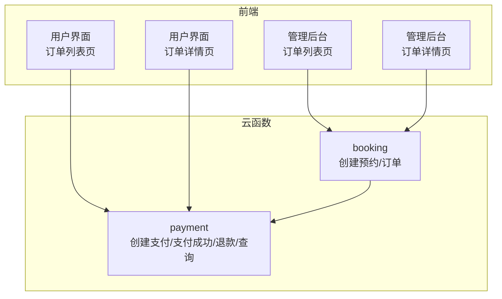
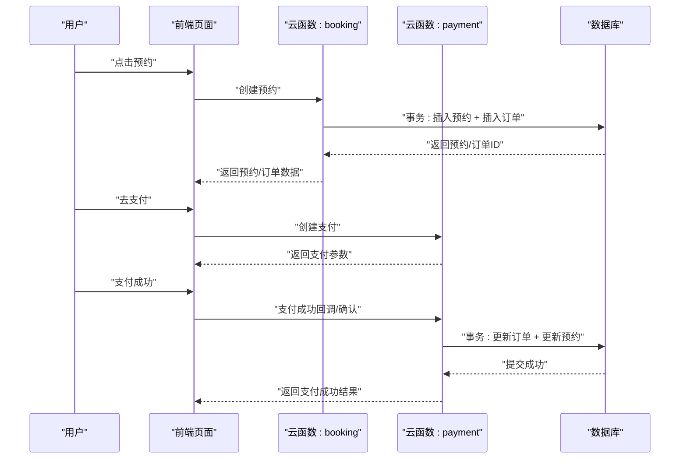
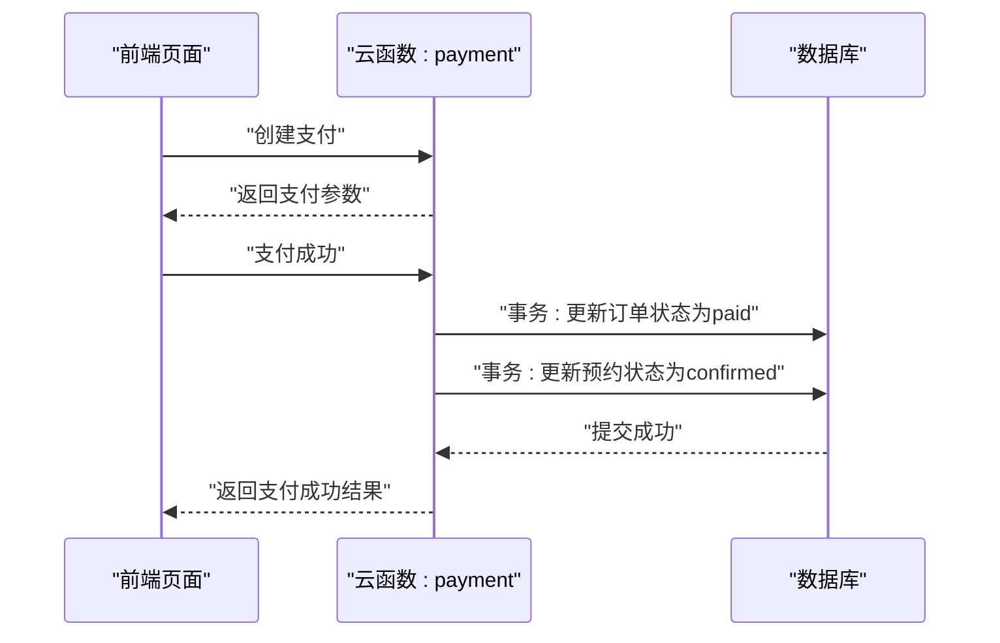
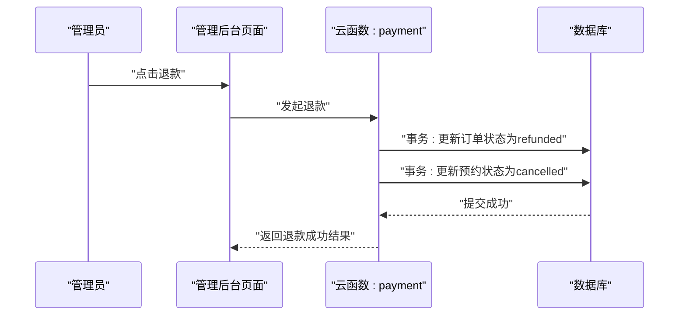
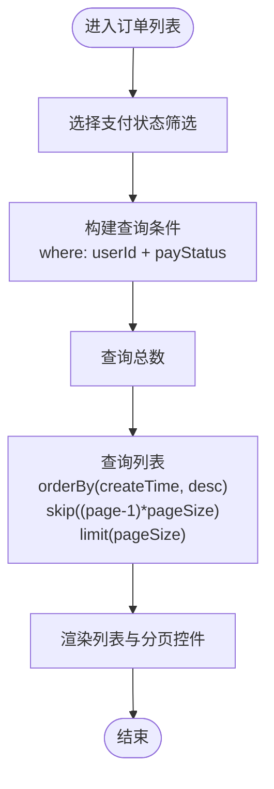
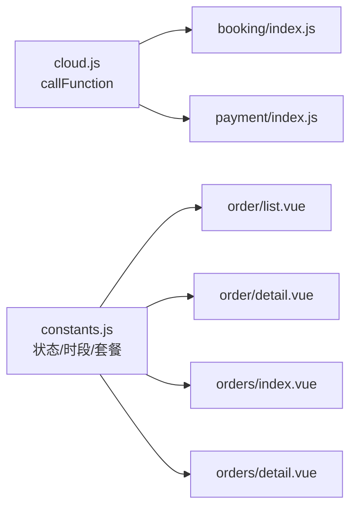

# 订单模型

<cite>
**本文档引用的文件**
- [payment/index.js](file://miniprogram/cloudfunctions/payment/index.js)
- [booking/index.js](file://miniprogram/cloudfunctions/booking/index.js)
- [order/list.vue](file://miniprogram/src/pages/order/list.vue)
- [order/detail.vue](file://miniprogram/src/pages/order/detail.vue)
- [orders/index.vue](file://miniprogram/src/pages-admin/orders/index.vue)
- [orders/detail.vue](file://miniprogram/src/pages-admin/orders/detail.vue)
- [constants.js](file://miniprogram/src/utils/constants.js)
- [cloud.js](file://miniprogram/src/utils/cloud.js)
- [pages.json](file://miniprogram/src/pages.json)
</cite>

## 目录
1. [简介](#简介)
2. [项目结构](#项目结构)
3. [核心组件](#核心组件)
4. [架构总览](#架构总览)
5. [详细组件分析](#详细组件分析)
6. [依赖分析](#依赖分析)
7. [性能考虑](#性能考虑)
8. [故障排查指南](#故障排查指南)
9. [结论](#结论)
10. [附录](#附录)

## 简介
本文件系统性阐述“旅拍”小程序的订单模型，覆盖数据结构、业务逻辑、状态流转、支付流程、退款处理、数据一致性与事务管理、查询与过滤策略，以及与支付、预约模块的关联关系与约束。目标是帮助开发者与运营人员快速理解并正确使用订单体系。

## 项目结构
订单系统由前端页面与云函数共同组成：
- 前端页面负责用户交互与数据展示，通过云函数封装调用后端能力。
- 云函数负责订单创建、支付、回调、退款、查询等核心业务逻辑，并保证数据一致性与安全控制。

图表来源
- [order/list.vue:213-253](file://miniprogram/src/pages/order/list.vue#L213-L253)
- [order/detail.vue:182-206](file://miniprogram/src/pages/order/detail.vue#L182-L206)
- [orders/index.vue:132-187](file://miniprogram/src/pages-admin/orders/index.vue#L132-L187)
- [orders/detail.vue:231-261](file://miniprogram/src/pages-admin/orders/detail.vue#L231-L261)
- [booking/index.js:98-206](file://miniprogram/cloudfunctions/booking/index.js#L98-L206)
- [payment/index.js:65-166](file://miniprogram/cloudfunctions/payment/index.js#L65-L166)

章节来源
- [pages.json:1-177](file://miniprogram/src/pages.json#L1-L177)

## 核心组件
- 订单模型（云函数）
  - 订单创建：由预约创建触发，生成唯一订单号，初始化支付状态。
  - 支付流程：前端发起支付请求，云函数返回支付参数；支付成功后更新订单与预约状态。
  - 退款流程：管理员发起退款，更新订单与预约状态。
  - 查询与分页：支持按支付状态筛选、分页与排序。
- 预约模型（云函数）
  - 预约创建：校验时段容量、套餐信息，使用事务保证一致性。
  - 预约状态管理：支持状态变更与取消。
- 前端页面
  - 用户侧：订单列表、订单详情、支付入口。
  - 管理侧：订单列表、订单详情、状态变更与退款入口。

章节来源
- [booking/index.js:98-206](file://miniprogram/cloudfunctions/booking/index.js#L98-L206)
- [payment/index.js:65-166](file://miniprogram/cloudfunctions/payment/index.js#L65-L166)
- [order/list.vue:213-253](file://miniprogram/src/pages/order/list.vue#L213-L253)
- [order/detail.vue:182-206](file://miniprogram/src/pages/order/detail.vue#L182-L206)
- [orders/index.vue:132-187](file://miniprogram/src/pages-admin/orders/index.vue#L132-L187)
- [orders/detail.vue:231-261](file://miniprogram/src/pages-admin/orders/detail.vue#L231-L261)

## 架构总览
订单系统围绕“预约-订单-支付-退款”的主链路展开，采用云函数作为统一服务层，前端通过云函数调用实现业务闭环。

图表来源
- [booking/index.js:150-206](file://miniprogram/cloudfunctions/booking/index.js#L150-L206)
- [payment/index.js:203-239](file://miniprogram/cloudfunctions/payment/index.js#L203-L239)

## 详细组件分析

### 订单号生成规则
- 规则：前缀“LP” + 年月日时分秒 + 4位随机数。
- 示例：LP202604081234560001。
- 作用：保证全局唯一性，便于对账与追踪。

章节来源
- [booking/index.js:16-27](file://miniprogram/cloudfunctions/booking/index.js#L16-L27)

### 订单数据结构与字段
- 关键字段
  - 订单号：orderNo（唯一标识）
  - 用户ID：userId（与用户OpenID关联）
  - 预约ID：bookingId（与预约记录关联）
  - 套餐信息：packageId/packageName/packagePrice
  - 金额：totalPrice/depositAmount（总价与定金）
  - 支付状态：payStatus（unpaid/paid/refunded）
  - 时间：createTime/payTime/refundTime/updateTime
  - 其他：remark、transactionId（真实支付场景）
- 字段含义与约束
  - 支付状态：未支付、已支付、已退款三态；退款流程中可能涉及“退款中”中间态（取消预约时标记）。
  - 金额：depositAmount通常等于套餐价或定金；totalPrice为应付总额。
  - 时间：各时间戳用于审计与报表统计。

章节来源
- [booking/index.js:174-190](file://miniprogram/cloudfunctions/booking/index.js#L174-L190)
- [payment/index.js:208-222](file://miniprogram/cloudfunctions/payment/index.js#L208-L222)

### 用户关联与权限控制
- 用户关联：订单与用户通过userId字段关联，查询与操作均进行权限校验。
- 权限控制：
  - 非管理员只能查看/操作自己的订单。
  - 管理员可查看全部预约列表与详情，并具备状态变更与退款权限。

章节来源
- [payment/index.js:84-94](file://miniprogram/cloudfunctions/payment/index.js#L84-L94)
- [booking/index.js:32-46](file://miniprogram/cloudfunctions/booking/index.js#L32-L46)

### 预约关联与数据一致性
- 预约与订单：创建预约时即创建订单，二者通过bookingId建立强关联。
- 事务保证：
  - 预约创建：使用事务插入预约与订单，避免脏数据。
  - 支付成功：使用事务同时更新订单与预约状态，确保一致性。
  - 退款：模拟退款直接更新订单与预约状态，真实场景建议使用云支付退款接口。

章节来源
- [booking/index.js:150-206](file://miniprogram/cloudfunctions/booking/index.js#L150-L206)
- [payment/index.js:203-239](file://miniprogram/cloudfunctions/payment/index.js#L203-L239)

### 支付状态与金额计算
- 支付状态
  - 未支付：初始状态，允许取消与支付。
  - 已支付：支付成功后，预约状态变更为confirmed。
  - 已退款：管理员发起退款后，订单状态变更为refunded，预约状态变更为cancelled。
- 金额计算
  - totalPrice：订单总金额。
  - depositAmount：定金或应付金额（此处与套餐价一致）。
- 支付方式
  - 模拟支付：返回模拟支付参数，便于开发测试。
  - 真实支付：需配置商户号，使用云支付统一下单接口生成prepay_id并返回支付参数。

章节来源
- [booking/index.js:179-186](file://miniprogram/cloudfunctions/booking/index.js#L179-L186)
- [payment/index.js:98-165](file://miniprogram/cloudfunctions/payment/index.js#L98-L165)

### 支付流程与状态变化
- 流程步骤
  1) 用户点击“去支付”，前端调用云函数创建支付，返回支付参数。
  2) 用户完成支付后，前端调用支付成功接口或等待回调，云函数使用事务更新订单与预约状态。
  3) 支付成功后，订单状态变为paid，预约状态变为confirmed。
- 数据同步机制
  - 事务：支付成功与预约状态更新在同一事务内完成，保证原子性。
  - 回调：真实场景下可通过支付回调自动更新状态，当前为模拟模式。

图表来源
- [payment/index.js:65-166](file://miniprogram/cloudfunctions/payment/index.js#L65-L166)
- [payment/index.js:203-239](file://miniprogram/cloudfunctions/payment/index.js#L203-L239)

### 退款处理与事务管理
- 触发条件：仅已支付订单可退款；管理员权限校验通过。
- 处理流程：
  1) 管理员在后台发起退款。
  2) 云函数更新订单状态为refunded，并更新关联预约状态为cancelled。
  3) 事务保证订单与预约状态的一致性。
- 数据一致性
  - 使用事务包裹订单与预约状态更新，失败回滚，避免部分更新导致的数据不一致。

图表来源
- [orders/detail.vue:313-352](file://miniprogram/src/pages-admin/orders/detail.vue#L313-L352)
- [payment/index.js:338-450](file://miniprogram/cloudfunctions/payment/index.js#L338-L450)

### 订单查询、状态跟踪与分页策略
- 用户侧查询
  - 支持按支付状态筛选（全部/待支付/已支付/已完成/已取消）。
  - 分页：page/pageSize，默认每页10条，按创建时间倒序。
- 管理侧查询
  - 支持按预约状态筛选（待确认/已确认/拍摄中/修片中/已完成/已取消）。
  - 分页：page/pageSize，默认每页10条，按创建时间倒序。
- 状态跟踪
  - 前端根据状态映射表渲染不同颜色与标签，便于用户与管理员识别。

图表来源
- [order/list.vue:213-253](file://miniprogram/src/pages/order/list.vue#L213-L253)
- [payment/index.js:497-531](file://miniprogram/cloudfunctions/payment/index.js#L497-L531)

章节来源
- [order/list.vue:168-210](file://miniprogram/src/pages/order/list.vue#L168-L210)
- [orders/index.vue:87-194](file://miniprogram/src/pages-admin/orders/index.vue#L87-L194)
- [payment/index.js:497-531](file://miniprogram/cloudfunctions/payment/index.js#L497-L531)

### 前端页面与云函数交互
- 订单列表页
  - 调用payment云函数的myOrders接口，支持按支付状态筛选与分页。
- 订单详情页
  - 调用payment云函数的getOrder接口获取订单详情；调用booking云函数的detail接口获取预约详情。
- 管理后台
  - 订单列表页调用booking云函数的list接口（isAdmin=true），支持按预约状态筛选与分页。
  - 订单详情页调用booking云函数的detail接口，并支持状态变更与退款。

章节来源
- [order/list.vue:224-229](file://miniprogram/src/pages/order/list.vue#L224-L229)
- [order/detail.vue:186-196](file://miniprogram/src/pages/order/detail.vue#L186-L196)
- [orders/index.vue:144-152](file://miniprogram/src/pages-admin/orders/index.vue#L144-L152)
- [orders/detail.vue:236-239](file://miniprogram/src/pages-admin/orders/detail.vue#L236-L239)

## 依赖分析
- 前端依赖
  - 云函数调用封装：通过cloud.js的callFunction方法统一调用。
  - 常量定义：状态映射、时段、套餐分类等通过constants.js集中管理。
- 云函数依赖
  - booking：负责预约创建与订单创建，使用事务保证一致性。
  - payment：负责支付创建、支付成功、退款、订单查询与分页。

图表来源
- [cloud.js:5-26](file://miniprogram/src/utils/cloud.js#L5-L26)
- [constants.js:29-56](file://miniprogram/src/utils/constants.js#L29-L56)
- [order/list.vue:146-148](file://miniprogram/src/pages/order/list.vue#L146-L148)
- [order/detail.vue:147-148](file://miniprogram/src/pages/order/detail.vue#L147-L148)
- [orders/index.vue:82-82](file://miniprogram/src/pages-admin/orders/index.vue#L82-L82)
- [orders/detail.vue:164-164](file://miniprogram/src/pages-admin/orders/detail.vue#L164-L164)

## 性能考虑
- 分页与排序
  - 使用orderBy(createTime, desc)与skip/limit实现分页，避免一次性加载大量数据。
- 查询优化
  - where条件尽量包含索引字段（如userId、payStatus），减少全表扫描。
- 事务范围
  - 将相关更新放入同一事务，减少多次往返网络开销，提高一致性与吞吐。
- 缓存与回调
  - 支付回调建议使用真实支付通道，避免频繁轮询造成的压力。

## 故障排查指南
- 支付失败
  - 检查订单状态是否仍为未支付；确认支付参数是否正确；查看云函数返回的错误信息。
- 退款失败
  - 确认订单状态为已支付；检查管理员权限；查看云函数返回的错误信息。
- 订单状态不一致
  - 检查事务是否正常提交；核对回调或手动确认流程是否执行。
- 权限问题
  - 非管理员尝试查看他人订单或执行退款会返回权限错误；请使用对应账户登录。

章节来源
- [payment/index.js:84-94](file://miniprogram/cloudfunctions/payment/index.js#L84-L94)
- [payment/index.js:341-345](file://miniprogram/cloudfunctions/payment/index.js#L341-L345)
- [booking/index.js:32-46](file://miniprogram/cloudfunctions/booking/index.js#L32-L46)

## 结论
本订单模型以“预约-订单-支付-退款”为主线，通过云函数实现业务编排与数据一致性保障，前端提供清晰的状态展示与操作入口。系统支持灵活的查询与分页、完善的权限控制与状态流转，满足旅拍业务的日常运营需求。建议在生产环境中启用真实支付与回调，完善退款流程与监控告警，持续优化用户体验与数据可靠性。

## 附录
- 状态映射
  - 预约状态：待确认、已确认、拍摄中、修片中、已完成、已取消。
  - 支付状态：待支付、已支付、已退款。
  - 订单状态：待支付、已支付定金、已确认、拍摄中、修片中、已完成、已取消、已退款。
- 时段配置
  - 上午、下午、黄金时段，每日每时段最大预约数限制为5。

章节来源
- [constants.js:29-56](file://miniprogram/src/utils/constants.js#L29-L56)
- [booking/index.js:7-9](file://miniprogram/cloudfunctions/booking/index.js#L7-L9)