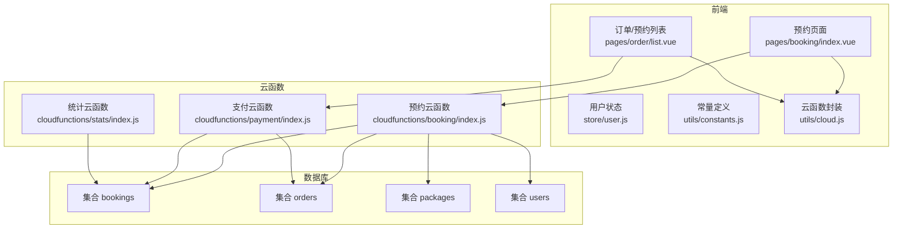
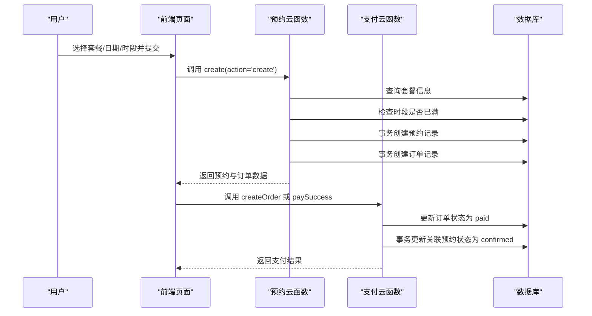
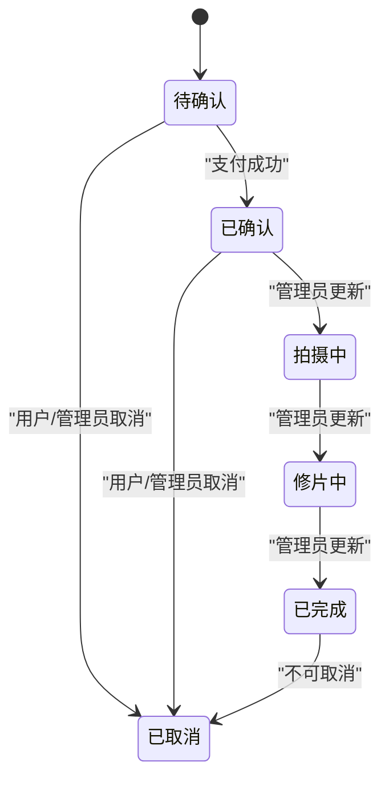
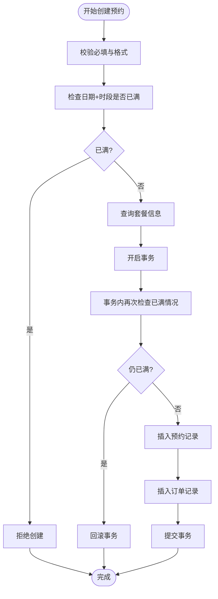
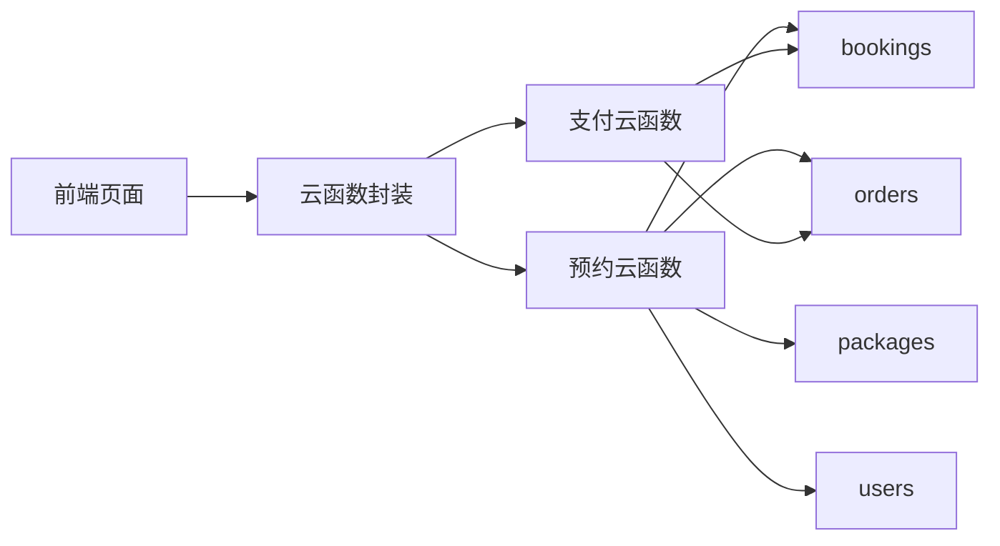

# 预约模型

<cite>
**本文档引用的文件**
- [miniprogram/cloudfunctions/booking/index.js](file://miniprogram/cloudfunctions/booking/index.js)
- [miniprogram/cloudfunctions/payment/index.js](file://miniprogram/cloudfunctions/payment/index.js)
- [miniprogram/cloudfunctions/stats/index.js](file://miniprogram/cloudfunctions/stats/index.js)
- [miniprogram/src/pages/booking/index.vue](file://miniprogram/src/pages/booking/index.vue)
- [miniprogram/src/pages/order/list.vue](file://miniprogram/src/pages/order/list.vue)
- [miniprogram/src/utils/constants.js](file://miniprogram/src/utils/constants.js)
- [miniprogram/src/utils/cloud.js](file://miniprogram/src/utils/cloud.js)
- [miniprogram/src/store/user.js](file://miniprogram/src/store/user.js)
</cite>

## 目录
1. [简介](#简介)
2. [项目结构](#项目结构)
3. [核心组件](#核心组件)
4. [架构总览](#架构总览)
5. [详细组件分析](#详细组件分析)
6. [依赖关系分析](#依赖关系分析)
7. [性能考虑](#性能考虑)
8. [故障排查指南](#故障排查指南)
9. [结论](#结论)
10. [附录](#附录)

## 简介
本文件面向“预约模型”的数据结构设计与业务流程，围绕以下目标展开：
- 全面梳理预约系统的核心字段与数据模型
- 解释预约状态机与状态转换规则及业务约束
- 说明时间槽管理机制与并发控制策略
- 提供预约创建、修改、取消的完整流程与数据校验规则
- 展示预约与订单、支付的关联关系设计
- 总结查询优化与索引策略建议

## 项目结构
本项目采用“前端页面 + 云函数服务 + 数据库”的三层架构：
- 前端页面负责用户交互与调用云函数
- 云函数封装业务逻辑与数据库操作
- 数据库包含 bookings、orders、packages、users 等集合

图表来源
- [miniprogram/src/pages/booking/index.vue](file://miniprogram/src/pages/booking/index.vue)
- [miniprogram/src/pages/order/list.vue](file://miniprogram/src/pages/order/list.vue)
- [miniprogram/src/utils/cloud.js](file://miniprogram/src/utils/cloud.js)
- [miniprogram/cloudfunctions/booking/index.js](file://miniprogram/cloudfunctions/booking/index.js)
- [miniprogram/cloudfunctions/payment/index.js](file://miniprogram/cloudfunctions/payment/index.js)
- [miniprogram/cloudfunctions/stats/index.js](file://miniprogram/cloudfunctions/stats/index.js)

章节来源
- [miniprogram/src/pages/booking/index.vue](file://miniprogram/src/pages/booking/index.vue)
- [miniprogram/src/pages/order/list.vue](file://miniprogram/src/pages/order/list.vue)
- [miniprogram/src/utils/cloud.js](file://miniprogram/src/utils/cloud.js)
- [miniprogram/cloudfunctions/booking/index.js](file://miniprogram/cloudfunctions/booking/index.js)
- [miniprogram/cloudfunctions/payment/index.js](file://miniprogram/cloudfunctions/payment/index.js)
- [miniprogram/cloudfunctions/stats/index.js](file://miniprogram/cloudfunctions/stats/index.js)

## 核心组件
- 预约云函数：负责预约创建、查询、详情、取消、状态更新、可用时段查询
- 支付云函数：负责订单创建、支付成功回调、退款处理
- 前端页面：预约页面、订单/预约列表页面
- 常量与工具：状态枚举、云函数封装、用户状态管理

章节来源
- [miniprogram/cloudfunctions/booking/index.js](file://miniprogram/cloudfunctions/booking/index.js)
- [miniprogram/cloudfunctions/payment/index.js](file://miniprogram/cloudfunctions/payment/index.js)
- [miniprogram/src/pages/booking/index.vue](file://miniprogram/src/pages/booking/index.vue)
- [miniprogram/src/pages/order/list.vue](file://miniprogram/src/pages/order/list.vue)
- [miniprogram/src/utils/constants.js](file://miniprogram/src/utils/constants.js)
- [miniprogram/src/utils/cloud.js](file://miniprogram/src/utils/cloud.js)

## 架构总览
预约与支付的协作流程如下：
- 用户在预约页面选择套餐、日期、时段并填写联系信息
- 提交后调用预约云函数创建预约记录，并同时创建订单记录
- 用户进入支付流程，调用支付云函数创建支付参数或处理支付成功
- 支付成功后，支付云函数通过事务更新订单与预约状态
- 管理员可在后台更新预约状态或进行退款处理

图表来源
- [miniprogram/cloudfunctions/booking/index.js](file://miniprogram/cloudfunctions/booking/index.js)
- [miniprogram/cloudfunctions/payment/index.js](file://miniprogram/cloudfunctions/payment/index.js)
- [miniprogram/src/pages/booking/index.vue](file://miniprogram/src/pages/booking/index.vue)
- [miniprogram/src/pages/order/list.vue](file://miniprogram/src/pages/order/list.vue)

## 详细组件分析

### 预约数据模型
- 集合名称：bookings
- 关键字段
  - 主键：_id（由数据库自动生成）
  - 用户关联：userId（对应用户 openid）
  - 套餐关联：packageId、packageName、packagePrice
  - 预约时间：date（YYYY-MM-DD）、timeSlot（morning/afternoon/golden）
  - 预约人数：persons（≥1）
  - 联系信息：contactName、contactPhone
  - 备注：remark
  - 状态：status（pending/confirmed/shooting/retouching/completed/cancelled）
  - 时间戳：createTime、updateTime、cancelTime（取消时填充）
  - 取消来源：cancelBy（user/admin）

- 字段来源与约束
  - 必填校验：packageId、date、timeSlot、contactName、contactPhone、persons
  - 时段校验：timeSlot 必须属于预设时段集合
  - 人数校验：persons ≥ 1
  - 时段容量：同一日期+时段最多容纳固定数量的预约（防超卖）

章节来源
- [miniprogram/cloudfunctions/booking/index.js](file://miniprogram/cloudfunctions/booking/index.js)
- [miniprogram/src/utils/constants.js](file://miniprogram/src/utils/constants.js)

### 订单数据模型
- 集合名称：orders
- 关键字段
  - 主键：_id
  - 关联字段：bookingId、userId、packageId、packageName
  - 价格：totalPrice、depositAmount
  - 支付状态：payStatus（unpaid/paid/refunded）
  - 订单编号：orderNo（生成规则见下文）
  - 时间戳：createTime、payTime、refundTime、updateTime

- 订单编号生成规则
  - 格式：LP + 年月日时分秒 + 4位随机数
  - 示例：LP202604081234560001

章节来源
- [miniprogram/cloudfunctions/booking/index.js](file://miniprogram/cloudfunctions/booking/index.js)
- [miniprogram/cloudfunctions/payment/index.js](file://miniprogram/cloudfunctions/payment/index.js)

### 预约状态机与业务约束
- 状态集合：pending、confirmed、shooting、retouching、completed、cancelled
- 状态转换规则
  - 创建后初始状态：pending
  - 支付成功后：confirmed
  - 管理员可直接更新为 shooting/retouching/completed
  - completed 不可取消
  - cancelled 不可再次取消
- 权限控制
  - 非管理员仅能查看/取消自己的预约
  - 管理员可更新任意预约状态

图表来源
- [miniprogram/cloudfunctions/booking/index.js](file://miniprogram/cloudfunctions/booking/index.js)
- [miniprogram/cloudfunctions/payment/index.js](file://miniprogram/cloudfunctions/payment/index.js)
- [miniprogram/src/utils/constants.js](file://miniprogram/src/utils/constants.js)

### 时间槽管理与并发控制
- 时段配置：morning、afternoon、golden
- 容量限制：每个日期+时段的最大预约数
- 并发保护
  - 预创建阶段二次检查时段是否已满
  - 使用事务保证“检查-计数-插入”原子性
  - 取消/退款时不会重复释放额度（通过状态过滤）

图表来源
- [miniprogram/cloudfunctions/booking/index.js](file://miniprogram/cloudfunctions/booking/index.js)

### 预约创建流程
- 前端校验：套餐、日期、时段、联系人、手机号、人数
- 调用云函数 action='create'
- 云函数执行：
  - 校验输入参数与格式
  - 检查时段容量
  - 查询套餐信息
  - 事务创建预约与订单
- 返回预约与订单对象，前端跳转支付

章节来源
- [miniprogram/src/pages/booking/index.vue](file://miniprogram/src/pages/booking/index.vue)
- [miniprogram/cloudfunctions/booking/index.js](file://miniprogram/cloudfunctions/booking/index.js)

### 预约取消流程
- 前端调用 action='cancel'
- 云函数执行：
  - 校验预约存在性与权限
  - 禁止取消已完成/已取消的预约
  - 更新预约状态为 cancelled
  - 若订单已支付，标记需退款
- 返回取消结果与退款提示

章节来源
- [miniprogram/cloudfunctions/booking/index.js](file://miniprogram/cloudfunctions/booking/index.js)
- [miniprogram/src/pages/order/list.vue](file://miniprogram/src/pages/order/list.vue)

### 支付与状态联动
- 支付成功
  - 云函数 action='paySuccess'
  - 事务更新订单为 paid，同时将关联预约更新为 confirmed
- 退款
  - 管理员调用 action='refund'
  - 事务更新订单为 refunded，同时将关联预约更新为 cancelled

章节来源
- [miniprogram/cloudfunctions/payment/index.js](file://miniprogram/cloudfunctions/payment/index.js)

### 预约与订单关联关系
- 一对多：一个订单对应一个预约（bookingId）
- 订单包含套餐信息副本（packageName、packagePrice），便于脱敏展示与历史追溯
- 订单编号 orderNo 作为外部标识，支持按订单号查询

章节来源
- [miniprogram/cloudfunctions/booking/index.js](file://miniprogram/cloudfunctions/booking/index.js)
- [miniprogram/cloudfunctions/payment/index.js](file://miniprogram/cloudfunctions/payment/index.js)

### 查询与索引策略建议
- 常用查询维度
  - 预约列表：按 userId/date/status 排序
  - 订单列表：按 userId/payStatus/createTime 排序
  - 可用时段：按 date/timeSlot/count
- 建议索引
  - bookings(userId, date, status, createTime)
  - bookings(date, timeSlot, status)
  - orders(userId, payStatus, createTime)
  - orders(orderNo)
- 分页与排序
  - 使用 skip/limit 实现分页
  - 使用 orderBy 控制排序顺序
- 统计与趋势
  - 按日期统计预约数量（排除 cancelled）

章节来源
- [miniprogram/cloudfunctions/booking/index.js](file://miniprogram/cloudfunctions/booking/index.js)
- [miniprogram/cloudfunctions/payment/index.js](file://miniprogram/cloudfunctions/payment/index.js)
- [miniprogram/cloudfunctions/stats/index.js](file://miniprogram/cloudfunctions/stats/index.js)

## 依赖关系分析
- 前端依赖
  - 调用云函数封装：utils/cloud.js
  - 状态与枚举：utils/constants.js
  - 用户状态：store/user.js
- 云函数依赖
  - booking：依赖 packages、users、orders 集合
  - payment：依赖 orders、bookings 集合
- 数据依赖
  - 预约与订单双向关联（bookingId）
  - 套餐信息副本（packageName、packagePrice）减少跨表查询

图表来源
- [miniprogram/src/utils/cloud.js](file://miniprogram/src/utils/cloud.js)
- [miniprogram/cloudfunctions/booking/index.js](file://miniprogram/cloudfunctions/booking/index.js)
- [miniprogram/cloudfunctions/payment/index.js](file://miniprogram/cloudfunctions/payment/index.js)

## 性能考虑
- 并发控制
  - 使用事务与二次检查，避免超卖
- 查询优化
  - 为高频查询建立复合索引
  - 分页查询使用 skip/limit，避免一次性加载过多数据
- 缓存与展示
  - 前端缓存套餐列表与可用时段，减少重复请求
- 异步处理
  - 支付回调与退款处理建议异步化，避免阻塞主流程

## 故障排查指南
- 常见错误与定位
  - “请选择套餐/日期/时段/联系人/手机号/人数”：前端校验失败
  - “该时段预约已满”：并发导致超卖，检查事务与二次检查
  - “套餐不存在”：packageId 错误或套餐下架
  - “无权限查看/取消此预约”：权限校验失败
  - “已完成的预约无法取消”：状态约束
  - “订单状态异常，无法支付”：订单状态不为 unpaid
- 排查步骤
  - 检查前端传参与校验逻辑
  - 查看云函数日志与事务回滚原因
  - 核对数据库索引与查询条件
  - 对比状态机与业务约束

章节来源
- [miniprogram/cloudfunctions/booking/index.js](file://miniprogram/cloudfunctions/booking/index.js)
- [miniprogram/cloudfunctions/payment/index.js](file://miniprogram/cloudfunctions/payment/index.js)

## 结论
本预约模型以“事务+二次检查+状态机+索引”为核心设计原则，实现了高并发下的数据一致性与良好的用户体验。通过预约与订单的紧密耦合，简化了支付与状态流转的复杂度；通过明确的状态转换规则与权限控制，保障了业务的合规性与可维护性。建议后续进一步完善索引策略与监控告警，持续优化查询性能与可观测性。

## 附录
- 前端调用云函数封装：utils/cloud.js
- 常量与状态枚举：utils/constants.js
- 用户状态管理：store/user.js
- 预约页面：pages/booking/index.vue
- 订单/预约列表：pages/order/list.vue