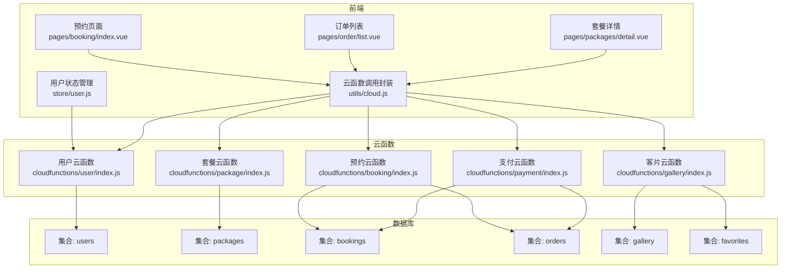
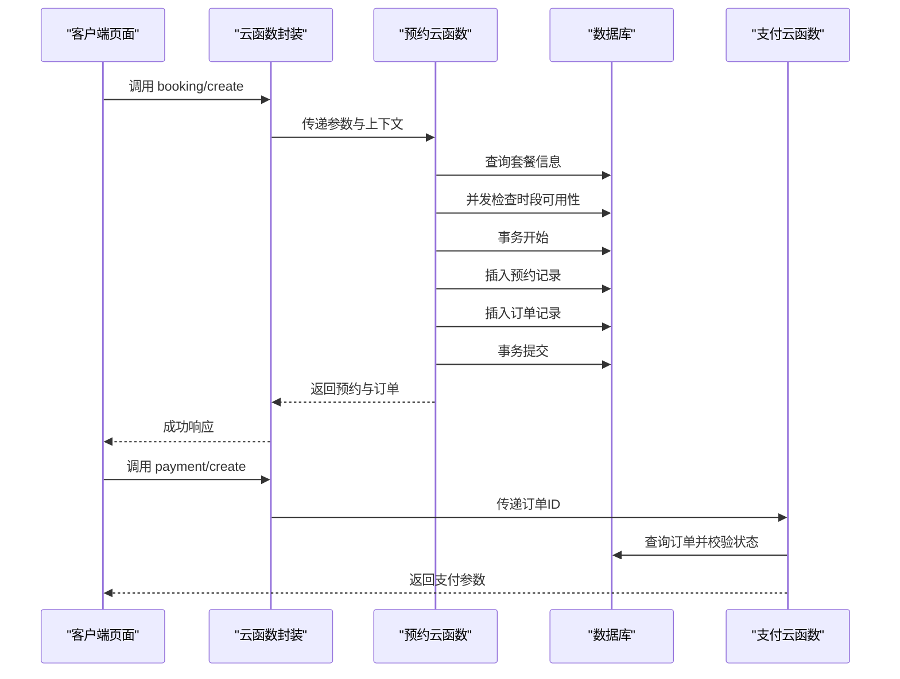
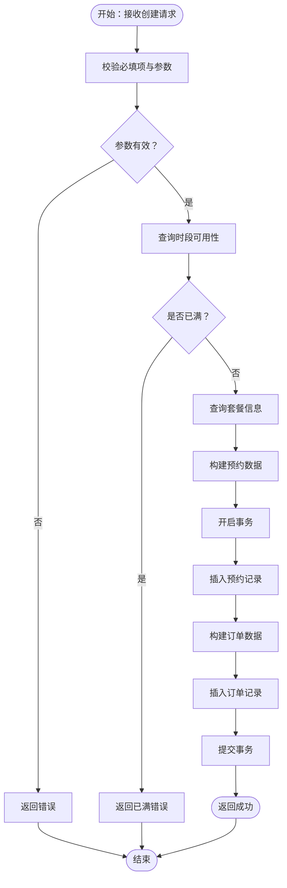
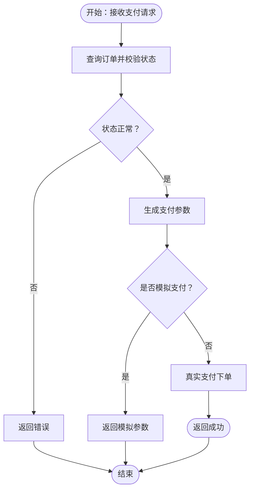
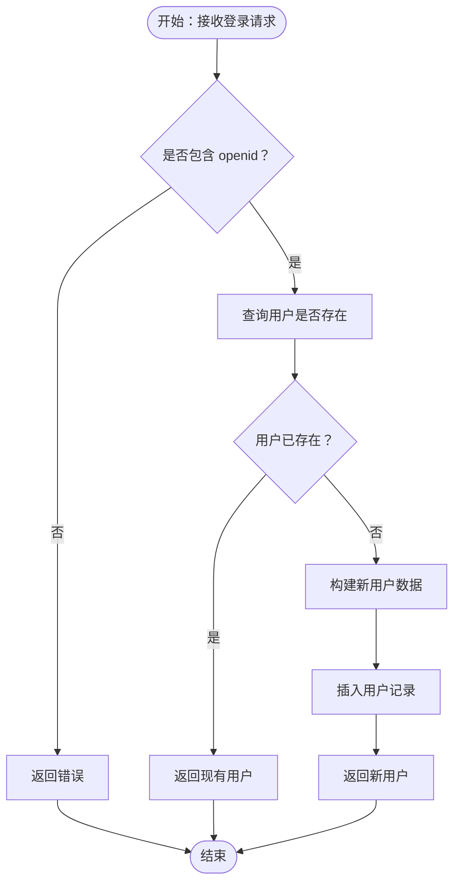
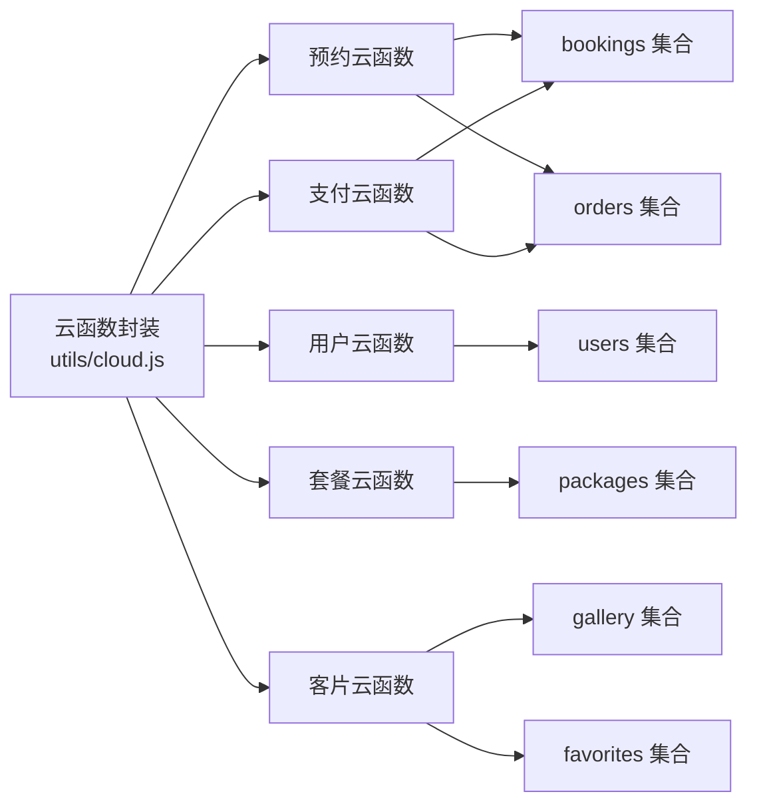

# 数据创建与初始化

<cite>
**本文档引用的文件**
- [miniprogram/cloudfunctions/booking/index.js](file://miniprogram/cloudfunctions/booking/index.js)
- [miniprogram/cloudfunctions/user/index.js](file://miniprogram/cloudfunctions/user/index.js)
- [miniprogram/cloudfunctions/payment/index.js](file://miniprogram/cloudfunctions/payment/index.js)
- [miniprogram/cloudfunctions/package/index.js](file://miniprogram/cloudfunctions/package/index.js)
- [miniprogram/cloudfunctions/gallery/index.js](file://miniprogram/cloudfunctions/gallery/index.js)
- [miniprogram/src/pages/booking/index.vue](file://miniprogram/src/pages/booking/index.vue)
- [miniprogram/src/pages/order/list.vue](file://miniprogram/src/pages/order/list.vue)
- [miniprogram/src/pages/packages/detail.vue](file://miniprogram/src/pages/packages/detail.vue)
- [miniprogram/src/store/user.js](file://miniprogram/src/store/user.js)
- [miniprogram/src/utils/cloud.js](file://miniprogram/src/utils/cloud.js)
- [miniprogram/src/utils/constants.js](file://miniprogram/src/utils/constants.js)
</cite>

## 目录
1. [简介](#简介)
2. [项目结构](#项目结构)
3. [核心组件](#核心组件)
4. [架构总览](#架构总览)
5. [详细组件分析](#详细组件分析)
6. [依赖关系分析](#依赖关系分析)
7. [性能考虑](#性能考虑)
8. [故障排除指南](#故障排除指南)
9. [结论](#结论)
10. [附录](#附录)

## 简介
本文件系统性梳理 lvpai 项目中的数据创建与初始化流程，重点覆盖以下方面：
- 预约数据、订单数据、用户数据的创建时机与数据结构设计
- 数据验证规则、默认值设置与约束条件
- 并发安全机制、事务处理与数据一致性保证
- 最佳实践与常见问题解决方案
- 为开发者提供完整的数据初始化指导与实现参考

## 项目结构
项目采用“前端页面 + 云函数 + 数据库”的三层架构：
- 前端页面通过云函数封装调用数据库操作，统一进行权限校验与数据校验
- 云函数负责业务逻辑、并发控制与事务处理
- 数据库采用云开发集合（users、packages、bookings、orders、gallery、favorites）

图表来源
- [miniprogram/src/pages/booking/index.vue:1-1029](file://miniprogram/src/pages/booking/index.vue#L1-L1029)
- [miniprogram/src/pages/order/list.vue:1-554](file://miniprogram/src/pages/order/list.vue#L1-L554)
- [miniprogram/src/pages/packages/detail.vue:1-598](file://miniprogram/src/pages/packages/detail.vue#L1-L598)
- [miniprogram/src/store/user.js:1-48](file://miniprogram/src/store/user.js#L1-L48)
- [miniprogram/src/utils/cloud.js:1-66](file://miniprogram/src/utils/cloud.js#L1-L66)
- [miniprogram/cloudfunctions/booking/index.js:1-463](file://miniprogram/cloudfunctions/booking/index.js#L1-L463)
- [miniprogram/cloudfunctions/payment/index.js:1-532](file://miniprogram/cloudfunctions/payment/index.js#L1-L532)
- [miniprogram/cloudfunctions/user/index.js:1-206](file://miniprogram/cloudfunctions/user/index.js#L1-L206)
- [miniprogram/cloudfunctions/package/index.js:1-222](file://miniprogram/cloudfunctions/package/index.js#L1-L222)
- [miniprogram/cloudfunctions/gallery/index.js:1-360](file://miniprogram/cloudfunctions/gallery/index.js#L1-L360)

章节来源
- [miniprogram/src/pages/booking/index.vue:1-1029](file://miniprogram/src/pages/booking/index.vue#L1-L1029)
- [miniprogram/src/pages/order/list.vue:1-554](file://miniprogram/src/pages/order/list.vue#L1-L554)
- [miniprogram/src/pages/packages/detail.vue:1-598](file://miniprogram/src/pages/packages/detail.vue#L1-L598)
- [miniprogram/src/store/user.js:1-48](file://miniprogram/src/store/user.js#L1-L48)
- [miniprogram/src/utils/cloud.js:1-66](file://miniprogram/src/utils/cloud.js#L1-L66)
- [miniprogram/cloudfunctions/booking/index.js:1-463](file://miniprogram/cloudfunctions/booking/index.js#L1-L463)
- [miniprogram/cloudfunctions/payment/index.js:1-532](file://miniprogram/cloudfunctions/payment/index.js#L1-L532)
- [miniprogram/cloudfunctions/user/index.js:1-206](file://miniprogram/cloudfunctions/user/index.js#L1-L206)
- [miniprogram/cloudfunctions/package/index.js:1-222](file://miniprogram/cloudfunctions/package/index.js#L1-L222)
- [miniprogram/cloudfunctions/gallery/index.js:1-360](file://miniprogram/cloudfunctions/gallery/index.js#L1-L360)

## 核心组件
- 预约云函数：负责预约创建、查询、取消、状态更新与可用时段查询；关键特性包括并发检查、事务一致性、管理员权限校验
- 支付云函数：负责订单创建、支付成功回调、退款处理；支持事务更新订单与预约状态
- 用户云函数：负责用户登录初始化、资料更新、手机号绑定、管理员角色设置
- 套餐云函数：负责套餐的增删改查与上下架管理，管理员权限校验
- 客片云函数：负责客片的增删改查、收藏与取消收藏，删除客片时级联清理收藏记录

章节来源
- [miniprogram/cloudfunctions/booking/index.js:67-206](file://miniprogram/cloudfunctions/booking/index.js#L67-L206)
- [miniprogram/cloudfunctions/payment/index.js:26-239](file://miniprogram/cloudfunctions/payment/index.js#L26-L239)
- [miniprogram/cloudfunctions/user/index.js:7-67](file://miniprogram/cloudfunctions/user/index.js#L7-L67)
- [miniprogram/cloudfunctions/package/index.js:26-134](file://miniprogram/cloudfunctions/package/index.js#L26-L134)
- [miniprogram/cloudfunctions/gallery/index.js:26-225](file://miniprogram/cloudfunctions/gallery/index.js#L26-L225)

## 架构总览
数据创建与初始化遵循“前端触发 → 云函数校验与处理 → 数据库持久化 → 返回结果”的闭环。前端通过云函数封装统一调用，云函数内完成权限校验、数据校验、并发控制与事务处理，确保数据一致性。

图表来源
- [miniprogram/src/utils/cloud.js:5-26](file://miniprogram/src/utils/cloud.js#L5-L26)
- [miniprogram/cloudfunctions/booking/index.js:98-206](file://miniprogram/cloudfunctions/booking/index.js#L98-L206)
- [miniprogram/cloudfunctions/payment/index.js:65-166](file://miniprogram/cloudfunctions/payment/index.js#L65-L166)

## 详细组件分析

### 预约数据创建与初始化
- 创建时机：用户在预约页面选择套餐、日期、时段与联系信息后提交，前端调用预约云函数的 create 接口
- 数据结构设计：
  - 预约记录包含用户标识、套餐信息、预约日期与时段、联系人信息、人数、状态、备注、时间戳等
  - 订单记录包含关联预约ID、用户ID、套餐信息、总价、定金、支付状态、订单号、时间戳等
- 验证规则与默认值：
  - 必填项校验：套餐ID、日期、时段、联系人姓名、联系电话、拍摄人数
  - 时段有效性：限定在 morning/afternoon/golden 三个时段
  - 并发安全：创建前与创建后两次检查时段是否已满，防止超卖
  - 默认值：状态默认 pending，时间戳使用服务端时间
- 并发安全与事务：
  - 使用数据库事务同时插入预约与订单，保证原子性
  - 二次检查避免竞态条件下超卖
- 关键流程图

图表来源
- [miniprogram/cloudfunctions/booking/index.js:98-206](file://miniprogram/cloudfunctions/booking/index.js#L98-L206)

章节来源
- [miniprogram/cloudfunctions/booking/index.js:98-206](file://miniprogram/cloudfunctions/booking/index.js#L98-L206)
- [miniprogram/src/pages/booking/index.vue:423-470](file://miniprogram/src/pages/booking/index.vue#L423-L470)

### 订单数据创建与初始化
- 创建时机：预约成功后，前端跳转至支付页面，调用支付云函数创建支付订单
- 数据结构设计：
  - 订单包含关联预约ID、用户ID、套餐信息、总价、定金、支付状态、订单号、时间戳等
  - 订单号采用“LP + 年月日时分秒 + 4位随机数”格式
- 验证规则与默认值：
  - 必填项：订单ID
  - 权限校验：仅允许本人支付
  - 状态校验：仅未支付订单可发起支付
  - 默认值：支付状态默认 unpaid，时间戳使用服务端时间
- 并发安全与事务：
  - 支付成功回调中使用事务同时更新订单与预约状态，保证一致性
- 关键流程图

图表来源
- [miniprogram/cloudfunctions/payment/index.js:65-166](file://miniprogram/cloudfunctions/payment/index.js#L65-L166)

章节来源
- [miniprogram/cloudfunctions/payment/index.js:65-166](file://miniprogram/cloudfunctions/payment/index.js#L65-L166)
- [miniprogram/cloudfunctions/booking/index.js:174-190](file://miniprogram/cloudfunctions/booking/index.js#L174-L190)

### 用户数据创建与初始化
- 创建时机：用户首次访问或登录时，调用用户云函数的 login 接口
- 数据结构设计：
  - 用户包含 openid、昵称、头像、手机号、角色、创建时间等
- 验证规则与默认值：
  - 必填项：openid（由云环境提供）
  - 角色默认 user
  - 时间戳使用服务端时间
- 权限与扩展：
  - 支持手机号更新、资料更新、管理员角色设置（仅 superAdmin 可执行）
- 关键流程图

图表来源
- [miniprogram/cloudfunctions/user/index.js:34-67](file://miniprogram/cloudfunctions/user/index.js#L34-L67)

章节来源
- [miniprogram/cloudfunctions/user/index.js:34-67](file://miniprogram/cloudfunctions/user/index.js#L34-L67)
- [miniprogram/src/store/user.js:10-20](file://miniprogram/src/store/user.js#L10-L20)

### 套餐与客片数据管理
- 套餐管理：管理员可创建、更新、删除、上下架套餐；非管理员仅能查询上架套餐
- 客片管理：管理员可创建、更新、删除客片；删除客片时级联删除相关收藏记录
- 并发与一致性：删除客片使用事务保证数据一致性

章节来源
- [miniprogram/cloudfunctions/package/index.js:109-134](file://miniprogram/cloudfunctions/package/index.js#L109-L134)
- [miniprogram/cloudfunctions/gallery/index.js:127-225](file://miniprogram/cloudfunctions/gallery/index.js#L127-L225)

## 依赖关系分析
- 前端依赖云函数封装工具，统一处理返回码与错误
- 云函数之间存在数据耦合：预约创建会联动生成订单；支付回调会联动更新预约状态
- 权限模型：用户角色分为 user/admin/superAdmin，不同操作具有不同权限边界

图表来源
- [miniprogram/src/utils/cloud.js:5-26](file://miniprogram/src/utils/cloud.js#L5-L26)
- [miniprogram/cloudfunctions/booking/index.js:4-6](file://miniprogram/cloudfunctions/booking/index.js#L4-L6)
- [miniprogram/cloudfunctions/payment/index.js:4-6](file://miniprogram/cloudfunctions/payment/index.js#L4-L6)
- [miniprogram/cloudfunctions/user/index.js:4-6](file://miniprogram/cloudfunctions/user/index.js#L4-L6)
- [miniprogram/cloudfunctions/package/index.js:4-6](file://miniprogram/cloudfunctions/package/index.js#L4-L6)
- [miniprogram/cloudfunctions/gallery/index.js:4-6](file://miniprogram/cloudfunctions/gallery/index.js#L4-L6)

章节来源
- [miniprogram/src/utils/cloud.js:5-26](file://miniprogram/src/utils/cloud.js#L5-L26)
- [miniprogram/cloudfunctions/booking/index.js:4-6](file://miniprogram/cloudfunctions/booking/index.js#L4-L6)
- [miniprogram/cloudfunctions/payment/index.js:4-6](file://miniprogram/cloudfunctions/payment/index.js#L4-L6)
- [miniprogram/cloudfunctions/user/index.js:4-6](file://miniprogram/cloudfunctions/user/index.js#L4-L6)
- [miniprogram/cloudfunctions/package/index.js:4-6](file://miniprogram/cloudfunctions/package/index.js#L4-L6)
- [miniprogram/cloudfunctions/gallery/index.js:4-6](file://miniprogram/cloudfunctions/gallery/index.js#L4-L6)

## 性能考虑
- 并发控制：预约创建前后双重检查时段可用性，降低超卖风险
- 事务优化：批量写入使用事务，减少中间态，提升一致性与性能
- 查询优化：分页查询、条件过滤、排序索引（建议在数据库侧建立相应索引）
- 前端缓存：用户状态与套餐列表可在前端做轻量缓存，减少重复请求
- 异步处理：支付回调与退款处理建议异步化，避免阻塞主流程

## 故障排除指南
- 预约失败
  - 现象：提交预约后返回“时段已满”
  - 原因：并发情况下多个用户同时提交导致超卖
  - 处理：检查云函数中的二次检查逻辑是否生效；确认数据库事务是否正确提交
- 支付异常
  - 现象：支付成功但订单状态未更新
  - 原因：支付回调未正确触发或事务回滚
  - 处理：检查支付回调云函数与事务提交逻辑；确认订单状态校验
- 权限错误
  - 现象：非管理员尝试修改订单或套餐
  - 原因：权限校验失败
  - 处理：确认用户角色与操作权限匹配；检查云函数中的管理员校验逻辑
- 数据不一致
  - 现象：订单与预约状态不一致
  - 原因：事务未正确提交或回调未执行
  - 处理：使用事务包裹相关更新；增加幂等性校验与重试机制

章节来源
- [miniprogram/cloudfunctions/booking/index.js:150-206](file://miniprogram/cloudfunctions/booking/index.js#L150-L206)
- [miniprogram/cloudfunctions/payment/index.js:203-239](file://miniprogram/cloudfunctions/payment/index.js#L203-L239)
- [miniprogram/cloudfunctions/user/index.js:156-205](file://miniprogram/cloudfunctions/user/index.js#L156-L205)

## 结论
lvpai 项目通过云函数实现了严格的权限控制、完善的参数校验与事务一致性保障，确保预约、订单与用户数据在高并发场景下的正确创建与初始化。前端通过统一的云函数封装简化了调用流程，提升了系统的可维护性与可扩展性。建议在生产环境中进一步完善数据库索引、回调监控与重试机制，持续优化用户体验与系统稳定性。

## 附录
- 常用常量与状态定义参考：[miniprogram/src/utils/constants.js:22-56](file://miniprogram/src/utils/constants.js#L22-L56)
- 前端云函数调用封装参考：[miniprogram/src/utils/cloud.js:5-26](file://miniprogram/src/utils/cloud.js#L5-L26)
- 预约页面交互与数据流参考：[miniprogram/src/pages/booking/index.vue:423-470](file://miniprogram/src/pages/booking/index.vue#L423-L470)
- 订单列表与状态展示参考：[miniprogram/src/pages/order/list.vue:168-210](file://miniprogram/src/pages/order/list.vue#L168-L210)
- 套餐详情与预约入口参考：[miniprogram/src/pages/packages/detail.vue:195-200](file://miniprogram/src/pages/packages/detail.vue#L195-L200)