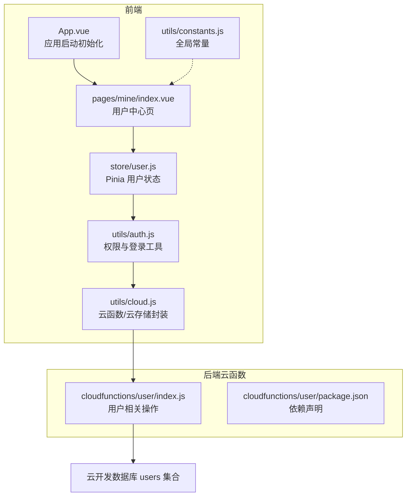
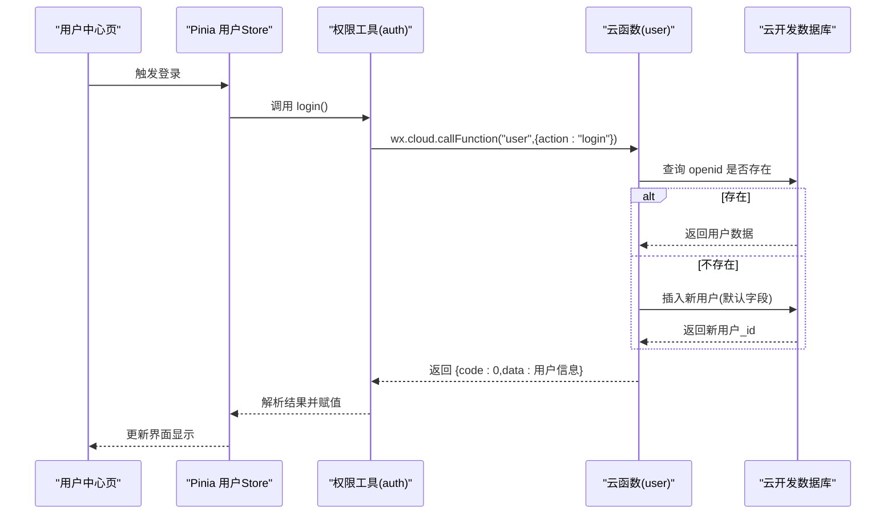
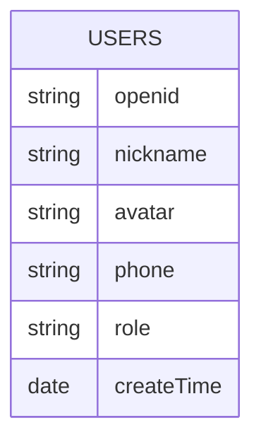
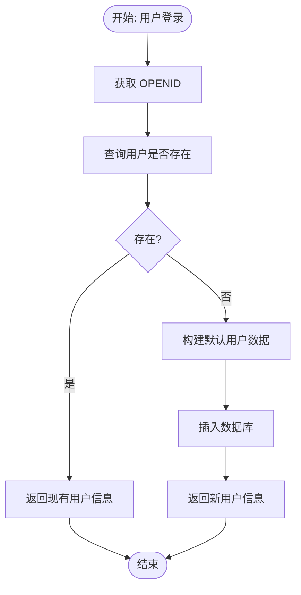
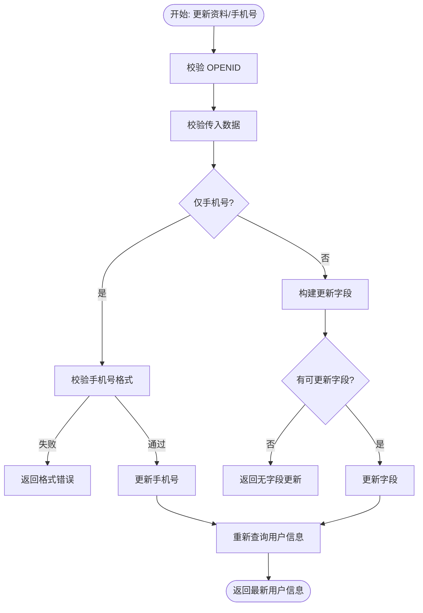
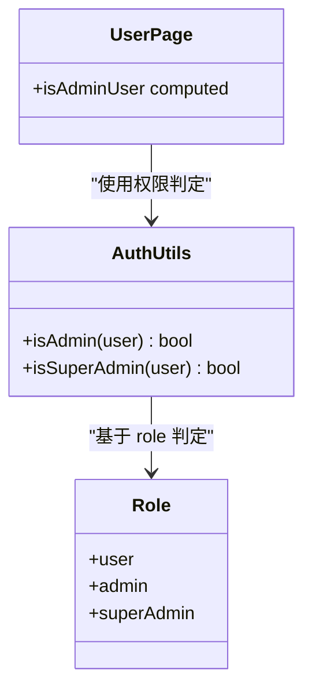
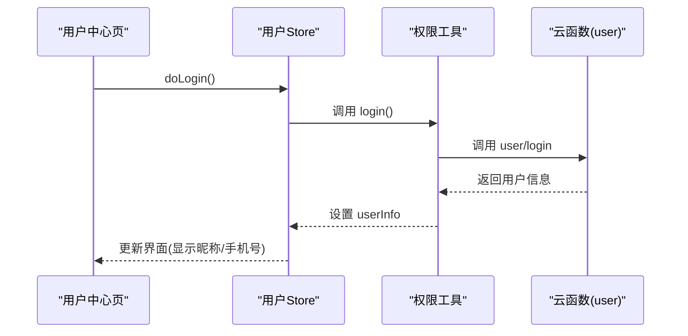
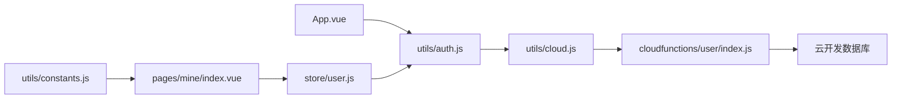

# 用户数据创建

<cite>
**本文档引用的文件**
- [miniprogram/cloudfunctions/user/index.js](file://miniprogram/cloudfunctions/user/index.js)
- [miniprogram/src/store/user.js](file://miniprogram/src/store/user.js)
- [miniprogram/src/utils/auth.js](file://miniprogram/src/utils/auth.js)
- [miniprogram/src/utils/cloud.js](file://miniprogram/src/utils/cloud.js)
- [miniprogram/src/pages/mine/index.vue](file://miniprogram/src/pages/mine/index.vue)
- [miniprogram/src/App.vue](file://miniprogram/src/App.vue)
- [miniprogram/src/utils/constants.js](file://miniprogram/src/utils/constants.js)
- [miniprogram/cloudfunctions/user/package.json](file://miniprogram/cloudfunctions/user/package.json)
- [miniprogram/src/pages-admin/dashboard/index.vue](file://miniprogram/src/pages-admin/dashboard/index.vue)
- [miniprogram/src/pages-admin/settings/index.vue](file://miniprogram/src/pages-admin/settings/index.vue)
</cite>

## 目录
1. [简介](#简介)
2. [项目结构](#项目结构)
3. [核心组件](#核心组件)
4. [架构总览](#架构总览)
5. [详细组件分析](#详细组件分析)
6. [依赖关系分析](#依赖关系分析)
7. [性能考量](#性能考量)
8. [故障排查指南](#故障排查指南)
9. [结论](#结论)
10. [附录](#附录)

## 简介
本文件面向开发者，系统性阐述 lvpai 项目中“用户数据创建”的完整流程与实现细节，包括：
- 用户数据模型设计、字段定义与默认值策略
- 用户注册流程、OpenID 绑定机制与角色分配策略
- 用户数据验证规则、权限初始化与状态管理
- 安全考虑、隐私保护与数据同步机制
- 为开发者提供的实现指导与权限控制方案

## 项目结构
围绕用户数据创建的关键文件分布如下：
- 云函数：用户云函数负责用户注册、资料查询与更新、手机号绑定、角色变更等
- 前端 Store：集中管理用户登录态、用户信息与管理员判定
- 工具层：封装云函数调用、鉴权判断与云存储接口
- 页面层：用户中心页触发登录，管理后台根据权限渲染入口
- 常量层：提供全局常量与业务配置

**图表来源**
- [miniprogram/src/App.vue:1-26](file://miniprogram/src/App.vue#L1-L26)
- [miniprogram/src/pages/mine/index.vue:1-309](file://miniprogram/src/pages/mine/index.vue#L1-L309)
- [miniprogram/src/store/user.js:1-48](file://miniprogram/src/store/user.js#L1-L48)
- [miniprogram/src/utils/auth.js:1-47](file://miniprogram/src/utils/auth.js#L1-L47)
- [miniprogram/src/utils/cloud.js:1-66](file://miniprogram/src/utils/cloud.js#L1-L66)
- [miniprogram/cloudfunctions/user/index.js:1-206](file://miniprogram/cloudfunctions/user/index.js#L1-L206)
- [miniprogram/cloudfunctions/user/package.json:1-7](file://miniprogram/cloudfunctions/user/package.json#L1-L7)

**章节来源**
- [miniprogram/src/App.vue:1-26](file://miniprogram/src/App.vue#L1-L26)
- [miniprogram/src/pages/mine/index.vue:1-309](file://miniprogram/src/pages/mine/index.vue#L1-L309)
- [miniprogram/src/store/user.js:1-48](file://miniprogram/src/store/user.js#L1-L48)
- [miniprogram/src/utils/auth.js:1-47](file://miniprogram/src/utils/auth.js#L1-L47)
- [miniprogram/src/utils/cloud.js:1-66](file://miniprogram/src/utils/cloud.js#L1-L66)
- [miniprogram/cloudfunctions/user/index.js:1-206](file://miniprogram/cloudfunctions/user/index.js#L1-L206)
- [miniprogram/cloudfunctions/user/package.json:1-7](file://miniprogram/cloudfunctions/user/package.json#L1-L7)

## 核心组件
- 用户云函数（user）
  - 提供登录、获取资料、更新资料、更新手机号、设置管理员角色等操作
  - 默认角色为普通用户，首次登录自动创建用户记录
- 前端用户 Store（Pinia）
  - 维护用户信息、登录态与管理员判定
  - 对外暴露登录、拉取资料、清理用户信息等方法
- 权限与云函数封装
  - 统一封装 wx.cloud.callFunction 调用，按返回码进行统一处理
  - 提供 isAdmin/isSuperAdmin 等权限判断工具

**章节来源**
- [miniprogram/cloudfunctions/user/index.js:7-31](file://miniprogram/cloudfunctions/user/index.js#L7-L31)
- [miniprogram/src/store/user.js:5-47](file://miniprogram/src/store/user.js#L5-L47)
- [miniprogram/src/utils/auth.js:6-36](file://miniprogram/src/utils/auth.js#L6-L36)
- [miniprogram/src/utils/cloud.js:5-26](file://miniprogram/src/utils/cloud.js#L5-L26)

## 架构总览
用户数据创建的整体流程从小程序端发起登录请求，经由云函数完成 OpenID 绑定与用户初始化，随后返回用户信息并写入前端 Store。

**图表来源**
- [miniprogram/src/pages/mine/index.vue:82-99](file://miniprogram/src/pages/mine/index.vue#L82-L99)
- [miniprogram/src/store/user.js:10-20](file://miniprogram/src/store/user.js#L10-L20)
- [miniprogram/src/utils/auth.js:7-15](file://miniprogram/src/utils/auth.js#L7-L15)
- [miniprogram/cloudfunctions/user/index.js:13-67](file://miniprogram/cloudfunctions/user/index.js#L13-L67)

## 详细组件分析

### 用户数据模型与默认值
- 字段定义
  - openid：微信唯一标识，云函数通过上下文获取
  - nickname：昵称，默认空字符串
  - avatar：头像地址，默认空字符串
  - phone：手机号，默认空字符串
  - role：角色，默认 user（普通用户）
  - createTime：创建时间，使用云开发服务端时间
- 默认值策略
  - 首次登录时自动填充上述字段，未填写字段保持默认值
  - 后续可通过更新接口按需补充或修改

**图表来源**
- [miniprogram/cloudfunctions/user/index.js:47-55](file://miniprogram/cloudfunctions/user/index.js#L47-L55)

**章节来源**
- [miniprogram/cloudfunctions/user/index.js:47-67](file://miniprogram/cloudfunctions/user/index.js#L47-L67)

### 注册流程与 OpenID 绑定
- 流程要点
  - 前端调用云函数 user 的 login 操作
  - 云函数通过上下文获取 OPENID
  - 查询数据库是否存在该 openid
  - 若不存在则创建新用户并返回完整信息；若存在则直接返回现有用户信息
- OpenID 绑定
  - 以 openid 作为用户唯一标识，贯穿后续所有用户相关操作
- 错误处理
  - 云函数对未知操作、参数缺失、服务器异常等情况进行统一返回

**图表来源**
- [miniprogram/cloudfunctions/user/index.js:34-67](file://miniprogram/cloudfunctions/user/index.js#L34-L67)

**章节来源**
- [miniprogram/cloudfunctions/user/index.js:13-31](file://miniprogram/cloudfunctions/user/index.js#L13-L31)
- [miniprogram/cloudfunctions/user/index.js:34-67](file://miniprogram/cloudfunctions/user/index.js#L34-L67)

### 资料更新与手机号绑定
- 资料更新
  - 支持更新 nickname、avatar 等字段
  - 未传入任何字段时拒绝更新
  - 更新后返回最新用户信息
- 手机号绑定
  - 必须传入 phone 参数
  - 校验手机号格式（中国大陆手机号正则）
  - 成功后返回更新后的用户信息

**图表来源**
- [miniprogram/cloudfunctions/user/index.js:84-154](file://miniprogram/cloudfunctions/user/index.js#L84-L154)

**章节来源**
- [miniprogram/cloudfunctions/user/index.js:117-154](file://miniprogram/cloudfunctions/user/index.js#L117-L154)
- [miniprogram/cloudfunctions/user/index.js:84-115](file://miniprogram/cloudfunctions/user/index.js#L84-L115)

### 角色分配策略与权限控制
- 角色层级
  - user：普通用户
  - admin：管理员
  - superAdmin：超级管理员
- 分配机制
  - 仅 superAdmin 可调用 setAdmin 接口
  - 目标 openid 必须存在，且角色值必须在允许范围内
- 前端权限判定
  - isAdmin：admin 或 superAdmin 即视为管理员
  - isSuperAdmin：仅 superAdmin
  - 管理后台入口仅在 isAdmin 为真时显示

**图表来源**
- [miniprogram/src/utils/auth.js:28-36](file://miniprogram/src/utils/auth.js#L28-L36)
- [miniprogram/src/pages/mine/index.vue:58-64](file://miniprogram/src/pages/mine/index.vue#L58-L64)

**章节来源**
- [miniprogram/cloudfunctions/user/index.js:156-205](file://miniprogram/cloudfunctions/user/index.js#L156-L205)
- [miniprogram/src/utils/auth.js:28-36](file://miniprogram/src/utils/auth.js#L28-L36)
- [miniprogram/src/pages/mine/index.vue:58-64](file://miniprogram/src/pages/mine/index.vue#L58-L64)

### 前端状态管理与界面联动
- 用户 Store
  - userInfo：当前用户信息
  - isLoggedIn：基于 userInfo 是否存在
  - isAdminUser：基于权限工具判定
  - doLogin/fetchProfile/clearUser：对外暴露的方法
- 用户中心页
  - 登录按钮触发 doLogin
  - 登录成功/失败通过 Toast 提示
  - 显示脱敏手机号与昵称占位

**图表来源**
- [miniprogram/src/pages/mine/index.vue:82-99](file://miniprogram/src/pages/mine/index.vue#L82-L99)
- [miniprogram/src/store/user.js:10-32](file://miniprogram/src/store/user.js#L10-L32)
- [miniprogram/src/utils/auth.js:7-15](file://miniprogram/src/utils/auth.js#L7-L15)

**章节来源**
- [miniprogram/src/store/user.js:5-47](file://miniprogram/src/store/user.js#L5-L47)
- [miniprogram/src/pages/mine/index.vue:1-309](file://miniprogram/src/pages/mine/index.vue#L1-L309)

### 数据验证规则与安全考虑
- 验证规则
  - 手机号格式：中国大陆手机号正则校验
  - 参数完整性：必要字段缺失时拒绝处理
  - 角色值范围：限定为 user/admin/superAdmin
- 安全考虑
  - setAdmin 仅允许 superAdmin 调用
  - 云函数内严格校验 openid 与用户存在性
  - 前端仅基于权限工具进行 UI 展示，不直接操作角色
- 隐私保护
  - 前端页面对手机号进行脱敏展示
  - 云函数返回数据不包含敏感字段（如不暴露 openid 于非必要场景）

**章节来源**
- [miniprogram/cloudfunctions/user/index.js:84-115](file://miniprogram/cloudfunctions/user/index.js#L84-L115)
- [miniprogram/cloudfunctions/user/index.js:156-205](file://miniprogram/cloudfunctions/user/index.js#L156-L205)
- [miniprogram/src/pages/mine/index.vue:101-105](file://miniprogram/src/pages/mine/index.vue#L101-L105)

### 数据同步机制
- 前端 Store 与云函数
  - 登录成功后，前端将返回的用户信息写入 Store
  - 资料更新后，前端再次调用获取最新用户信息，保证本地与云端一致
- 管理后台入口
  - 通过 isAdminUser 计算属性动态渲染管理入口，避免硬编码权限判断

**章节来源**
- [miniprogram/src/store/user.js:22-32](file://miniprogram/src/store/user.js#L22-L32)
- [miniprogram/src/pages/mine/index.vue:58-64](file://miniprogram/src/pages/mine/index.vue#L58-L64)

## 依赖关系分析
- 前端依赖
  - App.vue 初始化云开发能力
  - pages/mine/index.vue 依赖用户 Store 与权限工具
  - utils/cloud.js 封装云函数调用
  - utils/constants.js 提供全局常量
- 云函数依赖
  - wx-server-sdk 提供云开发能力
  - users 集合作为用户数据存储

**图表来源**
- [miniprogram/src/App.vue:4-13](file://miniprogram/src/App.vue#L4-L13)
- [miniprogram/src/pages/mine/index.vue:75-80](file://miniprogram/src/pages/mine/index.vue#L75-L80)
- [miniprogram/src/store/user.js:1-4](file://miniprogram/src/store/user.js#L1-L4)
- [miniprogram/src/utils/auth.js:4](file://miniprogram/src/utils/auth.js#L4)
- [miniprogram/src/utils/cloud.js:6-26](file://miniprogram/src/utils/cloud.js#L6-L26)
- [miniprogram/cloudfunctions/user/index.js:1-6](file://miniprogram/cloudfunctions/user/index.js#L1-L6)
- [miniprogram/cloudfunctions/user/package.json:3-5](file://miniprogram/cloudfunctions/user/package.json#L3-L5)

**章节来源**
- [miniprogram/src/App.vue:1-26](file://miniprogram/src/App.vue#L1-L26)
- [miniprogram/src/utils/cloud.js:1-66](file://miniprogram/src/utils/cloud.js#L1-L66)
- [miniprogram/cloudfunctions/user/package.json:1-7](file://miniprogram/cloudfunctions/user/package.json#L1-L7)

## 性能考量
- 云函数调用
  - 使用 wx.cloud.callFunction 进行异步调用，避免阻塞主线程
  - 对返回码进行统一处理，减少前端分支判断复杂度
- 数据库查询
  - 首次登录仅做一次 openid 查询，复杂度 O(1)
  - 更新操作按需构建更新字段，避免全量覆盖
- 前端渲染
  - 使用 Pinia 管理用户状态，computed 属性按需计算，降低重绘成本

## 故障排查指南
- 登录失败
  - 检查 App.vue 中云开发初始化是否成功
  - 查看云函数返回的错误码与消息
- 用户不存在
  - 确认 openid 是否正确传递
  - 检查数据库 users 集合中是否存在对应记录
- 手机号更新失败
  - 校验手机号格式是否符合正则
  - 确认传入 data.phone 是否存在
- 角色变更失败
  - 确认当前用户是否为 superAdmin
  - 检查目标 openid 是否存在以及角色值是否在允许范围内

**章节来源**
- [miniprogram/src/App.vue:4-13](file://miniprogram/src/App.vue#L4-L13)
- [miniprogram/cloudfunctions/user/index.js:27-30](file://miniprogram/cloudfunctions/user/index.js#L27-L30)
- [miniprogram/cloudfunctions/user/index.js:84-115](file://miniprogram/cloudfunctions/user/index.js#L84-L115)
- [miniprogram/cloudfunctions/user/index.js:156-205](file://miniprogram/cloudfunctions/user/index.js#L156-L205)

## 结论
lvpai 项目的用户数据创建流程以“OpenID 绑定 + 默认字段初始化”为核心，结合前后端协同的权限控制与数据校验，实现了简洁、安全、可扩展的用户体系。开发者可在此基础上继续完善头像上传、昵称审核、实名认证等能力，并持续优化前端状态管理与云函数性能。

## 附录
- 开发者实现建议
  - 在用户中心页增加“完善资料”入口，引导用户补充 nickname/avatar
  - 引入头像上传与云存储链接获取，提升用户体验
  - 对手机号绑定增加短信验证码流程，进一步增强安全性
- 权限控制最佳实践
  - 所有涉及角色变更的操作均应由 superAdmin 执行
  - 前端仅进行 UI 展示级权限控制，核心逻辑在云函数侧完成
  - 对外暴露的云函数接口应统一返回 {code,message,data} 结构，便于前端统一处理