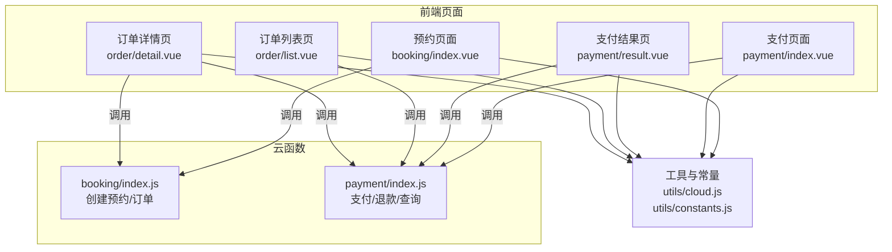
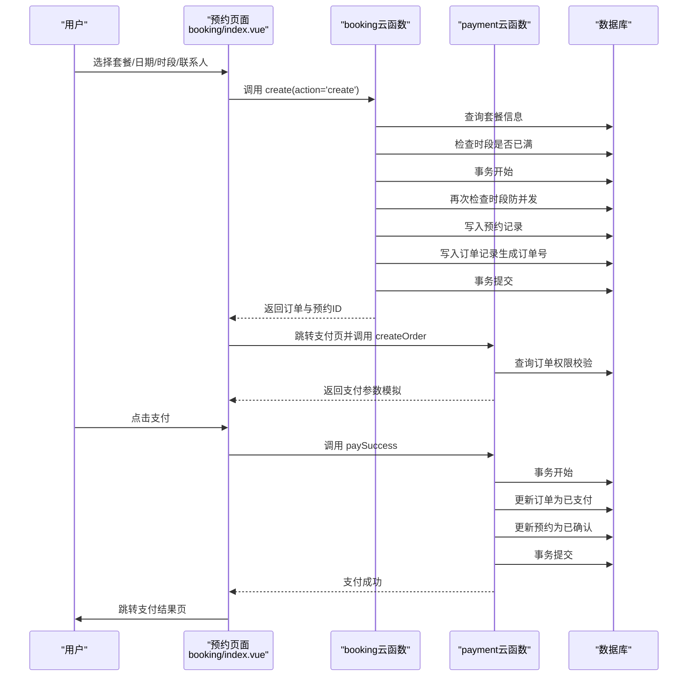
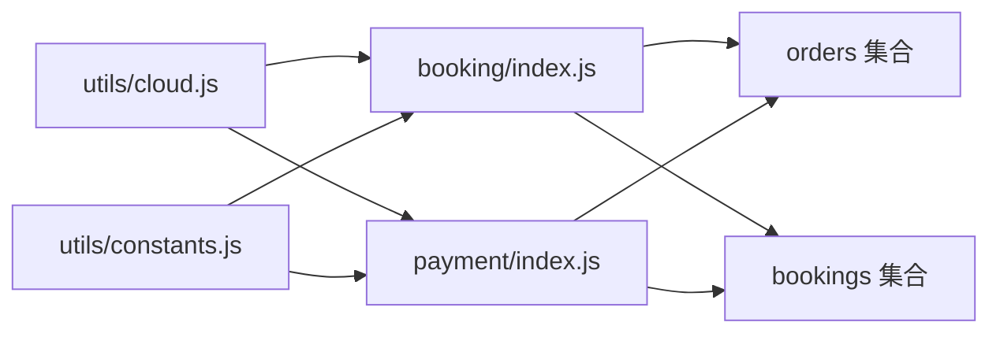

# 订单数据创建

<cite>
**本文档引用的文件**
- [miniprogram/cloudfunctions/booking/index.js](file://miniprogram/cloudfunctions/booking/index.js)
- [miniprogram/cloudfunctions/payment/index.js](file://miniprogram/cloudfunctions/payment/index.js)
- [miniprogram/src/pages/booking/index.vue](file://miniprogram/src/pages/booking/index.vue)
- [miniprogram/src/pages/payment/index.vue](file://miniprogram/src/pages/payment/index.vue)
- [miniprogram/src/pages/payment/result.vue](file://miniprogram/src/pages/payment/result.vue)
- [miniprogram/src/pages/order/list.vue](file://miniprogram/src/pages/order/list.vue)
- [miniprogram/src/pages/order/detail.vue](file://miniprogram/src/pages/order/detail.vue)
- [miniprogram/src/utils/constants.js](file://miniprogram/src/utils/constants.js)
- [miniprogram/src/utils/cloud.js](file://miniprogram/src/utils/cloud.js)
</cite>

## 目录
1. [简介](#简介)
2. [项目结构](#项目结构)
3. [核心组件](#核心组件)
4. [架构总览](#架构总览)
5. [详细组件分析](#详细组件分析)
6. [依赖关系分析](#依赖关系分析)
7. [性能考虑](#性能考虑)
8. [故障排查指南](#故障排查指南)
9. [结论](#结论)
10. [附录](#附录)

## 简介
本文件面向 lvpai 项目的订单数据创建流程，系统性阐述从用户下单、创建订单、支付联动到状态流转的完整链路。文档覆盖：
- 订单数据模型设计与字段定义
- 触发条件与业务规则
- 支付关联机制与订单号生成策略
- 数据验证、金额计算与并发控制
- 异常处理、重试机制与数据恢复方案
- 开发者实现指导与最佳实践

## 项目结构
lvpai 采用前后端分离的微信小程序架构，订单相关逻辑由前端页面与云函数共同协作完成：
- 前端页面负责用户交互与数据采集
- 云函数负责核心业务逻辑与数据库操作
- 常量与工具模块提供统一的状态与调用封装

图表来源
- [miniprogram/src/pages/booking/index.vue:422-470](file://miniprogram/src/pages/booking/index.vue#L422-L470)
- [miniprogram/src/pages/payment/index.vue:209-247](file://miniprogram/src/pages/payment/index.vue#L209-L247)
- [miniprogram/cloudfunctions/booking/index.js:67-93](file://miniprogram/cloudfunctions/booking/index.js#L67-L93)
- [miniprogram/cloudfunctions/payment/index.js:26-52](file://miniprogram/cloudfunctions/payment/index.js#L26-L52)
- [miniprogram/src/utils/cloud.js:5-26](file://miniprogram/src/utils/cloud.js#L5-L26)
- [miniprogram/src/utils/constants.js:22-56](file://miniprogram/src/utils/constants.js#L22-L56)

章节来源
- [miniprogram/src/pages/booking/index.vue:1-1029](file://miniprogram/src/pages/booking/index.vue#L1-L1029)
- [miniprogram/src/pages/payment/index.vue:1-535](file://miniprogram/src/pages/payment/index.vue#L1-L535)
- [miniprogram/src/pages/payment/result.vue:1-358](file://miniprogram/src/pages/payment/result.vue#L1-L358)
- [miniprogram/src/pages/order/list.vue:1-554](file://miniprogram/src/pages/order/list.vue#L1-L554)
- [miniprogram/src/pages/order/detail.vue:1-451](file://miniprogram/src/pages/order/detail.vue#L1-L451)
- [miniprogram/cloudfunctions/booking/index.js:1-463](file://miniprogram/cloudfunctions/booking/index.js#L1-L463)
- [miniprogram/cloudfunctions/payment/index.js:1-532](file://miniprogram/cloudfunctions/payment/index.js#L1-L532)
- [miniprogram/src/utils/cloud.js:1-66](file://miniprogram/src/utils/cloud.js#L1-L66)
- [miniprogram/src/utils/constants.js:1-73](file://miniprogram/src/utils/constants.js#L1-L73)

## 核心组件
- 预约与订单创建云函数：负责创建预约记录与订单记录、并发控制、状态初始化与事务保证
- 支付云函数：负责订单支付、支付成功回调、退款处理与状态联动
- 前端页面：预约页面收集用户输入并触发创建；支付页面展示订单摘要与倒计时，触发支付与结果跳转
- 订单列表与详情页：展示订单状态、支付状态与操作入口
- 工具与常量：统一的云函数调用封装、状态枚举与时段配置

章节来源
- [miniprogram/cloudfunctions/booking/index.js:67-206](file://miniprogram/cloudfunctions/booking/index.js#L67-L206)
- [miniprogram/cloudfunctions/payment/index.js:26-239](file://miniprogram/cloudfunctions/payment/index.js#L26-L239)
- [miniprogram/src/pages/booking/index.vue:422-470](file://miniprogram/src/pages/booking/index.vue#L422-L470)
- [miniprogram/src/pages/payment/index.vue:130-247](file://miniprogram/src/pages/payment/index.vue#L130-L247)
- [miniprogram/src/utils/constants.js:22-56](file://miniprogram/src/utils/constants.js#L22-L56)
- [miniprogram/src/utils/cloud.js:5-26](file://miniprogram/src/utils/cloud.js#L5-L26)

## 架构总览
订单创建与支付的整体流程如下：

图表来源
- [miniprogram/src/pages/booking/index.vue:422-470](file://miniprogram/src/pages/booking/index.vue#L422-L470)
- [miniprogram/cloudfunctions/booking/index.js:98-206](file://miniprogram/cloudfunctions/booking/index.js#L98-L206)
- [miniprogram/cloudfunctions/payment/index.js:65-166](file://miniprogram/cloudfunctions/payment/index.js#L65-L166)
- [miniprogram/src/pages/payment/index.vue:209-247](file://miniprogram/src/pages/payment/index.vue#L209-L247)

## 详细组件分析

### 订单数据模型与字段定义
- 订单集合（orders）关键字段
  - 订单标识：_id、orderNo（唯一订单号）
  - 关联信息：bookingId、userId、packageId
  - 金额信息：totalPrice、depositAmount（定金）
  - 支付状态：payStatus（unpaid/paid/refunded）
  - 时间信息：createTime、payTime、refundTime
  - 其他：packageName、remark（来自预约）

- 预约集合（bookings）关键字段
  - 预约标识：_id、userId
  - 套餐信息：packageId、packageName、packagePrice
  - 预约信息：date、timeSlot、persons、contactName、contactPhone
  - 状态：status（pending/confirmed/shooting/retouching/completed/cancelled）
  - 时间：createTime、updateTime、cancelTime
  - 其他：remark

字段来源与约束
- 字段定义与默认值来源于创建逻辑与状态初始化
- 订单号生成策略见下节
- 支付状态与预约状态相互影响，见“状态转换”小节

章节来源
- [miniprogram/cloudfunctions/booking/index.js:134-190](file://miniprogram/cloudfunctions/booking/index.js#L134-L190)
- [miniprogram/cloudfunctions/booking/index.js:144-147](file://miniprogram/cloudfunctions/booking/index.js#L144-L147)
- [miniprogram/cloudfunctions/booking/index.js:174-186](file://miniprogram/cloudfunctions/booking/index.js#L174-L186)
- [miniprogram/cloudfunctions/booking/index.js:180-185](file://miniprogram/cloudfunctions/booking/index.js#L180-L185)
- [miniprogram/cloudfunctions/payment/index.js:455-491](file://miniprogram/cloudfunctions/payment/index.js#L455-L491)
- [miniprogram/cloudfunctions/booking/index.js:264-302](file://miniprogram/cloudfunctions/booking/index.js#L264-L302)

### 订单号生成策略
- 格式：LP + 年月日时分秒 + 4位随机数
- 示例：LP202604081234560001
- 生成逻辑：基于当前时间戳与随机数拼接，确保高并发下的唯一性

章节来源
- [miniprogram/cloudfunctions/booking/index.js:16-27](file://miniprogram/cloudfunctions/booking/index.js#L16-L27)

### 触发条件与业务规则
- 预约创建触发条件
  - 用户在预约页面完成套餐选择、日期与时段选择、联系人信息填写
  - 前端校验手机号格式与必填项
  - 云函数侧二次校验套餐存在性、时段可用性与并发安全

- 订单创建触发条件
  - 预约创建成功后，同时创建订单记录
  - 订单金额以套餐价格为准，定金默认等于套餐价或套餐配置的定金字段

- 支付触发条件
  - 用户在支付页面点击支付，前端调用支付云函数创建支付参数
  - 支付成功后，前端调用支付成功云函数完成状态更新

章节来源
- [miniprogram/src/pages/booking/index.vue:408-421](file://miniprogram/src/pages/booking/index.vue#L408-L421)
- [miniprogram/src/pages/booking/index.vue:422-470](file://miniprogram/src/pages/booking/index.vue#L422-L470)
- [miniprogram/cloudfunctions/booking/index.js:98-130](file://miniprogram/cloudfunctions/booking/index.js#L98-L130)
- [miniprogram/cloudfunctions/booking/index.js:114-118](file://miniprogram/cloudfunctions/booking/index.js#L114-L118)
- [miniprogram/cloudfunctions/booking/index.js:169-190](file://miniprogram/cloudfunctions/booking/index.js#L169-L190)
- [miniprogram/src/pages/payment/index.vue:209-247](file://miniprogram/src/pages/payment/index.vue#L209-L247)
- [miniprogram/cloudfunctions/payment/index.js:65-166](file://miniprogram/cloudfunctions/payment/index.js#L65-L166)

### 数据验证与金额计算
- 前端验证
  - 必填项校验：套餐、日期、时段、联系人姓名、手机号、拍摄人数
  - 手机号格式校验：正则匹配
  - 时段可用性：通过 availableSlots 接口查询剩余名额

- 云函数验证
  - 套餐存在性与价格读取
  - 时段是否已满的二次检查（事务内）
  - 订单状态与权限校验（支付、退款、查询）

- 金额计算
  - total_price = 套餐价格
  - deposit_amount = 套餐定金（若套餐未配置定金，则默认等于 total_price）

章节来源
- [miniprogram/src/pages/booking/index.vue:408-421](file://miniprogram/src/pages/booking/index.vue#L408-L421)
- [miniprogram/cloudfunctions/booking/index.js:98-130](file://miniprogram/cloudfunctions/booking/index.js#L98-L130)
- [miniprogram/cloudfunctions/booking/index.js:174-186](file://miniprogram/cloudfunctions/booking/index.js#L174-L186)
- [miniprogram/cloudfunctions/booking/index.js:179-180](file://miniprogram/cloudfunctions/booking/index.js#L179-L180)

### 并发控制与事务保证
- 时段并发控制
  - 预约创建前与事务内分别检查时段剩余名额，防止超卖
- 事务保证
  - 预约与订单写入在同一事务中，确保原子性
  - 支付成功与状态更新在同一事务中，避免状态不一致

章节来源
- [miniprogram/cloudfunctions/booking/index.js:114-118](file://miniprogram/cloudfunctions/booking/index.js#L114-L118)
- [miniprogram/cloudfunctions/booking/index.js:154-166](file://miniprogram/cloudfunctions/booking/index.js#L154-L166)
- [miniprogram/cloudfunctions/booking/index.js:169-190](file://miniprogram/cloudfunctions/booking/index.js#L169-L190)
- [miniprogram/cloudfunctions/payment/index.js:203-238](file://miniprogram/cloudfunctions/payment/index.js#L203-L238)

### 支付关联机制
- 订单与预约的关联
  - 订单记录保存 bookingId，便于跨集合查询与状态联动
- 支付成功后的状态联动
  - 订单：payStatus 从 unpaid 变为 paid，并记录支付时间
  - 预约：status 从 pending 变为 confirmed
- 退款处理
  - 管理员权限校验后，将订单 payStatus 设为 refunded，并联动预约状态为 cancelled

章节来源
- [miniprogram/cloudfunctions/booking/index.js:174-190](file://miniprogram/cloudfunctions/booking/index.js#L174-L190)
- [miniprogram/cloudfunctions/payment/index.js:207-222](file://miniprogram/cloudfunctions/payment/index.js#L207-L222)
- [miniprogram/cloudfunctions/payment/index.js:338-450](file://miniprogram/cloudfunctions/payment/index.js#L338-L450)

### 状态转换
- 预约状态转换
  - pending -> confirmed -> shooting -> retouching -> completed
  - pending -> cancelled（用户/管理员取消）
- 支付状态转换
  - unpaid -> paid（支付成功）
  - paid -> refunded（管理员发起退款）
- 订单状态映射
  - 与预约状态保持一致，便于前端展示

章节来源
- [miniprogram/cloudfunctions/booking/index.js:390-437](file://miniprogram/cloudfunctions/booking/index.js#L390-L437)
- [miniprogram/src/utils/constants.js:29-56](file://miniprogram/src/utils/constants.js#L29-L56)

### 订单号生成与唯一性
- 生成策略：LP + 时间戳 + 4位随机数
- 唯一性保障：时间戳精度到秒级，配合随机数降低冲突概率
- 建议：如需更强唯一性，可在数据库层增加唯一索引或使用雪花算法

章节来源
- [miniprogram/cloudfunctions/booking/index.js:16-27](file://miniprogram/cloudfunctions/booking/index.js#L16-L27)

### 前端交互与页面职责
- 预约页面
  - 展示套餐、日历、时段选择与联系人信息
  - 调用 booking/create 创建预约与订单
- 支付页面
  - 展示订单摘要与倒计时
  - 调用 payment/createOrder 与 payment/paySuccess 完成支付
- 结果页
  - 展示支付成功/失败信息与订单详情
- 订单列表与详情
  - 展示订单状态、支付状态与操作入口

章节来源
- [miniprogram/src/pages/booking/index.vue:422-470](file://miniprogram/src/pages/booking/index.vue#L422-L470)
- [miniprogram/src/pages/payment/index.vue:130-247](file://miniprogram/src/pages/payment/index.vue#L130-L247)
- [miniprogram/src/pages/payment/result.vue:94-129](file://miniprogram/src/pages/payment/result.vue#L94-L129)
- [miniprogram/src/pages/order/list.vue:212-253](file://miniprogram/src/pages/order/list.vue#L212-L253)
- [miniprogram/src/pages/order/detail.vue:181-206](file://miniprogram/src/pages/order/detail.vue#L181-L206)

### 异常处理、重试机制与数据恢复
- 异常处理
  - 云函数统一捕获异常并返回标准化错误码与消息
  - 前端对调用失败进行提示与回退
- 重试机制
  - 支付页面支持重新支付
  - 倒计时结束后刷新订单状态，避免过期订单无法支付
- 数据恢复
  - 事务回滚保证数据一致性
  - 取消预约时，若订单已支付则标记退款状态，等待后续处理

章节来源
- [miniprogram/cloudfunctions/booking/index.js:89-92](file://miniprogram/cloudfunctions/booking/index.js#L89-L92)
- [miniprogram/cloudfunctions/payment/index.js:48-51](file://miniprogram/cloudfunctions/payment/index.js#L48-L51)
- [miniprogram/src/pages/payment/index.vue:174-189](file://miniprogram/src/pages/payment/index.vue#L174-L189)
- [miniprogram/cloudfunctions/booking/index.js:308-384](file://miniprogram/cloudfunctions/booking/index.js#L308-L384)
- [miniprogram/cloudfunctions/payment/index.js:338-450](file://miniprogram/cloudfunctions/payment/index.js#L338-L450)

## 依赖关系分析
- 前端依赖
  - utils/cloud.js：统一云函数调用封装
  - utils/constants.js：状态枚举与时段配置
- 云函数依赖
  - 数据库：bookings、orders 集合
  - 事务：确保写入一致性
- 前后端耦合点
  - 订单与预约的 bookingId 关联
  - 支付状态与预约状态的联动更新

图表来源
- [miniprogram/src/utils/cloud.js:5-26](file://miniprogram/src/utils/cloud.js#L5-L26)
- [miniprogram/src/utils/constants.js:22-56](file://miniprogram/src/utils/constants.js#L22-L56)
- [miniprogram/cloudfunctions/booking/index.js:4-6](file://miniprogram/cloudfunctions/booking/index.js#L4-L6)
- [miniprogram/cloudfunctions/payment/index.js:4-6](file://miniprogram/cloudfunctions/payment/index.js#L4-L6)

章节来源
- [miniprogram/src/utils/cloud.js:1-66](file://miniprogram/src/utils/cloud.js#L1-L66)
- [miniprogram/src/utils/constants.js:1-73](file://miniprogram/src/utils/constants.js#L1-L73)
- [miniprogram/cloudfunctions/booking/index.js:1-463](file://miniprogram/cloudfunctions/booking/index.js#L1-L463)
- [miniprogram/cloudfunctions/payment/index.js:1-532](file://miniprogram/cloudfunctions/payment/index.js#L1-L532)

## 性能考虑
- 数据库查询优化
  - 预约与订单查询尽量使用索引字段（如 userId、orderNo、bookingId）
- 事务范围控制
  - 将最小必要写操作放入事务，减少锁竞争
- 前端渲染优化
  - 列表分页加载，避免一次性渲染过多数据
- 支付流程
  - 支付参数生成与回调处理解耦，减少前端阻塞

## 故障排查指南
- 常见问题与定位
  - “时段已满”：检查 availableSlots 接口与数据库 count 结果
  - “订单不存在”：核对 orderId 或 orderNo 参数与权限校验
  - “支付失败”：检查支付参数生成与 paySuccess 调用链
- 日志与调试
  - 云函数统一捕获异常并输出错误日志
  - 前端对调用失败进行 toast 提示
- 恢复建议
  - 对于超时订单，前端倒计时结束后刷新订单状态
  - 对于并发冲突，重试创建预约并确保事务内二次检查

章节来源
- [miniprogram/cloudfunctions/booking/index.js:114-118](file://miniprogram/cloudfunctions/booking/index.js#L114-L118)
- [miniprogram/cloudfunctions/payment/index.js:72-80](file://miniprogram/cloudfunctions/payment/index.js#L72-L80)
- [miniprogram/src/pages/payment/index.vue:174-189](file://miniprogram/src/pages/payment/index.vue#L174-L189)

## 结论
lvpai 的订单创建流程通过前端页面与云函数协同，实现了从预约到支付的闭环管理。其关键特性包括：
- 明确的数据模型与字段定义
- 严格的验证与并发控制
- 支付与状态联动的事务保证
- 完整的异常处理与恢复机制

开发者在扩展功能时，应遵循现有模式，确保数据一致性与用户体验的稳定性。

## 附录
- 开发者实现指导
  - 新增字段：在创建逻辑中同步更新，确保数据库索引与前端展示一致
  - 新增状态：在常量与云函数中补充状态枚举与校验
  - 新增支付方式：在支付云函数中扩展参数生成与回调处理
- 最佳实践
  - 使用事务包裹跨集合写入
  - 前端做好输入校验与错误提示
  - 保持订单号生成策略的唯一性与可追踪性