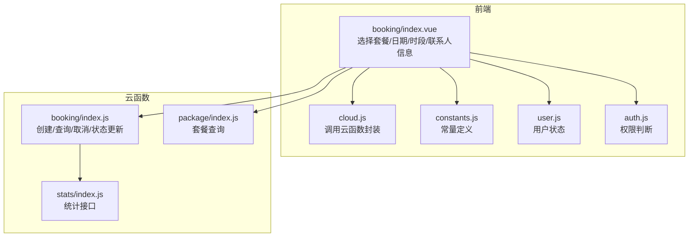
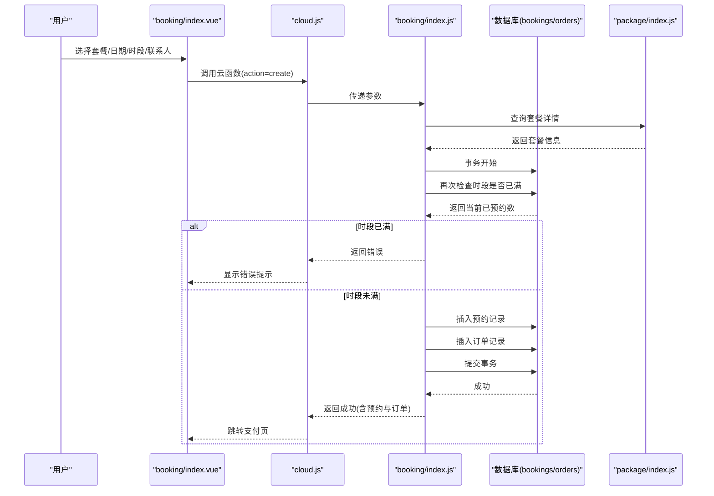
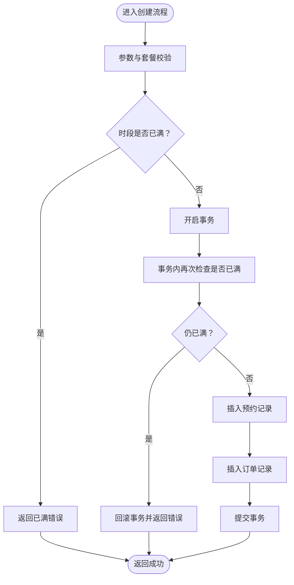
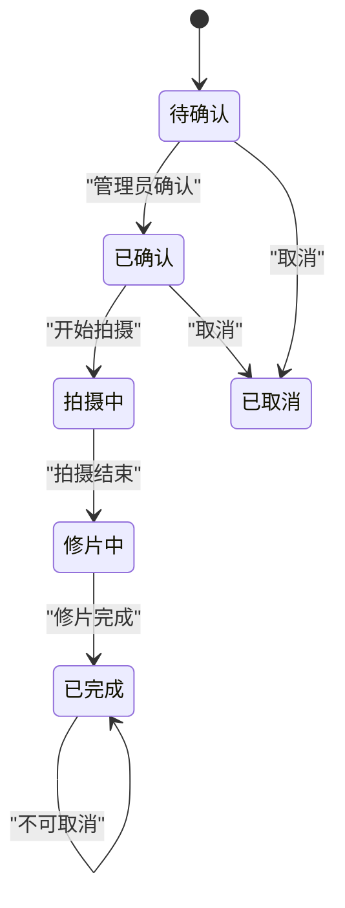
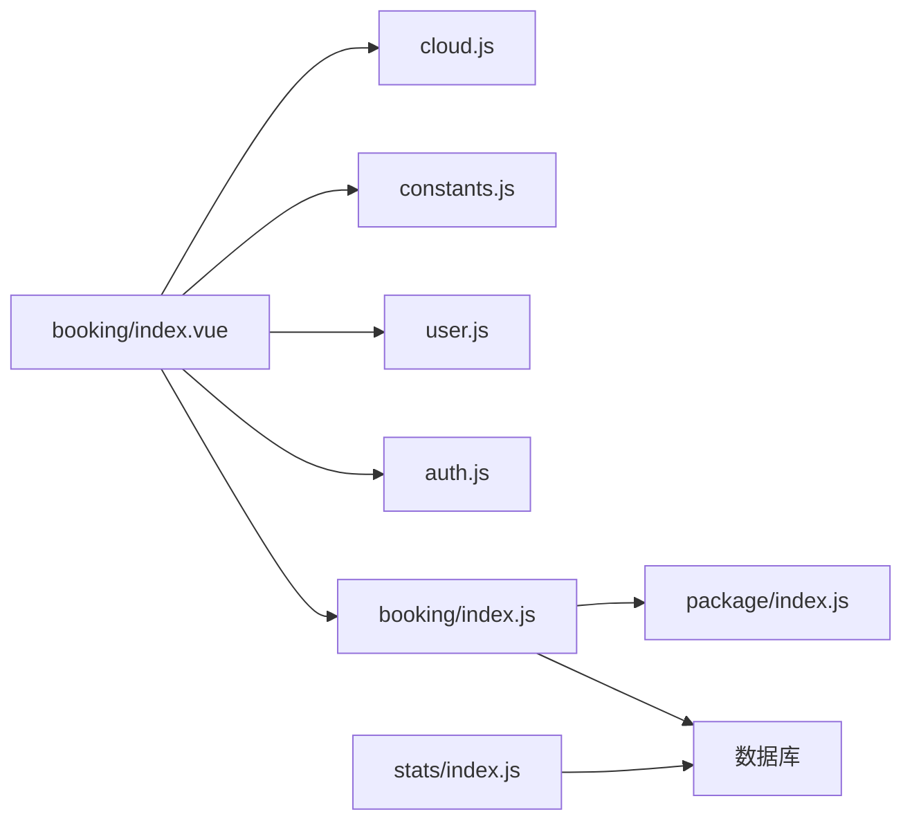

# 预约数据创建

<cite>
**本文档引用的文件**
- [booking/index.js](file://miniprogram/cloudfunctions/booking/index.js)
- [index.vue](file://miniprogram/src/pages/booking/index.vue)
- [cloud.js](file://miniprogram/src/utils/cloud.js)
- [constants.js](file://miniprogram/src/utils/constants.js)
- [user.js](file://miniprogram/src/store/user.js)
- [auth.js](file://miniprogram/src/utils/auth.js)
- [package/index.js](file://miniprogram/cloudfunctions/package/index.js)
- [stats/index.js](file://miniprogram/cloudfunctions/stats/index.js)
</cite>

## 目录
1. [简介](#简介)
2. [项目结构](#项目结构)
3. [核心组件](#核心组件)
4. [架构总览](#架构总览)
5. [详细组件分析](#详细组件分析)
6. [依赖关系分析](#依赖关系分析)
7. [性能考虑](#性能考虑)
8. [故障排查指南](#故障排查指南)
9. [结论](#结论)
10. [附录](#附录)

## 简介
本文件面向 lvpai 项目的预约数据创建流程，系统性阐述从用户端选择套餐、日期与时段，到云函数创建预约与订单的完整实现。重点包括：
- 预约数据结构设计与字段定义
- 验证规则与状态机设计
- 时间槽分配算法与冲突检测机制
- 业务逻辑、并发控制与数据一致性保障
- 最佳实践、错误处理与性能优化策略
- 开发者实现指导与调试方法

## 项目结构
预约相关代码主要分布在以下位置：
- 前端页面：miniprogram/src/pages/booking/index.vue
- 云函数：miniprogram/cloudfunctions/booking/index.js
- 通用工具：miniprogram/src/utils/cloud.js、miniprogram/src/utils/constants.js、miniprogram/src/store/user.js、miniprogram/src/utils/auth.js
- 套餐服务：miniprogram/cloudfunctions/package/index.js
- 统计服务：miniprogram/cloudfunctions/stats/index.js

图表来源
- [booking/index.js:67-93](file://miniprogram/cloudfunctions/booking/index.js#L67-L93)
- [index.vue:207-494](file://miniprogram/src/pages/booking/index.vue#L207-L494)
- [cloud.js:5-26](file://miniprogram/src/utils/cloud.js#L5-L26)
- [constants.js:22-37](file://miniprogram/src/utils/constants.js#L22-L37)
- [user.js:1-48](file://miniprogram/src/store/user.js#L1-L48)
- [auth.js:28-36](file://miniprogram/src/utils/auth.js#L28-L36)
- [package/index.js:26-58](file://miniprogram/cloudfunctions/package/index.js#L26-L58)
- [stats/index.js:52-68](file://miniprogram/cloudfunctions/stats/index.js#L52-L68)

章节来源
- [booking/index.js:67-93](file://miniprogram/cloudfunctions/booking/index.js#L67-L93)
- [index.vue:207-494](file://miniprogram/src/pages/booking/index.vue#L207-L494)
- [cloud.js:5-26](file://miniprogram/src/utils/cloud.js#L5-L26)
- [constants.js:22-37](file://miniprogram/src/utils/constants.js#L22-L37)
- [user.js:1-48](file://miniprogram/src/store/user.js#L1-L48)
- [auth.js:28-36](file://miniprogram/src/utils/auth.js#L28-L36)
- [package/index.js:26-58](file://miniprogram/cloudfunctions/package/index.js#L26-L58)
- [stats/index.js:52-68](file://miniprogram/cloudfunctions/stats/index.js#L52-L68)

## 核心组件
- 前端预约页面：负责用户交互、表单校验、调用云函数、展示结果与跳转支付。
- 云函数 booking：负责创建预约与订单、查询可用时段、权限校验、状态更新与取消。
- 套餐服务：提供套餐列表与详情查询，供前端选择。
- 通用工具：统一封装云函数调用、常量定义（时段、状态）、用户状态与权限判断。

章节来源
- [index.vue:207-494](file://miniprogram/src/pages/booking/index.vue#L207-L494)
- [booking/index.js:67-206](file://miniprogram/cloudfunctions/booking/index.js#L67-L206)
- [package/index.js:26-58](file://miniprogram/cloudfunctions/package/index.js#L26-L58)
- [cloud.js:5-26](file://miniprogram/src/utils/cloud.js#L5-L26)
- [constants.js:22-37](file://miniprogram/src/utils/constants.js#L22-L37)
- [user.js:1-48](file://miniprogram/src/store/user.js#L1-L48)
- [auth.js:28-36](file://miniprogram/src/utils/auth.js#L28-L36)

## 架构总览
预约创建采用“前端表单 + 云函数事务 + 数据库”的三层架构：
- 前端负责用户交互与参数收集
- 云函数负责业务逻辑、并发控制与数据一致性
- 数据库存储预约与订单两条主表

图表来源
- [index.vue:423-470](file://miniprogram/src/pages/booking/index.vue#L423-L470)
- [cloud.js:5-26](file://miniprogram/src/utils/cloud.js#L5-L26)
- [booking/index.js:98-206](file://miniprogram/cloudfunctions/booking/index.js#L98-L206)
- [package/index.js:88-107](file://miniprogram/cloudfunctions/package/index.js#L88-L107)

## 详细组件分析

### 预约数据结构设计与字段定义
预约与订单采用两条独立集合，通过外键关联：
- 预约集合（bookings）
  - 关键字段：userId、packageId、packageName、packagePrice、date、timeSlot、contactName、contactPhone、persons、status、remark、createTime、updateTime、cancelTime、cancelBy
  - 状态字段：pending、confirmed、shooting、retouching、completed、cancelled
- 订单集合（orders）
  - 关键字段：bookingId、userId、packageId、packageName、totalPrice、depositAmount、payStatus、orderNo、payTime、refundTime、createTime

字段约束与默认值：
- 必填校验：套餐ID、日期、时段、联系人姓名、联系电话、拍摄人数
- 时段枚举：morning、afternoon、golden
- 默认状态：创建时为 pending
- 订单编号：LP + 年月日时分秒 + 4位随机数
- 定金：若套餐未设置 deposit，则按套餐价格计算

章节来源
- [booking/index.js:98-148](file://miniprogram/cloudfunctions/booking/index.js#L98-L148)
- [booking/index.js:174-186](file://miniprogram/cloudfunctions/booking/index.js#L174-L186)
- [constants.js:22-37](file://miniprogram/src/utils/constants.js#L22-L37)

### 验证规则
- 前端校验（表单层）
  - 姓名非空
  - 手机号格式校验（1开头11位数字）
  - 拍摄人数≥1
  - 日期与时段必选
- 后端校验（云函数层）
  - 必填参数校验
  - 时段有效性校验
  - 套餐存在性校验
  - 时段容量校验（MAX_BOOKINGS_PER_SLOT）

章节来源
- [index.vue:408-420](file://miniprogram/src/pages/booking/index.vue#L408-L420)
- [booking/index.js:99-112](file://miniprogram/cloudfunctions/booking/index.js#L99-L112)
- [booking/index.js:120-129](file://miniprogram/cloudfunctions/booking/index.js#L120-L129)

### 时间槽分配算法与冲突检测
- 时间槽定义：morning、afternoon、golden
- 容量限制：每时段最大预约数为固定上限
- 冲突检测：
  - 首次检查：根据 date + timeSlot + status != 'cancelled' 统计当前已预约数
  - 二次检查：事务内再次统计，防止并发导致超卖
- 可用时段查询：遍历所有时段，逐个统计剩余名额

图表来源
- [booking/index.js:114-118](file://miniprogram/cloudfunctions/booking/index.js#L114-L118)
- [booking/index.js:153-166](file://miniprogram/cloudfunctions/booking/index.js#L153-L166)
- [booking/index.js:168-192](file://miniprogram/cloudfunctions/booking/index.js#L168-L192)

章节来源
- [booking/index.js:51-65](file://miniprogram/cloudfunctions/booking/index.js#L51-L65)
- [booking/index.js:150-206](file://miniprogram/cloudfunctions/booking/index.js#L150-L206)

### 预约状态机设计
- 状态流转（管理员可更新）
  - pending → confirmed → shooting → retouching → completed
  - pending → cancelled
  - confirmed → cancelled
- 状态校验：仅允许更新为有效状态
- 完成态不可取消：status == 'completed' 的预约禁止取消

图表来源
- [booking/index.js:390-438](file://miniprogram/cloudfunctions/booking/index.js#L390-L438)
- [booking/index.js:333-341](file://miniprogram/cloudfunctions/booking/index.js#L333-L341)

章节来源
- [booking/index.js:390-438](file://miniprogram/cloudfunctions/booking/index.js#L390-L438)
- [booking/index.js:333-341](file://miniprogram/cloudfunctions/booking/index.js#L333-L341)

### 业务逻辑与并发控制
- 事务保证：创建预约与订单必须在同一事务中完成，避免脏写
- 两次检查：首次检查用于快速拒绝，事务内再次检查用于并发安全
- 权限控制：非管理员仅能操作自己的数据；管理员可更新状态
- 取消流程：已支付订单标记退款状态，便于后续处理

章节来源
- [booking/index.js:150-206](file://miniprogram/cloudfunctions/booking/index.js#L150-L206)
- [booking/index.js:308-385](file://miniprogram/cloudfunctions/booking/index.js#L308-L385)

### 数据一致性保证
- 单事务写入：预约与订单同时写入，失败回滚
- 状态过滤：统计与查询均排除 cancelled 状态，确保准确性
- 服务端时间：使用 serverDate 保持时间一致性

章节来源
- [booking/index.js:150-206](file://miniprogram/cloudfunctions/booking/index.js#L150-L206)
- [booking/index.js:52-58](file://miniprogram/cloudfunctions/booking/index.js#L52-L58)

### 前端交互与最佳实践
- 表单校验：在提交前进行本地校验，减少无效请求
- 时段展示：根据后端返回的可用情况动态禁用/启用时段卡片
- 错误提示：统一使用 toast 展示错误信息，避免抛出异常
- 登录检查：页面加载时检查登录状态，必要时触发登录流程

章节来源
- [index.vue:408-420](file://miniprogram/src/pages/booking/index.vue#L408-L420)
- [index.vue:341-356](file://miniprogram/src/pages/booking/index.vue#L341-L356)
- [index.vue:423-470](file://miniprogram/src/pages/booking/index.vue#L423-L470)
- [index.vue:486-493](file://miniprogram/src/pages/booking/index.vue#L486-L493)

## 依赖关系分析
- 前端依赖
  - booking/index.vue 依赖 cloud.js 进行云函数调用
  - 依赖 constants.js 中的 TIME_SLOTS 常量
  - 依赖 user.js 与 auth.js 进行登录与权限判断
- 云函数依赖
  - booking/index.js 依赖 package/index.js 获取套餐详情
  - booking/index.js 依赖数据库进行事务与查询
  - stats/index.js 依赖数据库进行统计

图表来源
- [index.vue:207-494](file://miniprogram/src/pages/booking/index.vue#L207-L494)
- [cloud.js:5-26](file://miniprogram/src/utils/cloud.js#L5-L26)
- [constants.js:22-27](file://miniprogram/src/utils/constants.js#L22-L27)
- [user.js:1-48](file://miniprogram/src/store/user.js#L1-L48)
- [auth.js:28-36](file://miniprogram/src/utils/auth.js#L28-L36)
- [booking/index.js:26-58](file://miniprogram/cloudfunctions/booking/index.js#L26-L58)
- [package/index.js:26-58](file://miniprogram/cloudfunctions/package/index.js#L26-L58)
- [stats/index.js:52-68](file://miniprogram/cloudfunctions/stats/index.js#L52-L68)

章节来源
- [index.vue:207-494](file://miniprogram/src/pages/booking/index.vue#L207-L494)
- [cloud.js:5-26](file://miniprogram/src/utils/cloud.js#L5-L26)
- [constants.js:22-27](file://miniprogram/src/utils/constants.js#L22-L27)
- [user.js:1-48](file://miniprogram/src/store/user.js#L1-L48)
- [auth.js:28-36](file://miniprogram/src/utils/auth.js#L28-L36)
- [booking/index.js:26-58](file://miniprogram/cloudfunctions/booking/index.js#L26-L58)
- [package/index.js:26-58](file://miniprogram/cloudfunctions/package/index.js#L26-L58)
- [stats/index.js:52-68](file://miniprogram/cloudfunctions/stats/index.js#L52-L68)

## 性能考虑
- 查询优化
  - 在 bookings 上对 date、timeSlot、status 建立复合索引，提升时段统计与查询效率
  - 对 orders 上对 userId、payStatus、payTime 建立索引，提升订单查询与统计效率
- 事务粒度
  - 仅在创建预约与订单时使用事务，避免长时间持有锁
- 缓存策略
  - 前端缓存套餐列表与可用时段，减少重复请求
- 并发控制
  - 事务内二次检查是关键，避免超卖
- 日志与监控
  - 对关键路径（创建、取消、状态更新）增加日志，便于定位性能瓶颈

## 故障排查指南
- 常见错误与处理
  - 时段已满：前端显示“该时段预约已满，请选择其他时段”，建议引导用户切换时段
  - 参数缺失：后端返回具体缺失字段，前端应提示用户完善
  - 权限不足：非管理员尝试取消他人预约或更新状态，需引导用户登录或联系管理员
  - 事务回滚：网络抖动或并发竞争导致回滚，建议重试或提示稍后重试
- 调试方法
  - 前端：使用 uni.showToast 输出错误信息，结合控制台日志定位问题
  - 云函数：在关键节点打印日志，检查数据库查询条件与事务提交状态
  - 数据库：核对 bookings 与 orders 的字段是否一致，确认索引是否生效

章节来源
- [booking/index.js:114-118](file://miniprogram/cloudfunctions/booking/index.js#L114-L118)
- [booking/index.js:99-112](file://miniprogram/cloudfunctions/booking/index.js#L99-L112)
- [booking/index.js:327-341](file://miniprogram/cloudfunctions/booking/index.js#L327-L341)
- [booking/index.js:202-205](file://miniprogram/cloudfunctions/booking/index.js#L202-L205)

## 结论
lvpai 项目的预约创建流程通过“前端表单 + 云函数事务 + 数据库”的组合，实现了可靠的预约与订单创建。其关键优势在于：
- 明确的数据结构与字段约束
- 严谨的时段容量控制与并发安全
- 清晰的状态机与权限控制
- 前端友好的交互与错误提示

建议在生产环境中进一步完善索引、缓存与监控体系，以获得更优的性能与稳定性。

## 附录
- 术语
  - 时段：morning、afternoon、golden
  - 状态：pending、confirmed、shooting、retouching、completed、cancelled
  - 订单状态：unpaid、paid、refunded
- 相关接口
  - 前端调用 booking/create、booking/availableSlots、package/list、package/detail
  - 管理员调用 booking/updateStatus、booking/list、booking/detail