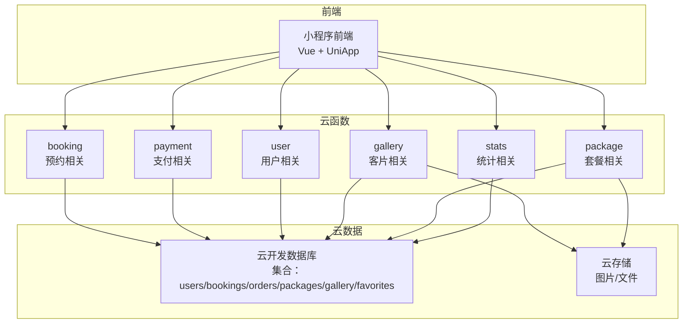
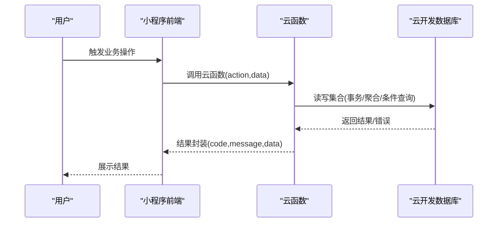
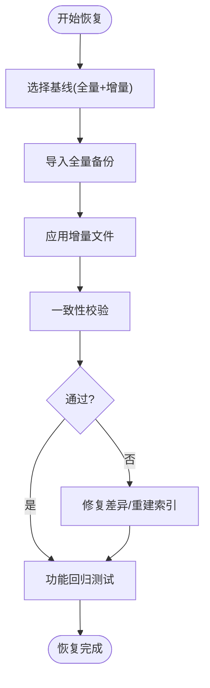
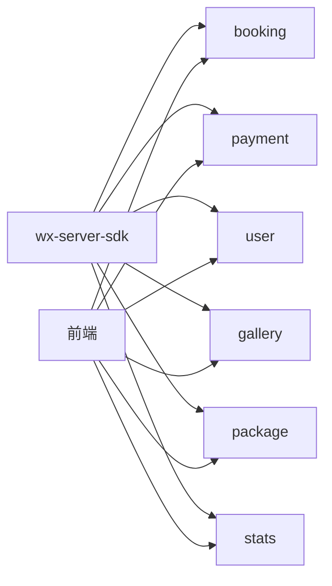

# 数据备份与恢复

<cite>
**本文引用的文件**
- [miniprogram/cloudfunctions/booking/index.js](file://miniprogram/cloudfunctions/booking/index.js)
- [miniprogram/cloudfunctions/payment/index.js](file://miniprogram/cloudfunctions/payment/index.js)
- [miniprogram/cloudfunctions/user/index.js](file://miniprogram/cloudfunctions/user/index.js)
- [miniprogram/cloudfunctions/gallery/index.js](file://miniprogram/cloudfunctions/gallery/index.js)
- [miniprogram/cloudfunctions/package/index.js](file://miniprogram/cloudfunctions/package/index.js)
- [miniprogram/cloudfunctions/stats/index.js](file://miniprogram/cloudfunctions/stats/index.js)
- [miniprogram/src/utils/cloud.js](file://miniprogram/src/utils/cloud.js)
- [miniprogram/src/utils/constants.js](file://miniprogram/src/utils/constants.js)
- [miniprogram/project.config.json](file://miniprogram/project.config.json)
- [miniprogram/cloudfunctions/booking/package.json](file://miniprogram/cloudfunctions/booking/package.json)
- [miniprogram/cloudfunctions/payment/package.json](file://miniprogram/cloudfunctions/payment/package.json)
</cite>

## 目录
1. [简介](#简介)
2. [项目结构](#项目结构)
3. [核心组件](#核心组件)
4. [架构总览](#架构总览)
5. [详细组件分析](#详细组件分析)
6. [依赖关系分析](#依赖关系分析)
7. [性能考量](#性能考量)
8. [故障排查指南](#故障排查指南)
9. [结论](#结论)
10. [附录](#附录)

## 简介
本文件面向 lvpai 项目的运维与开发团队，系统化阐述数据备份与恢复策略，覆盖以下方面：
- 备份范围与对象：基于云开发数据库的集合与云存储文件
- 备份计划与策略：全量备份与增量备份的建议与落地方法
- 存储位置、加密与访问控制：结合云开发默认安全模型给出加固建议
- 恢复流程、测试验证与回滚策略：从演练到生产回切的完整路径
- 监控、告警与性能影响评估：保障备份系统的可观测性与稳定性
- 应急响应方案：针对常见故障场景的处置步骤

说明：当前仓库代码以云开发数据库为核心数据源，未发现内置的自动化备份脚本或外部备份工具集成。因此，本方案在“现有代码基线”基础上，提出可落地的备份与恢复实践，并明确需要在云平台侧进行的配置与加固。

## 项目结构
lvpai 采用“小程序前端 + 云开发云函数 + 云开发数据库/云存储”的三层架构：
- 前端层：Vue + UniApp，通过云函数封装与数据库交互
- 云函数层：按功能拆分 booking、payment、user、gallery、package、stats 等
- 数据层：云开发数据库集合与云存储文件

图表来源
- [miniprogram/cloudfunctions/booking/index.js:1-93](file://miniprogram/cloudfunctions/booking/index.js#L1-L93)
- [miniprogram/cloudfunctions/payment/index.js:26-52](file://miniprogram/cloudfunctions/payment/index.js#L26-L52)
- [miniprogram/cloudfunctions/user/index.js:7-31](file://miniprogram/cloudfunctions/user/index.js#L7-L31)
- [miniprogram/cloudfunctions/gallery/index.js:26-64](file://miniprogram/cloudfunctions/gallery/index.js#L26-L64)
- [miniprogram/cloudfunctions/package/index.js:26-58](file://miniprogram/cloudfunctions/package/index.js#L26-L58)
- [miniprogram/cloudfunctions/stats/index.js:52-68](file://miniprogram/cloudfunctions/stats/index.js#L52-L68)

章节来源
- [miniprogram/project.config.json:1-21](file://miniprogram/project.config.json#L1-L21)

## 核心组件
围绕备份与恢复，以下集合是关键数据资产：
- users：用户身份与角色信息
- bookings：预约记录与状态流转
- orders：订单与支付状态
- packages：套餐信息
- gallery：客片作品与发布状态
- favorites：收藏关系

章节来源
- [miniprogram/cloudfunctions/booking/index.js:34-46](file://miniprogram/cloudfunctions/booking/index.js#L34-L46)
- [miniprogram/cloudfunctions/payment/index.js:12-24](file://miniprogram/cloudfunctions/payment/index.js#L12-L24)
- [miniprogram/cloudfunctions/gallery/index.js:10-24](file://miniprogram/cloudfunctions/gallery/index.js#L10-L24)
- [miniprogram/cloudfunctions/package/index.js:7-24](file://miniprogram/cloudfunctions/package/index.js#L7-L24)
- [miniprogram/cloudfunctions/user/index.js:4-5](file://miniprogram/cloudfunctions/user/index.js#L4-L5)
- [miniprogram/src/utils/constants.js:22-56](file://miniprogram/src/utils/constants.js#L22-L56)

## 架构总览
下图展示从前端到云函数再到数据库的关键调用链路，以及备份与恢复关注点：

图表来源
- [miniprogram/src/utils/cloud.js:6-26](file://miniprogram/src/utils/cloud.js#L6-L26)
- [miniprogram/cloudfunctions/booking/index.js:67-93](file://miniprogram/cloudfunctions/booking/index.js#L67-L93)
- [miniprogram/cloudfunctions/payment/index.js:26-52](file://miniprogram/cloudfunctions/payment/index.js#L26-L52)
- [miniprogram/cloudfunctions/user/index.js:7-31](file://miniprogram/cloudfunctions/user/index.js#L7-L31)
- [miniprogram/cloudfunctions/gallery/index.js:26-64](file://miniprogram/cloudfunctions/gallery/index.js#L26-L64)
- [miniprogram/cloudfunctions/package/index.js:26-58](file://miniprogram/cloudfunctions/package/index.js#L26-L58)
- [miniprogram/cloudfunctions/stats/index.js:52-68](file://miniprogram/cloudfunctions/stats/index.js#L52-L68)

## 详细组件分析

### 数据备份策略
- 全量备份
  - 周期：建议每周日凌晨进行一次全量导出，保留集合快照与索引元数据
  - 工具：使用云开发提供的数据导出功能（在云开发控制台执行），导出为 JSON 或 CSV
  - 存储：导出文件存放于专用的归档存储桶/目录，设置生命周期策略（如365天）
  - 校验：导出完成后进行完整性校验与哈希比对
- 增量备份
  - 周期：每日凌晨执行增量导出，基于时间戳过滤新增/变更记录
  - 方案：通过聚合查询或时间范围查询，提取近24小时内的变更集合
  - 存储：与全量同目录分层存放，便于恢复时合并
- 版本化命名
  - 命名规范：YYYYMMDD_HHMMSS_类型_集合名，如 20250315_000000_full_users.json
  - 元数据：记录导出时间、版本号、校验值、包含的记录数等

- 存储位置与加密
  - 位置：云开发控制台导出的文件默认保存在项目内存储空间；建议迁移至独立的归档存储（如对象存储）以隔离风险
  - 加密：启用服务端加密（SSE）与客户端解密流程；对导出文件进行压缩与二次加密
- 访问控制
  - IAM：限制导出与归档操作的最小权限；仅授权备份账号/角色
  - 网络：通过 VPC/白名单限制访问；避免公网暴露

- 备份监控与告警
  - 监控指标：导出成功率、耗时、文件大小、网络带宽占用
  - 告警：失败重试阈值、超时阈值、存储配额预警
  - 日志：记录每次导出任务的开始/结束、错误堆栈、重试次数

章节来源
- [miniprogram/cloudfunctions/stats/index.js:73-162](file://miniprogram/cloudfunctions/stats/index.js#L73-L162)

### 数据恢复流程
- 恢复准备
  - 确认目标环境与版本：匹配数据库版本、索引结构、集合数量
  - 选择恢复基线：优先使用最近一次全量备份，再叠加增量备份
- 恢复步骤
  - 导入全量备份：在目标环境执行批量导入，注意主键冲突与去重
  - 应用增量：按时间顺序应用增量文件，处理删除、更新、插入
  - 校验与修复：比对记录总数、关键字段一致性；修复索引与外键关系
- 测试验证
  - 功能回归：验证预约、支付、客片浏览等核心流程
  - 数据一致性：核对订单与预约状态、用户角色、收藏关系
- 回滚策略
  - 快照回滚：若支持数据库快照，可在恢复窗口内快速回滚
  - 人工回退：对关键表执行逆向操作（如撤销误删、还原误改）

### 关键业务集合的备份要点
- users：包含 openid、角色、手机号等敏感字段，需单独脱敏处理或仅备份必要字段
- bookings：状态机复杂，需保证状态流转一致性与事务边界
- orders：与 bookings 关联，恢复时需保持外键一致
- packages/gellery：包含图片/文件引用，需同步恢复云存储文件
- favorites：轻量级关系表，可作为增量恢复的一部分

章节来源
- [miniprogram/cloudfunctions/booking/index.js:150-206](file://miniprogram/cloudfunctions/booking/index.js#L150-L206)
- [miniprogram/cloudfunctions/payment/index.js:203-239](file://miniprogram/cloudfunctions/payment/index.js#L203-L239)
- [miniprogram/cloudfunctions/gallery/index.js:198-225](file://miniprogram/cloudfunctions/gallery/index.js#L198-L225)

### 云函数与数据库交互对备份的影响
- 事务与一致性
  - 预约创建与订单创建在云函数内使用事务，确保原子性；备份应考虑事务边界，避免半写状态
- 权限与审计
  - 管理员权限校验贯穿多个云函数；备份过程中应记录操作者与时间戳，便于审计
- 聚合与统计
  - 统计云函数使用聚合查询；备份时需同步聚合结果或保留原始明细以便重算

章节来源
- [miniprogram/cloudfunctions/booking/index.js:150-206](file://miniprogram/cloudfunctions/booking/index.js#L150-L206)
- [miniprogram/cloudfunctions/payment/index.js:203-239](file://miniprogram/cloudfunctions/payment/index.js#L203-L239)
- [miniprogram/cloudfunctions/stats/index.js:167-228](file://miniprogram/cloudfunctions/stats/index.js#L167-L228)

## 依赖关系分析
- 云函数依赖
  - 所有云函数均依赖 wx-server-sdk 初始化与云开发数据库
  - booking、payment、stats 对事务与聚合查询有较高依赖
- 前端依赖
  - 通过统一的云函数封装调用数据库，降低前端耦合度
- 存储依赖
  - gallery、package 等涉及云存储文件，备份需同时考虑数据库与云存储

图表来源
- [miniprogram/cloudfunctions/booking/package.json:3-5](file://miniprogram/cloudfunctions/booking/package.json#L3-L5)
- [miniprogram/cloudfunctions/payment/package.json:3-5](file://miniprogram/cloudfunctions/payment/package.json#L3-L5)
- [miniprogram/src/utils/cloud.js:6-26](file://miniprogram/src/utils/cloud.js#L6-L26)

章节来源
- [miniprogram/cloudfunctions/booking/package.json:1-7](file://miniprogram/cloudfunctions/booking/package.json#L1-L7)
- [miniprogram/cloudfunctions/payment/package.json:1-7](file://miniprogram/cloudfunctions/payment/package.json#L1-L7)

## 性能考量
- 备份窗口
  - 选择业务低峰时段执行全量/增量备份，避免影响线上查询与事务
- 导出优化
  - 分批导出与断点续传；对大集合使用分页与游标
- 存储成本
  - 增量文件体积较小，但长期累积需评估成本；可启用压缩与去重
- 恢复速度
  - 优先恢复高频集合（users、bookings、orders）；批量导入时关闭非必要索引，导入后再重建

## 故障排查指南
- 常见问题
  - 导出失败：检查云函数权限、网络连通性、存储配额
  - 数据不一致：核对事务边界、时间戳过滤条件、索引缺失
  - 恢复卡顿：检查导入批次大小、磁盘 IO、并发度
- 排查步骤
  - 查看云函数日志与错误码
  - 对比导出前后集合记录数与关键字段
  - 验证前端核心流程（预约、支付、登录）是否正常
- 应急回退
  - 若恢复失败，立即回滚到上一个稳定版本的全量备份
  - 临时降级：关闭高风险功能，优先保障核心业务

章节来源
- [miniprogram/cloudfunctions/booking/index.js:89-92](file://miniprogram/cloudfunctions/booking/index.js#L89-L92)
- [miniprogram/cloudfunctions/payment/index.js:48-51](file://miniprogram/cloudfunctions/payment/index.js#L48-L51)
- [miniprogram/cloudfunctions/user/index.js:27-30](file://miniprogram/cloudfunctions/user/index.js#L27-L30)

## 结论
- lvpai 当前以云开发数据库为核心数据资产，备份与恢复应围绕集合与云存储展开
- 建议采用“全量+增量”的混合策略，配合严格的访问控制与加密存储
- 通过可观测性与告警体系保障备份质量，制定可演练的恢复与回滚方案
- 在云平台侧完成必要的安全与合规配置，确保备份数据的机密性、完整性与可用性

## 附录
- 备份清单（建议）
  - users、bookings、orders、packages、gallery、favorites
  - 云存储文件（客片图片、套餐封面等）
- 恢复清单（建议）
  - 依次恢复：users → bookings → orders → packages → gallery → favorites
  - 校验：记录总数、关键字段、状态一致性
- 告警阈值（示例）
  - 导出失败率 > 1%、导出耗时 > X 分钟、存储剩余 < 10%