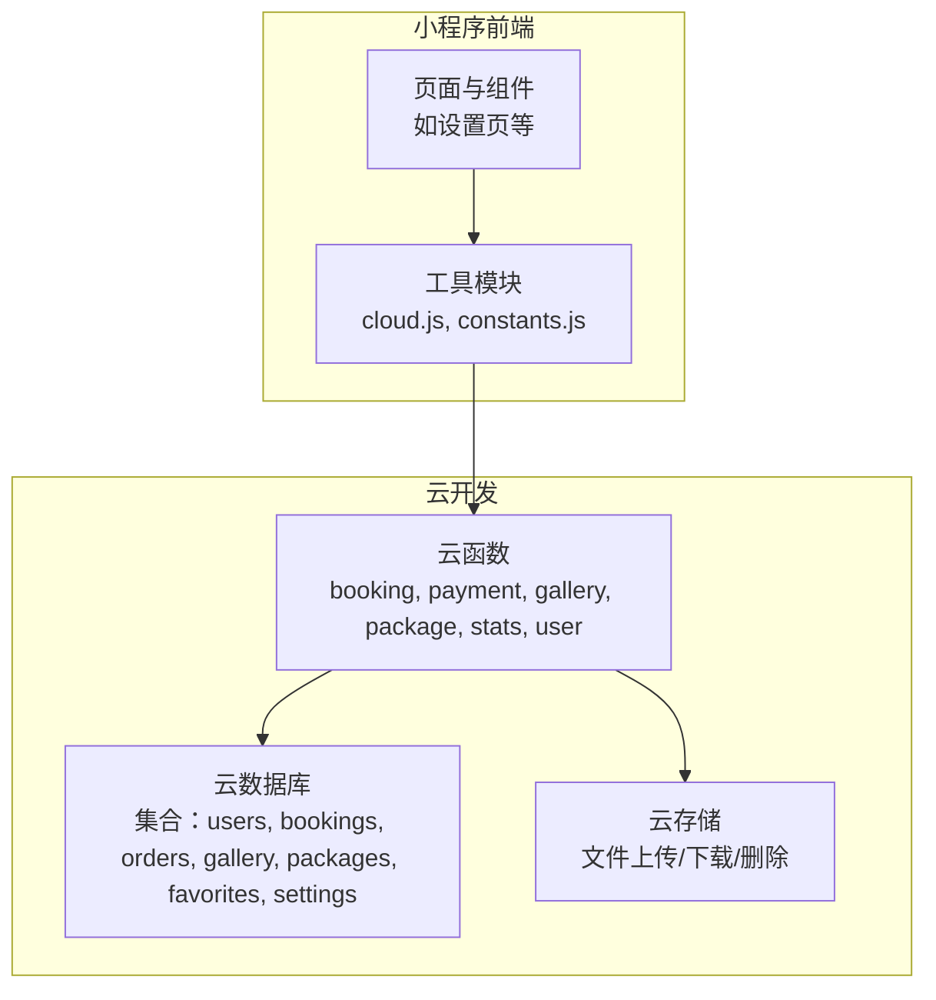
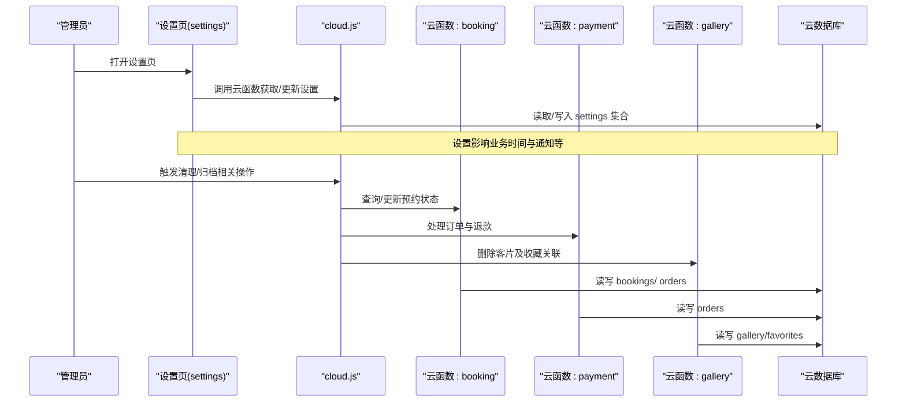
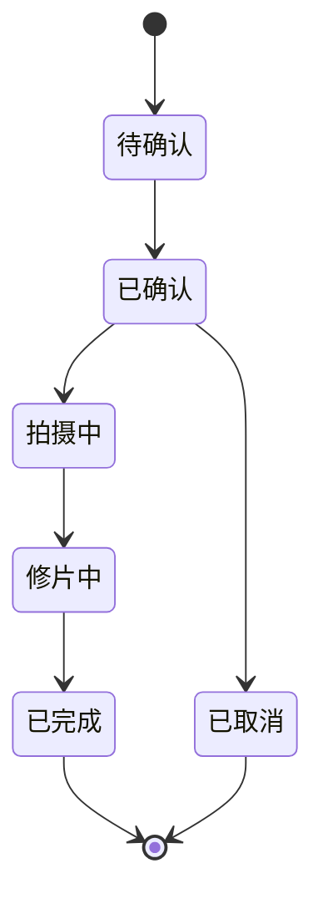
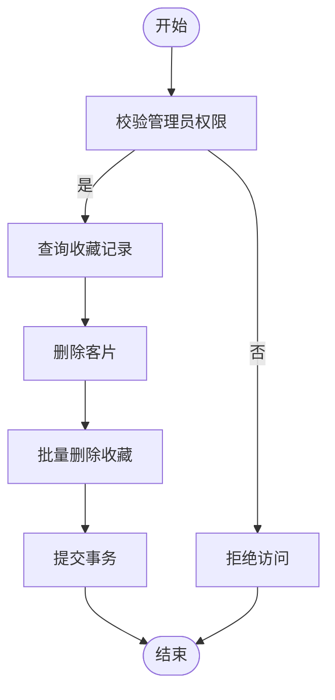
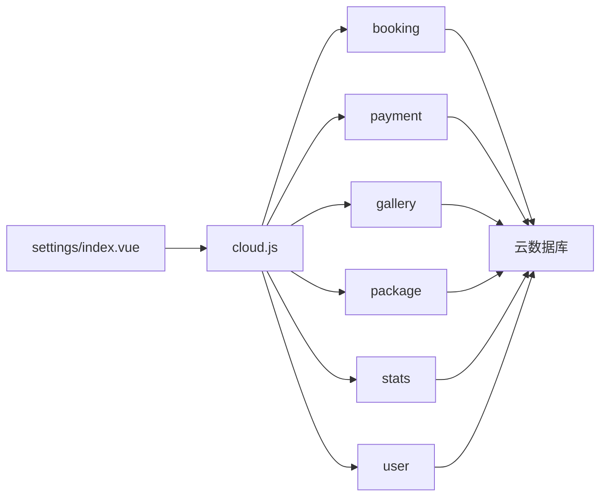
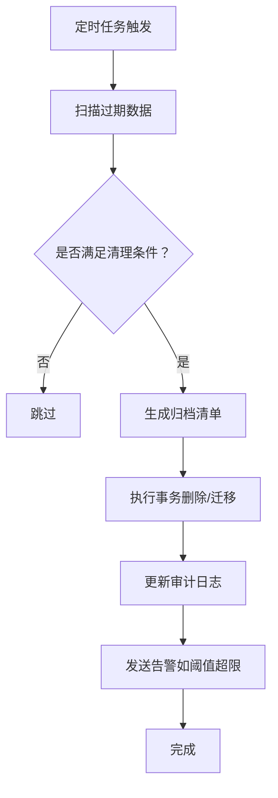

# 数据清理与归档

<cite>
**本文引用的文件**
- [miniprogram/cloudfunctions/stats/index.js](file://miniprogram/cloudfunctions/stats/index.js)
- [miniprogram/cloudfunctions/booking/index.js](file://miniprogram/cloudfunctions/booking/index.js)
- [miniprogram/cloudfunctions/payment/index.js](file://miniprogram/cloudfunctions/payment/index.js)
- [miniprogram/cloudfunctions/gallery/index.js](file://miniprogram/cloudfunctions/gallery/index.js)
- [miniprogram/cloudfunctions/package/index.js](file://miniprogram/cloudfunctions/package/index.js)
- [miniprogram/cloudfunctions/user/index.js](file://miniprogram/cloudfunctions/user/index.js)
- [miniprogram/src/utils/cloud.js](file://miniprogram/src/utils/cloud.js)
- [miniprogram/src/utils/constants.js](file://miniprogram/src/utils/constants.js)
- [miniprogram/project.config.json](file://miniprogram/project.config.json)
- [miniprogram/src/pages-admin/settings/index.vue](file://miniprogram/src/pages-admin/settings/index.vue)
</cite>

## 目录
1. [简介](#简介)
2. [项目结构](#项目结构)
3. [核心组件](#核心组件)
4. [架构总览](#架构总览)
5. [详细组件分析](#详细组件分析)
6. [依赖关系分析](#依赖关系分析)
7. [性能考量](#性能考量)
8. [故障排查指南](#故障排查指南)
9. [结论](#结论)
10. [附录](#附录)

## 简介
本文件面向运维与开发人员，系统化梳理 lvpai 项目在云开发环境下的数据清理与归档策略与机制。通过对现有云函数与前端页面的代码分析，明确以下内容：
- 过期数据识别规则与边界条件
- 自动清理流程与手动清理操作路径
- 数据归档标准、存储策略与检索机制
- 数据压缩、索引重建与性能优化建议
- 监控告警、审计日志与安全删除方案
- 运维维护指导与故障处理预案

## 项目结构
lvpai 采用“小程序前端 + 云开发云函数 + 云数据库 + 云存储”的架构。云函数作为后端服务层，负责业务编排、权限校验、数据读写与事务控制；前端通过封装的工具方法调用云函数与云存储。

图表来源
- [miniprogram/project.config.json:1-21](file://miniprogram/project.config.json#L1-L21)
- [miniprogram/src/utils/cloud.js:1-66](file://miniprogram/src/utils/cloud.js#L1-L66)

章节来源
- [miniprogram/project.config.json:1-21](file://miniprogram/project.config.json#L1-L21)
- [miniprogram/src/utils/cloud.js:1-66](file://miniprogram/src/utils/cloud.js#L1-L66)

## 核心组件
围绕数据清理与归档，本项目的关键组件包括：
- 业务云函数：booking（预约）、payment（支付/退款）、gallery（客片）、package（套餐）、stats（统计）、user（用户）
- 前端工具：cloud.js（统一调用云函数/存储）、constants.js（状态常量）
- 管理端页面：settings/index.vue（系统设置，含业务时间等）

章节来源
- [miniprogram/cloudfunctions/booking/index.js:1-463](file://miniprogram/cloudfunctions/booking/index.js#L1-L463)
- [miniprogram/cloudfunctions/payment/index.js:1-532](file://miniprogram/cloudfunctions/payment/index.js#L1-L532)
- [miniprogram/cloudfunctions/gallery/index.js:1-360](file://miniprogram/cloudfunctions/gallery/index.js#L1-L360)
- [miniprogram/cloudfunctions/package/index.js:1-222](file://miniprogram/cloudfunctions/package/index.js#L1-L222)
- [miniprogram/cloudfunctions/stats/index.js:1-229](file://miniprogram/cloudfunctions/stats/index.js#L1-L229)
- [miniprogram/cloudfunctions/user/index.js:1-206](file://miniprogram/cloudfunctions/user/index.js#L1-L206)
- [miniprogram/src/utils/cloud.js:1-66](file://miniprogram/src/utils/cloud.js#L1-L66)
- [miniprogram/src/utils/constants.js:1-73](file://miniprogram/src/utils/constants.js#L1-L73)
- [miniprogram/src/pages-admin/settings/index.vue:140-339](file://miniprogram/src/pages-admin/settings/index.vue#L140-L339)

## 架构总览
下图展示数据清理与归档相关的典型调用链路与数据流向：

图表来源
- [miniprogram/src/pages-admin/settings/index.vue:140-339](file://miniprogram/src/pages-admin/settings/index.vue#L140-L339)
- [miniprogram/src/utils/cloud.js:1-66](file://miniprogram/src/utils/cloud.js#L1-L66)
- [miniprogram/cloudfunctions/booking/index.js:1-463](file://miniprogram/cloudfunctions/booking/index.js#L1-L463)
- [miniprogram/cloudfunctions/payment/index.js:1-532](file://miniprogram/cloudfunctions/payment/index.js#L1-L532)
- [miniprogram/cloudfunctions/gallery/index.js:1-360](file://miniprogram/cloudfunctions/gallery/index.js#L1-L360)

## 详细组件分析

### 预约与订单生命周期与清理边界
- 预约状态机：pending → confirmed → shooting → retouching → completed 或 cancelled
- 订单状态：unpaid → paid/refunded
- 关联关系：每个预约对应一个订单；取消预约可能触发退款流程
- 清理边界：
  - 已完成/已取消的预约与订单通常不再变动，可作为归档对象
  - 未支付且长时间未处理的订单可作为清理目标
  - 取消订单若已退款，可视为历史归档

图表来源
- [miniprogram/src/utils/constants.js:29-56](file://miniprogram/src/utils/constants.js#L29-L56)
- [miniprogram/cloudfunctions/booking/index.js:387-438](file://miniprogram/cloudfunctions/booking/index.js#L387-L438)
- [miniprogram/cloudfunctions/payment/index.js:168-239](file://miniprogram/cloudfunctions/payment/index.js#L168-L239)

章节来源
- [miniprogram/cloudfunctions/booking/index.js:387-438](file://miniprogram/cloudfunctions/booking/index.js#L387-L438)
- [miniprogram/cloudfunctions/payment/index.js:168-239](file://miniprogram/cloudfunctions/payment/index.js#L168-L239)
- [miniprogram/src/utils/constants.js:29-56](file://miniprogram/src/utils/constants.js#L29-L56)

### 客片与收藏的删除与归档
- 管理员可删除客片，并级联删除收藏记录
- 删除流程使用事务保证一致性
- 历史客片可作为归档对象

图表来源
- [miniprogram/cloudfunctions/gallery/index.js:184-225](file://miniprogram/cloudfunctions/gallery/index.js#L184-L225)

章节来源
- [miniprogram/cloudfunctions/gallery/index.js:184-225](file://miniprogram/cloudfunctions/gallery/index.js#L184-L225)

### 套餐上下架与清理
- 上架/下架由管理员操作
- 下架套餐不再对外展示，可作为归档依据之一

章节来源
- [miniprogram/cloudfunctions/package/index.js:189-221](file://miniprogram/cloudfunctions/package/index.js#L189-L221)

### 统计与数据规模评估
- 统计模块提供今日预约、待处理订单、月收入、客片总数、预约总数、用户总数等指标
- 为清理与归档策略提供数据基础

章节来源
- [miniprogram/cloudfunctions/stats/index.js:73-162](file://miniprogram/cloudfunctions/stats/index.js#L73-L162)

### 文件存储与安全删除
- 前端工具提供上传、获取临时链接、删除文件的能力
- 删除文件需谨慎，应与数据库记录联动，避免悬挂文件

章节来源
- [miniprogram/src/utils/cloud.js:28-60](file://miniprogram/src/utils/cloud.js#L28-L60)

## 依赖关系分析
- 云函数之间通过云数据库进行数据交互，部分操作使用事务保证一致性
- 前端通过工具模块统一调用云函数与云存储
- 管理端页面负责读取/写入 settings 集合，影响业务时间与通知等

图表来源
- [miniprogram/src/utils/cloud.js:1-66](file://miniprogram/src/utils/cloud.js#L1-L66)
- [miniprogram/src/pages-admin/settings/index.vue:140-339](file://miniprogram/src/pages-admin/settings/index.vue#L140-L339)
- [miniprogram/cloudfunctions/booking/index.js:1-463](file://miniprogram/cloudfunctions/booking/index.js#L1-L463)
- [miniprogram/cloudfunctions/payment/index.js:1-532](file://miniprogram/cloudfunctions/payment/index.js#L1-L532)
- [miniprogram/cloudfunctions/gallery/index.js:1-360](file://miniprogram/cloudfunctions/gallery/index.js#L1-L360)
- [miniprogram/cloudfunctions/package/index.js:1-222](file://miniprogram/cloudfunctions/package/index.js#L1-L222)
- [miniprogram/cloudfunctions/stats/index.js:1-229](file://miniprogram/cloudfunctions/stats/index.js#L1-L229)
- [miniprogram/cloudfunctions/user/index.js:1-206](file://miniprogram/cloudfunctions/user/index.js#L1-L206)

## 性能考量
- 查询与排序
  - booking/list、payment/myOrders、gallery/list 等均使用排序与分页，建议在高频字段建立索引以提升性能
- 聚合与统计
  - stats 模块使用聚合计算月收入，建议对常用过滤字段建立复合索引
- 事务与一致性
  - gallery/delete 与 payment/paysuccess 使用事务，确保删除与状态变更原子性
- 存储与文件
  - 删除文件需与数据库记录联动，避免产生悬挂文件；建议定期扫描并清理未引用文件

章节来源
- [miniprogram/cloudfunctions/booking/index.js:211-259](file://miniprogram/cloudfunctions/booking/index.js#L211-L259)
- [miniprogram/cloudfunctions/payment/index.js:497-531](file://miniprogram/cloudfunctions/payment/index.js#L497-L531)
- [miniprogram/cloudfunctions/gallery/index.js:184-225](file://miniprogram/cloudfunctions/gallery/index.js#L184-L225)
- [miniprogram/cloudfunctions/stats/index.js:99-121](file://miniprogram/cloudfunctions/stats/index.js#L99-L121)

## 故障排查指南
- 权限问题
  - 管理员校验失败会导致操作被拒绝，需确认用户角色与 openid 对应关系
- 事务回滚
  - 删除客片或支付状态更新失败会触发回滚，需检查前置条件与并发场景
- 文件删除失败
  - 删除文件需确保传入正确的 fileID 列表，避免误删或未删
- 订单状态异常
  - 支付/退款前需校验订单状态，避免重复处理

章节来源
- [miniprogram/cloudfunctions/user/index.js:156-205](file://miniprogram/cloudfunctions/user/index.js#L156-L205)
- [miniprogram/cloudfunctions/gallery/index.js:184-225](file://miniprogram/cloudfunctions/gallery/index.js#L184-L225)
- [miniprogram/cloudfunctions/payment/index.js:168-239](file://miniprogram/cloudfunctions/payment/index.js#L168-L239)
- [miniprogram/src/utils/cloud.js:51-60](file://miniprogram/src/utils/cloud.js#L51-L60)

## 结论
lvpai 项目在云开发环境下具备清晰的数据生命周期与权限控制。通过现有云函数与前端工具，可实现：
- 基于状态的自动清理与归档
- 管理员驱动的手动清理与归档
- 事务保障的一致性操作
- 统计与监控支持的策略制定

建议进一步引入定时任务与审计日志，完善自动化与合规性要求。

## 附录

### 数据清理策略与归档机制（建议）
- 过期数据识别规则
  - 未支付订单：超过一定时间阈值（如 7 天）未支付的订单可标记为过期
  - 取消订单：已取消且完成退款的订单可归档
  - 已完成预约：完成后一段时间（如 30 天）的历史数据可归档
- 自动清理流程
  - 定时任务扫描过期数据，标记状态并生成归档清单
  - 批量删除或迁移至归档集合，同时清理云存储中的相关文件
- 手动清理操作
  - 管理员在管理端触发清理/归档操作，系统执行权限校验与事务处理
- 归档标准与存储策略
  - 归档集合按时间分区（如按月），便于检索与备份
  - 保留必要索引以支持常见查询，同时减少写放大
- 检索机制
  - 为高频查询字段建立复合索引，结合分页与排序优化
- 性能优化
  - 聚合查询与统计使用索引；批量删除使用分批策略
- 监控告警与审计日志
  - 记录每次清理/归档操作的用户、时间、影响范围
  - 建立阈值告警（如清理数量异常、存储占用突增）
- 安全删除方案
  - 删除前生成备份快照；删除文件与数据库记录联动校验；支持恢复流程

### 代码级流程图示例（概念性）
