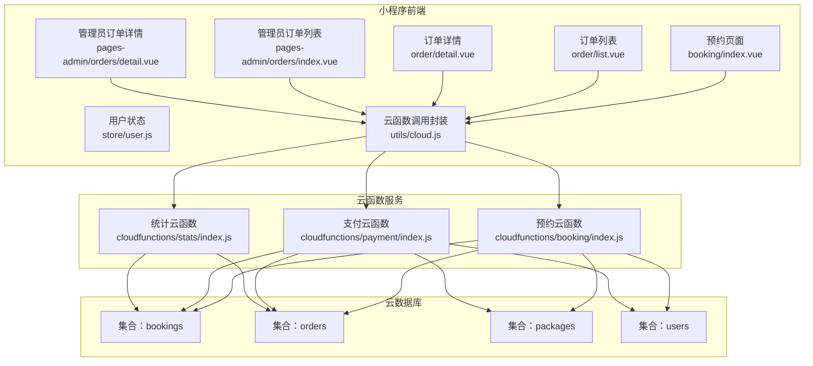
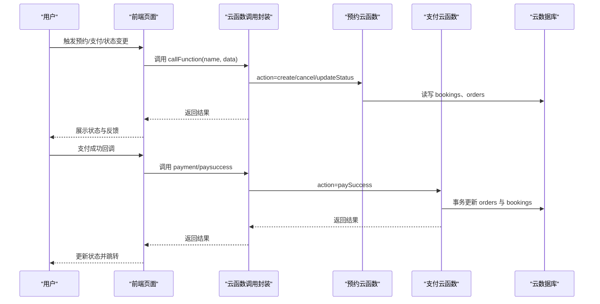
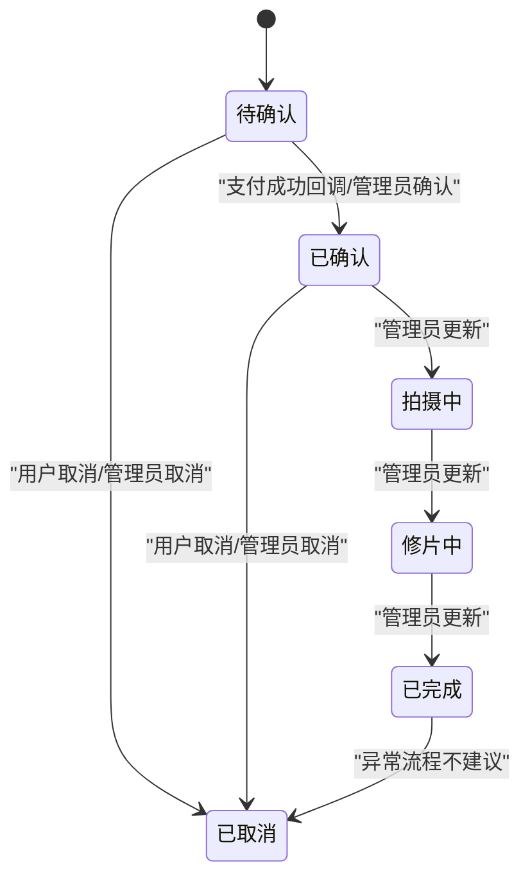
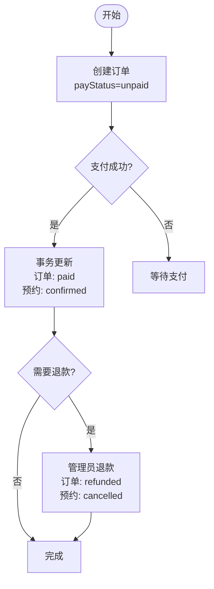
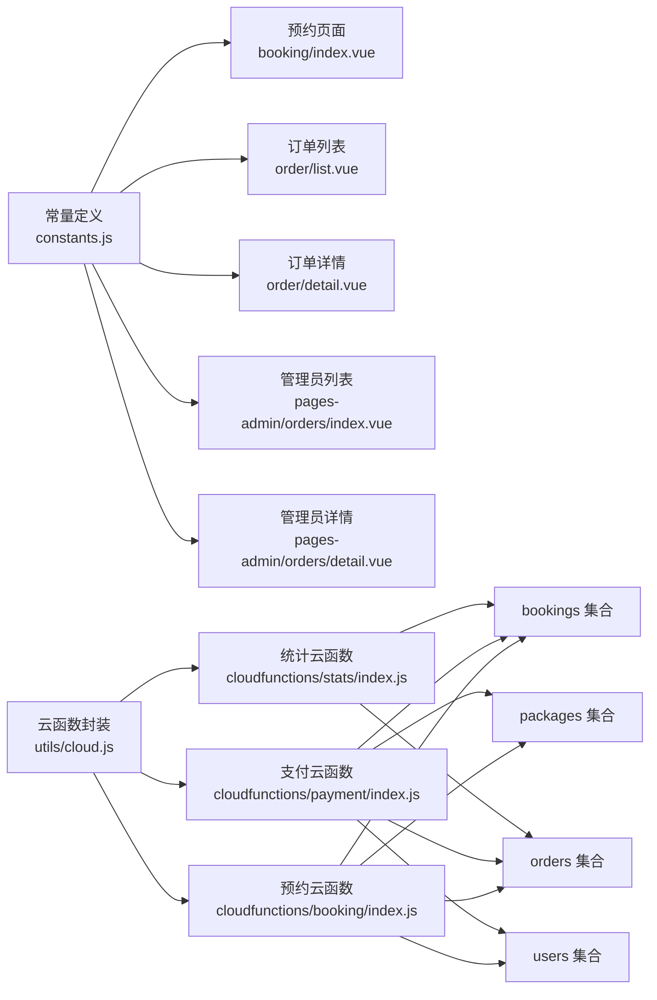

# 数据状态管理

<cite>
**本文档引用的文件**
- [constants.js](file://miniprogram/src/utils/constants.js)
- [booking/index.js](file://miniprogram/cloudfunctions/booking/index.js)
- [payment/index.js](file://miniprogram/cloudfunctions/payment/index.js)
- [stats/index.js](file://miniprogram/cloudfunctions/stats/index.js)
- [booking/index.vue](file://miniprogram/src/pages/booking/index.vue)
- [order/list.vue](file://miniprogram/src/pages/order/list.vue)
- [order/detail.vue](file://miniprogram/src/pages/order/detail.vue)
- [orders/index.vue](file://miniprogram/src/pages-admin/orders/index.vue)
- [orders/detail.vue](file://miniprogram/src/pages-admin/orders/detail.vue)
- [cloud.js](file://miniprogram/src/utils/cloud.js)
- [user.js](file://miniprogram/src/store/user.js)
</cite>

## 目录
1. [简介](#简介)
2. [项目结构](#项目结构)
3. [核心组件](#核心组件)
4. [架构总览](#架构总览)
5. [详细组件分析](#详细组件分析)
6. [依赖关系分析](#依赖关系分析)
7. [性能考虑](#性能考虑)
8. [故障排除指南](#故障排除指南)
9. [结论](#结论)

## 简介
本文件系统性梳理 lvpai 项目中的数据状态管理体系，重点覆盖预约状态与订单状态的生命周期、流转规则、权限控制与数据完整性保障，并提供状态监控、异常处理与状态同步的实现方案，帮助开发者快速理解并高效维护状态管理架构。

## 项目结构
lvpai 采用前后端分离的云开发架构：
- 前端（小程序端）：Vue 3 + UniApp，负责用户交互、状态展示与调用云函数
- 云函数（后端）：基于微信云开发，封装业务逻辑与数据持久化
- 数据库：云数据库，存储预约、订单、套餐等核心实体

图表来源
- [booking/index.vue:1-800](file://miniprogram/src/pages/booking/index.vue#L1-800)
- [order/list.vue:1-554](file://miniprogram/src/pages/order/list.vue#L1-554)
- [order/detail.vue:1-451](file://miniprogram/src/pages/order/detail.vue#L1-451)
- [orders/index.vue:1-402](file://miniprogram/src/pages-admin/orders/index.vue#L1-402)
- [orders/detail.vue:1-586](file://miniprogram/src/pages-admin/orders/detail.vue#L1-586)
- [cloud.js:1-66](file://miniprogram/src/utils/cloud.js#L1-66)
- [booking/index.js:1-463](file://miniprogram/cloudfunctions/booking/index.js#L1-463)
- [payment/index.js:1-532](file://miniprogram/cloudfunctions/payment/index.js#L1-532)
- [stats/index.js:1-229](file://miniprogram/cloudfunctions/stats/index.js#L1-229)

章节来源
- [booking/index.vue:1-800](file://miniprogram/src/pages/booking/index.vue#L1-800)
- [order/list.vue:1-554](file://miniprogram/src/pages/order/list.vue#L1-554)
- [order/detail.vue:1-451](file://miniprogram/src/pages/order/detail.vue#L1-451)
- [orders/index.vue:1-402](file://miniprogram/src/pages-admin/orders/index.vue#L1-402)
- [orders/detail.vue:1-586](file://miniprogram/src/pages-admin/orders/detail.vue#L1-586)
- [cloud.js:1-66](file://miniprogram/src/utils/cloud.js#L1-66)

## 核心组件
- 状态常量定义：统一管理预约状态、支付状态与订单状态的标签、颜色与枚举值
- 预约云函数：负责预约创建、取消、状态更新、可用时段查询与列表查询
- 支付云函数：负责订单创建、支付成功回调、退款处理与订单查询
- 统计云函数：提供管理员视角的运营数据概览与趋势分析
- 前端页面：用户侧与管理员侧的状态展示、操作入口与权限控制

章节来源
- [constants.js:29-56](file://miniprogram/src/utils/constants.js#L29-L56)
- [booking/index.js:67-93](file://miniprogram/cloudfunctions/booking/index.js#L67-L93)
- [payment/index.js:26-52](file://miniprogram/cloudfunctions/payment/index.js#L26-L52)
- [stats/index.js:52-68](file://miniprogram/cloudfunctions/stats/index.js#L52-L68)

## 架构总览
状态管理贯穿“前端页面 -> 云函数 -> 数据库”的链路，采用云函数作为业务边界，确保权限校验、并发控制与数据一致性。

图表来源
- [cloud.js:6-26](file://miniprogram/src/utils/cloud.js#L6-L26)
- [booking/index.js:67-93](file://miniprogram/cloudfunctions/booking/index.js#L67-L93)
- [payment/index.js:26-52](file://miniprogram/cloudfunctions/payment/index.js#L26-L52)

## 详细组件分析

### 预约状态生命周期与流转规则
预约状态包括：pending（待确认）、confirmed（已确认）、shooting（拍摄中）、retouching（修片中）、completed（已完成）、cancelled（已取消）。状态流转遵循以下业务规则：

- 创建预约：默认状态为 pending，同时创建关联订单（payStatus 为 unpaid）
- 用户取消：仅允许未完成且未取消的预约取消；若订单已支付，标记需退款
- 管理员更新：支持从任意有效状态更新到目标状态，但需管理员权限
- 并发保护：创建预约时使用事务与二次检查，避免超卖

图表来源
- [constants.js:29-37](file://miniprogram/src/utils/constants.js#L29-L37)
- [booking/index.js:390-438](file://miniprogram/cloudfunctions/booking/index.js#L390-L438)
- [payment/index.js:172-239](file://miniprogram/cloudfunctions/payment/index.js#L172-L239)

章节来源
- [constants.js:29-37](file://miniprogram/src/utils/constants.js#L29-L37)
- [booking/index.js:98-206](file://miniprogram/cloudfunctions/booking/index.js#L98-L206)
- [booking/index.js:308-385](file://miniprogram/cloudfunctions/booking/index.js#L308-L385)
- [booking/index.js:390-438](file://miniprogram/cloudfunctions/booking/index.js#L390-L438)

### 订单状态管理策略
订单状态包括：unpaid（待支付）、paid（已支付）、refunded（已退款）。策略如下：
- 创建订单：payStatus 默认 unpaid，关联预约状态 pending
- 支付成功：事务更新订单为 paid，并联动预约状态为 confirmed
- 退款处理：管理员发起退款，事务更新订单为 refunded，并联动预约状态为 cancelled

图表来源
- [payment/index.js:172-239](file://miniprogram/cloudfunctions/payment/index.js#L172-L239)
- [payment/index.js:338-450](file://miniprogram/cloudfunctions/payment/index.js#L338-L450)

章节来源
- [payment/index.js:65-166](file://miniprogram/cloudfunctions/payment/index.js#L65-L166)
- [payment/index.js:172-239](file://miniprogram/cloudfunctions/payment/index.js#L172-L239)
- [payment/index.js:338-450](file://miniprogram/cloudfunctions/payment/index.js#L338-L450)

### 权限控制与数据完整性
- 权限校验
  - 非管理员仅能查看/操作自己的预约与订单
  - 管理员权限通过角色字段校验，具备批量查询与状态更新能力
- 数据一致性
  - 创建预约与订单采用事务，确保原子性
  - 支付成功与退款均使用事务，避免状态不一致
  - 预约创建时进行并发检查，防止超卖

章节来源
- [booking/index.js:211-259](file://miniprogram/cloudfunctions/booking/index.js#L211-L259)
- [booking/index.js:264-303](file://miniprogram/cloudfunctions/booking/index.js#L264-L303)
- [booking/index.js:308-385](file://miniprogram/cloudfunctions/booking/index.js#L308-L385)
- [booking/index.js:390-438](file://miniprogram/cloudfunctions/booking/index.js#L390-L438)
- [payment/index.js:497-531](file://miniprogram/cloudfunctions/payment/index.js#L497-L531)
- [payment/index.js:338-450](file://miniprogram/cloudfunctions/payment/index.js#L338-L450)

### 状态监控与异常处理
- 管理员仪表盘：提供今日预约数、待处理订单、月收入、客片总数、总预约数、总用户数等指标
- 前端异常处理：统一通过云函数封装返回 code/message，前端根据 code 判断并提示
- 日志记录：云函数内捕获异常并输出错误日志，便于排查

章节来源
- [stats/index.js:73-162](file://miniprogram/cloudfunctions/stats/index.js#L73-L162)
- [cloud.js:6-26](file://miniprogram/src/utils/cloud.js#L6-L26)

### 前端状态展示与交互
- 用户侧页面：展示预约与订单状态，提供去支付、取消预约、查看详情等操作
- 管理员侧页面：支持按状态筛选、批量更新状态、发起退款
- 状态标签：统一使用常量定义的颜色与标签，保持视觉一致性

章节来源
- [order/list.vue:168-175](file://miniprogram/src/pages/order/list.vue#L168-L175)
- [order/detail.vue:157-172](file://miniprogram/src/pages/order/detail.vue#L157-L172)
- [orders/index.vue:87-95](file://miniprogram/src/pages-admin/orders/index.vue#L87-L95)
- [orders/detail.vue:172-181](file://miniprogram/src/pages-admin/orders/detail.vue#L172-L181)

## 依赖关系分析

图表来源
- [constants.js:29-56](file://miniprogram/src/utils/constants.js#L29-L56)
- [booking/index.vue:211-212](file://miniprogram/src/pages/booking/index.vue#L211-L212)
- [order/list.vue:147-147](file://miniprogram/src/pages/order/list.vue#L147-L147)
- [order/detail.vue:148-148](file://miniprogram/src/pages/order/detail.vue#L148-L148)
- [orders/index.vue:82-82](file://miniprogram/src/pages-admin/orders/index.vue#L82-L82)
- [orders/detail.vue:164-164](file://miniprogram/src/pages-admin/orders/detail.vue#L164-L164)
- [cloud.js:6-26](file://miniprogram/src/utils/cloud.js#L6-L26)
- [booking/index.js:4-6](file://miniprogram/cloudfunctions/booking/index.js#L4-L6)
- [payment/index.js:4-6](file://miniprogram/cloudfunctions/payment/index.js#L4-L6)
- [stats/index.js:4-6](file://miniprogram/cloudfunctions/stats/index.js#L4-L6)

章节来源
- [constants.js:29-56](file://miniprogram/src/utils/constants.js#L29-L56)
- [cloud.js:6-26](file://miniprogram/src/utils/cloud.js#L6-L26)
- [booking/index.js:4-6](file://miniprogram/cloudfunctions/booking/index.js#L4-L6)
- [payment/index.js:4-6](file://miniprogram/cloudfunctions/payment/index.js#L4-L6)
- [stats/index.js:4-6](file://miniprogram/cloudfunctions/stats/index.js#L4-L6)

## 性能考虑
- 并发控制：预约创建与支付成功均使用事务，避免竞态条件
- 查询优化：前端分页加载，后端限制每页大小，减少一次性传输
- 缓存策略：前端可在本地缓存常用状态标签与用户信息，降低重复请求
- 异步处理：退款与支付回调采用异步处理，避免阻塞主线程

## 故障排除指南
- 云函数调用失败：检查返回的 code 与 message，确认参数合法性与权限
- 状态不一致：核对事务是否正确提交/回滚，检查并发场景下的二次检查
- 权限不足：确认用户角色与 openid 的绑定，管理员需具备 admin/superAdmin 角色
- 支付回调：模拟模式下不会真正调用微信支付，需配置商户号后启用真实回调

章节来源
- [cloud.js:6-26](file://miniprogram/src/utils/cloud.js#L6-L26)
- [booking/index.js:150-206](file://miniprogram/cloudfunctions/booking/index.js#L150-L206)
- [payment/index.js:203-239](file://miniprogram/cloudfunctions/payment/index.js#L203-L239)

## 结论
lvpai 的状态管理以“常量定义 + 云函数 + 前端页面”为核心，通过严格的权限控制、事务保证与统一的状态标签，实现了预约与订单状态的清晰流转与可靠管理。建议在生产环境中：
- 完善真实支付与退款回调的商户号配置
- 增加状态变更审计日志与异常告警
- 对高频查询增加索引与缓存策略
- 持续优化前端分页与懒加载体验