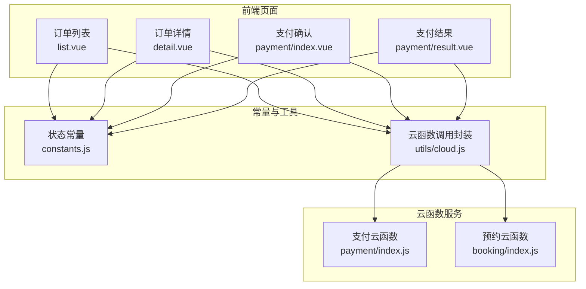
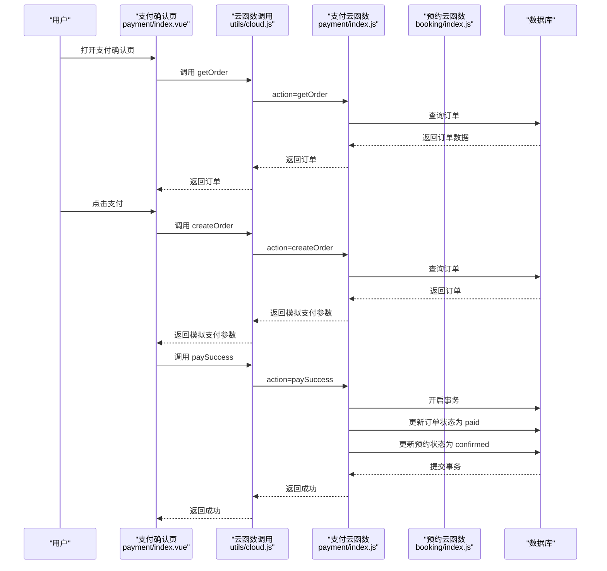
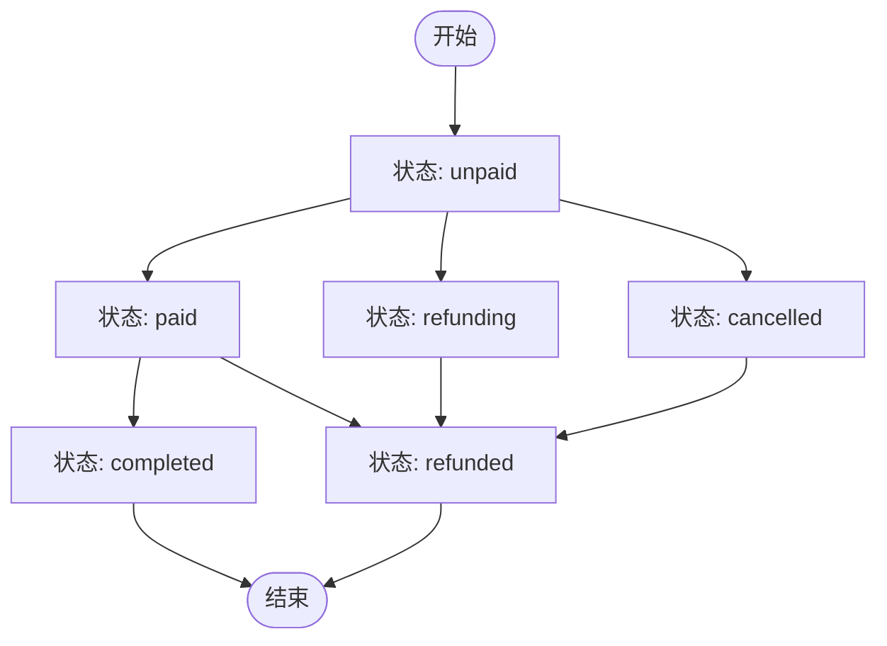
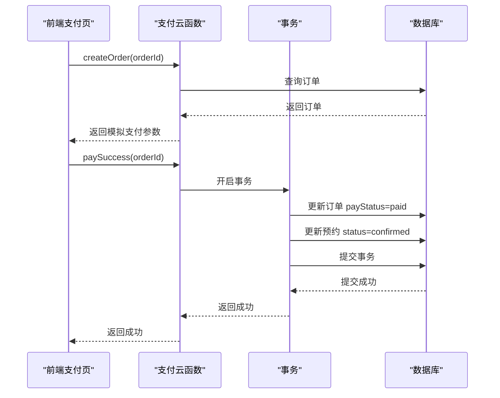
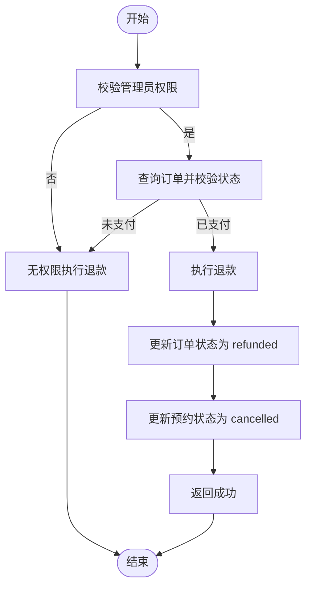
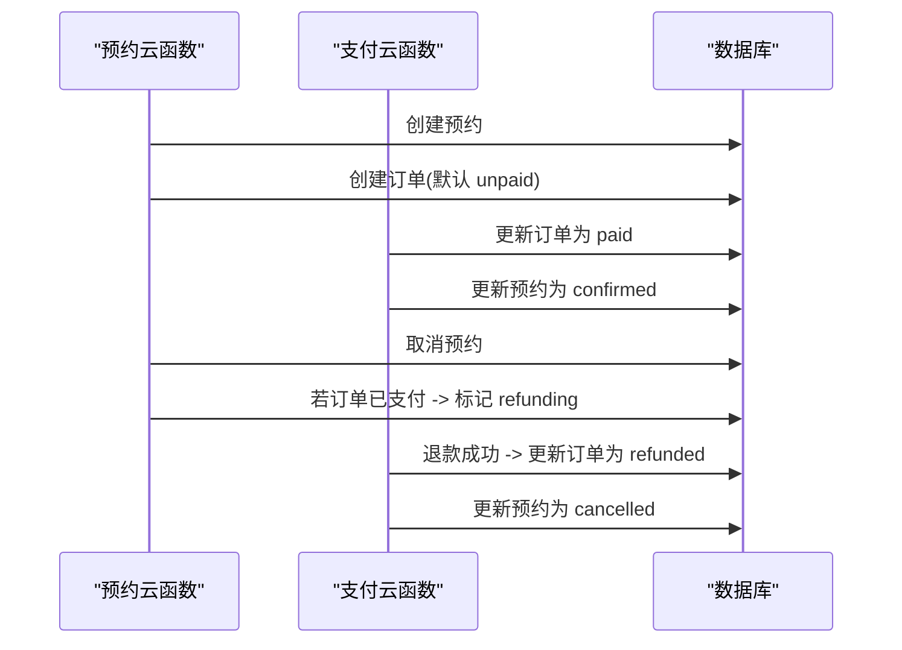
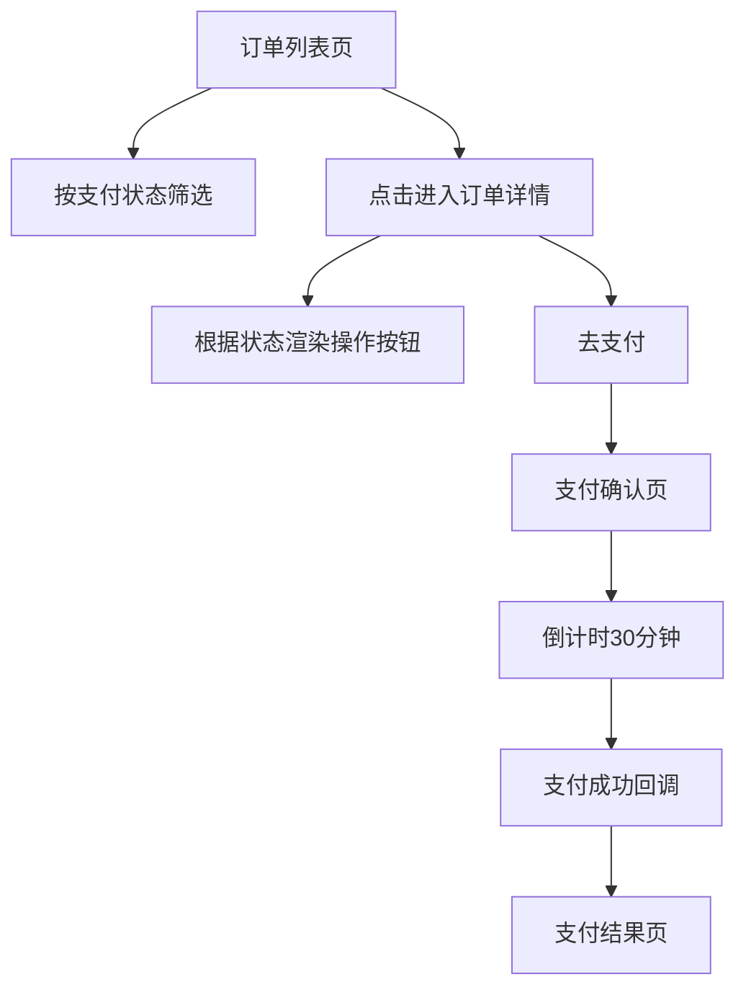
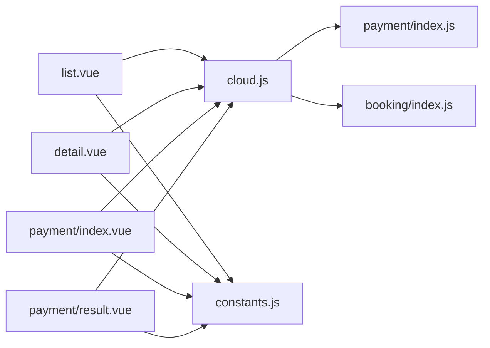

# 订单状态管理

<cite>
**本文档引用的文件**
- [payment/index.js](file://miniprogram/cloudfunctions/payment/index.js)
- [booking/index.js](file://miniprogram/cloudfunctions/booking/index.js)
- [constants.js](file://miniprogram/src/utils/constants.js)
- [list.vue](file://miniprogram/src/pages/order/list.vue)
- [detail.vue](file://miniprogram/src/pages/order/detail.vue)
- [index.vue](file://miniprogram/src/pages/payment/index.vue)
- [result.vue](file://miniprogram/src/pages/payment/result.vue)
- [cloud.js](file://miniprogram/src/utils/cloud.js)
</cite>

## 目录
1. [简介](#简介)
2. [项目结构](#项目结构)
3. [核心组件](#核心组件)
4. [架构总览](#架构总览)
5. [详细组件分析](#详细组件分析)
6. [依赖关系分析](#依赖关系分析)
7. [性能考虑](#性能考虑)
8. [故障排查指南](#故障排查指南)
9. [结论](#结论)
10. [附录](#附录)

## 简介
本文件系统性梳理 lvpai 项目中的订单状态管理，覆盖从“创建预约并生成订单”到“支付完成与退款”的完整生命周期。重点说明订单状态枚举（unpaid、paid、refunding、refunded）的定义、流转规则与触发条件；解释支付流程与预约状态的同步机制；给出退款处理流程与异常状态处理策略；并提供状态监控、对账与一致性保障的实现建议，帮助开发者快速理解与扩展订单状态管理能力。

## 项目结构
围绕订单状态管理的关键模块包括：
- 前端页面层：订单列表、订单详情、支付确认、支付结果
- 云函数服务层：支付相关操作（创建订单、支付成功、回调、退款）、预约相关操作
- 常量定义层：状态枚举与展示配置
- 云函数调用封装：统一的云函数调用工具

**图表来源**
- [list.vue:144-322](file://miniprogram/src/pages/order/list.vue#L144-L322)
- [detail.vue:145-284](file://miniprogram/src/pages/order/detail.vue#L145-L284)
- [index.vue:106-267](file://miniprogram/src/pages/payment/index.vue#L106-L267)
- [result.vue:79-181](file://miniprogram/src/pages/payment/result.vue#L79-L181)
- [payment/index.js:26-52](file://miniprogram/cloudfunctions/payment/index.js#L26-L52)
- [booking/index.js:67-93](file://miniprogram/cloudfunctions/booking/index.js#L67-L93)
- [constants.js:29-56](file://miniprogram/src/utils/constants.js#L29-L56)
- [cloud.js:5-26](file://miniprogram/src/utils/cloud.js#L5-L26)

**章节来源**
- [list.vue:144-322](file://miniprogram/src/pages/order/list.vue#L144-L322)
- [detail.vue:145-284](file://miniprogram/src/pages/order/detail.vue#L145-L284)
- [index.vue:106-267](file://miniprogram/src/pages/payment/index.vue#L106-L267)
- [result.vue:79-181](file://miniprogram/src/pages/payment/result.vue#L79-L181)
- [payment/index.js:26-52](file://miniprogram/cloudfunctions/payment/index.js#L26-L52)
- [booking/index.js:67-93](file://miniprogram/cloudfunctions/booking/index.js#L67-L93)
- [constants.js:29-56](file://miniprogram/src/utils/constants.js#L29-L56)
- [cloud.js:5-26](file://miniprogram/src/utils/cloud.js#L5-L26)

## 核心组件
- 订单状态枚举与展示
  - 支付状态：unpaid、paid、refunded
  - 订单状态：pending、paid、confirmed、shooting、retouching、completed、cancelled、refunded
  - 预约状态：pending、confirmed、shooting、retouching、completed、cancelled
- 关键云函数
  - 支付云函数：创建订单、支付成功、回调、退款、查询订单、我的订单
  - 预约云函数：创建预约、取消预约、更新预约状态等
- 前端页面
  - 订单列表与筛选、订单详情、支付确认、支付结果页

**章节来源**
- [constants.js:29-56](file://miniprogram/src/utils/constants.js#L29-L56)
- [payment/index.js:26-52](file://miniprogram/cloudfunctions/payment/index.js#L26-L52)
- [booking/index.js:67-93](file://miniprogram/cloudfunctions/booking/index.js#L67-L93)

## 架构总览
订单状态管理采用“前端页面 + 云函数 + 数据库”的三层架构。前端负责用户交互与状态展示，云函数负责业务逻辑与数据一致性，数据库负责持久化与事务支持。

**图表来源**
- [index.vue:130-247](file://miniprogram/src/pages/payment/index.vue#L130-L247)
- [cloud.js:5-26](file://miniprogram/src/utils/cloud.js#L5-L26)
- [payment/index.js:65-166](file://miniprogram/cloudfunctions/payment/index.js#L65-L166)
- [payment/index.js:172-239](file://miniprogram/cloudfunctions/payment/index.js#L172-L239)

## 详细组件分析

### 订单状态枚举与业务含义
- unpaid（待支付）
  - 业务含义：订单已创建，等待用户支付定金
  - 触发条件：创建预约时自动生成订单，默认状态为 unpaid
- paid（已支付）
  - 业务含义：用户完成支付，订单进入可执行阶段
  - 触发条件：支付成功回调或前端调用支付成功接口
- refunding（退款中）
  - 业务含义：预约被取消且订单已支付，进入退款流程
  - 触发条件：取消预约时检测到订单已支付
- refunded（已退款）
  - 业务含义：退款完成，订单状态更新为已退款
  - 触发条件：管理员执行退款或模拟退款

**图表来源**
- [constants.js:39-56](file://miniprogram/src/utils/constants.js#L39-L56)

**章节来源**
- [constants.js:39-56](file://miniprogram/src/utils/constants.js#L39-L56)

### 支付流程与状态转换
- 创建订单
  - 前端调用支付云函数的 createOrder，返回模拟支付参数（开发测试用）
  - 真实接入时应使用统一下单接口生成 prepay_id
- 支付成功
  - 前端调用 paySuccess，云函数开启事务，原子性更新订单状态为 paid，并同步预约状态为 confirmed
- 支付回调
  - 真实接入时由微信服务器推送回调，云函数解析并更新订单与预约状态
  - 当前为模拟模式，直接返回成功

**图表来源**
- [payment/index.js:65-166](file://miniprogram/cloudfunctions/payment/index.js#L65-L166)
- [payment/index.js:172-239](file://miniprogram/cloudfunctions/payment/index.js#L172-L239)

**章节来源**
- [payment/index.js:65-166](file://miniprogram/cloudfunctions/payment/index.js#L65-L166)
- [payment/index.js:172-239](file://miniprogram/cloudfunctions/payment/index.js#L172-L239)

### 退款处理流程
- 权限校验：仅管理员可执行退款
- 状态校验：仅已支付订单可退款
- 退款执行
  - 真实接入：调用退款接口，成功后更新订单状态为 refunded，并同步预约状态为 cancelled
  - 模拟退款：直接更新订单与预约状态
- 异常处理：退款失败时返回错误信息

**图表来源**
- [payment/index.js:338-450](file://miniprogram/cloudfunctions/payment/index.js#L338-L450)

**章节来源**
- [payment/index.js:338-450](file://miniprogram/cloudfunctions/payment/index.js#L338-L450)

### 预约与订单状态同步
- 创建预约时，同时创建订单，默认订单状态为 unpaid
- 支付成功后，订单状态变为 paid，预约状态同步为 confirmed
- 取消预约时，若订单已支付则标记为 refunding，后续由退款流程更新为 refunded，并同步预约状态为 cancelled

**图表来源**
- [booking/index.js:173-206](file://miniprogram/cloudfunctions/booking/index.js#L173-L206)
- [booking/index.js:308-385](file://miniprogram/cloudfunctions/booking/index.js#L308-L385)
- [payment/index.js:172-239](file://miniprogram/cloudfunctions/payment/index.js#L172-L239)
- [payment/index.js:338-450](file://miniprogram/cloudfunctions/payment/index.js#L338-L450)

**章节来源**
- [booking/index.js:173-206](file://miniprogram/cloudfunctions/booking/index.js#L173-L206)
- [booking/index.js:308-385](file://miniprogram/cloudfunctions/booking/index.js#L308-L385)
- [payment/index.js:172-239](file://miniprogram/cloudfunctions/payment/index.js#L172-L239)
- [payment/index.js:338-450](file://miniprogram/cloudfunctions/payment/index.js#L338-L450)

### 前端状态展示与交互
- 订单列表页支持按支付状态筛选（全部、待支付、已支付、已完成、已取消），并展示订单号、套餐信息、创建时间与支付状态
- 订单详情页根据状态显示不同操作按钮（去支付、再次预约、联系客服等），并展示订单与预约相关信息
- 支付确认页展示倒计时（30分钟），倒计时结束后刷新订单状态；支付成功后跳转至支付结果页

**图表来源**
- [list.vue:167-210](file://miniprogram/src/pages/order/list.vue#L167-L210)
- [detail.vue:108-123](file://miniprogram/src/pages/order/detail.vue#L108-L123)
- [index.vue:124-189](file://miniprogram/src/pages/payment/index.vue#L124-L189)
- [result.vue:94-129](file://miniprogram/src/pages/payment/result.vue#L94-L129)

**章节来源**
- [list.vue:167-210](file://miniprogram/src/pages/order/list.vue#L167-L210)
- [detail.vue:108-123](file://miniprogram/src/pages/order/detail.vue#L108-L123)
- [index.vue:124-189](file://miniprogram/src/pages/payment/index.vue#L124-L189)
- [result.vue:94-129](file://miniprogram/src/pages/payment/result.vue#L94-L129)

## 依赖关系分析
- 前端页面依赖云函数封装工具进行统一调用
- 支付云函数与预约云函数共同维护订单与预约的状态一致性
- 常量定义集中管理状态枚举与展示颜色，便于统一维护

**图表来源**
- [list.vue:144-322](file://miniprogram/src/pages/order/list.vue#L144-L322)
- [detail.vue:145-284](file://miniprogram/src/pages/order/detail.vue#L145-L284)
- [index.vue:106-267](file://miniprogram/src/pages/payment/index.vue#L106-L267)
- [result.vue:79-181](file://miniprogram/src/pages/payment/result.vue#L79-L181)
- [cloud.js:5-26](file://miniprogram/src/utils/cloud.js#L5-L26)
- [payment/index.js:26-52](file://miniprogram/cloudfunctions/payment/index.js#L26-L52)
- [booking/index.js:67-93](file://miniprogram/cloudfunctions/booking/index.js#L67-L93)
- [constants.js:29-56](file://miniprogram/src/utils/constants.js#L29-L56)

**章节来源**
- [list.vue:144-322](file://miniprogram/src/pages/order/list.vue#L144-L322)
- [detail.vue:145-284](file://miniprogram/src/pages/order/detail.vue#L145-L284)
- [index.vue:106-267](file://miniprogram/src/pages/payment/index.vue#L106-L267)
- [result.vue:79-181](file://miniprogram/src/pages/payment/result.vue#L79-L181)
- [cloud.js:5-26](file://miniprogram/src/utils/cloud.js#L5-L26)
- [payment/index.js:26-52](file://miniprogram/cloudfunctions/payment/index.js#L26-L52)
- [booking/index.js:67-93](file://miniprogram/cloudfunctions/booking/index.js#L67-L93)
- [constants.js:29-56](file://miniprogram/src/utils/constants.js#L29-L56)

## 性能考虑
- 事务原子性：支付成功与预约状态同步使用事务，避免中间态导致的数据不一致
- 并发控制：创建预约时二次校验时段是否已满，防止超卖
- 前端缓存：订单详情与列表数据在页面内缓存，减少重复请求
- 分页加载：订单列表支持分页与下拉刷新，提升大数据量下的交互体验

[本节为通用性能建议，不直接分析具体文件]

## 故障排查指南
- 支付失败
  - 检查订单状态是否仍为 unpaid，倒计时是否过期
  - 确认前端调用 paySuccess 的时机与参数
- 退款异常
  - 确认订单状态为 paid，管理员权限校验通过
  - 检查退款流程是否正确更新订单与预约状态
- 状态不一致
  - 检查事务提交是否成功，必要时回滚并重试
  - 核对预约取消逻辑中 refunding 标记与后续退款流程

**章节来源**
- [payment/index.js:172-239](file://miniprogram/cloudfunctions/payment/index.js#L172-L239)
- [payment/index.js:338-450](file://miniprogram/cloudfunctions/payment/index.js#L338-L450)
- [booking/index.js:308-385](file://miniprogram/cloudfunctions/booking/index.js#L308-L385)

## 结论
lvpai 项目的订单状态管理以“预约 + 订单”的双轨模型为核心，通过云函数实现强一致性的状态转换与同步。支付流程采用事务保障，退款流程提供管理员权限控制与模拟/真实两种接入路径。前端页面围绕状态枚举提供直观的展示与交互。建议在生产环境中完善真实支付与退款接入，并建立状态监控与对账机制以确保业务稳定运行。

[本节为总结性内容，不直接分析具体文件]

## 附录
- 状态枚举定义位置：[constants.js:39-56](file://miniprogram/src/utils/constants.js#L39-L56)
- 支付相关云函数：[payment/index.js:26-52](file://miniprogram/cloudfunctions/payment/index.js#L26-L52)
- 预约相关云函数：[booking/index.js:67-93](file://miniprogram/cloudfunctions/booking/index.js#L67-L93)
- 前端云函数调用封装：[cloud.js:5-26](file://miniprogram/src/utils/cloud.js#L5-L26)