# 预约状态管理

<cite>
**本文档引用的文件**
- [booking/index.js](file://miniprogram/cloudfunctions/booking/index.js)
- [constants.js](file://miniprogram/src/utils/constants.js)
- [index.vue](file://miniprogram/src/pages/booking/index.vue)
- [detail.vue](file://miniprogram/src/pages/order/detail.vue)
- [list.vue](file://miniprogram/src/pages/order/list.vue)
- [index.vue](file://miniprogram/src/pages-admin/orders/detail.vue)
- [index.vue](file://miniprogram/src/pages-admin/orders/index.vue)
- [payment/index.js](file://miniprogram/cloudfunctions/payment/index.js)
</cite>

## 目录
1. [简介](#简介)
2. [项目结构](#项目结构)
3. [核心组件](#核心组件)
4. [架构概览](#架构概览)
5. [详细组件分析](#详细组件分析)
6. [依赖关系分析](#依赖关系分析)
7. [性能考虑](#性能考虑)
8. [故障排除指南](#故障排除指南)
9. [结论](#结论)

## 简介

lvpai项目的预约状态管理系统是一个完整的业务流程控制框架，负责管理从用户预约到最终完成的整个生命周期。系统采用前后端分离架构，通过云函数提供状态管理服务，前端通过小程序界面进行交互。

本系统的核心功能包括：
- 预约状态的完整生命周期管理
- 多角色权限控制（用户 vs 管理员）
- 并发安全的事务处理
- 实时状态同步和通知
- 异常处理和错误恢复

## 项目结构

lvpai项目采用模块化的文件组织方式，预约状态管理涉及以下关键目录和文件：

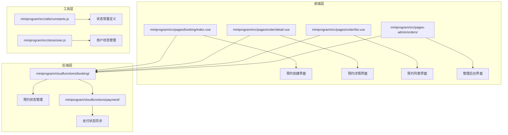

**图表来源**
- [booking/index.js:1-463](file://miniprogram/cloudfunctions/booking/index.js#L1-L463)
- [constants.js:1-73](file://miniprogram/src/utils/constants.js#L1-L73)

**章节来源**
- [booking/index.js:1-93](file://miniprogram/cloudfunctions/booking/index.js#L1-L93)
- [constants.js:1-73](file://miniprogram/src/utils/constants.js#L1-L73)

## 核心组件

### 预约状态枚举定义

系统定义了完整的预约状态枚举，包含六个核心状态：

| 状态值 | 中文标签 | 颜色标识 | 业务含义 |
|--------|----------|----------|----------|
| pending | 待确认 | #ff976a | 用户已提交预约，等待管理员确认 |
| confirmed | 已确认 | #07c160 | 管理员已确认预约，准备进入拍摄阶段 |
| shooting | 拍摄中 | #ff976a | 正在进行拍摄工作 |
| retouching | 修片中 | #ff976a | 正在进行照片后期处理 |
| completed | 已完成 | #999999 | 预约流程完全结束 |
| cancelled | 已取消 | #ee0a24 | 预约被取消 |

### 状态流转图

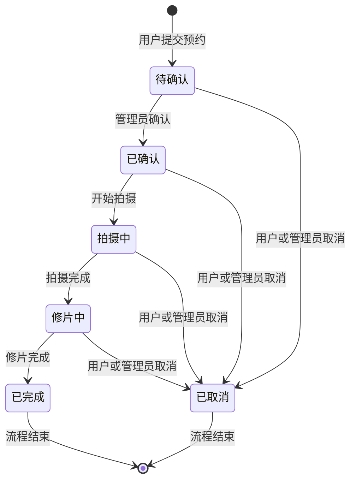

**图表来源**
- [constants.js:29-37](file://miniprogram/src/utils/constants.js#L29-L37)

**章节来源**
- [constants.js:29-37](file://miniprogram/src/utils/constants.js#L29-L37)

## 架构概览

### 整体架构设计

系统采用三层架构模式，实现了清晰的职责分离：

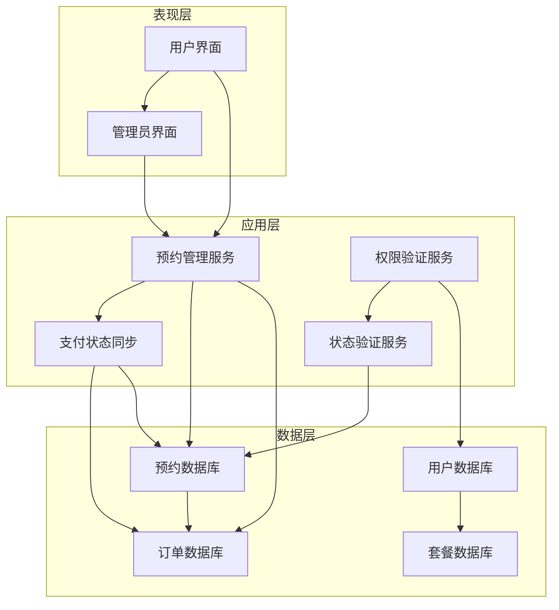

**图表来源**
- [booking/index.js:67-93](file://miniprogram/cloudfunctions/booking/index.js#L67-L93)
- [payment/index.js:171-229](file://miniprogram/cloudfunctions/payment/index.js#L171-L229)

### 数据流架构

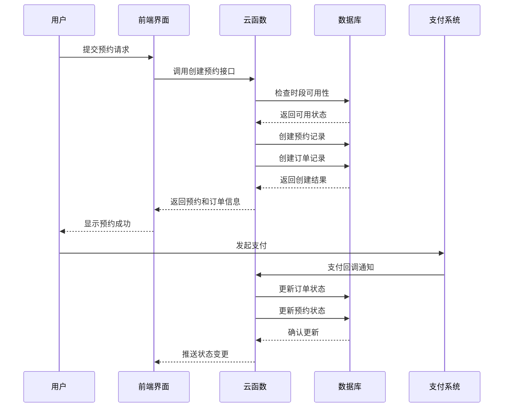

**图表来源**
- [booking/index.js:98-206](file://miniprogram/cloudfunctions/booking/index.js#L98-L206)
- [payment/index.js:171-229](file://miniprogram/cloudfunctions/payment/index.js#L171-L229)

## 详细组件分析

### 预约状态管理核心服务

#### 创建预约流程

创建预约是状态管理的起点，系统通过严格的验证和事务处理确保数据一致性：

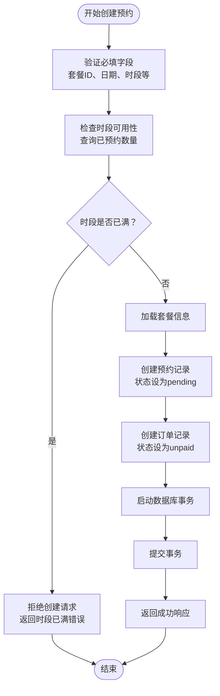

**图表来源**
- [booking/index.js:98-206](file://miniprogram/cloudfunctions/booking/index.js#L98-L206)

#### 状态更新机制

管理员拥有最高权限，可以手动更新任何预约的状态：

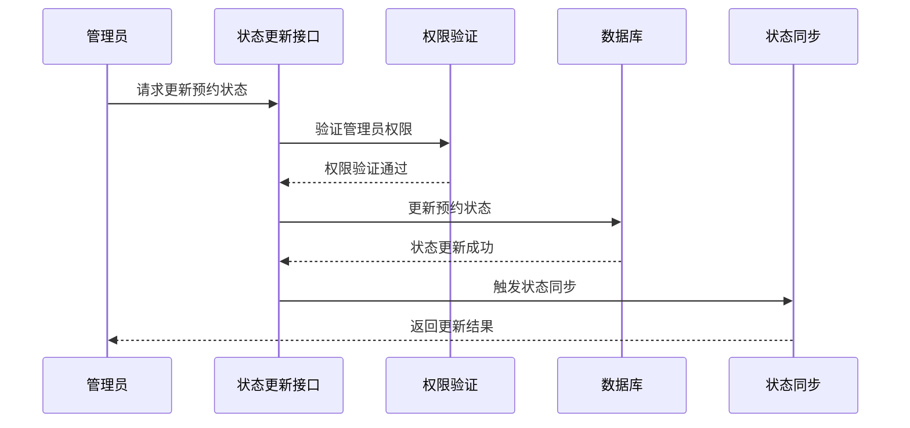

**图表来源**
- [booking/index.js:390-438](file://miniprogram/cloudfunctions/booking/index.js#L390-L438)

**章节来源**
- [booking/index.js:98-206](file://miniprogram/cloudfunctions/booking/index.js#L98-L206)
- [booking/index.js:390-438](file://miniprogram/cloudfunctions/booking/index.js#L390-L438)

### 权限控制系统

系统实现了严格的权限分级控制：

#### 用户权限
- 仅能查看和操作自己的预约
- 可以取消未完成的预约
- 无法修改其他用户的预约状态

#### 管理员权限
- 可以查看所有预约记录
- 可以更新任意预约的状态
- 可以执行批量状态管理操作

#### 权限验证流程

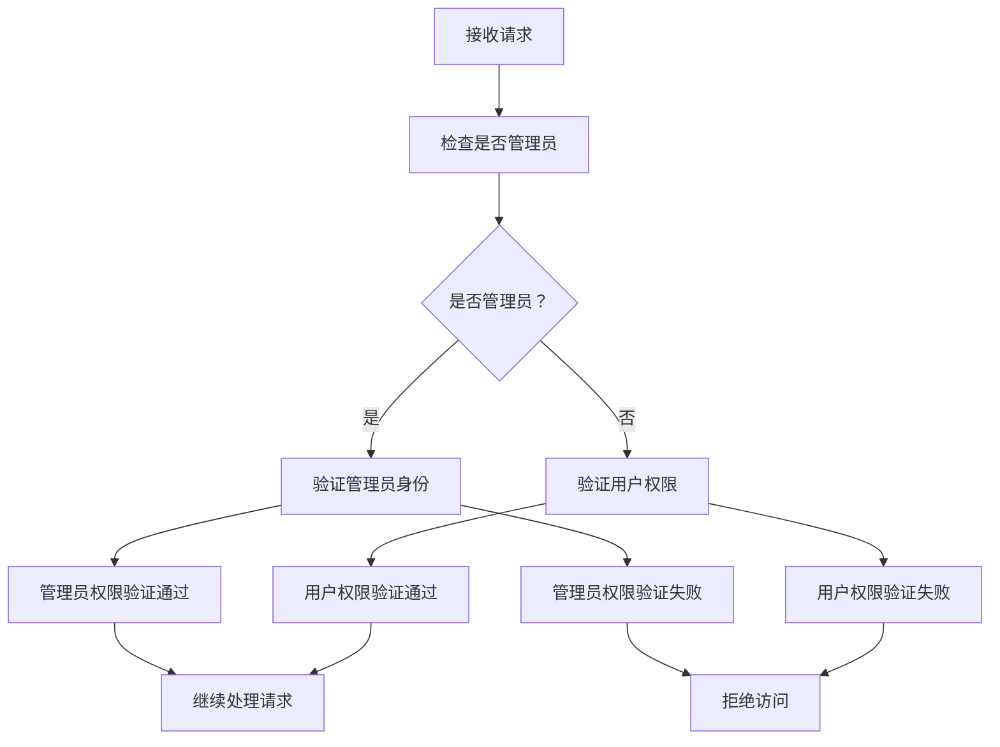

**图表来源**
- [booking/index.js:32-46](file://miniprogram/cloudfunctions/booking/index.js#L32-L46)
- [booking/index.js:211-226](file://miniprogram/cloudfunctions/booking/index.js#L211-L226)

**章节来源**
- [booking/index.js:32-46](file://miniprogram/cloudfunctions/booking/index.js#L32-L46)
- [booking/index.js:211-226](file://miniprogram/cloudfunctions/booking/index.js#L211-L226)

### 并发控制与事务保证

系统通过数据库事务确保状态变更的一致性和原子性：

#### 事务处理流程

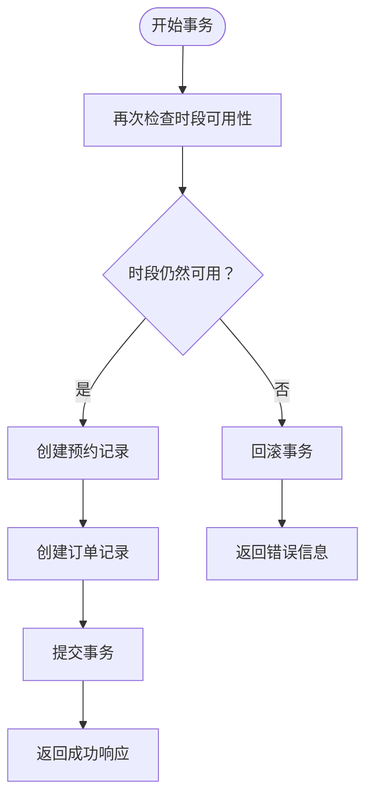

**图表来源**
- [booking/index.js:150-206](file://miniprogram/cloudfunctions/booking/index.js#L150-L206)

#### 并发冲突处理

系统采用乐观锁策略处理并发冲突：

1. **双重检查机制**：在事务开始前和开始后分别检查时段可用性
2. **事务回滚**：检测到冲突时自动回滚所有更改
3. **错误重试**：客户端收到错误后可以重新尝试

**章节来源**
- [booking/index.js:150-206](file://miniprogram/cloudfunctions/booking/index.js#L150-L206)

### 支付状态同步

支付系统的成功回调会自动同步预约状态：

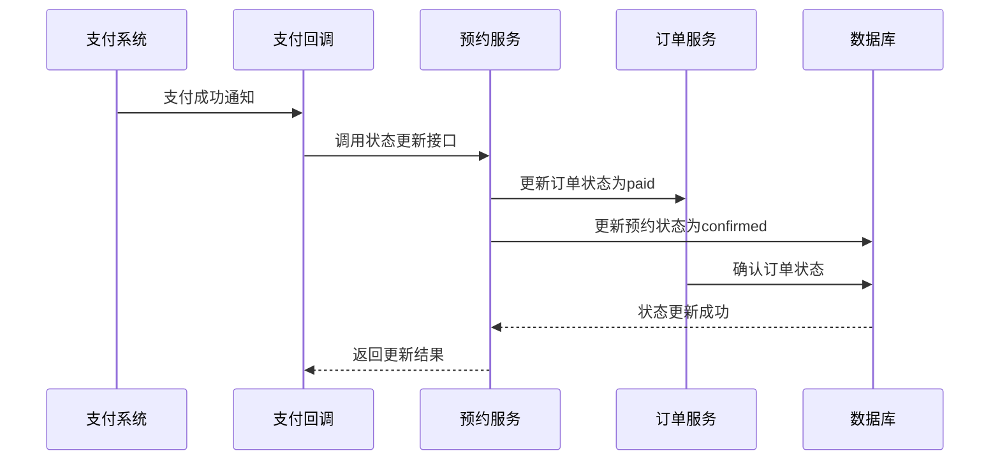

**图表来源**
- [payment/index.js:171-229](file://miniprogram/cloudfunctions/payment/index.js#L171-L229)

**章节来源**
- [payment/index.js:171-229](file://miniprogram/cloudfunctions/payment/index.js#L171-L229)

## 依赖关系分析

### 组件依赖图

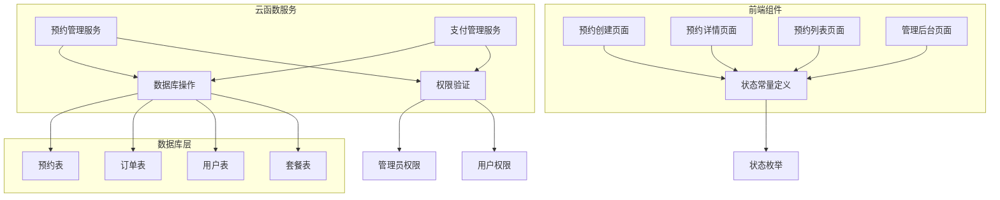

**图表来源**
- [constants.js:29-37](file://miniprogram/src/utils/constants.js#L29-L37)
- [booking/index.js:32-46](file://miniprogram/cloudfunctions/booking/index.js#L32-L46)

### 数据模型关系

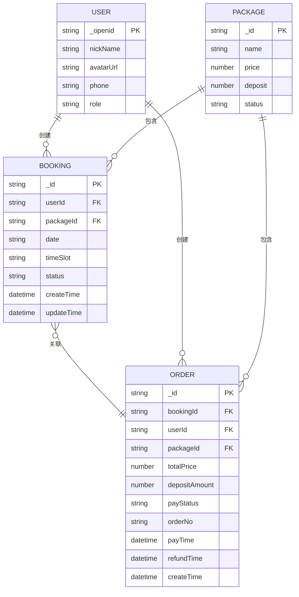

**图表来源**
- [booking/index.js:134-148](file://miniprogram/cloudfunctions/booking/index.js#L134-L148)
- [booking/index.js:174-186](file://miniprogram/cloudfunctions/booking/index.js#L174-L186)

**章节来源**
- [booking/index.js:134-186](file://miniprogram/cloudfunctions/booking/index.js#L134-L186)

## 性能考虑

### 查询优化策略

1. **索引设计**：在常用查询字段上建立适当的数据库索引
2. **分页查询**：使用分页机制避免大量数据一次性加载
3. **条件过滤**：根据用户角色动态构建查询条件

### 缓存策略

- **状态缓存**：将常用的状态映射关系缓存在前端
- **用户信息缓存**：缓存用户权限信息减少重复验证
- **套餐信息缓存**：缓存套餐价格和可用性信息

### 并发优化

- **事务隔离**：使用数据库事务确保数据一致性
- **乐观锁**：通过版本控制处理并发冲突
- **异步处理**：将耗时操作异步化避免阻塞主线程

## 故障排除指南

### 常见问题及解决方案

#### 预约创建失败

**问题现象**：用户提交预约后返回"时段已满"错误

**可能原因**：
1. 同一时间段内已有多个预约
2. 并发情况下其他用户抢先预约
3. 数据库查询结果不一致

**解决步骤**：
1. 检查时段可用性查询逻辑
2. 验证事务处理是否正确
3. 确认并发控制机制是否生效

#### 状态更新异常

**问题现象**：管理员无法更新预约状态

**可能原因**：
1. 管理员权限验证失败
2. 预约ID不存在或已被删除
3. 状态值不在允许范围内

**解决步骤**：
1. 验证管理员身份认证
2. 检查预约记录是否存在
3. 确认状态值的有效性

#### 支付状态不同步

**问题现象**：支付完成后预约状态未更新

**可能原因**：
1. 支付回调接口未正确调用
2. 数据库事务提交失败
3. 网络连接异常导致回调失败

**解决步骤**：
1. 检查支付回调日志
2. 验证数据库事务处理
3. 实现回调重试机制

**章节来源**
- [booking/index.js:328-341](file://miniprogram/cloudfunctions/booking/index.js#L328-L341)
- [booking/index.js:403-407](file://miniprogram/cloudfunctions/booking/index.js#L403-L407)

## 结论

lvpai项目的预约状态管理系统展现了良好的软件工程实践，具有以下特点：

### 技术优势
- **完整的状态生命周期管理**：覆盖从创建到完成的所有阶段
- **严格的权限控制**：清晰的角色分离和权限验证机制
- **可靠的并发处理**：通过事务和双重检查确保数据一致性
- **完善的错误处理**：多层次的异常捕获和恢复机制

### 架构特色
- **模块化设计**：前后端职责清晰分离
- **事件驱动**：通过回调机制实现状态自动同步
- **扩展性强**：易于添加新的状态和业务逻辑

### 最佳实践建议
1. **持续监控**：建立状态变更监控和告警机制
2. **性能优化**：定期审查查询性能和数据库索引
3. **安全加固**：加强输入验证和权限检查
4. **用户体验**：优化状态变更通知和反馈机制

该系统为类似预约管理场景提供了优秀的参考模板，其设计理念和实现方式值得在其他项目中借鉴和应用。