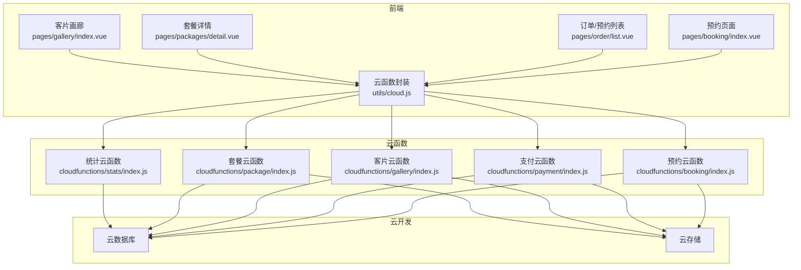
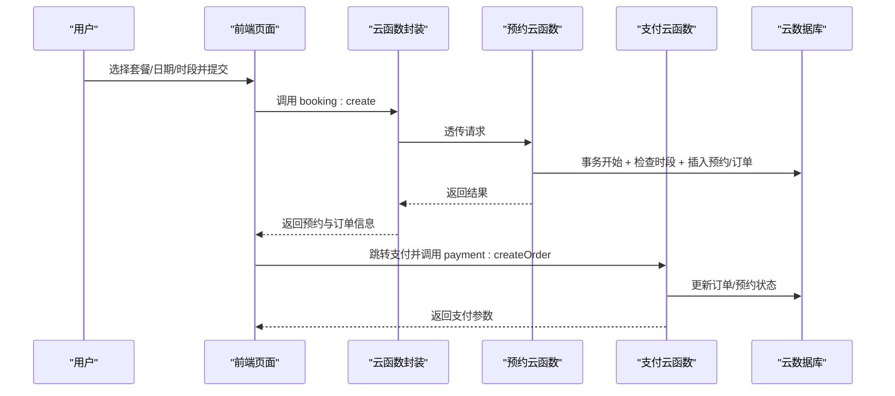
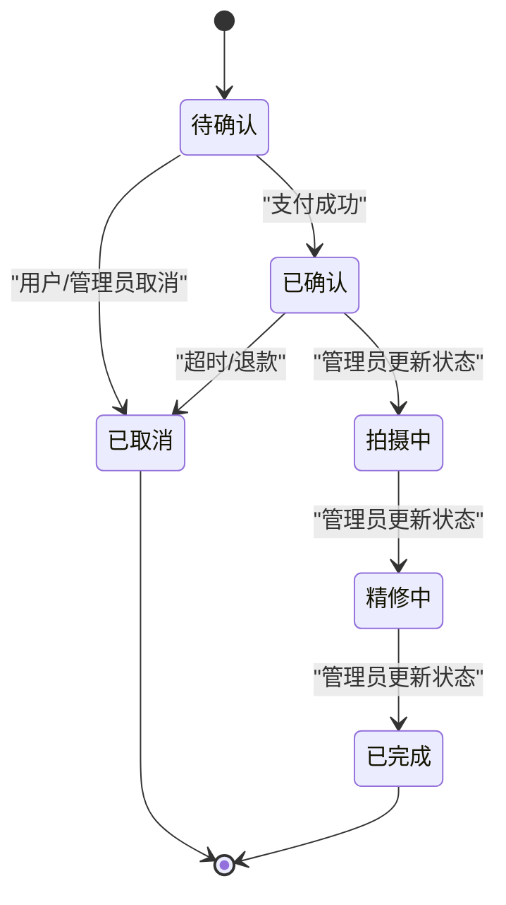
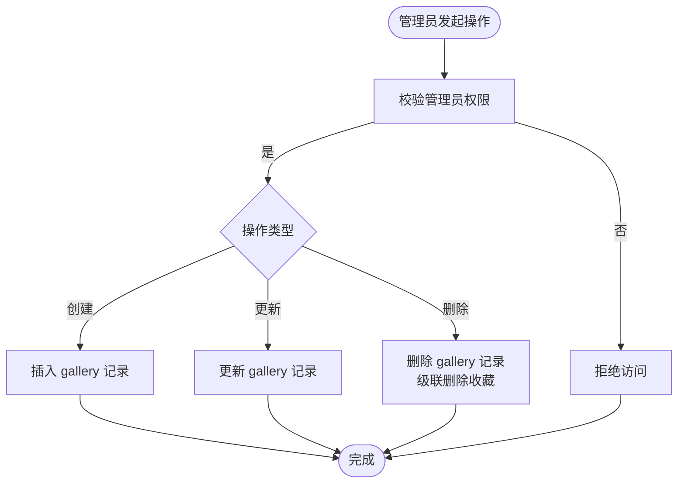
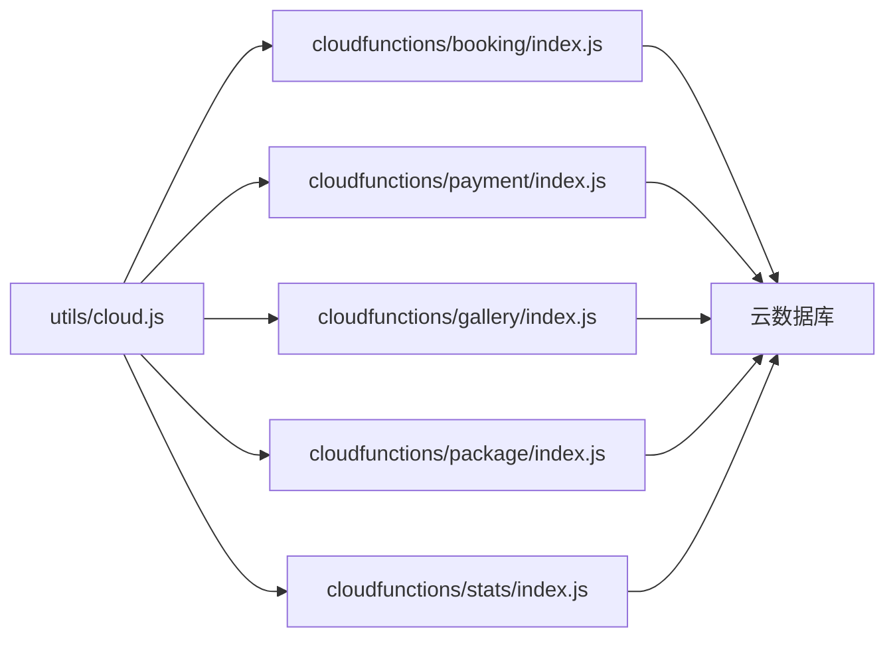

# 数据生命周期管理

<cite>
**本文引用的文件**
- [miniprogram/src/utils/cloud.js](file://miniprogram/src/utils/cloud.js)
- [miniprogram/cloudfunctions/booking/index.js](file://miniprogram/cloudfunctions/booking/index.js)
- [miniprogram/cloudfunctions/gallery/index.js](file://miniprogram/cloudfunctions/gallery/index.js)
- [miniprogram/cloudfunctions/package/index.js](file://miniprogram/cloudfunctions/package/index.js)
- [miniprogram/cloudfunctions/payment/index.js](file://miniprogram/cloudfunctions/payment/index.js)
- [miniprogram/cloudfunctions/stats/index.js](file://miniprogram/cloudfunctions/stats/index.js)
- [miniprogram/src/pages/booking/index.vue](file://miniprogram/src/pages/booking/index.vue)
- [miniprogram/src/pages/order/list.vue](file://miniprogram/src/pages/order/list.vue)
- [miniprogram/src/pages/packages/detail.vue](file://miniprogram/src/pages/packages/detail.vue)
- [miniprogram/src/pages/gallery/index.vue](file://miniprogram/src/pages/gallery/index.vue)
- [miniprogram/project.config.json](file://miniprogram/project.config.json)
</cite>

## 目录
1. [引言](#引言)
2. [项目结构](#项目结构)
3. [核心组件](#核心组件)
4. [架构总览](#架构总览)
5. [详细组件分析](#详细组件分析)
6. [依赖关系分析](#依赖关系分析)
7. [性能考量](#性能考量)
8. [故障排查指南](#故障排查指南)
9. [结论](#结论)
10. [附录](#附录)

## 引言
本文件面向 lvpai 项目的开发者与运维人员，系统化梳理数据从创建、流转、使用、归档、清理到销毁的全生命周期管理策略。结合现有代码实现，明确数据创建时机、状态转换规则、权限控制、事务一致性保障、以及与云开发数据库、云函数、云存储的集成方式；同时给出数据备份、恢复、迁移的实施建议，以及数据质量监控、异常检测与自动修复的可行方案，并覆盖数据保留期限、合规性与安全销毁的最佳实践。

## 项目结构
lvpai 采用“前端 uni-app + 微信云开发”的技术栈，前端通过云函数封装统一调用后端能力，云函数对数据库进行读写与事务控制，部分页面负责触发业务流程与状态变更。

图表来源
- [miniprogram/src/pages/booking/index.vue](file://miniprogram/src/pages/booking/index.vue)
- [miniprogram/src/pages/order/list.vue](file://miniprogram/src/pages/order/list.vue)
- [miniprogram/src/pages/packages/detail.vue](file://miniprogram/src/pages/packages/detail.vue)
- [miniprogram/src/pages/gallery/index.vue](file://miniprogram/src/pages/gallery/index.vue)
- [miniprogram/src/utils/cloud.js](file://miniprogram/src/utils/cloud.js)
- [miniprogram/cloudfunctions/booking/index.js](file://miniprogram/cloudfunctions/booking/index.js)
- [miniprogram/cloudfunctions/payment/index.js](file://miniprogram/cloudfunctions/payment/index.js)
- [miniprogram/cloudfunctions/gallery/index.js](file://miniprogram/cloudfunctions/gallery/index.js)
- [miniprogram/cloudfunctions/package/index.js](file://miniprogram/cloudfunctions/package/index.js)
- [miniprogram/cloudfunctions/stats/index.js](file://miniprogram/cloudfunctions/stats/index.js)

章节来源
- [miniprogram/project.config.json](file://miniprogram/project.config.json)

## 核心组件
- 云函数封装层：统一调用云函数、文件上传/下载/删除、数据库引用，屏蔽前端与后端差异。
- 业务云函数：booking、payment、gallery、package、stats，分别负责预约、支付、客片、套餐、统计等核心业务。
- 前端页面：负责用户交互、表单校验、状态展示与触发业务流程。

章节来源
- [miniprogram/src/utils/cloud.js](file://miniprogram/src/utils/cloud.js)
- [miniprogram/cloudfunctions/booking/index.js](file://miniprogram/cloudfunctions/booking/index.js)
- [miniprogram/cloudfunctions/payment/index.js](file://miniprogram/cloudfunctions/payment/index.js)
- [miniprogram/cloudfunctions/gallery/index.js](file://miniprogram/cloudfunctions/gallery/index.js)
- [miniprogram/cloudfunctions/package/index.js](file://miniprogram/cloudfunctions/package/index.js)
- [miniprogram/cloudfunctions/stats/index.js](file://miniprogram/cloudfunctions/stats/index.js)

## 架构总览
前端通过云函数封装调用各业务云函数，云函数以事务保证数据一致性，数据库保存业务主数据，云存储承载图片等静态资源。统计云函数提供运营视图。

图表来源
- [miniprogram/src/pages/booking/index.vue](file://miniprogram/src/pages/booking/index.vue)
- [miniprogram/src/utils/cloud.js](file://miniprogram/src/utils/cloud.js)
- [miniprogram/cloudfunctions/booking/index.js](file://miniprogram/cloudfunctions/booking/index.js)
- [miniprogram/cloudfunctions/payment/index.js](file://miniprogram/cloudfunctions/payment/index.js)

## 详细组件分析

### 预约与订单生命周期（booking → payment）
- 创建时机：用户在预约页面选择套餐、日期、时段并提交，前端调用预约云函数创建预约与订单。
- 状态转换：预约状态包括 pending、confirmed、shooting、retouching、completed、cancelled；订单状态包括 unpaid、paid、refunding、refunded。
- 事务保障：预约创建与订单创建在单个事务内完成，避免脏写。
- 并发控制：创建前二次检查时段是否已满，防止超卖。
- 权限控制：非管理员仅能查看/取消自己的预约；取消时区分用户/管理员来源并记录。

图表来源
- [miniprogram/cloudfunctions/booking/index.js](file://miniprogram/cloudfunctions/booking/index.js)
- [miniprogram/cloudfunctions/payment/index.js](file://miniprogram/cloudfunctions/payment/index.js)

章节来源
- [miniprogram/src/pages/booking/index.vue](file://miniprogram/src/pages/booking/index.vue)
- [miniprogram/cloudfunctions/booking/index.js](file://miniprogram/cloudfunctions/booking/index.js)
- [miniprogram/cloudfunctions/payment/index.js](file://miniprogram/cloudfunctions/payment/index.js)

### 客片与收藏生命周期（gallery）
- 创建/更新/删除：管理员权限校验后方可操作；删除客片时级联删除收藏记录，保持数据一致性。
- 展示策略：用户端仅展示已发布客片；收藏状态实时同步。
- 文件管理：图片存储于云存储，前端通过临时链接访问。

图表来源
- [minipromaid/cloudfunctions/gallery/index.js](file://miniprogram/cloudfunctions/gallery/index.js)

章节来源
- [miniprogram/cloudfunctions/gallery/index.js](file://miniprogram/cloudfunctions/gallery/index.js)

### 套餐生命周期（package）
- 上下架管理：管理员可将套餐置为 on/off，用户端仅展示 on 的套餐。
- 数据完整性：删除套餐不涉及级联删除，避免误删关联预约/订单。

章节来源
- [miniprogram/cloudfunctions/package/index.js](file://miniprogram/cloudfunctions/package/index.js)

### 统计与监控（stats）
- 管理员视角：提供今日预约数、待处理订单、本月收入、客片总数、总预约数、总用户数等指标。
- 趋势分析：最近7天预约趋势。
- 聚合能力：使用聚合管道统计月收入，异常时降级为0并记录日志。

章节来源
- [miniprogram/cloudfunctions/stats/index.js](file://miniprogram/cloudfunctions/stats/index.js)

### 前端交互与数据绑定
- 预约页面：选择套餐、日期、时段，提交后跳转支付；支持可用时段动态查询。
- 订单/预约列表：支持分页、下拉刷新、按支付状态筛选；支持取消预约。
- 套餐详情：展示套餐信息与图片轮播，支持收藏与立即预约。
- 客片画廊：瀑布流展示、分类筛选、收藏与复制文案。

章节来源
- [miniprogram/src/pages/booking/index.vue](file://miniprogram/src/pages/booking/index.vue)
- [miniprogram/src/pages/order/list.vue](file://miniprogram/src/pages/order/list.vue)
- [miniprogram/src/pages/packages/detail.vue](file://miniprogram/src/pages/packages/detail.vue)
- [miniprogram/src/pages/gallery/index.vue](file://miniprogram/src/pages/gallery/index.vue)

## 依赖关系分析
- 前端依赖云函数封装模块统一调用，降低耦合度。
- 业务云函数依赖数据库命令与事务，确保一致性。
- 统计云函数依赖聚合能力，提供运营决策数据。
- 项目配置文件定义了云函数根目录与构建输出路径。

图表来源
- [miniprogram/src/utils/cloud.js](file://miniprogram/src/utils/cloud.js)
- [miniprogram/cloudfunctions/booking/index.js](file://miniprogram/cloudfunctions/booking/index.js)
- [miniprogram/cloudfunctions/payment/index.js](file://miniprogram/cloudfunctions/payment/index.js)
- [miniprogram/cloudfunctions/gallery/index.js](file://miniprogram/cloudfunctions/gallery/index.js)
- [miniprogram/cloudfunctions/package/index.js](file://miniprogram/cloudfunctions/package/index.js)
- [miniprogram/cloudfunctions/stats/index.js](file://miniprogram/cloudfunctions/stats/index.js)

章节来源
- [miniprogram/project.config.json](file://miniprogram/project.config.json)

## 性能考量
- 分页与懒加载：列表页采用分页与触底加载，减少一次性数据传输。
- 缓存与状态：前端维护收藏状态与瀑布流布局，避免重复请求。
- 事务优化：关键写入操作使用事务，减少中间态，提升一致性与性能。
- 聚合查询：统计云函数使用聚合管道，降低多次查询成本。

## 故障排查指南
- 云函数调用失败：检查云函数返回的 code/message 字段，定位具体错误原因（如权限不足、数据不存在、并发冲突）。
- 事务回滚：创建预约/订单失败会回滚，检查时段是否已满、订单状态是否异常。
- 支付/退款模拟：当前为模拟模式，真实支付/退款需配置商户号并启用真实回调逻辑。
- 文件操作：上传/删除/获取临时链接失败时，检查 fileID 与权限。

章节来源
- [miniprogram/src/utils/cloud.js](file://miniprogram/src/utils/cloud.js)
- [miniprogram/cloudfunctions/booking/index.js](file://miniprogram/cloudfunctions/booking/index.js)
- [miniprogram/cloudfunctions/payment/index.js](file://miniprogram/cloudfunctions/payment/index.js)

## 结论
lvpai 项目通过云函数封装与事务机制，实现了预约/订单、客片/收藏、套餐/统计等核心数据的全生命周期管理。前端以页面为入口驱动业务流程，云函数承担数据一致性与权限控制，云数据库与云存储提供稳定的数据与资源承载。建议在现有基础上补充自动化备份与归档策略、完善异常检测与自动修复机制，并制定明确的数据保留与销毁策略以满足合规要求。

## 附录

### 数据生命周期治理清单（建议）
- 数据创建
  - 明确创建入口与前置校验（如套餐存在性、时段可用性）。
  - 对关键写入使用事务，确保原子性。
- 数据状态转换
  - 定义清晰的状态枚举与转换规则，记录状态变更时间与操作者。
- 数据归档与清理
  - 对历史订单与不再活跃的客片建立归档策略（如超过一定期限转存至归档库/桶）。
  - 清理策略需考虑合规要求与审计需求。
- 数据备份与恢复
  - 建议开启云数据库备份与跨区域复制，定期进行恢复演练。
- 数据迁移
  - 迁移前后进行数据一致性校验，灰度发布与回滚预案。
- 数据质量监控
  - 建立指标看板（如订单成功率、支付失败率、时段冲突率），异常告警与自动修复（如重试、补偿任务）。
- 合规与安全销毁
  - 明确数据保留期限与销毁流程，确保删除不可逆且可审计。