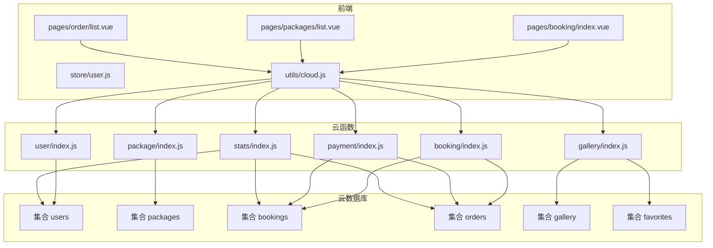
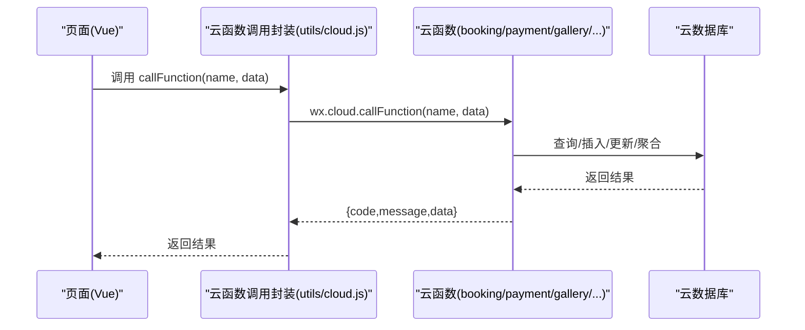
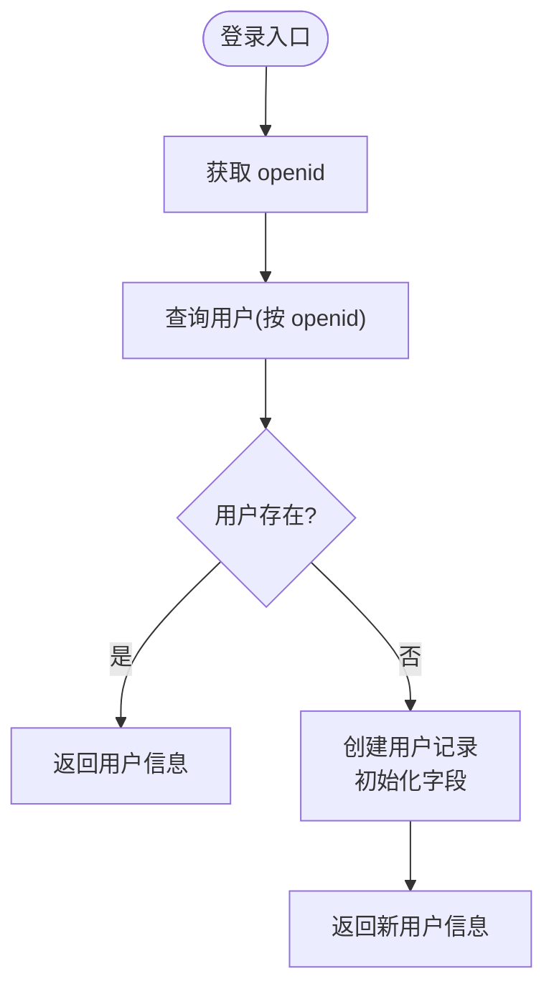
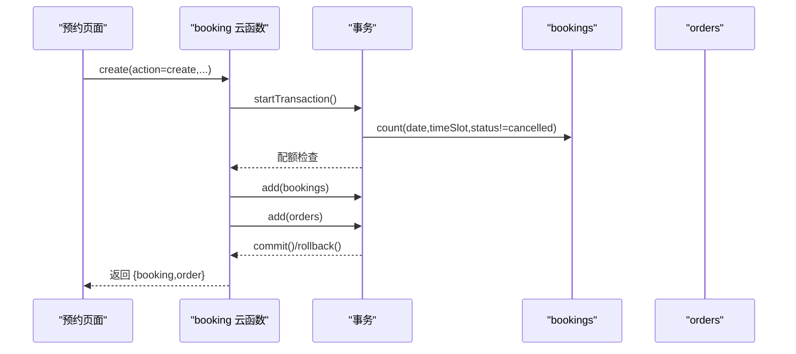
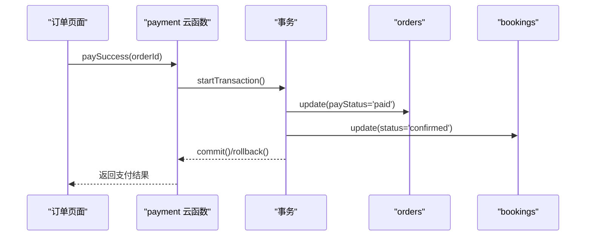
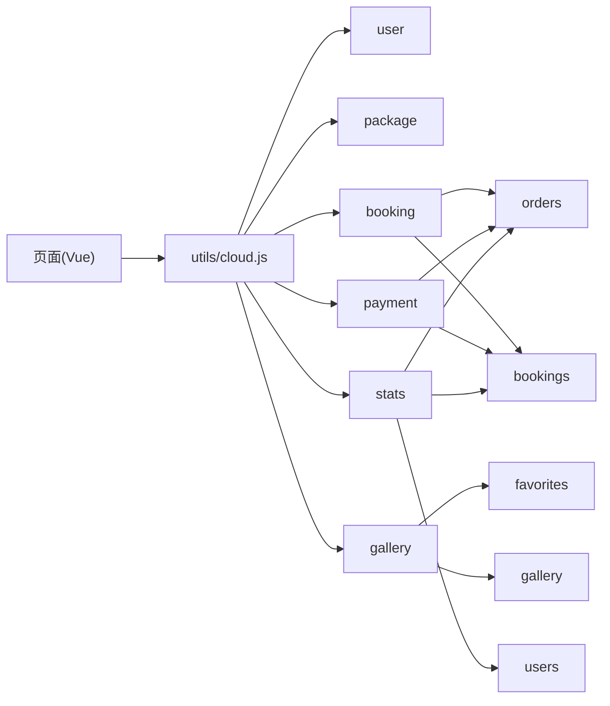
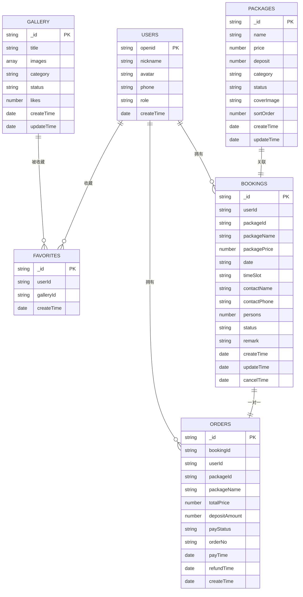

# 数据管理

<cite>
**本文档引用的文件**
- [user/index.js](file://miniprogram/cloudfunctions/user/index.js)
- [booking/index.js](file://miniprogram/cloudfunctions/booking/index.js)
- [payment/index.js](file://miniprogram/cloudfunctions/payment/index.js)
- [gallery/index.js](file://miniprogram/cloudfunctions/gallery/index.js)
- [package/index.js](file://miniprogram/cloudfunctions/package/index.js)
- [stats/index.js](file://miniprogram/cloudfunctions/stats/index.js)
- [cloud.js](file://miniprogram/src/utils/cloud.js)
- [constants.js](file://miniprogram/src/utils/constants.js)
- [user.js](file://miniprogram/src/store/user.js)
- [booking/index.vue](file://miniprogram/src/pages/booking/index.vue)
- [packages/list.vue](file://miniprogram/src/pages/packages/list.vue)
- [order/list.vue](file://miniprogram/src/pages/order/list.vue)
</cite>

## 目录
1. [简介](#简介)
2. [项目结构](#项目结构)
3. [核心数据模型](#核心数据模型)
4. [架构总览](#架构总览)
5. [详细组件分析](#详细组件分析)
6. [依赖关系分析](#依赖关系分析)
7. [性能与优化](#性能与优化)
8. [故障排查指南](#故障排查指南)
9. [结论](#结论)
10. [附录](#附录)

## 简介
本文件系统性梳理 lvpai 项目的“数据管理”相关内容，覆盖用户、预约、支付、内容（客片/套餐）、统计等核心数据模型的设计与业务含义；阐述数据库集合关系、索引策略与查询优化建议；解释数据生命周期管理、缓存策略与同步机制；提供数据迁移、备份恢复与安全保护方案；并给出数据访问模式、事务处理与并发控制的实现细节，帮助开发者高效进行数据维护与扩展。

## 项目结构
lvpai 采用“前端页面 + 云函数 + 云数据库”的典型小程序架构：
- 前端页面通过云函数封装调用云数据库，统一进行数据读写与业务处理
- 云函数负责权限校验、数据校验、事务一致性、跨表联动更新
- 云数据库集合包括 users、packages、bookings、orders、gallery、favorites 等

图表来源
- [booking/index.vue:1-1029](file://miniprogram/src/pages/booking/index.vue#L1-L1029)
- [packages/list.vue:1-305](file://miniprogram/src/pages/packages/list.vue#L1-L305)
- [order/list.vue:1-554](file://miniprogram/src/pages/order/list.vue#L1-L554)
- [cloud.js:1-66](file://miniprogram/src/utils/cloud.js#L1-L66)
- [user/index.js:1-206](file://miniprogram/cloudfunctions/user/index.js#L1-L206)
- [package/index.js:1-222](file://miniprogram/cloudfunctions/package/index.js#L1-L222)
- [booking/index.js:1-463](file://miniprogram/cloudfunctions/booking/index.js#L1-L463)
- [payment/index.js:1-532](file://miniprogram/cloudfunctions/payment/index.js#L1-L532)
- [gallery/index.js:1-360](file://miniprogram/cloudfunctions/gallery/index.js#L1-L360)
- [stats/index.js:1-229](file://miniprogram/cloudfunctions/stats/index.js#L1-L229)

章节来源
- [booking/index.vue:1-1029](file://miniprogram/src/pages/booking/index.vue#L1-L1029)
- [packages/list.vue:1-305](file://miniprogram/src/pages/packages/list.vue#L1-L305)
- [order/list.vue:1-554](file://miniprogram/src/pages/order/list.vue#L1-L554)
- [cloud.js:1-66](file://miniprogram/src/utils/cloud.js#L1-L66)

## 核心数据模型
以下为核心数据集合的结构设计与业务含义（字段命名与类型以云数据库为准，字段语义按业务约定）：

- 用户集合 users
  - 字段示例：openid、nickname、avatar、phone、role、createTime
  - 业务含义：标识小程序用户身份，支持用户资料、手机号绑定、角色分级（user/admin/superAdmin）
  - 关键约束：openid 唯一；角色字段用于权限控制

- 套餐集合 packages
  - 字段示例：name、price、deposit、category、status、coverImage、sortOrder、createTime/updateTime
  - 业务含义：提供拍摄套餐配置，支持上下架、排序、分类展示
  - 关键约束：status 控制前台可见性；sortOrder 控制展示顺序

- 客片集合 gallery
  - 字段示例：title、images、category、status、likes、createTime/updateTime
  - 业务含义：展示客户作品，支持发布/下线、点赞计数、分类筛选
  - 关键约束：status=published 时前台可见；likes 通过收藏联动更新

- 收藏集合 favorites
  - 字段示例：userId、galleryId、createTime
  - 业务含义：记录用户对客片的收藏关系，用于“我的收藏”列表
  - 关键约束：唯一索引（userId,galleryId）

- 预约集合 bookings
  - 字段示例：userId、packageId、packageName、packagePrice、date、timeSlot、contactName、contactPhone、persons、status、remark、createTime/updateTime/cancelTime
  - 业务含义：记录用户的拍摄预约，支持多状态流转（pending/confirmed/shooting/retouching/completed/cancelled）
  - 关键约束：date+timeSlot 的时段配额限制；状态变更需满足业务规则

- 订单集合 orders
  - 字段示例：bookingId、userId、packageId、packageName、totalPrice、depositAmount、payStatus、orderNo、payTime/refundTime、createTime
  - 业务含义：记录支付订单，支持定金支付、退款流程与状态同步
  - 关键约束：orderNo 全局唯一；与 bookings 一对一关联

- 统计集合（统计云函数聚合）
  - 统计维度：当日预约数、待处理订单数、当月收入、客片总数、总预约数、总用户数、状态分布、近7日趋势

章节来源
- [user/index.js:48-66](file://miniprogram/cloudfunctions/user/index.js#L48-L66)
- [package/index.js:119-133](file://miniprogram/cloudfunctions/package/index.js#L119-L133)
- [gallery/index.js:136-145](file://miniprogram/cloudfunctions/gallery/index.js#L136-L145)
- [booking/index.js:134-148](file://miniprogram/cloudfunctions/booking/index.js#L134-L148)
- [payment/index.js:174-199](file://miniprogram/cloudfunctions/payment/index.js#L174-L199)
- [stats/index.js:84-131](file://miniprogram/cloudfunctions/stats/index.js#L84-L131)

## 架构总览
前端页面通过统一的云函数调用封装，向数据库发起读写请求；云函数承担：
- 权限校验（用户/管理员）
- 参数校验与业务规则
- 事务保证跨表一致性
- 聚合统计与趋势分析

图表来源
- [cloud.js:6-26](file://miniprogram/src/utils/cloud.js#L6-L26)
- [booking/index.vue:442-453](file://miniprogram/src/pages/booking/index.vue#L442-L453)
- [order/list.vue:224-229](file://miniprogram/src/pages/order/list.vue#L224-L229)

## 详细组件分析

### 用户模块（user）
- 功能要点
  - 登录即注册：根据 openid 自动创建用户记录
  - 资料更新：昵称、头像、手机号
  - 角色管理：仅 superAdmin 可提升他人角色
- 关键实现
  - openid 作为唯一标识，首次登录自动写入基础字段
  - 更新手机号时进行格式校验
  - setAdmin 接口前置校验当前用户角色

图表来源
- [user/index.js:34-66](file://miniprogram/cloudfunctions/user/index.js#L34-L66)

章节来源
- [user/index.js:1-206](file://miniprogram/cloudfunctions/user/index.js#L1-L206)
- [user.js:1-48](file://miniprogram/src/store/user.js#L1-L48)

### 套餐模块（package）
- 功能要点
  - 列表/详情：支持分类筛选、状态过滤（前台仅 on）
  - 管理员 CRUD：创建、更新、删除、上下架
- 关键实现
  - 列表按 sortOrder 升序排列
  - 上下架状态仅管理员可操作

章节来源
- [package/index.js:1-222](file://miniprogram/cloudfunctions/package/index.js#L1-L222)
- [packages/list.vue:94-125](file://miniprogram/src/pages/packages/list.vue#L94-L125)

### 客片模块（gallery）
- 功能要点
  - 列表/详情：分类筛选、发布态过滤
  - 收藏：toggleFavorite 增减 likes
  - 管理员 CRUD：创建、更新、删除（删除时级联清理收藏）
- 关键实现
  - 收藏与取消收藏通过事务保证 gallery.likes 与 favorites 的一致性
  - “我的收藏”联查 gallery 信息并过滤 published

章节来源
- [gallery/index.js:1-360](file://miniprogram/cloudfunctions/gallery/index.js#L1-L360)
- [order/list.vue:230-235](file://miniprogram/src/pages/order/list.vue#L230-L235)

### 预约模块（booking）
- 功能要点
  - 创建预约：校验套餐、日期时段、并发保护、创建订单
  - 列表/详情：支持管理员全量查看与权限校验
  - 取消预约：状态校验、退款标记
  - 管理员状态变更：推进预约流程
  - 可用时段查询：基于配额计算
- 关键实现
  - 事务：创建预约与订单必须同时成功或回滚
  - 并发控制：二次检查配额，避免超卖
  - 订单号生成：时间戳+随机数，保证全局唯一性

图表来源
- [booking/index.js:150-206](file://miniprogram/cloudfunctions/booking/index.js#L150-L206)

章节来源
- [booking/index.js:1-463](file://miniprogram/cloudfunctions/booking/index.js#L1-L463)
- [booking/index.vue:372-400](file://miniprogram/src/pages/booking/index.vue#L372-L400)

### 支付模块（payment）
- 功能要点
  - 创建支付订单：模拟支付参数（开发阶段），真实接入需配置商户号
  - 支付成功：前端调用后端更新订单与预约状态（事务）
  - 支付回调：模拟处理（真实需实现签名验证与幂等）
  - 退款：管理员触发，模拟退款（真实需配置证书）
  - 我的订单：分页查询、按支付状态筛选
- 关键实现
  - 事务：订单支付成功后，同时更新 orders.payStatus 与 bookings.status
  - 权限校验：仅本人可支付/查看订单；管理员可退款与查看全部

图表来源
- [payment/index.js:203-238](file://miniprogram/cloudfunctions/payment/index.js#L203-L238)

章节来源
- [payment/index.js:1-532](file://miniprogram/cloudfunctions/payment/index.js#L1-L532)
- [order/list.vue:284-289](file://miniprogram/src/pages/order/list.vue#L284-L289)

### 统计模块（stats）
- 功能要点
  - 管理员仪表盘：当日预约、待处理订单、当月收入、客片/预约/用户总数
  - 状态分布统计：各预约状态数量
  - 近7日趋势：按日期统计预约数量
- 关键实现
  - 聚合查询：使用聚合管道统计当月收入
  - 多次 count：状态分布与趋势通过多次 count 实现

章节来源
- [stats/index.js:1-229](file://miniprogram/cloudfunctions/stats/index.js#L1-L229)

## 依赖关系分析
- 前端依赖
  - 页面通过 utils/cloud.js 统一封装调用云函数
  - 常量定义（状态、分类、时段）集中于 utils/constants.js
  - Pinia store 管理用户登录态与权限判断
- 云函数间耦合
  - booking 与 payment 通过订单与预约双向关联
  - gallery 与 favorites 通过收藏关系关联
  - stats 依赖 bookings、orders、users 进行聚合统计

图表来源
- [cloud.js:1-66](file://miniprogram/src/utils/cloud.js#L1-L66)
- [booking/index.js:1-463](file://miniprogram/cloudfunctions/booking/index.js#L1-L463)
- [payment/index.js:1-532](file://miniprogram/cloudfunctions/payment/index.js#L1-L532)
- [gallery/index.js:1-360](file://miniprogram/cloudfunctions/gallery/index.js#L1-L360)
- [stats/index.js:1-229](file://miniprogram/cloudfunctions/stats/index.js#L1-L229)

章节来源
- [cloud.js:1-66](file://miniprogram/src/utils/cloud.js#L1-L66)
- [constants.js:1-73](file://miniprogram/src/utils/constants.js#L1-L73)
- [user.js:1-48](file://miniprogram/src/store/user.js#L1-L48)

## 性能与优化
- 查询优化
  - 为高频查询字段建立索引：users.openid、bookings.userId/date/timeSlot/status、orders.userId/orderNo/payStatus、gallery.status/category、favorites(userId,galleryId)
  - 分页查询：使用 skip/limit，避免一次性拉取大量数据
  - 聚合统计：优先使用聚合管道（如 stats 的月收入统计）
- 事务与并发
  - booking 创建时使用事务，二次检查配额，避免超卖
  - 支付成功与状态变更使用事务，保证一致性
- 缓存策略
  - 前端对常驻数据（如套餐列表、分类常量）进行本地缓存，减少重复请求
  - 对热点数据（如每日可用时段）可在云函数层做短期缓存（注意时效性）
- 索引建议
  - bookings：(date, timeSlot, status) 复合索引，用于配额查询
  - orders：(userId, payStatus, createTime) 复合索引，用于我的订单分页
  - gallery：(status, category, createTime) 复合索引，用于前台列表
  - favorites：(userId, galleryId) 复合索引，用于收藏查询与去重

[本节为通用性能建议，不直接分析具体文件]

## 故障排查指南
- 常见问题定位
  - 权限不足：检查用户角色与管理员校验逻辑（booking/galary/package/payment）
  - 数据不一致：确认事务是否正确提交/回滚（booking/payment）
  - 并发超卖：核对配额二次检查与事务边界（booking）
  - 订单状态异常：核对 payStatus 流程与幂等处理（payment）
- 错误处理
  - 云函数统一捕获异常并返回标准结构（{code,message}）
  - 前端对返回 code==0 做成功分支，其余做错误提示
- 日志与监控
  - 在关键路径添加日志（如事务开始/结束、配额检查、状态变更）
  - 对高频接口进行埋点统计，识别慢查询与异常峰值

章节来源
- [booking/index.js:150-206](file://miniprogram/cloudfunctions/booking/index.js#L150-L206)
- [payment/index.js:203-238](file://miniprogram/cloudfunctions/payment/index.js#L203-L238)
- [cloud.js:6-26](file://miniprogram/src/utils/cloud.js#L6-L26)

## 结论
lvpai 的数据管理以云函数为中心，围绕用户、套餐、客片、预约、订单构建清晰的业务闭环，并通过事务与权限校验保障一致性与安全性。前端通过统一的云函数封装简化数据交互，配合常量与状态定义提升可维护性。建议在现有基础上进一步完善索引策略、引入缓存与监控，并在生产环境完善支付回调与退款的真实接入，持续优化查询性能与用户体验。

[本节为总结性内容，不直接分析具体文件]

## 附录

### 数据模型关系图

图表来源
- [user/index.js:48-66](file://miniprogram/cloudfunctions/user/index.js#L48-L66)
- [package/index.js:119-133](file://miniprogram/cloudfunctions/package/index.js#L119-L133)
- [gallery/index.js:136-145](file://miniprogram/cloudfunctions/gallery/index.js#L136-L145)
- [booking/index.js:134-148](file://miniprogram/cloudfunctions/booking/index.js#L134-L148)
- [payment/index.js:174-199](file://miniprogram/cloudfunctions/payment/index.js#L174-L199)

### 数据生命周期与同步机制
- 生命周期
  - 用户：创建（登录即注册）→ 更新资料/角色 → 逻辑删除（可扩展）
  - 套餐：创建 → 上架/下架 → 删除
  - 客片：创建 → 发布/下线 → 删除（级联清理收藏）
  - 预约：创建 → 状态推进 → 取消/完成 → 退款（可扩展）
  - 订单：创建 → 支付 → 退款 → 完成
- 同步机制
  - 收藏与点赞：toggleFavorite 通过事务原子更新 gallery.likes 与 favorites
  - 支付成功：事务同步更新 orders.payStatus 与 bookings.status
  - 取消预约：根据订单支付状态决定是否标记退款

章节来源
- [gallery/index.js:198-225](file://miniprogram/cloudfunctions/gallery/index.js#L198-L225)
- [payment/index.js:203-238](file://miniprogram/cloudfunctions/payment/index.js#L203-L238)
- [booking/index.js:308-384](file://miniprogram/cloudfunctions/booking/index.js#L308-L384)

### 数据迁移、备份与安全
- 迁移方案
  - 新增字段：使用云函数批量更新历史数据，结合事务保证一致性
  - 字段重命名：先写新字段，再迁移旧字段，最后删除旧字段
  - 结构变更：通过版本化接口与灰度发布，逐步替换旧逻辑
- 备份与恢复
  - 定期导出重要集合（bookings/orders/gallery/packages/users）至 CSV/JSON
  - 使用云开发提供的备份功能进行快照管理
- 安全保护
  - 权限校验：所有敏感操作均需管理员或本人权限
  - 输入校验：手机号、日期、时段、人数等字段严格校验
  - 事务隔离：跨表更新使用事务，避免中间态暴露
  - 日志审计：记录关键操作（创建/更新/删除/退款）与操作人

[本节为通用实践建议，不直接分析具体文件]