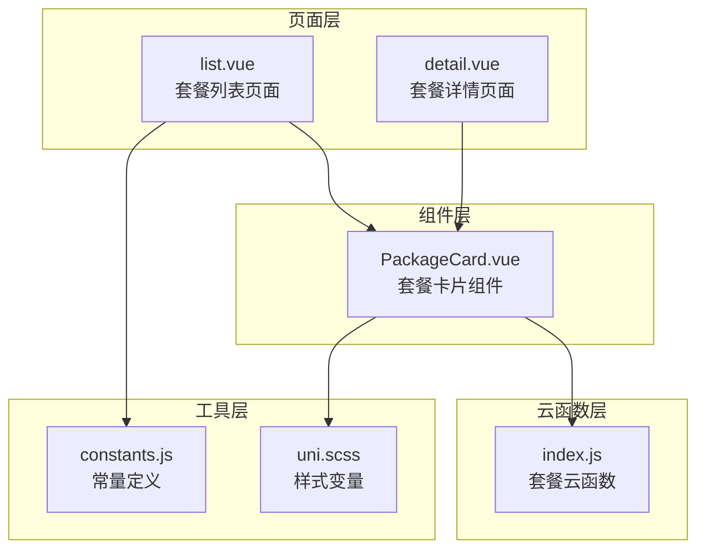
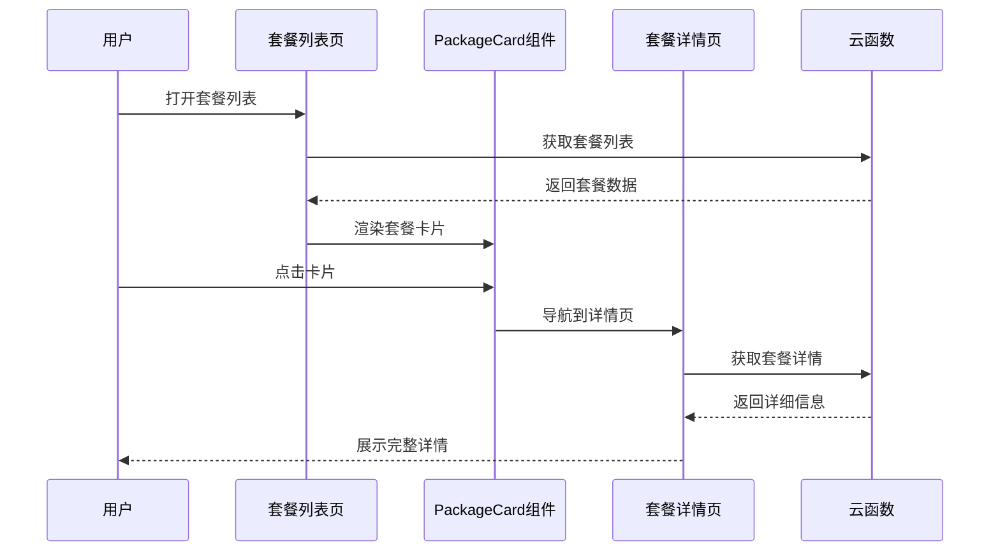
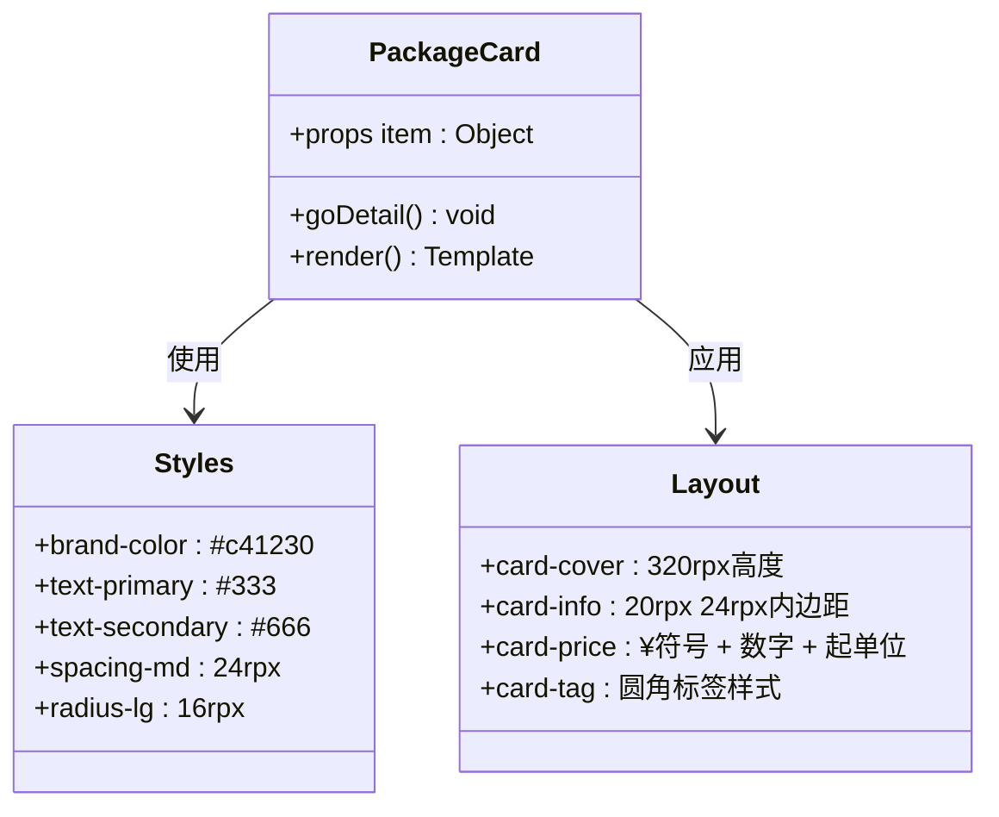
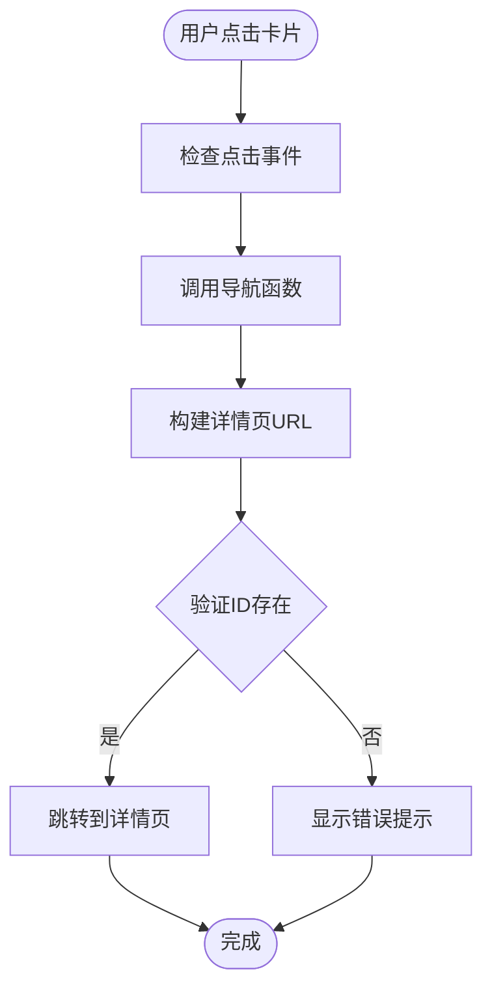
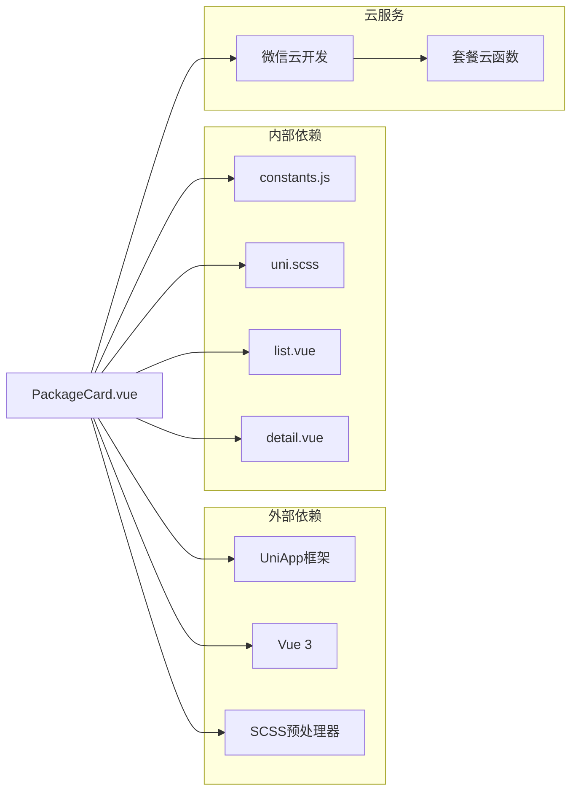

# 套餐卡片组件 (PackageCard)

<cite>
**本文档引用的文件**
- [PackageCard.vue](file://miniprogram/src/components/PackageCard.vue)
- [list.vue](file://miniprogram/src/pages/packages/list.vue)
- [detail.vue](file://miniprogram/src/pages/packages/detail.vue)
- [constants.js](file://miniprogram/src/utils/constants.js)
- [index.js](file://miniprogram/cloudfunctions/package/index.js)
- [uni.scss](file://miniprogram/src/uni.scss)
</cite>

## 目录
1. [简介](#简介)
2. [项目结构](#项目结构)
3. [核心组件](#核心组件)
4. [架构概览](#架构概览)
5. [详细组件分析](#详细组件分析)
6. [依赖关系分析](#依赖关系分析)
7. [性能考虑](#性能考虑)
8. [故障排除指南](#故障排除指南)
9. [结论](#结论)
10. [附录](#附录)

## 简介
PackageCard 是一个专为微电影摄影工作室小程序设计的套餐卡片组件。该组件采用响应式设计，支持图片懒加载，提供直观的价格展示和标签功能，是用户浏览和选择摄影套餐的核心界面元素。

该组件基于 UniApp 框架开发，使用 Vue 3 Composition API 和 SCSS 预处理器，实现了完整的移动端适配和现代化的视觉效果。

## 项目结构
PackageCard 组件位于项目的组件目录中，与页面组件协同工作，形成完整的套餐浏览和详情展示系统。

**图表来源**
- [PackageCard.vue:1-100](file://miniprogram/src/components/PackageCard.vue#L1-L100)
- [list.vue:1-305](file://miniprogram/src/pages/packages/list.vue#L1-L305)
- [detail.vue:1-598](file://miniprogram/src/pages/packages/detail.vue#L1-L598)

**章节来源**
- [PackageCard.vue:1-100](file://miniprogram/src/components/PackageCard.vue#L1-L100)
- [list.vue:1-305](file://miniprogram/src/pages/packages/list.vue#L1-L305)

## 核心组件
PackageCard 组件是一个轻量级的 Vue 3 组件，专注于展示单个套餐的信息。组件通过 props 接收数据，提供点击跳转到详情页的功能。

### 主要特性
- **响应式设计**: 使用 rpx 单位确保在不同设备上的正确显示
- **图片懒加载**: 自动优化图片加载性能
- **价格展示**: 采用专业的货币符号和格式化显示
- **标签系统**: 支持可选的标签显示
- **导航集成**: 无缝集成到应用的导航体系

**章节来源**
- [PackageCard.vue:21-31](file://miniprogram/src/components/PackageCard.vue#L21-L31)

## 架构概览
PackageCard 组件在整个应用架构中扮演着关键角色，连接了数据层、业务逻辑层和用户界面层。

**图表来源**
- [list.vue:94-125](file://miniprogram/src/pages/packages/list.vue#L94-L125)
- [PackageCard.vue:26-30](file://miniprogram/src/components/PackageCard.vue#L26-L30)
- [detail.vue:202-237](file://miniprogram/src/pages/packages/detail.vue#L202-L237)

## 详细组件分析

### 数据模型和 Props 配置

PackageCard 组件通过单一的 props 接收套餐数据对象，该对象必须包含以下必需字段：

#### 必需字段
| 字段名 | 类型 | 描述 | 示例值 |
|--------|------|------|--------|
| `_id` | String | 套餐唯一标识符 | `"pkg_12345"` |
| `coverImage` | String | 封面图片URL | `"https://example.com/image.jpg"` |
| `name` | String | 套餐名称 | `"草原征途"` |
| `description` | String | 套餐描述 | `"蒙古袍/民族风/公主服，一站式换装"` |
| `price` | Number/String | 套餐价格 | `2999` |

#### 可选字段
| 字段名 | 类型 | 描述 | 示例值 |
|--------|------|------|--------|
| `tag` | String | 标签文本 | `"热销"` |

### 样式系统和主题定制

组件采用 SCSS 预处理器，使用全局样式变量确保视觉一致性：

**图表来源**
- [PackageCard.vue:33-98](file://miniprogram/src/components/PackageCard.vue#L33-L98)
- [uni.scss:1-43](file://miniprogram/src/uni.scss#L1-L43)

### 交互行为和事件处理

组件提供了一套完整的交互体验，包括点击事件处理和导航跳转：

**图表来源**
- [PackageCard.vue:26-30](file://miniprogram/src/components/PackageCard.vue#L26-L30)

### 响应式设计实现

组件采用 rpx 单位和弹性布局，确保在不同屏幕尺寸下的良好表现：

| 设备类型 | 屏幕宽度 | rpx基准 | 组件适配 |
|----------|----------|---------|----------|
| 移动设备 | 320-480px | 24rpx | 完全适配 |
| 平板设备 | 768px+ | 32rpx | 适当放大 |
| iPhone SE | 375px | 24rpx | 紧凑布局 |
| iPhone Pro Max | 428px | 24rpx | 标准布局 |

**章节来源**
- [PackageCard.vue:34-98](file://miniprogram/src/components/PackageCard.vue#L34-L98)

## 依赖关系分析

PackageCard 组件与其他模块的依赖关系体现了清晰的分层架构：

**图表来源**
- [PackageCard.vue:1-100](file://miniprogram/src/components/PackageCard.vue#L1-L100)
- [list.vue:57-61](file://miniprogram/src/pages/packages/list.vue#L57-L61)

**章节来源**
- [constants.js:5-11](file://miniprogram/src/utils/constants.js#L5-L11)
- [uni.scss:1-43](file://miniprogram/src/uni.scss#L1-L43)

## 性能考虑

### 图片懒加载优化
组件使用 `lazy-load` 属性实现图片懒加载，有效减少首屏加载时间：
- 延迟加载非首屏图片
- 减少带宽消耗
- 提升滚动性能

### 渲染优化策略
- 使用 `v-if` 条件渲染标签
- 避免不必要的计算属性
- 合理的样式作用域管理

### 内存管理
- 组件生命周期短，自动清理
- 无全局状态污染
- 事件监听器及时销毁

## 故障排除指南

### 常见问题及解决方案

#### 1. 图片不显示问题
**症状**: 封面图片空白或加载失败
**原因**: 
- 图片URL无效
- 网络连接问题
- 图片权限限制

**解决方案**:
- 验证图片URL格式
- 检查网络连接状态
- 确认图片访问权限

#### 2. 导航跳转失败
**症状**: 点击卡片无反应或跳转错误
**原因**:
- 缺少 `_id` 字段
- 页面路径配置错误
- 参数传递问题

**解决方案**:
- 确保数据对象包含 `_id`
- 检查页面路由配置
- 验证参数格式

#### 3. 样式显示异常
**症状**: 组件样式错乱或显示不正常
**原因**:
- SCSS变量未正确导入
- 样式作用域冲突
- rpx单位换算问题

**解决方案**:
- 确认样式文件导入
- 检查样式优先级
- 验证响应式断点

**章节来源**
- [PackageCard.vue:26-30](file://miniprogram/src/components/PackageCard.vue#L26-L30)

## 结论
PackageCard 组件是一个设计精良、功能完整的套餐展示组件。它通过简洁的 API 设计、完善的响应式支持和优秀的性能优化，为用户提供了流畅的套餐浏览体验。

组件的主要优势包括：
- **简洁易用**: 单一 props 接口，易于集成
- **性能优秀**: 图片懒加载和优化渲染
- **样式统一**: 基于全局样式变量的主题系统
- **扩展性强**: 良好的架构设计便于功能扩展

## 附录

### API 参考文档

#### Props 配置
| 属性名 | 类型 | 必填 | 默认值 | 描述 |
|--------|------|------|--------|------|
| item | Object | 是 | - | 套餐数据对象 |

#### 事件接口
| 事件名 | 触发时机 | 回调参数 | 描述 |
|--------|----------|----------|------|
| click | 用户点击卡片 | - | 触发导航到详情页 |

#### 样式定制选项
| 样式类 | 适用范围 | 自定义属性 | 说明 |
|--------|----------|------------|------|
| package-card | 组件根容器 | 背景、圆角、阴影 | 主容器样式 |
| card-cover | 封面图片 | 高度、宽度 | 图片容器样式 |
| card-info | 信息区域 | 内边距、字体 | 文本内容样式 |
| card-price | 价格区域 | 颜色、字号 | 价格显示样式 |
| card-tag | 标签区域 | 背景色、圆角 | 标签样式 |

### 最佳实践建议

#### 数据准备
1. 确保每个套餐对象都包含必需字段
2. 提供高质量的封面图片
3. 使用合理的描述文案

#### 性能优化
1. 为图片设置合适的尺寸
2. 使用 CDN 加速静态资源
3. 合理控制组件数量

#### 用户体验
1. 提供加载状态反馈
2. 实现错误处理机制
3. 保持一致的视觉风格

### 扩展开发指南

#### 功能扩展方向
1. **收藏功能**: 添加收藏状态管理和本地存储
2. **分享功能**: 实现微信分享和海报生成
3. **价格比较**: 支持多个价格方案对比
4. **评价系统**: 集成用户评价和评分功能

#### 自定义样式
1. 通过 SCSS 变量调整主题色彩
2. 使用深度选择器覆盖组件样式
3. 实现响应式断点自定义

#### 集成建议
1. 与 Vuex/Pinia 状态管理集成
2. 实现缓存策略优化
3. 添加国际化支持