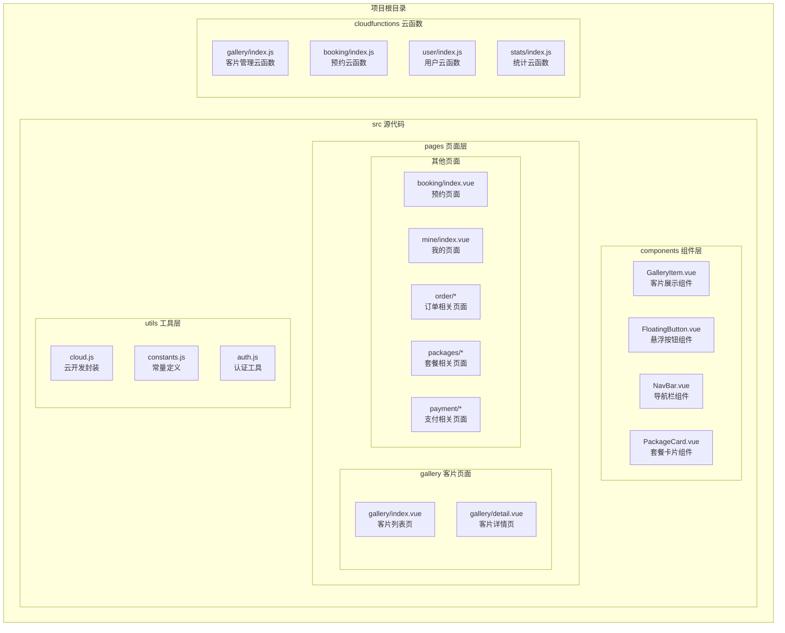
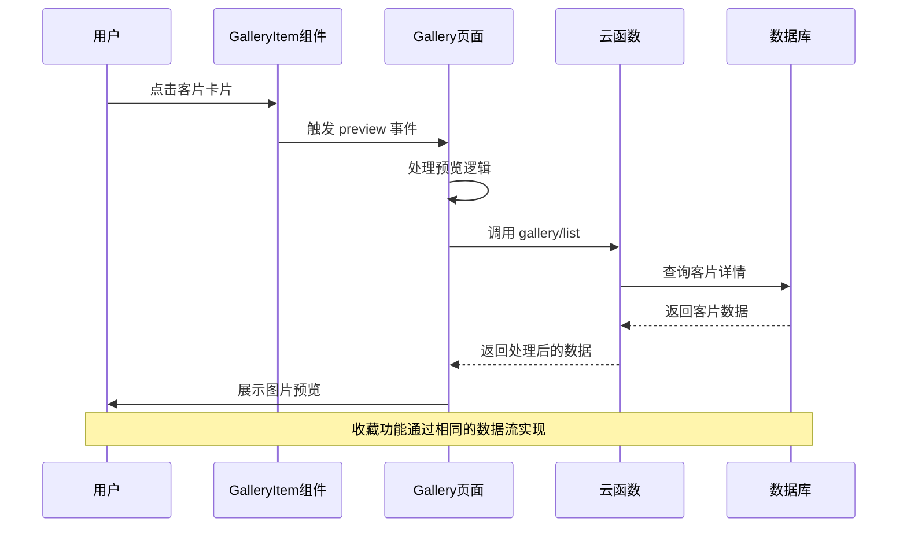
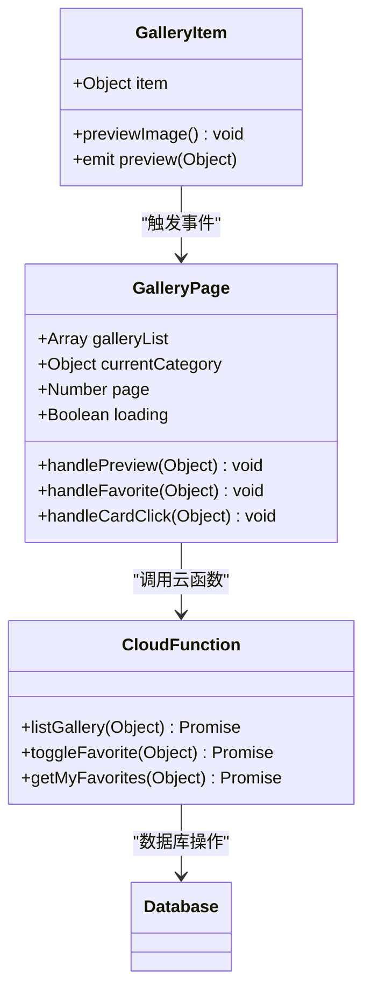
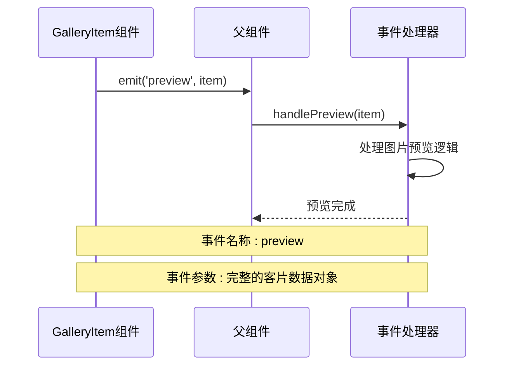
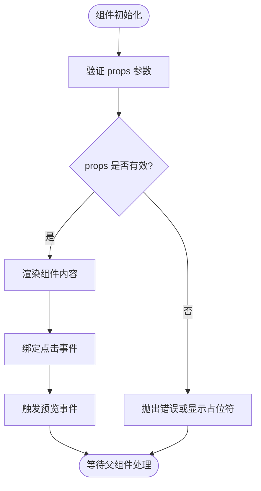
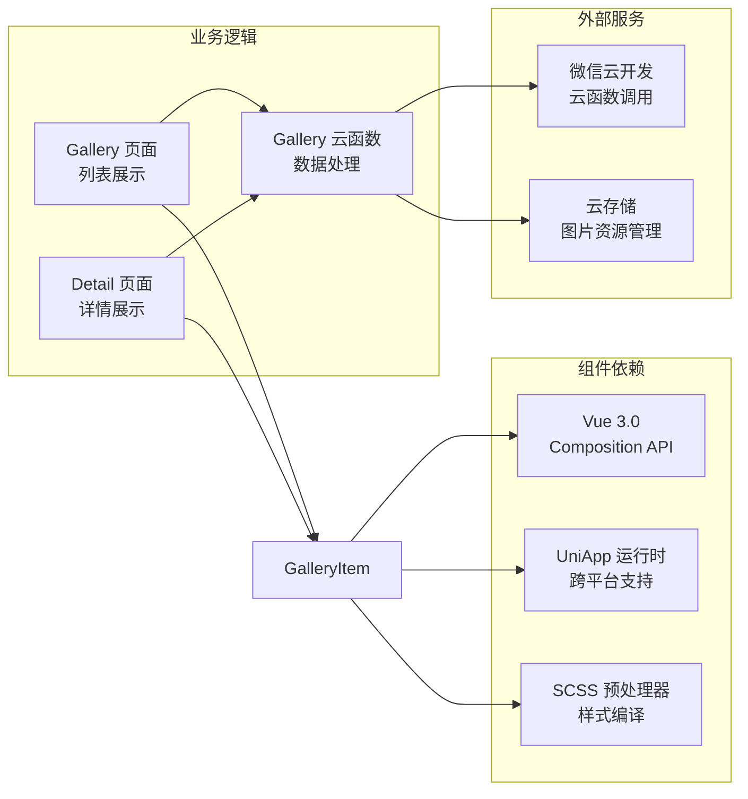
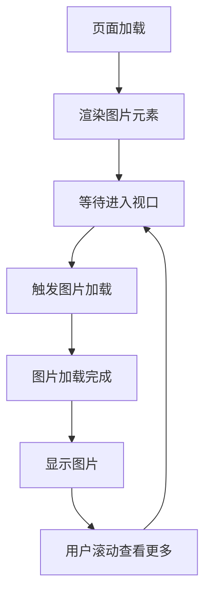

# 客片展示组件 (GalleryItem)

<cite>
**本文档引用的文件**
- [GalleryItem.vue](file://miniprogram/src/components/GalleryItem.vue)
- [gallery/index.vue](file://miniprogram/src/pages/gallery/index.vue)
- [gallery/detail.vue](file://miniprogram/src/pages/gallery/detail.vue)
- [gallery/index.js](file://miniprogram/cloudfunctions/gallery/index.js)
- [cloud.js](file://miniprogram/src/utils/cloud.js)
- [constants.js](file://miniprogram/src/utils/constants.js)
- [App.vue](file://miniprogram/src/App.vue)
- [main.js](file://miniprogram/src/main.js)
</cite>

## 目录
1. [简介](#简介)
2. [项目结构](#项目结构)
3. [核心组件](#核心组件)
4. [架构概览](#架构概览)
5. [详细组件分析](#详细组件分析)
6. [依赖关系分析](#依赖关系分析)
7. [性能考虑](#性能考虑)
8. [故障排除指南](#故障排除指南)
9. [结论](#结论)
10. [附录](#附录)

## 简介

GalleryItem 是一个专门用于展示客片缩略图的 Vue 3 组件，采用 Composition API 和单文件组件格式编写。该组件是整个客片展示系统的核心组成部分，提供了简洁而强大的图片展示功能，支持点击查看详情、收藏管理和响应式布局。

组件基于 UniApp 框架构建，兼容微信小程序、H5 和其他 UniApp 支持的平台。通过与云开发服务的深度集成，实现了完整的客片展示、收藏和管理功能。

## 项目结构

该项目采用基于功能模块的组织方式，GalleryItem 组件位于组件目录中，与页面组件形成清晰的层次结构：



**图表来源**
- [GalleryItem.vue:1-60](file://miniprogram/src/components/GalleryItem.vue#L1-L60)
- [gallery/index.vue:1-533](file://miniprogram/src/pages/gallery/index.vue#L1-L533)
- [gallery/detail.vue:1-450](file://miniprogram/src/pages/gallery/detail.vue#L1-L450)

**章节来源**
- [GalleryItem.vue:1-60](file://miniprogram/src/components/GalleryItem.vue#L1-L60)
- [gallery/index.vue:1-533](file://miniprogram/src/pages/gallery/index.vue#L1-L533)

## 核心组件

GalleryItem 组件是一个高度内聚的展示组件，专注于提供客片缩略图的视觉呈现和基本交互功能。组件的设计遵循单一职责原则，确保了良好的可维护性和可复用性。

### 主要特性

1. **简洁的图片展示**：提供优雅的图片缩略图显示界面
2. **标签系统**：支持多个标签的动态展示
3. **点击预览**：完整的图片预览功能
4. **响应式设计**：适配不同屏幕尺寸
5. **懒加载支持**：优化图片加载性能

### 数据结构要求

组件期望接收一个包含以下字段的对象：

| 字段名 | 类型 | 必需 | 描述 |
|--------|------|------|------|
| coverImage | String | 是 | 缩略图的图片地址 |
| title | String | 是 | 客片标题 |
| tags | Array<String> | 否 | 标签数组，默认为空数组 |

**章节来源**
- [GalleryItem.vue:14-16](file://miniprogram/src/components/GalleryItem.vue#L14-L16)

## 架构概览

GalleryItem 组件在整个应用架构中扮演着关键角色，它与页面组件、云函数和工具模块形成了完整的数据流：



**图表来源**
- [gallery/index.vue:206-216](file://miniprogram/src/pages/gallery/index.vue#L206-L216)
- [gallery/index.js:66-103](file://miniprogram/cloudfunctions/gallery/index.js#L66-L103)

## 详细组件分析

### 组件结构分析

GalleryItem 采用简洁的模板结构，专注于核心展示功能：



**图表来源**
- [GalleryItem.vue:13-23](file://miniprogram/src/components/GalleryItem.vue#L13-L23)
- [gallery/index.vue:100-283](file://miniprogram/src/pages/gallery/index.vue#L100-L283)
- [gallery/index.js:26-64](file://miniprogram/cloudfunctions/gallery/index.js#L26-L64)

### Props 参数详解

| 参数名 | 类型 | 必需 | 默认值 | 描述 |
|--------|------|------|--------|------|
| item | Object | 是 | - | 客片数据对象，包含封面图、标题、标签等信息 |

**章节来源**
- [GalleryItem.vue:14-16](file://miniprogram/src/components/GalleryItem.vue#L14-L16)

### 事件回调机制

组件通过事件系统与父组件进行通信，实现了松耦合的设计：



**图表来源**
- [GalleryItem.vue:18-22](file://miniprogram/src/components/GalleryItem.vue#L18-L22)
- [gallery/index.vue:206-216](file://miniprogram/src/pages/gallery/index.vue#L206-L216)

**章节来源**
- [GalleryItem.vue:18-22](file://miniprogram/src/components/GalleryItem.vue#L18-L22)

### 状态管理策略

组件采用外部状态管理模式，所有状态都由父组件管理：



**图表来源**
- [GalleryItem.vue:1-11](file://miniprogram/src/components/GalleryItem.vue#L1-L11)

**章节来源**
- [GalleryItem.vue:1-11](file://miniprogram/src/components/GalleryItem.vue#L1-L11)

### 样式系统设计

组件采用 scoped CSS 和语义化类名，确保样式隔离和可维护性：

| 样式类名 | 作用域 | 功能描述 |
|----------|--------|----------|
| gallery-item | 组件根元素 | 主容器，设置圆角、阴影等基础样式 |
| gallery-cover | 图片元素 | 设置图片宽度和自适应模式 |
| gallery-info | 信息容器 | 标题和标签的布局容器 |
| gallery-title | 标题文本 | 设置字体大小和颜色 |
| gallery-meta | 标签容器 | 使用 Flex 布局实现标签排列 |
| gallery-tag | 标签元素 | 设置标签样式和间距 |

**章节来源**
- [GalleryItem.vue:25-59](file://miniprogram/src/components/GalleryItem.vue#L25-L59)

## 依赖关系分析

GalleryItem 组件的依赖关系相对简单，主要依赖于 Vue 3 的 Composition API 和 UniApp 的运行时环境：



**图表来源**
- [GalleryItem.vue:1-60](file://miniprogram/src/components/GalleryItem.vue#L1-L60)
- [gallery/index.vue:100-105](file://miniprogram/src/pages/gallery/index.vue#L100-L105)
- [cloud.js:6-26](file://miniprogram/src/utils/cloud.js#L6-L26)

**章节来源**
- [GalleryItem.vue:1-60](file://miniprogram/src/components/GalleryItem.vue#L1-L60)
- [gallery/index.vue:100-105](file://miniprogram/src/pages/gallery/index.vue#L100-L105)

## 性能考虑

### 图片懒加载优化

组件利用 UniApp 的懒加载特性，通过 `lazy-load` 属性实现图片的延迟加载，减少初始页面加载时间：



**图表来源**
- [GalleryItem.vue:3-3](file://miniprogram/src/components/GalleryItem.vue#L3-L3)

### 内存管理策略

组件采用轻量级设计，避免不必要的内存占用：
- 无本地状态管理，完全依赖 props
- 事件处理函数在组件内部定义，避免重复创建
- 样式使用 scoped，防止全局污染

### 渲染性能优化

通过合理的 DOM 结构设计，组件具有良好的渲染性能：
- 最小化的 DOM 层级结构
- 使用 CSS Grid/Flex 布局，减少重排重绘
- 图片使用 `widthFix` 模式，保持宽高比

## 故障排除指南

### 常见问题及解决方案

#### 1. 图片不显示问题

**症状**：缩略图无法正常显示
**可能原因**：
- 图片 URL 无效或过期
- 网络连接问题
- 权限不足访问云存储资源

**解决步骤**：
1. 检查 `coverImage` 字段的有效性
2. 验证图片 URL 的可访问性
3. 确认云存储权限配置正确

#### 2. 点击事件无响应

**症状**：点击客片卡片无任何反应
**可能原因**：
- 事件监听器未正确绑定
- 父组件未正确处理 preview 事件
- 样式层叠导致触摸事件被拦截

**解决步骤**：
1. 检查组件模板中的 `@tap` 绑定
2. 验证父组件的事件处理函数
3. 检查 CSS 样式是否影响触摸事件

#### 3. 标签显示异常

**症状**：标签显示错位或样式异常
**可能原因**：
- 标签数组为空或格式不正确
- CSS Flex 布局冲突
- 标签内容包含特殊字符

**解决步骤**：
1. 验证 `tags` 数组的数据格式
2. 检查标签容器的 CSS 样式
3. 对标签内容进行必要的转义处理

**章节来源**
- [GalleryItem.vue:1-60](file://miniprogram/src/components/GalleryItem.vue#L1-L60)

## 结论

GalleryItem 组件是一个设计精良的展示组件，它成功地将复杂的功能需求简化为清晰、易用的接口。组件的核心优势包括：

1. **简洁性**：专注于单一职责，代码简洁易懂
2. **可复用性**：通过标准化的 props 接口，可在多个场景中使用
3. **性能优化**：合理利用懒加载和轻量级设计
4. **可维护性**：清晰的代码结构和完善的注释

该组件为整个客片展示系统奠定了坚实的基础，通过与其他组件和服务的良好协作，构建了一个完整、高效的客片管理系统。

## 附录

### API 参考文档

#### 组件属性 (Props)

| 属性名 | 类型 | 必需 | 默认值 | 描述 |
|--------|------|------|--------|------|
| item | Object | 是 | - | 客片数据对象，包含封面图、标题、标签等信息 |

#### 组件事件 (Events)

| 事件名 | 参数类型 | 描述 |
|--------|----------|------|
| preview | Object | 当用户点击客片时触发，传递完整的客片数据对象 |

#### 样式定制指南

**基础样式覆盖**：
- `.gallery-item`：主容器样式
- `.gallery-cover`：图片样式
- `.gallery-info`：信息容器样式
- `.gallery-title`：标题样式
- `.gallery-meta`：标签容器样式
- `.gallery-tag`：标签样式

**自定义建议**：
1. 通过修改 SCSS 变量来自定义主题色
2. 使用 `:deep()` 选择器覆盖子组件样式
3. 在父组件中添加额外的样式类进行局部定制

### 使用示例

#### 基础用法
```vue
<template>
  <view>
    <GalleryItem :item="galleryItem" @preview="handlePreview" />
  </view>
</template>
```

#### 批量渲染
```vue
<template>
  <view>
    <view v-for="item in galleryList" :key="item._id">
      <GalleryItem :item="item" @preview="handlePreview" />
    </view>
  </view>
</template>
```

### 扩展开发指南

#### 自定义功能扩展

1. **添加收藏状态指示**：可以在组件中添加收藏状态的视觉反馈
2. **图片质量控制**：根据设备性能动态调整图片质量
3. **加载状态显示**：添加图片加载进度指示器
4. **错误处理增强**：添加图片加载失败的降级方案

#### 性能优化建议

1. **图片压缩**：在云存储中自动压缩图片
2. **CDN 加速**：配置 CDN 提升图片加载速度
3. **缓存策略**：实现图片缓存机制
4. **预加载优化**：为即将显示的图片提前加载