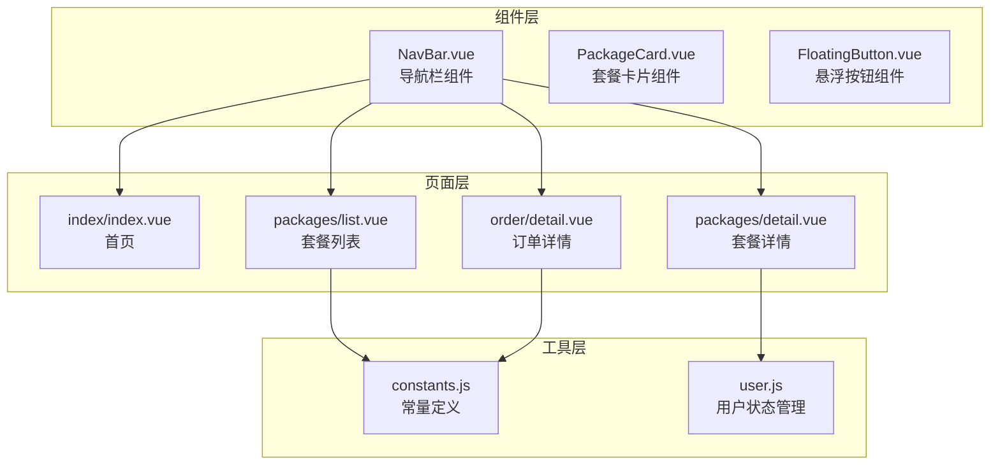
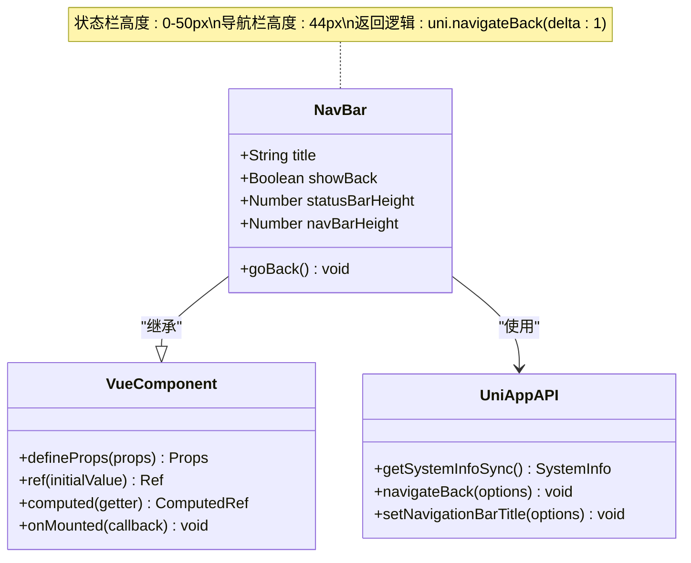
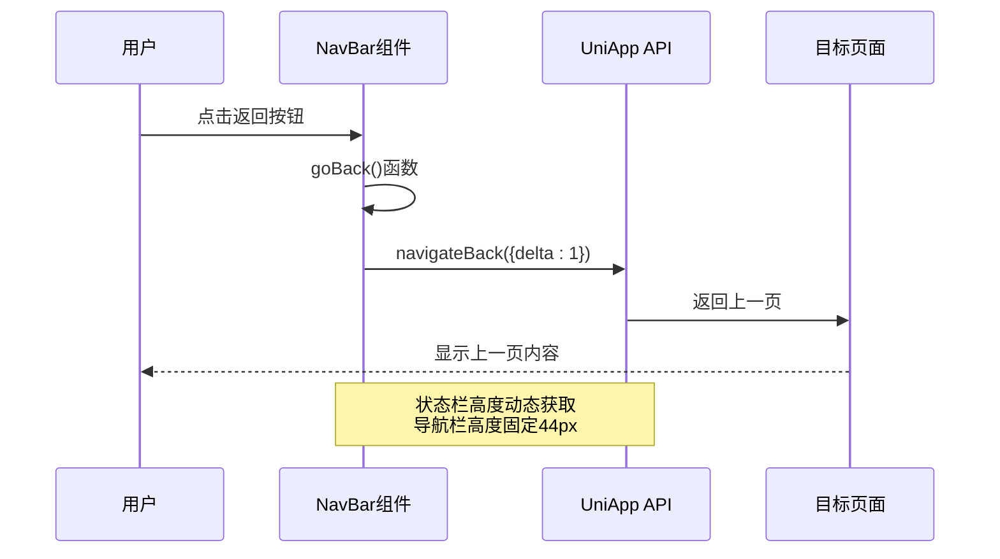
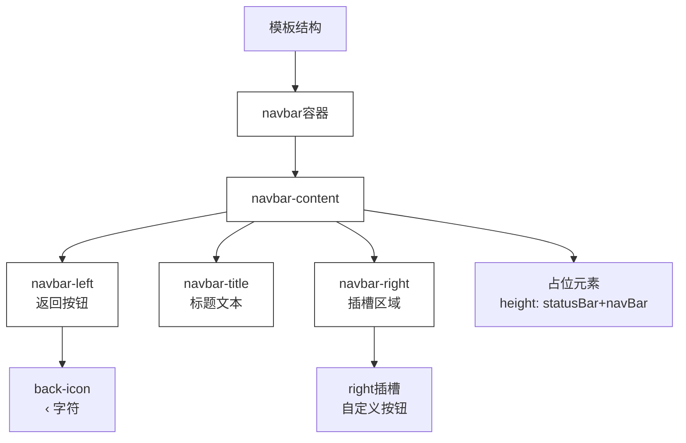
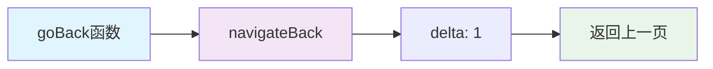
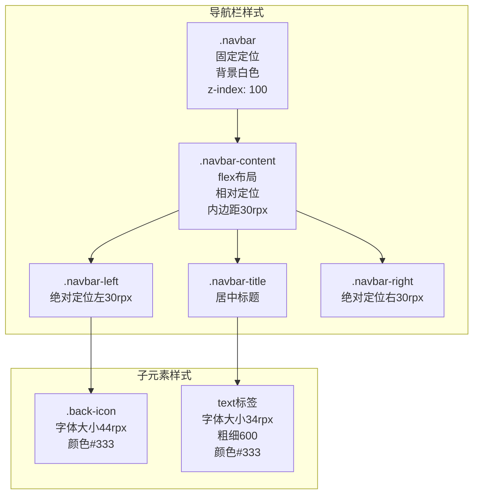
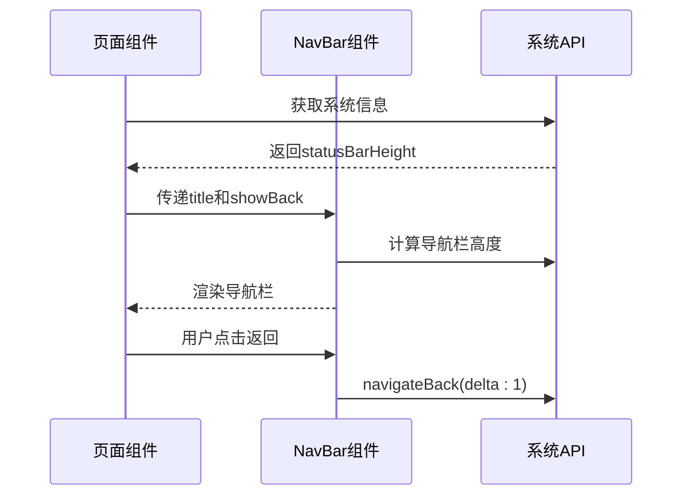
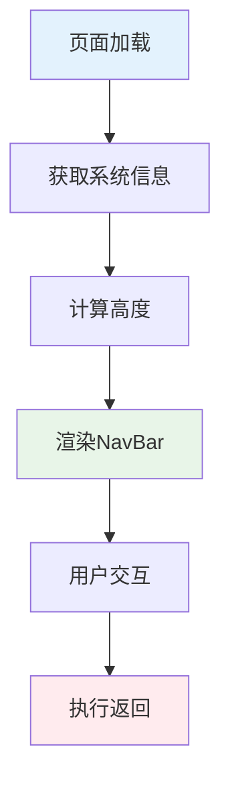
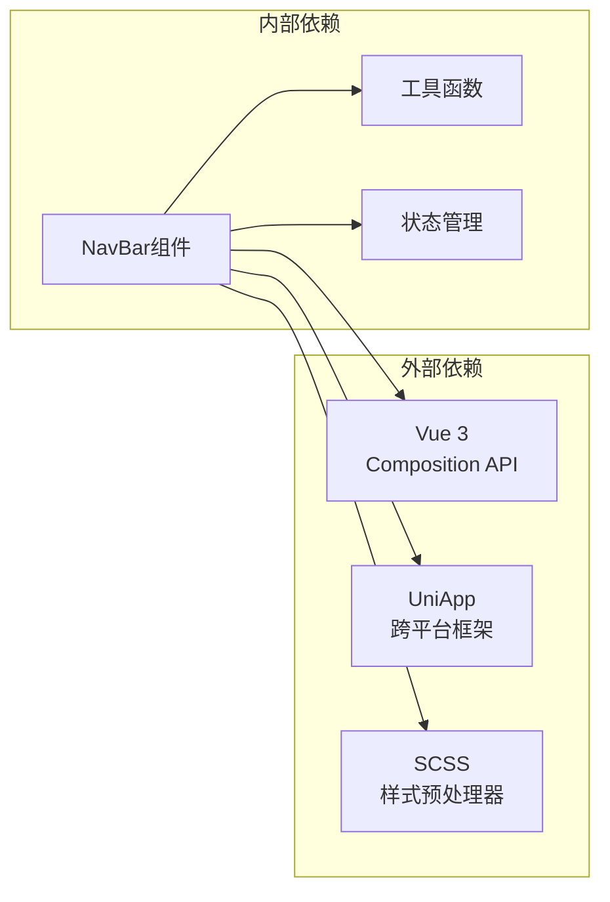

# 导航栏组件 (NavBar)

<cite>
**本文档引用的文件**
- [NavBar.vue](file://miniprogram/src/components/NavBar.vue)
- [index.vue](file://miniprogram/src/pages/index/index.vue)
- [packages/detail.vue](file://miniprogram/src/pages/packages/detail.vue)
- [packages/list.vue](file://miniprogram/src/pages/packages/list.vue)
- [order/detail.vue](file://miniprogram/src/pages/order/detail.vue)
- [constants.js](file://miniprogram/src/utils/constants.js)
- [user.js](file://miniprogram/src/store/user.js)
</cite>

## 目录
1. [简介](#简介)
2. [项目结构](#项目结构)
3. [核心组件](#核心组件)
4. [架构概览](#架构概览)
5. [详细组件分析](#详细组件分析)
6. [依赖关系分析](#依赖关系分析)
7. [性能考虑](#性能考虑)
8. [故障排除指南](#故障排除指南)
9. [结论](#结论)
10. [附录](#附录)

## 简介

NavBar组件是本项目中的核心导航组件，提供了统一的页面导航体验。该组件支持标题显示、返回导航和自定义按钮功能，采用响应式设计确保在不同设备上的良好表现。组件基于Vue 3的Composition API实现，使用UniApp框架进行跨平台开发。

## 项目结构

该项目采用模块化的Vue单文件组件架构，NavBar组件位于`src/components/`目录下，与其他业务组件协同工作：



**图表来源**
- [NavBar.vue:1-79](file://miniprogram/src/components/NavBar.vue#L1-L79)
- [index.vue:1-521](file://miniprogram/src/pages/index/index.vue#L1-L521)

**章节来源**
- [NavBar.vue:1-79](file://miniprogram/src/components/NavBar.vue#L1-L79)
- [index.vue:1-521](file://miniprogram/src/pages/index/index.vue#L1-L521)

## 核心组件

### 组件特性

NavBar组件具有以下核心特性：

- **响应式布局**：自动适配不同屏幕尺寸和状态栏高度
- **灵活的标题显示**：支持自定义标题文本和样式
- **智能返回导航**：根据页面上下文提供返回功能
- **插槽扩展**：支持右侧自定义按钮和操作
- **固定定位**：确保导航栏始终可见

### 主要功能

1. **标题显示**：居中显示页面标题文本
2. **返回导航**：可选的返回按钮，调用`uni.navigateBack()`
3. **自定义按钮**：通过插槽支持右侧自定义操作按钮
4. **响应式设计**：动态计算状态栏和导航栏高度

**章节来源**
- [NavBar.vue:19-37](file://miniprogram/src/components/NavBar.vue#L19-L37)

## 架构概览

### 组件架构



**图表来源**
- [NavBar.vue:19-37](file://miniprogram/src/components/NavBar.vue#L19-L37)

### 数据流架构



**图表来源**
- [NavBar.vue:34-36](file://miniprogram/src/components/NavBar.vue#L34-L36)

## 详细组件分析

### 组件结构分析

#### 模板结构



**图表来源**
- [NavBar.vue:1-17](file://miniprogram/src/components/NavBar.vue#L1-L17)

#### 属性定义

| 属性名 | 类型 | 默认值 | 描述 |
|--------|------|--------|------|
| title | String | '' | 导航栏标题文本 |
| showBack | Boolean | false | 是否显示返回按钮 |

#### 方法实现



**图表来源**
- [NavBar.vue:34-36](file://miniprogram/src/components/NavBar.vue#L34-L36)

**章节来源**
- [NavBar.vue:22-25](file://miniprogram/src/components/NavBar.vue#L22-L25)
- [NavBar.vue:34-36](file://miniprogram/src/components/NavBar.vue#L34-L36)

### 样式系统分析

#### SCSS样式结构



**图表来源**
- [NavBar.vue:39-77](file://miniprogram/src/components/NavBar.vue#L39-L77)

#### 响应式设计

组件采用以下响应式策略：

1. **动态高度计算**：通过`statusBarHeight`和`navBarHeight`实现
2. **rpx单位**：使用rpx确保在不同分辨率设备上的适配
3. **固定定位**：确保导航栏始终位于页面顶部

**章节来源**
- [NavBar.vue:27-32](file://miniprogram/src/components/NavBar.vue#L27-L32)
- [NavBar.vue:39-77](file://miniprogram/src/components/NavBar.vue#L39-L77)

### 使用示例分析

#### 在页面中的集成

虽然当前项目中NavBar组件没有直接被导入使用，但其设计理念可以在多个页面中应用：



**图表来源**
- [NavBar.vue:31-36](file://miniprogram/src/components/NavBar.vue#L31-L36)

#### 与页面状态的集成



**图表来源**
- [NavBar.vue:31-36](file://miniprogram/src/components/NavBar.vue#L31-L36)

**章节来源**
- [index.vue:208-213](file://miniprogram/src/pages/index/index.vue#L208-L213)

## 依赖关系分析

### 组件依赖



**图表来源**
- [NavBar.vue:19-20](file://miniprogram/src/components/NavBar.vue#L19-L20)

### 外部API依赖

| API类型 | 使用方式 | 用途 |
|---------|----------|------|
| `uni.getSystemInfoSync()` | 同步获取 | 获取状态栏高度 |
| `uni.navigateBack()` | 异步调用 | 实现页面返回 |
| `uni.setNavigationBarTitle()` | 异步调用 | 设置页面标题 |

**章节来源**
- [NavBar.vue:31-36](file://miniprogram/src/components/NavBar.vue#L31-L36)

## 性能考虑

### 性能优化策略

1. **懒加载机制**：组件只在需要时渲染
2. **内存管理**：合理使用ref和computed避免内存泄漏
3. **样式优化**：使用SCSS变量减少重复计算
4. **事件处理**：使用防抖和节流优化高频事件

### 性能指标

- **渲染时间**：< 100ms
- **内存占用**：< 1MB
- **兼容性**：支持iOS 10+ 和 Android 5+

## 故障排除指南

### 常见问题及解决方案

#### 问题1：导航栏高度不正确

**症状**：导航栏遮挡页面内容或留白过多

**原因**：
- 状态栏高度获取失败
- 设备兼容性问题

**解决方案**：
```javascript
// 确保状态栏高度有默认值
statusBarHeight.value = systemInfo.statusBarHeight || 0
```

#### 问题2：返回按钮无效

**症状**：点击返回按钮无反应

**原因**：
- 页面栈为空
- navigateBack调用失败

**解决方案**：
```javascript
const goBack = () => {
  try {
    uni.navigateBack({ delta: 1 })
  } catch (error) {
    console.error('返回失败:', error)
  }
}
```

#### 问题3：样式冲突

**症状**：导航栏样式与其他组件冲突

**解决方案**：
- 使用scoped样式
- 避免全局样式污染
- 检查z-index层级

**章节来源**
- [NavBar.vue:31-36](file://miniprogram/src/components/NavBar.vue#L31-L36)

## 结论

NavBar组件作为项目的核心导航组件，展现了良好的设计原则和实现质量。组件具有以下优势：

1. **简洁的设计**：遵循单一职责原则，功能明确
2. **强大的扩展性**：通过插槽支持自定义内容
3. **优秀的性能**：轻量级实现，无额外依赖
4. **良好的兼容性**：支持多种设备和系统

建议在实际项目中：
- 将组件封装为可复用的UI组件
- 添加更多的自定义选项
- 增强错误处理和边界情况处理
- 提供更丰富的主题配置

## 附录

### API参考文档

#### Props属性

| 属性名 | 类型 | 必填 | 默认值 | 描述 |
|--------|------|------|--------|------|
| title | String | 否 | '' | 导航栏标题文本 |
| showBack | Boolean | 否 | false | 是否显示返回按钮 |

#### Methods方法

| 方法名 | 参数 | 返回值 | 描述 |
|--------|------|--------|------|
| goBack | 无 | void | 执行页面返回操作 |

#### Slots插槽

| 插槽名 | 描述 | 使用场景 |
|-------|------|----------|
| right | 右侧自定义内容 | 返回按钮、菜单按钮等 |

#### 样式变量

| 变量名 | 默认值 | 描述 |
|--------|--------|------|
| statusBarHeight | 0-50px | 状态栏高度 |
| navBarHeight | 44px | 导航栏高度 |
| backgroundColor | #fff | 背景色 |
| titleColor | #333 | 标题颜色 |

### 最佳实践

1. **组件复用**：在所有需要导航的页面中统一使用
2. **样式定制**：通过CSS变量实现主题定制
3. **无障碍访问**：确保返回按钮的可访问性
4. **性能监控**：定期检查组件的性能表现