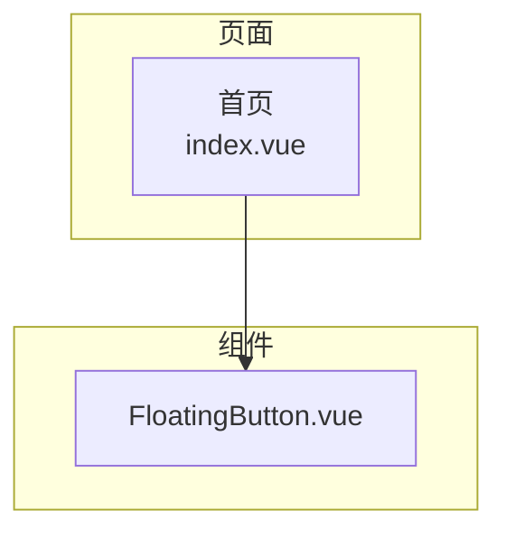
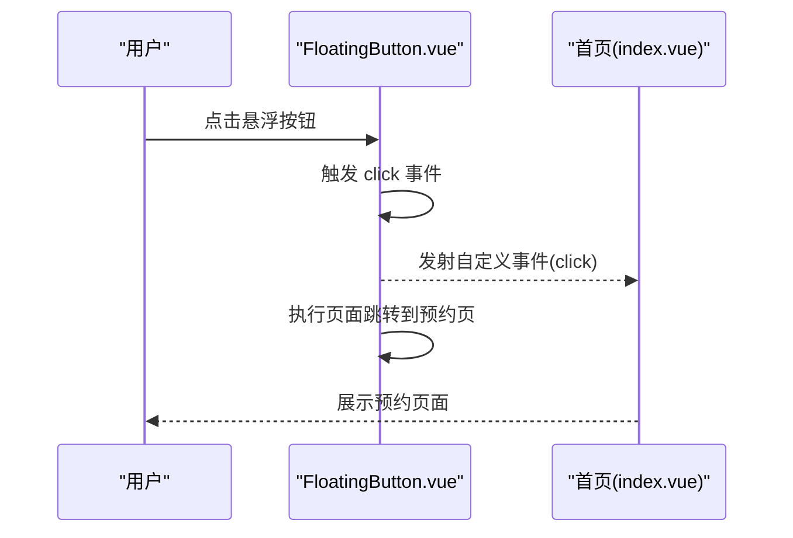
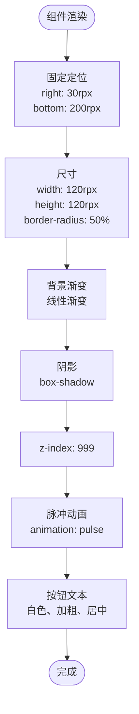
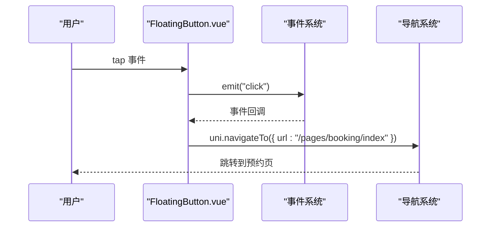
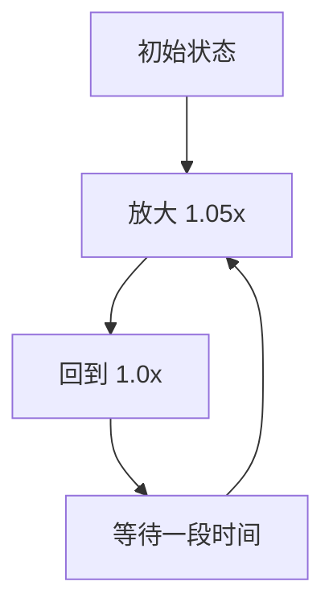
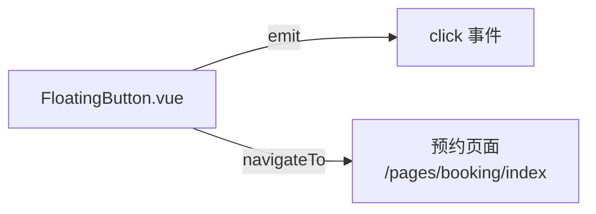

# 悬浮按钮组件 (FloatingButton)

<cite>
**本文引用的文件**
- [FloatingButton.vue](file://miniprogram/src/components/FloatingButton.vue)
- [index.vue](file://miniprogram/src/pages/index/index.vue)
- [index.vue](file://miniprogram/src/pages/gallery/index.vue)
- [index.vue](file://miniprogram/src/pages/mine/index.vue)
- [index.vue](file://miniprogram/src/pages/packages/list.vue)
- [index.vue](file://miniprogram/src/pages/booking/index.vue)
- [constants.js](file://miniprogram/src/utils/constants.js)
- [App.vue](file://miniprogram/src/App.vue)
</cite>

## 目录
1. [简介](#简介)
2. [项目结构](#项目结构)
3. [核心组件](#核心组件)
4. [架构总览](#架构总览)
5. [详细组件分析](#详细组件分析)
6. [依赖关系分析](#依赖关系分析)
7. [性能考虑](#性能考虑)
8. [故障排查指南](#故障排查指南)
9. [结论](#结论)
10. [附录](#附录)

## 简介
本文件为“悬浮按钮组件（FloatingButton）”的完整技术文档，面向开发者与产品设计人员，覆盖组件的设计理念、实现细节、API规范、样式定制、交互行为以及最佳实践。该组件在首页中用于快速跳转至“预约拍摄”页面，具备固定定位、脉冲动画、点击反馈等特性，并通过事件发射实现与父组件的解耦协作。

## 项目结构
FloatingButton 组件位于组件目录下，被首页页面直接引入并渲染。其样式采用 SCSS 并使用 rpx 响应式单位，确保在不同设备上保持一致的视觉比例。

图表来源
- [index.vue:107-109](file://miniprogram/src/pages/index/index.vue#L107-L109)
- [FloatingButton.vue:1-48](file://miniprogram/src/components/FloatingButton.vue#L1-L48)

章节来源
- [index.vue:107-109](file://miniprogram/src/pages/index/index.vue#L107-L109)
- [FloatingButton.vue:1-48](file://miniprogram/src/components/FloatingButton.vue#L1-L48)

## 核心组件
FloatingButton 是一个轻量级的 Vue 组件，提供以下能力：
- 固定定位的圆形悬浮按钮
- 内置脉冲动画，增强视觉引导
- 点击事件发射与页面跳转联动
- 可扩展的样式与主题定制

组件当前的默认行为：
- 点击后会触发自定义事件“click”，同时调用页面跳转至“预约拍摄”页面
- 按钮尺寸为 120rpx × 120rpx，圆角 50%，使用线性渐变背景
- z-index 设为 999，确保在大多数页面层级之上显示
- 文本颜色为白色，字号 24rpx，加粗

章节来源
- [FloatingButton.vue:1-48](file://miniprogram/src/components/FloatingButton.vue#L1-L48)

## 架构总览
FloatingButton 在页面中的职责是提供“一键预约”的入口，通过事件与页面逻辑解耦，便于复用与扩展。

图表来源
- [FloatingButton.vue:8-15](file://miniprogram/src/components/FloatingButton.vue#L8-L15)
- [index.vue:107-109](file://miniprogram/src/pages/index/index.vue#L107-L109)

章节来源
- [FloatingButton.vue:8-15](file://miniprogram/src/components/FloatingButton.vue#L8-L15)
- [index.vue:107-109](file://miniprogram/src/pages/index/index.vue#L107-L109)

## 详细组件分析

### 组件结构与样式
- 结构：根节点为容器视图，内部包含一个文本元素承载按钮文案
- 样式：使用 SCSS，采用固定定位、圆角、阴影、线性渐变背景、脉冲动画等
- 响应式：rpx 单位适配移动端屏幕密度

图表来源
- [FloatingButton.vue:18-46](file://miniprogram/src/components/FloatingButton.vue#L18-L46)

章节来源
- [FloatingButton.vue:18-46](file://miniprogram/src/components/FloatingButton.vue#L18-L46)

### 交互与事件
- 点击事件：绑定在根容器上，触发自定义事件“click”
- 页面跳转：在事件处理中执行页面跳转，目标路径为“预约拍摄”页面
- 事件传播：使用点击事件冒泡，父组件可监听“click”事件进行额外处理

图表来源
- [FloatingButton.vue:10-15](file://miniprogram/src/components/FloatingButton.vue#L10-L15)

章节来源
- [FloatingButton.vue:10-15](file://miniprogram/src/components/FloatingButton.vue#L10-L15)

### 动画与视觉反馈
- 脉冲动画：通过关键帧缩放实现轻微的呼吸感，提升按钮的可发现性
- 触摸反馈：组件本身未内置按压态样式，建议在父组件或外部样式中添加激活态效果

图表来源
- [FloatingButton.vue:42-46](file://miniprogram/src/components/FloatingButton.vue#L42-L46)

章节来源
- [FloatingButton.vue:42-46](file://miniprogram/src/components/FloatingButton.vue#L42-L46)

### API 文档
- 组件名称：FloatingButton
- 组件类型：Vue 单文件组件（Composition API）
- 事件
  - 事件名：click
  - 触发时机：用户点击按钮
  - 参数：无
  - 用途：父组件可监听此事件执行自定义逻辑（如埋点、二次确认等）

- 插槽：无
- Props：无
- 外部样式类：无
- 全局样式：组件内联 SCSS，不对外暴露类名

章节来源
- [FloatingButton.vue:8-15](file://miniprogram/src/components/FloatingButton.vue#L8-L15)

### 样式定制与主题
- 颜色主题：可通过修改背景渐变值调整主色调
- 尺寸规格：可调整宽度、高度与圆角半径
- 位置定位：可调整 right 与 bottom 值以适配不同页面布局
- 动画效果：可替换或禁用脉冲动画
- 文本样式：可调整字号、字重与颜色

章节来源
- [FloatingButton.vue:18-46](file://miniprogram/src/components/FloatingButton.vue#L18-L46)

### 响应式定位与 z-index 管理
- 固定定位：使用 fixed 定位，确保在滚动时仍保持在可视区域内
- 位置偏移：通过 right 与 bottom 控制水平与垂直位置
- 层级控制：z-index 为 999，避免被页面其他元素遮挡
- 适配建议：在不同页面或横竖屏场景下，可根据需要微调位置参数

章节来源
- [FloatingButton.vue:20-31](file://miniprogram/src/components/FloatingButton.vue#L20-L31)

### 实际使用场景与集成示例
- 场景一：首页“一键预约”
  - 在首页模板中直接引入组件并渲染
  - 父组件可监听“click”事件进行埋点或二次确认
- 场景二：其他页面复用
  - 可在多个页面中引入同一组件，统一交互体验
  - 如需差异化行为，可在父组件中通过事件进行差异化处理

章节来源
- [index.vue:107-109](file://miniprogram/src/pages/index/index.vue#L107-L109)

### 最佳实践
- 事件解耦：通过自定义事件与页面跳转分离，便于扩展
- 样式隔离：组件内联样式，避免全局污染；如需主题化，建议通过外部容器或变量注入
- 性能优化：动画使用 transform，避免触发布局与重绘
- 可访问性：为按钮提供明确的语义与可读文案，必要时补充 aria-label
- 一致性：在多页面中保持按钮尺寸、位置与动效的一致性

## 依赖关系分析
FloatingButton 为纯视图组件，不依赖外部第三方库，仅使用 uni-app 的导航 API 进行页面跳转。

图表来源
- [FloatingButton.vue:8-15](file://miniprogram/src/components/FloatingButton.vue#L8-L15)
- [index.vue:107-109](file://miniprogram/src/pages/index/index.vue#L107-L109)

章节来源
- [FloatingButton.vue:8-15](file://miniprogram/src/components/FloatingButton.vue#L8-L15)
- [index.vue:107-109](file://miniprogram/src/pages/index/index.vue#L107-L109)

## 性能考虑
- 动画性能：使用 transform 缩放，避免触发布局与重排
- 渲染成本：组件结构简单，无复杂计算属性，渲染开销低
- 样式体积：内联 SCSS，避免额外资源请求
- 事件处理：仅绑定一次 tap 事件，避免重复绑定导致的内存泄漏

## 故障排查指南
- 点击无效
  - 检查父组件是否正确引入并渲染组件
  - 确认事件监听是否正确绑定
- 跳转异常
  - 检查目标页面路径是否正确
  - 确认页面路由配置是否存在
- 样式冲突
  - 检查父容器是否对组件设置了影响定位或层级的样式
  - 确认 z-index 是否被更高层级元素覆盖
- 动画问题
  - 检查浏览器/小程序运行环境对关键帧动画的支持
  - 确认动画时长与频率设置合理

章节来源
- [FloatingButton.vue:10-15](file://miniprogram/src/components/FloatingButton.vue#L10-L15)
- [index.vue:107-109](file://miniprogram/src/pages/index/index.vue#L107-L109)

## 结论
FloatingButton 组件以简洁的结构与明确的职责实现了“一键预约”的核心交互，通过事件解耦与内联样式保证了良好的可维护性与可扩展性。建议在后续迭代中增加 props 支持（如文案、图标、颜色、尺寸、跳转路径等），以满足更多业务场景的定制需求。

## 附录
- 相关常量与页面路径参考
  - 预约页面路径：/pages/booking/index
  - 页面跳转 API：uni.navigateTo
  - 页面生命周期钩子：onLoad、onMounted（用于页面初始化与数据加载）

章节来源
- [constants.js:59-69](file://miniprogram/src/utils/constants.js#L59-L69)
- [index.vue:206-213](file://miniprogram/src/pages/index/index.vue#L206-L213)
- [index.vue:473-493](file://miniprogram/src/pages/booking/index.vue#L473-L493)