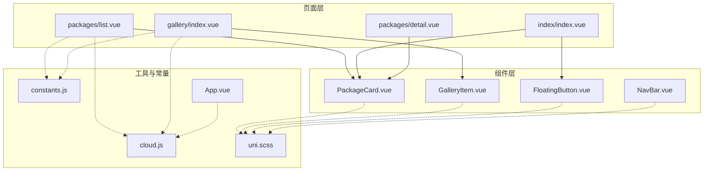
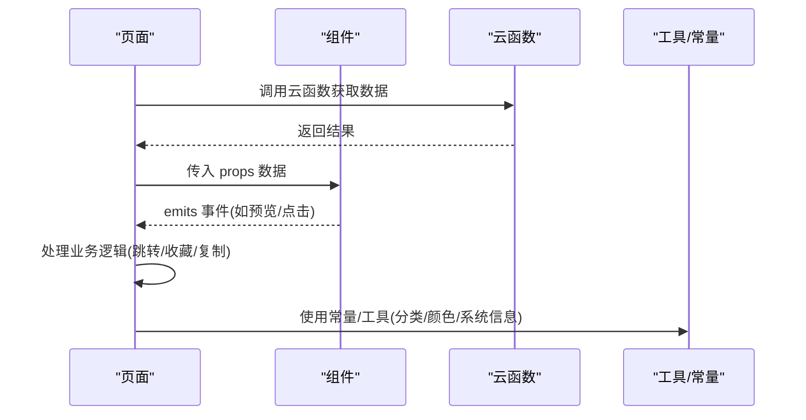
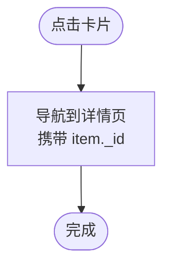
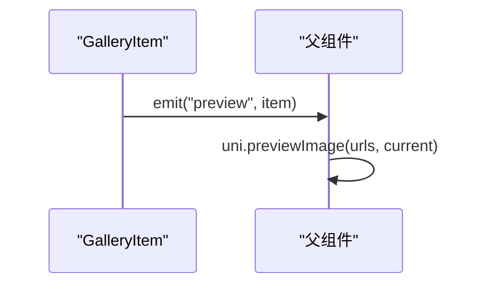
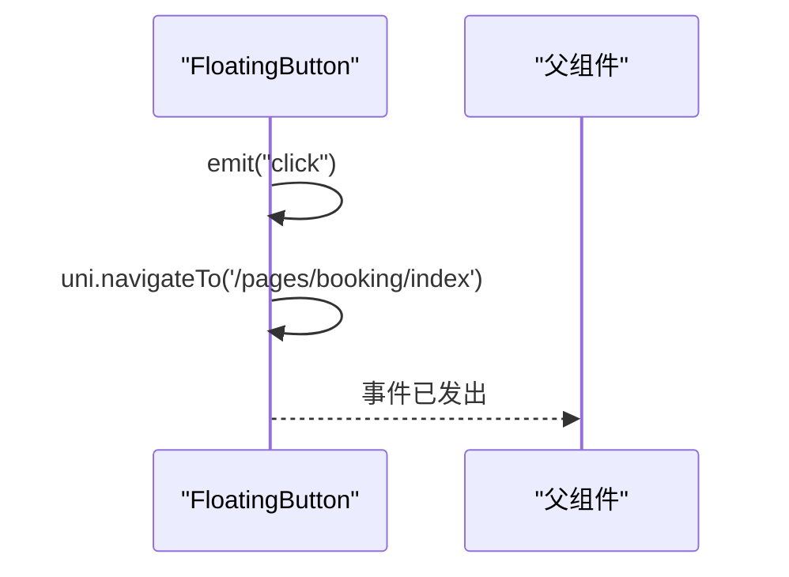
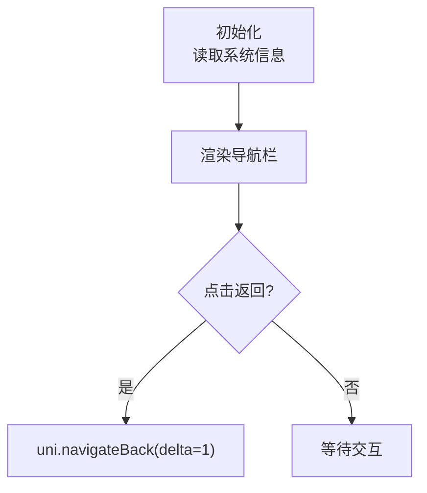
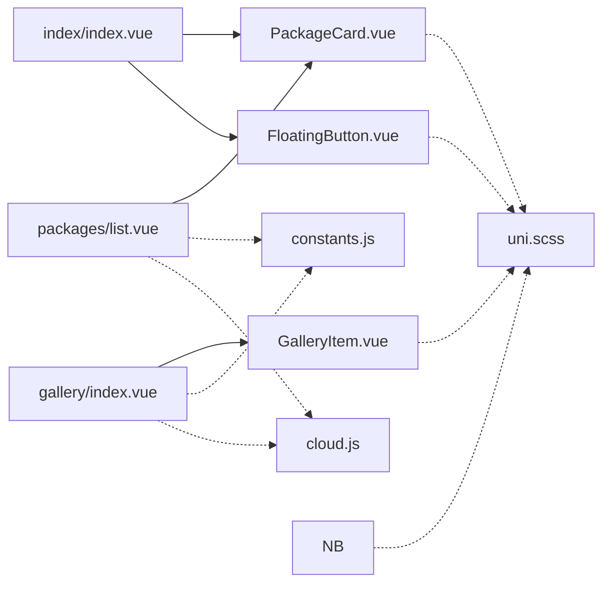

# 组件库

<cite>
**本文引用的文件**
- [PackageCard.vue](file://miniprogram/src/components/PackageCard.vue)
- [GalleryItem.vue](file://miniprogram/src/components/GalleryItem.vue)
- [FloatingButton.vue](file://miniprogram/src/components/FloatingButton.vue)
- [NavBar.vue](file://miniprogram/src/components/NavBar.vue)
- [list.vue](file://miniprogram/src/pages/packages/list.vue)
- [index.vue](file://miniprogram/src/pages/index/index.vue)
- [detail.vue](file://miniprogram/src/pages/packages/detail.vue)
- [index.vue](file://miniprogram/src/pages/gallery/index.vue)
- [App.vue](file://miniprogram/src/App.vue)
- [constants.js](file://miniprogram/src/utils/constants.js)
- [cloud.js](file://miniprogram/src/utils/cloud.js)
- [uni.scss](file://miniprogram/src/uni.scss)
</cite>

## 目录
1. [简介](#简介)
2. [项目结构](#项目结构)
3. [核心组件](#核心组件)
4. [架构总览](#架构总览)
5. [组件详解](#组件详解)
6. [依赖关系分析](#依赖关系分析)
7. [性能与优化](#性能与优化)
8. [故障排查](#故障排查)
9. [结论](#结论)
10. [附录：API与最佳实践](#附录api与最佳实践)

## 简介
本组件库面向 lvpai 小程序应用，提供可复用的 UI 组件，包括套餐卡片 PackageCard、客片卡片 GalleryItem、悬浮预约按钮 FloatingButton、自定义导航栏 NavBar。本文档从设计原则、属性配置、事件处理、样式定制、响应式与跨平台兼容性、性能优化、扩展开发与主题定制等方面，系统阐述各组件的能力边界与使用方法，并给出在首页、套餐列表、客片瀑布流等页面中的实际应用示例与最佳实践。

## 项目结构
组件集中于 src/components 目录，页面位于 src/pages 与 src/pages-admin，工具与常量位于 src/utils，全局样式在 uni.scss 中统一定义品牌色、字号、间距与圆角等变量。

图表来源
- [PackageCard.vue:1-100](file://miniprogram/src/components/PackageCard.vue#L1-L100)
- [GalleryItem.vue:1-60](file://miniprogram/src/components/GalleryItem.vue#L1-L60)
- [FloatingButton.vue:1-48](file://miniprogram/src/components/FloatingButton.vue#L1-L48)
- [NavBar.vue:1-79](file://miniprogram/src/components/NavBar.vue#L1-L79)
- [list.vue:1-305](file://miniprogram/src/pages/packages/list.vue#L1-L305)
- [index.vue:1-521](file://miniprogram/src/pages/index/index.vue#L1-L521)
- [detail.vue:1-598](file://miniprogram/src/pages/packages/detail.vue#L1-L598)
- [index.vue:1-533](file://miniprogram/src/pages/gallery/index.vue#L1-L533)
- [constants.js:1-73](file://miniprogram/src/utils/constants.js#L1-L73)
- [cloud.js:1-66](file://miniprogram/src/utils/cloud.js#L1-L66)
- [App.vue:1-26](file://miniprogram/src/App.vue#L1-L26)
- [uni.scss:1-43](file://miniprogram/src/uni.scss#L1-L43)

章节来源
- [list.vue:1-305](file://miniprogram/src/pages/packages/list.vue#L1-L305)
- [index.vue:1-521](file://miniprogram/src/pages/index/index.vue#L1-L521)
- [index.vue:1-533](file://miniprogram/src/pages/gallery/index.vue#L1-L533)
- [detail.vue:1-598](file://miniprogram/src/pages/packages/detail.vue#L1-L598)
- [constants.js:1-73](file://miniprogram/src/utils/constants.js#L1-L73)
- [cloud.js:1-66](file://miniprogram/src/utils/cloud.js#L1-L66)
- [uni.scss:1-43](file://miniprogram/src/uni.scss#L1-L43)

## 核心组件
- PackageCard：展示套餐封面、标题、描述、价格与标签，支持点击跳转详情。
- GalleryItem：展示客片封面、标题与标签集合，支持预览事件。
- FloatingButton：悬浮预约按钮，点击触发预约并播放脉冲动画。
- NavBar：自定义导航栏，支持返回按钮与右侧插槽，自动适配状态栏高度。

章节来源
- [PackageCard.vue:1-100](file://miniprogram/src/components/PackageCard.vue#L1-L100)
- [GalleryItem.vue:1-60](file://miniprogram/src/components/GalleryItem.vue#L1-L60)
- [FloatingButton.vue:1-48](file://miniprogram/src/components/FloatingButton.vue#L1-L48)
- [NavBar.vue:1-79](file://miniprogram/src/components/NavBar.vue#L1-L79)

## 架构总览
组件通过 props 接收数据，通过 emits 向父组件传递事件；页面通过云函数调用获取数据并驱动组件渲染；全局样式通过 uni.scss 提供一致的品牌色与排版体系。

图表来源
- [list.vue:94-125](file://miniprogram/src/pages/packages/list.vue#L94-L125)
- [index.vue:150-178](file://miniprogram/src/pages/index/index.vue#L150-L178)
- [index.vue:144-189](file://miniprogram/src/pages/gallery/index.vue#L144-L189)
- [constants.js:1-73](file://miniprogram/src/utils/constants.js#L1-L73)
- [cloud.js:1-66](file://miniprogram/src/utils/cloud.js#L1-L66)

## 组件详解

### PackageCard 组件
- 设计目标：以卡片形式呈现套餐信息，突出封面、价格与标签，提升点击转化。
- 关键属性
  - item: 对象，必需。包含封面图、标题、描述、价格、标签、唯一标识等字段。
- 事件
  - 无显式事件发出；点击卡片内部触发导航至详情页。
- 行为
  - 点击卡片触发 uni.navigateTo 跳转到套餐详情页，携带 item._id。
- 样式与交互
  - 使用圆角、阴影与渐变背景营造卡片质感；价格采用分段字体大小与品牌色强调。
  - 描述文本支持省略号截断，避免布局溢出。
- 最佳实践
  - 在父组件中确保 item 字段完整，缺失时提供默认值或骨架屏占位。
  - 在列表中使用 v-for 渲染时，务必绑定唯一 key（建议使用 item._id）。
  - 为封面图设置懒加载与合适的尺寸模式，减少首屏阻塞。

图表来源
- [PackageCard.vue:26-30](file://miniprogram/src/components/PackageCard.vue#L26-L30)
- [list.vue:40-46](file://miniprogram/src/pages/packages/list.vue#L40-L46)
- [index.vue:48-54](file://miniprogram/src/pages/index/index.vue#L48-L54)

章节来源
- [PackageCard.vue:1-100](file://miniprogram/src/components/PackageCard.vue#L1-L100)
- [list.vue:40-46](file://miniprogram/src/pages/packages/list.vue#L40-L46)
- [index.vue:48-54](file://miniprogram/src/pages/index/index.vue#L48-L54)

### GalleryItem 组件
- 设计目标：在瀑布流中展示客片缩略图与标签，支持点击预览。
- 关键属性
  - item: 对象，必需。包含封面图、标题、标签数组等。
- 事件
  - preview: 自定义事件，向父组件传递当前项，便于父组件执行 uni.previewImage。
- 行为
  - 点击卡片触发 preview 事件，父组件负责预览图片序列。
- 样式与交互
  - 标签使用弹性布局与间距，支持多标签展示；卡片圆角与阴影增强层级感。
- 最佳实践
  - 父组件应处理图片预览的 urls 与 current 参数，保证首张图正确高亮。
  - 若 item 不包含图片，应在父组件兜底为单图或占位图。

图表来源
- [GalleryItem.vue:18-22](file://miniprogram/src/components/GalleryItem.vue#L18-L22)
- [index.vue:206-216](file://miniprogram/src/pages/gallery/index.vue#L206-L216)

章节来源
- [GalleryItem.vue:1-60](file://miniprogram/src/components/GalleryItem.vue#L1-L60)
- [index.vue:206-216](file://miniprogram/src/pages/gallery/index.vue#L206-L216)

### FloatingButton 组件
- 设计目标：在首页提供一键预约入口，使用脉冲动画吸引注意。
- 关键属性
  - 无 props。
- 事件
  - click: 点击后发出，父组件可监听进行额外处理。
- 行为
  - 点击后先发出 click 事件，再跳转到预约页。
- 样式与交互
  - 固定定位、圆形、线性渐变背景、阴影与脉冲动画，符合移动端交互习惯。
- 最佳实践
  - 父组件可监听 click 事件进行埋点或业务校验。
  - 注意在不同页面的可视区域与安全区适配，避免遮挡内容。

图表来源
- [FloatingButton.vue:8-15](file://miniprogram/src/components/FloatingButton.vue#L8-L15)
- [index.vue:107-109](file://miniprogram/src/pages/index/index.vue#L107-L109)

章节来源
- [FloatingButton.vue:1-48](file://miniprogram/src/components/FloatingButton.vue#L1-L48)
- [index.vue:107-109](file://miniprogram/src/pages/index/index.vue#L107-L109)

### NavBar 组件
- 设计目标：统一页面导航体验，自动适配状态栏高度，支持返回与右侧插槽。
- 关键属性
  - title: 字符串，默认空；导航栏标题。
  - showBack: 布尔，默认 false；是否显示返回按钮。
- 事件
  - 无显式事件发出。
- 行为
  - 点击返回按钮调用 uni.navigateBack，delta=1。
  - 自动读取系统信息获取 statusBarHeight 并动态设置样式。
- 样式与交互
  - 固定定位、顶部占位元素避免内容被导航栏遮挡；右侧插槽支持灵活扩展。
- 最佳实践
  - 在需要返回的页面开启 showBack；在首页等无需返回的页面保持默认。
  - 使用插槽在右侧放置搜索、菜单等操作。

图表来源
- [NavBar.vue:27-36](file://miniprogram/src/components/NavBar.vue#L27-L36)
- [NavBar.vue:19-25](file://miniprogram/src/components/NavBar.vue#L19-L25)

章节来源
- [NavBar.vue:1-79](file://miniprogram/src/components/NavBar.vue#L1-L79)

## 依赖关系分析
- 页面对组件的依赖
  - 套餐列表页依赖 PackageCard 展示套餐卡片。
  - 首页依赖 PackageCard 与 FloatingButton 实现“热门套餐”横向滚动与悬浮预约。
  - 客片页依赖 GalleryItem 实现瀑布流卡片与预览。
- 组件对工具与常量的依赖
  - 页面通过 constants.js 提供分类与文案映射，通过 cloud.js 调用云函数。
  - 组件本身不直接依赖工具，但页面在渲染时会使用工具与常量。
- 全局样式依赖
  - 组件与页面均使用 uni.scss 中的品牌色、字号、间距与圆角变量，确保视觉一致性。

图表来源
- [list.vue](file://miniprogram/src/pages/packages/list.vue#L61)
- [index.vue:114-115](file://miniprogram/src/pages/index/index.vue#L114-L115)
- [index.vue](file://miniprogram/src/pages/gallery/index.vue#L103)
- [constants.js:1-73](file://miniprogram/src/utils/constants.js#L1-L73)
- [cloud.js:1-66](file://miniprogram/src/utils/cloud.js#L1-L66)
- [uni.scss:1-43](file://miniprogram/src/uni.scss#L1-L43)

章节来源
- [list.vue:1-305](file://miniprogram/src/pages/packages/list.vue#L1-L305)
- [index.vue:1-521](file://miniprogram/src/pages/index/index.vue#L1-L521)
- [index.vue:1-533](file://miniprogram/src/pages/gallery/index.vue#L1-L533)
- [constants.js:1-73](file://miniprogram/src/utils/constants.js#L1-L73)
- [cloud.js:1-66](file://miniprogram/src/utils/cloud.js#L1-L66)
- [uni.scss:1-43](file://miniprogram/src/uni.scss#L1-L43)

## 性能与优化
- 图片懒加载与尺寸控制
  - 套餐封面与客片缩略图均使用懒加载与合适的裁剪模式，减少首屏渲染压力。
- 列表渲染优化
  - 使用 v-for 渲染时绑定唯一 key，避免不必要的 DOM 重建。
- 动画与交互
  - 浮动按钮使用轻量级脉冲动画，避免复杂过渡影响性能。
- 瀑布流与分页
  - 客片页采用双列瀑布流与触底加载，结合下拉刷新，提升浏览效率。
- 云函数调用
  - 页面通过封装的 callFunction 统一处理云函数调用与错误提示，避免重复代码。

章节来源
- [PackageCard.vue](file://miniprogram/src/components/PackageCard.vue#L3)
- [GalleryItem.vue](file://miniprogram/src/components/GalleryItem.vue#L3)
- [index.vue:116-123](file://miniprogram/src/pages/gallery/index.vue#L116-L123)
- [index.vue:94-125](file://miniprogram/src/pages/packages/list.vue#L94-L125)
- [cloud.js:1-66](file://miniprogram/src/utils/cloud.js#L1-L66)

## 故障排查
- 云函数调用失败
  - 现象：页面提示“获取失败/网络错误，请重试”。
  - 排查：检查云函数返回码与 message 字段；确认 wx.cloud 是否初始化成功。
- 图片加载异常
  - 现象：封面或缩略图空白。
  - 排查：确认 item.coverImage 或 images 字段有效；必要时提供默认占位图。
- 预览失败
  - 现象：点击预览无反应或报错。
  - 排查：确认 urls 与 current 参数正确；检查图片地址有效性。
- 导航栏遮挡
  - 现象：内容被导航栏覆盖。
  - 排查：确认页面使用了占位元素与正确的 paddingTop/height 计算。

章节来源
- [list.vue:116-125](file://miniprogram/src/pages/packages/list.vue#L116-L125)
- [index.vue:206-216](file://miniprogram/src/pages/gallery/index.vue#L206-L216)
- [App.vue:4-13](file://miniprogram/src/App.vue#L4-L13)

## 结论
lvpai 组件库围绕核心业务场景构建，组件职责清晰、接口简洁、样式统一。通过全局样式变量与页面级工具函数，实现了良好的可维护性与一致性。建议在后续迭代中：
- 为组件增加更完善的类型约束与默认值校验；
- 在关键页面引入骨架屏与错误边界，提升用户体验；
- 对动画与交互进行更细粒度的性能监控与优化。

## 附录：API与最佳实践

### PackageCard API
- 属性
  - item: 对象，必需。字段建议包含：_id、coverImage、name、description、price、tag。
- 事件
  - 无
- 使用场景
  - 套餐列表页、首页“热门套餐”横向滚动。
- 最佳实践
  - 为缺失字段提供兜底值；在父组件中统一处理跳转逻辑。

章节来源
- [PackageCard.vue:22-24](file://miniprogram/src/components/PackageCard.vue#L22-L24)
- [list.vue:40-46](file://miniprogram/src/pages/packages/list.vue#L40-L46)
- [index.vue:48-54](file://miniprogram/src/pages/index/index.vue#L48-L54)

### GalleryItem API
- 属性
  - item: 对象，必需。字段建议包含：coverImage、title、tags。
- 事件
  - preview: 传递 item，父组件负责 uni.previewImage。
- 使用场景
  - 客片瀑布流展示与预览。
- 最佳实践
  - 父组件统一处理预览与收藏、复制文案等操作。

章节来源
- [GalleryItem.vue:14-16](file://miniprogram/src/components/GalleryItem.vue#L14-L16)
- [GalleryItem.vue:18-22](file://miniprogram/src/components/GalleryItem.vue#L18-L22)
- [index.vue:38-76](file://miniprogram/src/pages/gallery/index.vue#L38-L76)

### FloatingButton API
- 属性
  - 无
- 事件
  - click: 点击后发出，父组件可监听。
- 使用场景
  - 首页悬浮预约入口。
- 最佳实践
  - 父组件监听 click 进行埋点或业务前置校验。

章节来源
- [FloatingButton.vue:8-15](file://miniprogram/src/components/FloatingButton.vue#L8-L15)
- [index.vue:107-109](file://miniprogram/src/pages/index/index.vue#L107-L109)

### NavBar API
- 属性
  - title: 字符串，默认空。
  - showBack: 布尔，默认 false。
- 事件
  - 无
- 使用场景
  - 需要返回的页面导航栏。
- 最佳实践
  - 使用插槽在右侧放置操作按钮；确保页面顶部留有占位空间。

章节来源
- [NavBar.vue:22-25](file://miniprogram/src/components/NavBar.vue#L22-L25)
- [NavBar.vue:34-36](file://miniprogram/src/components/NavBar.vue#L34-L36)

### 主题与样式定制
- 品牌色与字号
  - 通过 uni.scss 定义品牌色、功能色、文字色、背景色、字号与圆角等变量，组件与页面共享。
- 自定义主题
  - 可在 uni.scss 中调整变量值，实现品牌色替换与字号适配。
- 组件样式
  - 组件内部使用 scoped 样式，可通过父组件 :deep 选择器覆盖局部样式（见客片页对 GalleryItem 的覆盖）。

章节来源
- [uni.scss:1-43](file://miniprogram/src/uni.scss#L1-L43)
- [index.vue:409-413](file://miniprogram/src/pages/gallery/index.vue#L409-L413)

### 响应式与跨平台兼容
- 响应式设计
  - 使用 rpx 单位与相对布局（flex/grid），适配不同屏幕密度。
- 跨平台兼容
  - 使用 uni-app 生态，组件与页面在微信小程序、H5 等平台保持一致行为。
- 系统信息适配
  - NavBar 自动读取系统信息获取状态栏高度，避免刘海屏与安全区问题。

章节来源
- [NavBar.vue:31-32](file://miniprogram/src/components/NavBar.vue#L31-L32)
- [index.vue:208-213](file://miniprogram/src/pages/index/index.vue#L208-L213)

### 扩展开发指南
- 新增组件
  - 建议遵循现有命名规范与目录结构；在组件内明确 props 与 emits；在页面中通过 import 引入并在模板中使用。
- 插槽使用
  - NavBar 提供右侧插槽，可在父组件中插入搜索、菜单等操作。
- 事件链路
  - 子组件通过 emits 向父组件传递事件，父组件统一处理业务逻辑与导航跳转。

章节来源
- [NavBar.vue:10-11](file://miniprogram/src/components/NavBar.vue#L10-L11)
- [index.vue:107-109](file://miniprogram/src/pages/index/index.vue#L107-L109)