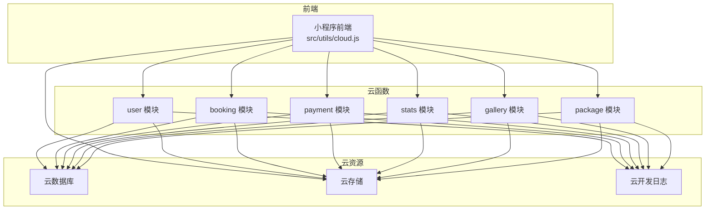
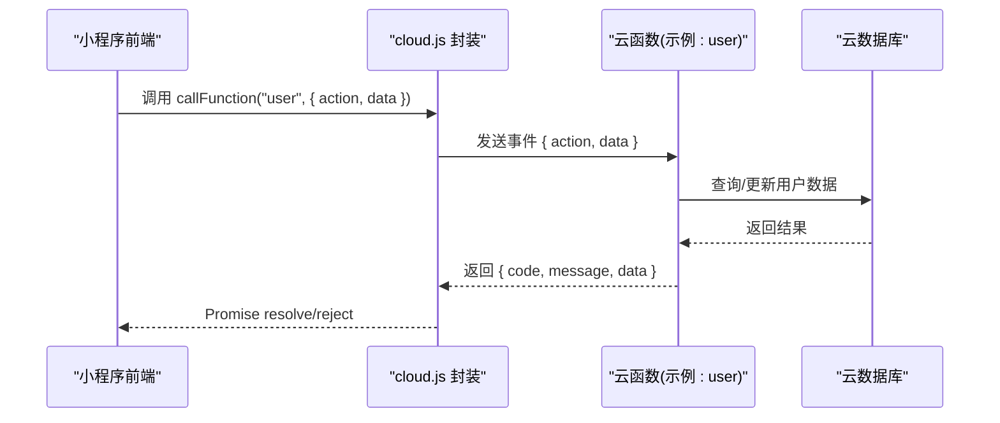
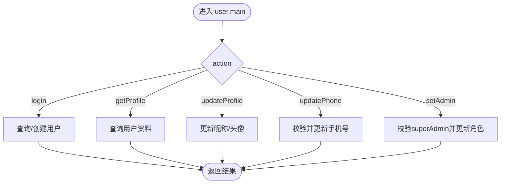
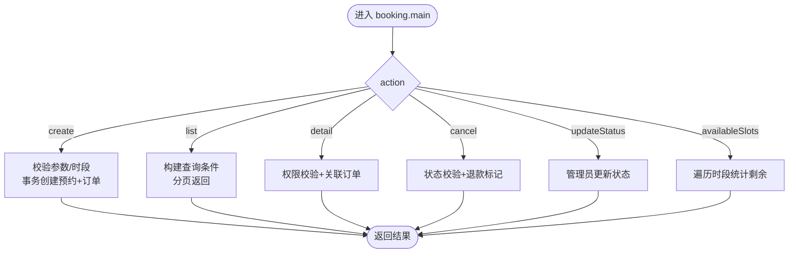
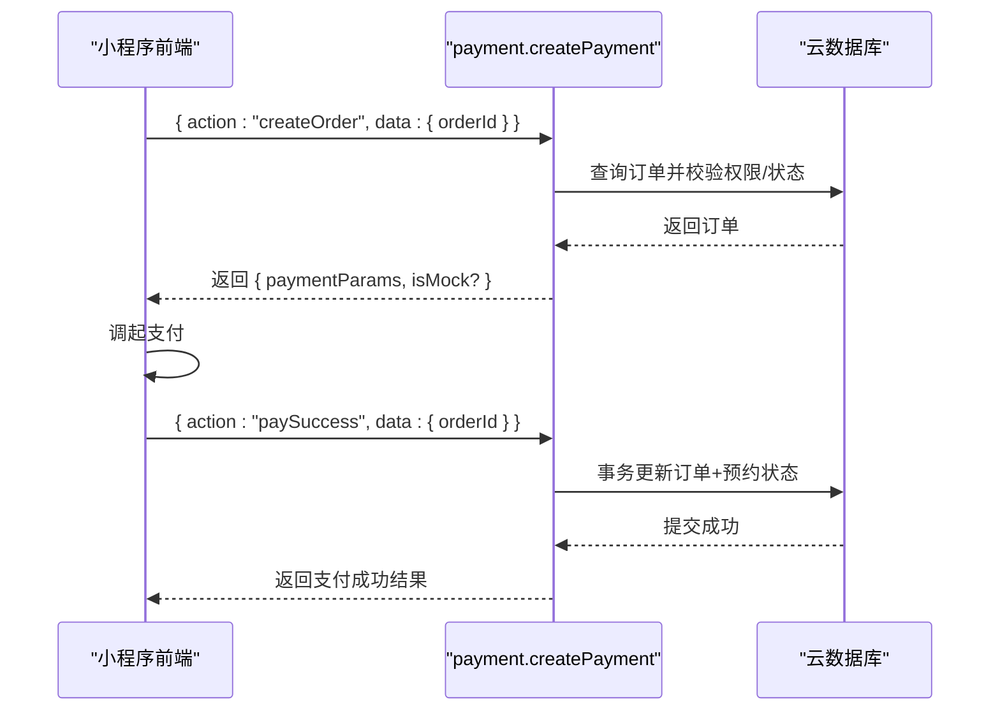
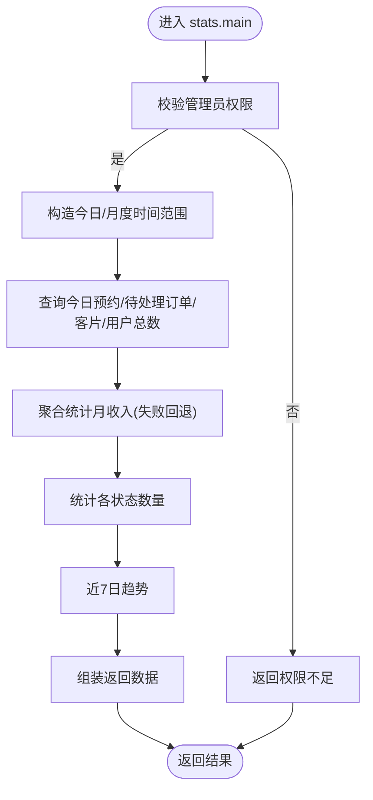
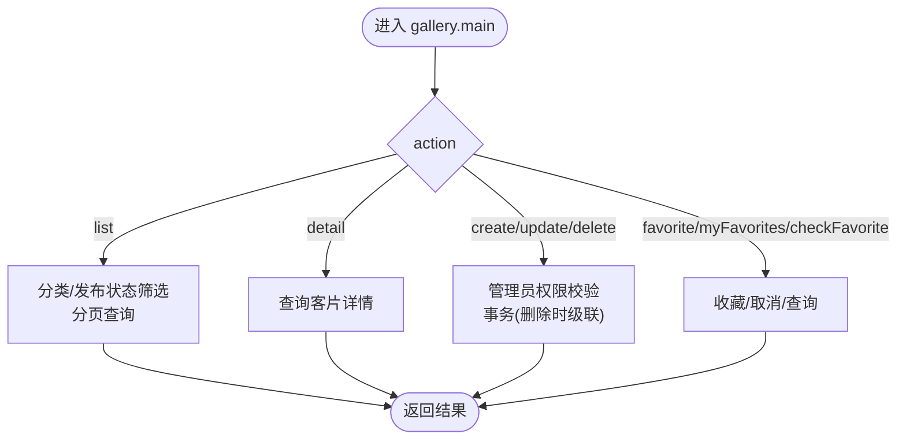
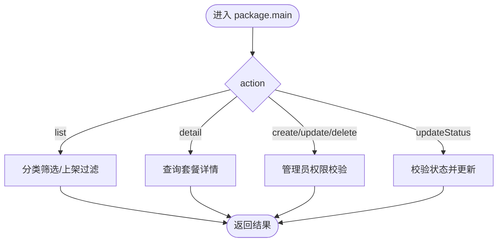
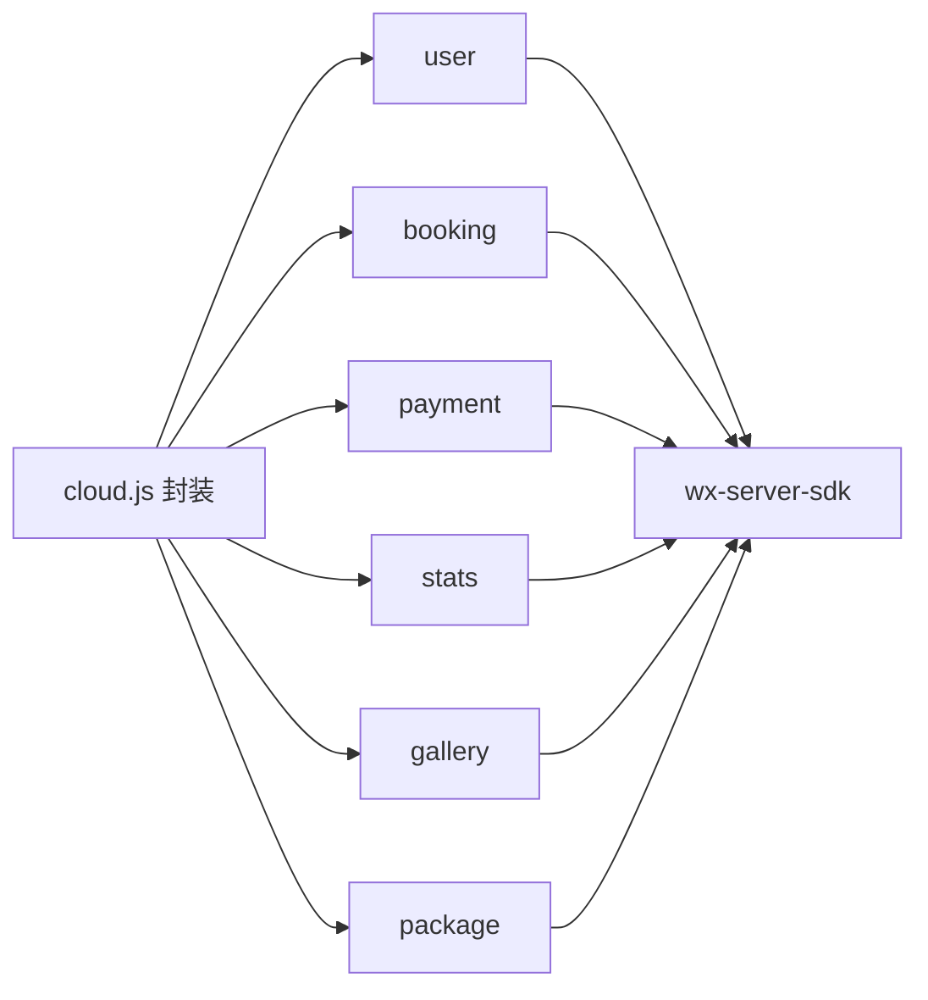

# 云开发部署

<cite>
**本文档引用的文件**
- [miniprogram/cloudfunctions/booking/index.js](file://miniprogram/cloudfunctions/booking/index.js)
- [miniprogram/cloudfunctions/booking/package.json](file://miniprogram/cloudfunctions/booking/package.json)
- [miniprogram/cloudfunctions/user/index.js](file://miniprogram/cloudfunctions/user/index.js)
- [miniprogram/cloudfunctions/user/package.json](file://miniprogram/cloudfunctions/user/package.json)
- [miniprogram/cloudfunctions/payment/index.js](file://miniprogram/cloudfunctions/payment/index.js)
- [miniprogram/cloudfunctions/payment/package.json](file://miniprogram/cloudfunctions/payment/package.json)
- [miniprogram/cloudfunctions/stats/index.js](file://miniprogram/cloudfunctions/stats/index.js)
- [miniprogram/cloudfunctions/stats/package.json](file://miniprogram/cloudfunctions/stats/package.json)
- [miniprogram/cloudfunctions/gallery/index.js](file://miniprogram/cloudfunctions/gallery/index.js)
- [miniprogram/cloudfunctions/gallery/package.json](file://miniprogram/cloudfunctions/gallery/package.json)
- [miniprogram/cloudfunctions/package/index.js](file://miniprogram/cloudfunctions/package/index.js)
- [miniprogram/cloudfunctions/package/package.json](file://miniprogram/cloudfunctions/package/package.json)
- [miniprogram/project.config.json](file://miniprogram/project.config.json)
- [miniprogram/src/utils/cloud.js](file://miniprogram/src/utils/cloud.js)
- [miniprogram/src/utils/constants.js](file://miniprogram/src/utils/constants.js)
</cite>

## 目录
1. [简介](#简介)
2. [项目结构](#项目结构)
3. [核心组件](#核心组件)
4. [架构总览](#架构总览)
5. [详细组件分析](#详细组件分析)
6. [依赖关系分析](#依赖关系分析)
7. [性能与成本优化](#性能与成本优化)
8. [调试与排错指南](#调试与排错指南)
9. [结论](#结论)
10. [附录](#附录)

## 简介
本文件面向微信云开发的部署与运维，系统性说明云函数的部署流程、环境变量与依赖管理、各模块（booking、user、payment、stats、gallery、package）的配置与触发器设置，以及云数据库、云存储的初始化与权限配置。同时提供调试、日志查看与错误排查方法，并给出性能监控、冷启动优化与成本控制策略。

## 项目结构
- 云函数目录位于 miniprogram/cloudfunctions 下，按功能划分为 booking、user、payment、stats、gallery、package 六个模块。
- 每个云函数包含 index.js 与 package.json，前者为入口与业务逻辑，后者声明依赖（统一使用 wx-server-sdk）。
- 前端工程通过 project.config.json 指定云函数根目录与构建输出路径；前端通过 src/utils/cloud.js 封装云函数调用与云存储操作。

图表来源
- [miniprogram/project.config.json:1-21](file://miniprogram/project.config.json#L1-L21)
- [miniprogram/src/utils/cloud.js:1-66](file://miniprogram/src/utils/cloud.js#L1-L66)

章节来源
- [miniprogram/project.config.json:1-21](file://miniprogram/project.config.json#L1-L21)
- [miniprogram/src/utils/cloud.js:1-66](file://miniprogram/src/utils/cloud.js#L1-L66)

## 核心组件
- 云函数模块
  - user：用户登录、资料更新、手机号绑定、管理员角色变更。
  - booking：预约创建、列表/详情查询、取消、状态更新、可用时段查询。
  - payment：模拟支付下单、支付成功回调、退款、订单查询。
  - stats：管理员数据概览（今日预约、待处理订单、月收入、统计趋势等）。
  - gallery：客片列表/详情、增删改、收藏/取消收藏、我的收藏。
  - package：套餐列表/详情、增删改、上下架。
- 依赖与环境
  - 所有模块依赖 wx-server-sdk，版本约束见对应 package.json。
  - 云函数通过 cloud.init({ env: cloud.DYNAMIC_CURRENT_ENV }) 动态使用当前环境。
- 前端封装
  - src/utils/cloud.js 提供 callFunction、uploadFile、getTempFileURL、deleteFile、getDB 等封装，便于前端统一调用。

章节来源
- [miniprogram/cloudfunctions/user/index.js:1-206](file://miniprogram/cloudfunctions/user/index.js#L1-L206)
- [miniprogram/cloudfunctions/booking/index.js:1-463](file://miniprogram/cloudfunctions/booking/index.js#L1-L463)
- [miniprogram/cloudfunctions/payment/index.js:1-532](file://miniprogram/cloudfunctions/payment/index.js#L1-L532)
- [miniprogram/cloudfunctions/stats/index.js:1-229](file://miniprogram/cloudfunctions/stats/index.js#L1-L229)
- [miniprogram/cloudfunctions/gallery/index.js:1-360](file://miniprogram/cloudfunctions/gallery/index.js#L1-L360)
- [miniprogram/cloudfunctions/package/index.js:1-222](file://miniprogram/cloudfunctions/package/index.js#L1-L222)
- [miniprogram/cloudfunctions/user/package.json:1-7](file://miniprogram/cloudfunctions/user/package.json#L1-L7)
- [miniprogram/cloudfunctions/booking/package.json:1-7](file://miniprogram/cloudfunctions/booking/package.json#L1-L7)
- [miniprogram/cloudfunctions/payment/package.json:1-7](file://miniprogram/cloudfunctions/payment/package.json#L1-L7)
- [miniprogram/cloudfunctions/stats/package.json:1-7](file://miniprogram/cloudfunctions/stats/package.json#L1-L7)
- [miniprogram/cloudfunctions/gallery/package.json:1-7](file://miniprogram/cloudfunctions/gallery/package.json#L1-L7)
- [miniprogram/cloudfunctions/package/package.json:1-7](file://miniprogram/cloudfunctions/package/package.json#L1-L7)
- [miniprogram/src/utils/cloud.js:1-66](file://miniprogram/src/utils/cloud.js#L1-L66)

## 架构总览
- 前端通过 wx.cloud 调用云函数，云函数以事件驱动方式执行，访问云数据库与云存储。
- 数据模型涉及 users、bookings、orders、gallery、packages 等集合，权限控制贯穿各模块。
- 支付模块提供模拟支付与退款逻辑，便于开发联调；真实支付需配置商户号并启用云开发支付能力。

图表来源
- [miniprogram/src/utils/cloud.js:1-66](file://miniprogram/src/utils/cloud.js#L1-L66)
- [miniprogram/cloudfunctions/user/index.js:1-206](file://miniprogram/cloudfunctions/user/index.js#L1-L206)

## 详细组件分析

### 用户模块（user）
- 主要职责
  - 登录：首次登录创建用户记录，后续返回用户信息。
  - 资料更新：支持昵称、头像更新。
  - 手机号绑定：校验格式并更新。
  - 管理员角色变更：仅 superAdmin 可操作。
- 关键点
  - 使用 users 集合，权限校验通过 role 字段区分。
  - 新用户默认 role 为 user，创建时间使用 serverDate。
- 部署要点
  - 依赖 wx-server-sdk，无需额外环境变量。
  - 触发器建议：HTTP 请求触发（由前端调用）。

图表来源
- [miniprogram/cloudfunctions/user/index.js:1-206](file://miniprogram/cloudfunctions/user/index.js#L1-L206)

章节来源
- [miniprogram/cloudfunctions/user/index.js:1-206](file://miniprogram/cloudfunctions/user/index.js#L1-L206)
- [miniprogram/cloudfunctions/user/package.json:1-7](file://miniprogram/cloudfunctions/user/package.json#L1-L7)

### 预约模块（booking）
- 主要职责
  - 创建预约：校验套餐、时段、并发安全（事务），同时创建订单。
  - 列表/详情：支持管理员全量查询与用户按权限查询。
  - 取消预约：校验状态与权限，必要时标记退款。
  - 状态更新：管理员更新预约状态。
  - 可用时段：按日期查询各时段剩余情况。
- 关键点
  - TIME_SLOTS 与 MAX_BOOKINGS_PER_SLOT 控制时段容量。
  - 使用事务保证“预约+订单”一致性。
  - 管理员权限通过 users 集合 role 校验。
- 部署要点
  - 依赖 wx-server-sdk。
  - 触发器：HTTP 请求触发；如需定时清理过期未支付订单，可配置定时触发器。

图表来源
- [miniprogram/cloudfunctions/booking/index.js:1-463](file://miniprogram/cloudfunctions/booking/index.js#L1-L463)

章节来源
- [miniprogram/cloudfunctions/booking/index.js:1-463](file://miniprogram/cloudfunctions/booking/index.js#L1-L463)
- [miniprogram/cloudfunctions/booking/package.json:1-7](file://miniprogram/cloudfunctions/booking/package.json#L1-L7)

### 支付模块（payment）
- 主要职责
  - 创建支付订单：模拟支付参数（开发阶段），真实支付需配置商户号。
  - 支付成功回调：前端通知后更新订单与预约状态。
  - 退款处理：管理员发起，模拟退款（开发阶段）。
  - 订单查询：支持按订单ID或订单号查询，权限校验。
  - 我的订单：分页查询当前用户订单。
- 关键点
  - 模拟支付/退款便于本地联调；真实接入需在小程序后台配置商户号并使用 cloud.cloudPay 接口。
  - 事务更新订单与预约状态，保证一致性。
- 部署要点
  - 依赖 wx-server-sdk。
  - 触发器：HTTP 请求触发；若启用真实支付回调，需在统一下单时配置回调云函数名。

图表来源
- [miniprogram/cloudfunctions/payment/index.js:1-532](file://miniprogram/cloudfunctions/payment/index.js#L1-L532)

章节来源
- [miniprogram/cloudfunctions/payment/index.js:1-532](file://miniprogram/cloudfunctions/payment/index.js#L1-L532)
- [miniprogram/cloudfunctions/payment/package.json:1-7](file://miniprogram/cloudfunctions/payment/package.json#L1-L7)

### 统计模块（stats）
- 主要职责
  - 管理员数据概览：今日预约、待处理订单、月收入、客片/预约/用户总数、状态分布、近7日趋势。
- 关键点
  - 使用聚合查询统计月收入，失败回退为0。
  - 时间范围计算采用 getTodayString 与 getMonthRange。
- 部署要点
  - 依赖 wx-server-sdk。
  - 触发器：HTTP 请求触发；可配合定时任务定期生成报表。

图表来源
- [miniprogram/cloudfunctions/stats/index.js:1-229](file://miniprogram/cloudfunctions/stats/index.js#L1-L229)

章节来源
- [miniprogram/cloudfunctions/stats/index.js:1-229](file://miniprogram/cloudfunctions/stats/index.js#L1-L229)
- [miniprogram/cloudfunctions/stats/package.json:1-7](file://miniprogram/cloudfunctions/stats/package.json#L1-L7)

### 客片模块（gallery）
- 主要职责
  - 列表/详情：支持分类筛选与发布状态过滤。
  - 管理员：增删改。
  - 收藏/取消收藏：维护 favorites 集合并同步 gallery likes。
  - 我的收藏：分页查询并联查 gallery 信息。
- 关键点
  - 删除客片时级联删除收藏记录，使用事务保证一致性。
  - 收藏/取消收藏通过原子自增更新 likes。
- 部署要点
  - 依赖 wx-server-sdk。
  - 触发器：HTTP 请求触发；云存储文件删除需同步清理。

图表来源
- [miniprogram/cloudfunctions/gallery/index.js:1-360](file://miniprogram/cloudfunctions/gallery/index.js#L1-L360)

章节来源
- [miniprogram/cloudfunctions/gallery/index.js:1-360](file://miniprogram/cloudfunctions/gallery/index.js#L1-L360)
- [miniprogram/cloudfunctions/gallery/package.json:1-7](file://miniprogram/cloudfunctions/gallery/package.json#L1-L7)

### 套餐模块（package）
- 主要职责
  - 列表/详情：支持分类筛选与上架状态过滤。
  - 管理员：增删改、上下架。
- 关键点
  - 上下架状态仅允许 on/off。
- 部署要点
  - 依赖 wx-server-sdk。
  - 触发器：HTTP 请求触发。

图表来源
- [miniprogram/cloudfunctions/package/index.js:1-222](file://miniprogram/cloudfunctions/package/index.js#L1-L222)

章节来源
- [miniprogram/cloudfunctions/package/index.js:1-222](file://miniprogram/cloudfunctions/package/index.js#L1-L222)
- [miniprogram/cloudfunctions/package/package.json:1-7](file://miniprogram/cloudfunctions/package/package.json#L1-L7)

## 依赖关系分析
- 云函数间无直接依赖，均通过 wx-server-sdk 访问云数据库与云存储。
- 前端通过 src/utils/cloud.js 统一封装调用，降低耦合。
- 依赖统一为 wx-server-sdk，版本固定，便于部署一致性。

图表来源
- [miniprogram/src/utils/cloud.js:1-66](file://miniprogram/src/utils/cloud.js#L1-L66)
- [miniprogram/cloudfunctions/user/package.json:1-7](file://miniprogram/cloudfunctions/user/package.json#L1-L7)
- [miniprogram/cloudfunctions/booking/package.json:1-7](file://miniprogram/cloudfunctions/booking/package.json#L1-L7)
- [miniprogram/cloudfunctions/payment/package.json:1-7](file://miniprogram/cloudfunctions/payment/package.json#L1-L7)
- [miniprogram/cloudfunctions/stats/package.json:1-7](file://miniprogram/cloudfunctions/stats/package.json#L1-L7)
- [miniprogram/cloudfunctions/gallery/package.json:1-7](file://miniprogram/cloudfunctions/gallery/package.json#L1-L7)
- [miniprogram/cloudfunctions/package/package.json:1-7](file://miniprogram/cloudfunctions/package/package.json#L1-L7)

章节来源
- [miniprogram/src/utils/cloud.js:1-66](file://miniprogram/src/utils/cloud.js#L1-L66)
- [miniprogram/cloudfunctions/*/package.json](file://miniprogram/cloudfunctions/*/package.json)

## 性能与成本优化
- 冷启动优化
  - 合理拆分云函数，避免单函数体积过大；保持依赖精简。
  - 避免在函数入口做重初始化工作，尽量复用模块内初始化。
  - 对热点接口（如列表查询）适当缓存查询结果（注意时效性）。
- 并发与事务
  - 预约创建使用事务，减少竞态；对高并发场景考虑预扣减库存或分布式锁。
- 日志与监控
  - 使用云开发日志查看器定位慢请求与异常堆栈。
  - 对高频调用增加埋点统计（如 QPS、P95 延迟、错误率）。
- 成本控制
  - 合理设置并发与超时，避免长时间空闲连接。
  - 云存储按需上传，及时清理历史文件。
  - 支付回调与退款流程尽量走模拟链路，减少真实交易次数。

## 调试与排错指南
- 常见问题
  - 权限不足：检查用户 role 与管理员校验逻辑。
  - 数据不存在：核对 ID、订单号、日期格式。
  - 事务回滚：确认并发场景下的二次检查与回滚路径。
- 调试步骤
  - 前端：通过 src/utils/cloud.js 的 Promise 错误分支打印与拦截。
  - 云函数：利用云开发日志查看 console 输出与报错堆栈。
  - 数据库：核对集合名称、索引与查询条件。
- 排错清单
  - 云函数返回 { code !== 0 }：前端统一 reject，查看 message。
  - 支付/退款：开发阶段为模拟流程，切换真实支付需配置商户号并校验回调签名。

章节来源
- [miniprogram/src/utils/cloud.js:1-66](file://miniprogram/src/utils/cloud.js#L1-L66)
- [miniprogram/cloudfunctions/*/index.js](file://miniprogram/cloudfunctions/*/index.js)

## 结论
本项目基于微信云开发实现了完整的预约、支付、统计、内容与套餐管理能力。通过模块化云函数与统一的前端封装，具备良好的可维护性与扩展性。建议在生产环境中完善真实支付接入、建立完善的日志与监控体系，并持续进行性能与成本优化。

## 附录

### 云函数部署与配置清单
- 通用配置
  - 环境：使用 DYNAMIC_CURRENT_ENV 动态环境。
  - 依赖：wx-server-sdk，版本固定。
  - 触发器：HTTP 请求触发（由前端调用）。
- 模块特定
  - booking：建议增加定时触发器清理过期未支付订单。
  - payment：真实支付需在小程序后台配置商户号；回调云函数名需与统一下单一致。
  - stats：可配置定时任务每日生成报表。
  - gallery/package：注意删除时的级联事务与云存储文件清理。

章节来源
- [miniprogram/cloudfunctions/*/index.js](file://miniprogram/cloudfunctions/*/index.js)
- [miniprogram/cloudfunctions/*/package.json](file://miniprogram/cloudfunctions/*/package.json)
- [miniprogram/project.config.json:1-21](file://miniprogram/project.config.json#L1-L21)