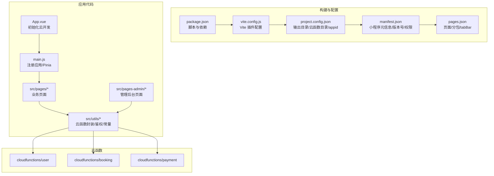
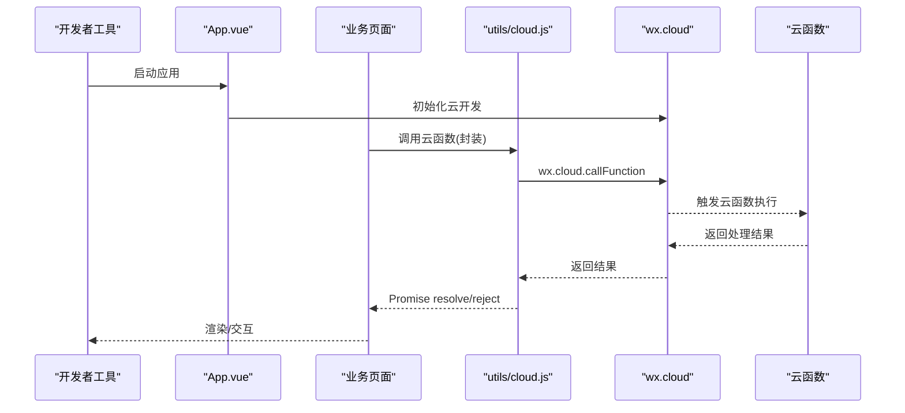
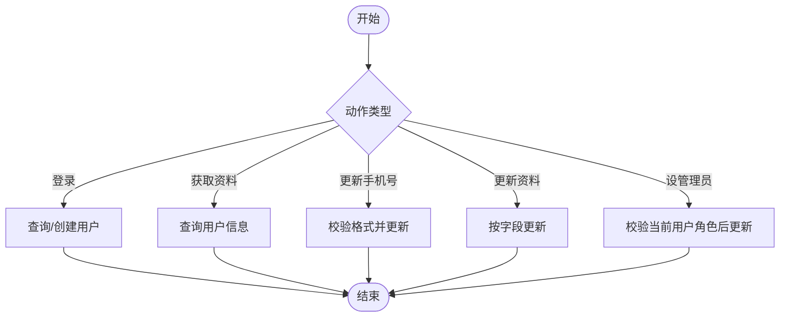
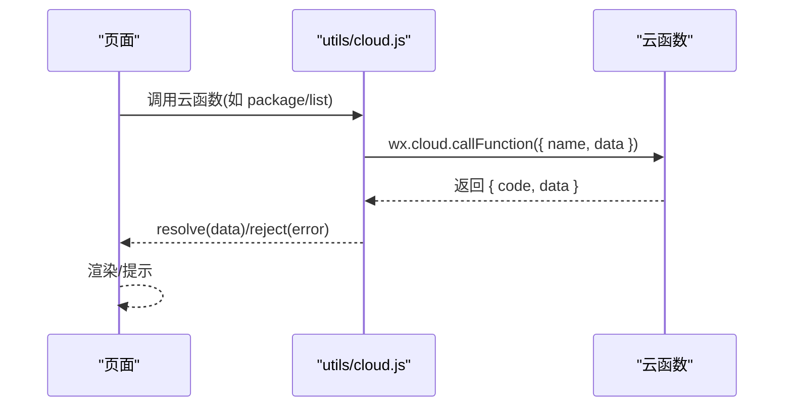
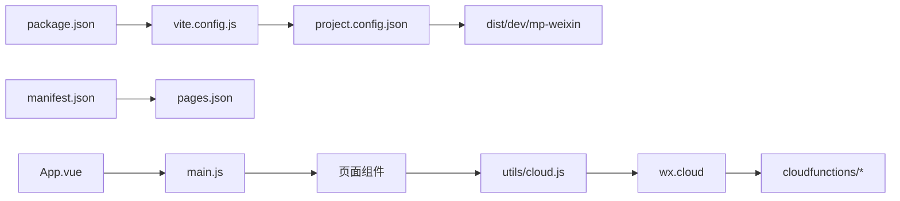
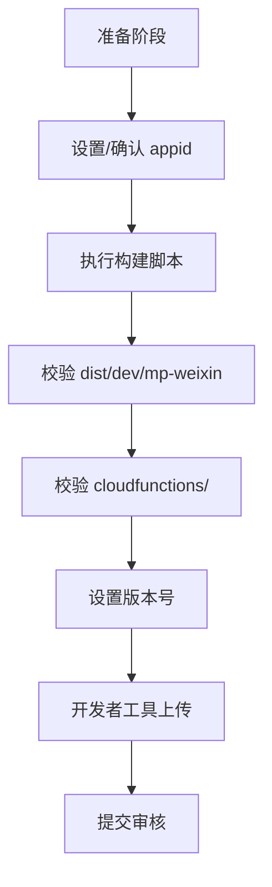

# 小程序上传

<cite>
**本文档引用的文件**
- [project.config.json](file://miniprogram/project.config.json)
- [package.json](file://miniprogram/package.json)
- [vite.config.js](file://miniprogram/vite.config.js)
- [manifest.json](file://miniprogram/src/manifest.json)
- [pages.json](file://miniprogram/src/pages.json)
- [App.vue](file://miniprogram/src/App.vue)
- [main.js](file://miniprogram/src/main.js)
- [constants.js](file://miniprogram/src/utils/constants.js)
- [cloud.js](file://miniprogram/src/utils/cloud.js)
- [auth.js](file://miniprogram/src/utils/auth.js)
- [user 云函数](file://miniprogram/cloudfunctions/user/index.js)
- [booking 云函数](file://miniprogram/cloudfunctions/booking/index.js)
- [payment 云函数](file://miniprogram/cloudfunctions/payment/index.js)
- [首页页面](file://miniprogram/src/pages/index/index.vue)
- [套餐列表页面](file://miniprogram/src/pages/packages/list.vue)
- [管理后台首页](file://miniprogram/src/pages-admin/dashboard/index.vue)
</cite>

## 目录
1. [简介](#简介)
2. [项目结构](#项目结构)
3. [核心组件](#核心组件)
4. [架构总览](#架构总览)
5. [详细组件分析](#详细组件分析)
6. [依赖关系分析](#依赖关系分析)
7. [性能与构建优化](#性能与构建优化)
8. [上传流程详解](#上传流程详解)
9. [版本管理与灰度回滚](#版本管理与灰度回滚)
10. [常见问题与故障排查](#常见问题与故障排查)
11. [审核标准与合规检查](#审核标准与合规检查)
12. [上线后运营维护](#上线后运营维护)
13. [结论](#结论)

## 简介
本文件面向从本地开发到微信开发者平台的完整上传流程，结合仓库现有配置与代码，系统阐述以下内容：
- 项目配置文件中的 appid 设置、编译输出目录与上传前准备
- 微信开发者工具的项目上传步骤、版本号管理与审核准备
- 版本管理策略、灰度发布与回滚机制
- 上传过程中的常见问题、网络问题处理与超时重试策略
- 小程序审核标准、合规性检查与上线后的运营维护

## 项目结构
该项目采用 uni-app 多端工程，目标平台为微信小程序（mp-weixin）。核心目录与文件如下：
- 构建与运行脚本：package.json 提供 dev/build 脚本
- 构建插件：vite.config.js 配置 uni 插件
- 项目配置：project.config.json 指定 dist/dev/mp-weixin 输出目录、云函数目录与 appid
- 运行配置：manifest.json 定义小程序名称、版本号、权限与云函数根目录
- 页面与分包：pages.json 管理页面路由、分包与 tabBar
- 应用入口：App.vue 初始化云开发；main.js 注册应用与状态管理
- 业务模块：src/utils 下封装云函数调用、鉴权与常量；cloudfunctions 下为后端云函数

**图表来源**
- [project.config.json:1-21](file://miniprogram/project.config.json#L1-L21)
- [package.json:1-22](file://miniprogram/package.json#L1-L22)
- [vite.config.js:1-7](file://miniprogram/vite.config.js#L1-L7)
- [manifest.json:1-24](file://miniprogram/src/manifest.json#L1-L24)
- [pages.json:1-177](file://miniprogram/src/pages.json#L1-L177)
- [App.vue:1-26](file://miniprogram/src/App.vue#L1-L26)
- [main.js:1-11](file://miniprogram/src/main.js#L1-L11)
- [user 云函数:1-206](file://miniprogram/cloudfunctions/user/index.js#L1-L206)
- [booking 云函数:1-463](file://miniprogram/cloudfunctions/booking/index.js#L1-L463)
- [payment 云函数:1-532](file://miniprogram/cloudfunctions/payment/index.js#L1-L532)

**章节来源**
- [project.config.json:1-21](file://miniprogram/project.config.json#L1-L21)
- [package.json:1-22](file://miniprogram/package.json#L1-L22)
- [vite.config.js:1-7](file://miniprogram/vite.config.js#L1-L7)
- [manifest.json:1-24](file://miniprogram/src/manifest.json#L1-L24)
- [pages.json:1-177](file://miniprogram/src/pages.json#L1-L177)
- [App.vue:1-26](file://miniprogram/src/App.vue#L1-L26)
- [main.js:1-11](file://miniprogram/src/main.js#L1-L11)

## 核心组件
- 构建与脚本
  - 开发与构建命令通过 package.json 的 scripts 字段提供，分别针对微信小程序平台进行编译与打包。
  - Vite 配置通过 uni 插件启用多端编译能力。
- 项目配置
  - project.config.json 指定 miniprogramRoot 为 dist/dev/mp-weixin，即微信小程序的编译输出目录；同时声明 cloudfunctionRoot 为 cloudfunctions/，用于开发者工具识别云函数目录。
  - appid 字段为空，上传前必须在开发者工具中设置或在 manifest.json 中配置。
- 运行配置
  - manifest.json 定义小程序名称、版本名称与版本号、平台特定设置与权限，以及云函数根目录。
  - pages.json 管理页面路由、分包与 tabBar，决定小程序的页面结构与导航。
- 应用入口
  - App.vue 在启动时初始化云开发能力；main.js 注册应用实例与状态管理。
- 业务工具
  - utils/cloud.js 封装 wx.cloud 调用，统一处理成功/失败回调与 Promise 化。
  - utils/auth.js 封装登录、用户信息获取与权限判断。
  - utils/constants.js 定义业务常量（如套餐分类、状态枚举等）。

**章节来源**
- [package.json:5-8](file://miniprogram/package.json#L5-L8)
- [vite.config.js:4-6](file://miniprogram/vite.config.js#L4-L6)
- [project.config.json:2-3](file://miniprogram/project.config.json#L2-L3)
- [project.config.json:17](file://miniprogram/project.config.json#L17)
- [manifest.json:5-6](file://miniprogram/src/manifest.json#L5-L6)
- [manifest.json:21](file://miniprogram/src/manifest.json#L21)
- [pages.json:2-76](file://miniprogram/src/pages.json#L2-L76)
- [pages.json:77-131](file://miniprogram/src/pages.json#L77-L131)
- [pages.json:132-169](file://miniprogram/src/pages.json#L132-L169)
- [App.vue:4-12](file://miniprogram/src/App.vue#L4-L12)
- [main.js:5-10](file://miniprogram/src/main.js#L5-L10)
- [cloud.js:6-26](file://miniprogram/src/utils/cloud.js#L6-L26)
- [auth.js:7-15](file://miniprogram/src/utils/auth.js#L7-L15)
- [constants.js:6-73](file://miniprogram/src/utils/constants.js#L6-L73)

## 架构总览
下图展示从前端页面到云函数的典型调用链路，体现上传前的准备工作与运行期交互。

**图表来源**
- [App.vue:4-12](file://miniprogram/src/App.vue#L4-L12)
- [cloud.js:6-26](file://miniprogram/src/utils/cloud.js#L6-L26)
- [user 云函数:14-67](file://miniprogram/cloudfunctions/user/index.js#L14-L67)
- [booking 云函数:67-93](file://miniprogram/cloudfunctions/booking/index.js#L67-L93)
- [payment 云函数:26-52](file://miniprogram/cloudfunctions/payment/index.js#L26-L52)

## 详细组件分析

### 项目配置组件分析
- project.config.json
  - miniprogramRoot：指定微信小程序编译输出目录，开发者工具会基于此目录进行预览与上传。
  - cloudfunctionRoot：指定云函数目录，便于开发者工具识别与上传。
  - appid：当前为空，上传前必须在开发者工具中设置或在 manifest.json 中配置。
  - setting.urlCheck、minified 等：影响编译与预览行为。
- manifest.json
  - versionName/versionCode：小程序版本号，上传时用于版本递增与审核。
  - mp-weixin.appid：平台特定 appid。
  - mp-weixin.cloudfunctionRoot：平台特定云函数根目录。
  - permission：声明位置权限等。
- pages.json
  - pages/subPackages/tabBar/globalStyle：定义页面路由、分包与全局样式。
- package.json / vite.config.js
  - 提供 uni -p mp-weixin 与 uni build -p mp-weixin 命令，配合 project.config.json 的输出目录完成编译。

**章节来源**
- [project.config.json:1-21](file://miniprogram/project.config.json#L1-L21)
- [manifest.json:1-24](file://miniprogram/src/manifest.json#L1-L24)
- [pages.json:1-177](file://miniprogram/src/pages.json#L1-L177)
- [package.json:5-8](file://miniprogram/package.json#L5-L8)
- [vite.config.js:4-6](file://miniprogram/vite.config.js#L4-L6)

### 云函数组件分析
- user 云函数
  - 功能：登录、获取用户信息、更新手机号/资料、设置管理员角色。
  - 关键点：根据 openid 操作用户集合，权限校验区分 user/admin/superAdmin。
- booking 云函数
  - 功能：创建预约、查询列表/详情、取消预约、更新状态、查询可用时段。
  - 关键点：使用事务保证数据一致性；对并发场景进行时段容量控制。
- payment 云函数
  - 功能：创建支付订单、支付成功回调、退款处理、订单查询。
  - 关键点：提供模拟支付/退款示例，真实接入需配置商户号与回调。

**图表来源**
- [user 云函数:13-206](file://miniprogram/cloudfunctions/user/index.js#L13-L206)

**章节来源**
- [user 云函数:1-206](file://miniprogram/cloudfunctions/user/index.js#L1-L206)

### 页面与业务组件分析
- 首页页面
  - 展示轮播、快捷入口、热门套餐、场景介绍与信任背书；调用云函数获取套餐列表。
- 套餐列表页面
  - 分类筛选、骨架屏加载、空态提示；调用云函数获取套餐列表。
- 管理后台首页
  - 统计数据卡片、快捷入口；调用 stats 云函数获取概览。

**图表来源**
- [首页页面:150-178](file://miniprogram/src/pages/index/index.vue#L150-L178)
- [套餐列表页面:94-125](file://miniprogram/src/pages/packages/list.vue#L94-L125)
- [管理后台首页:106-122](file://miniprogram/src/pages-admin/dashboard/index.vue#L106-L122)
- [cloud.js:6-26](file://miniprogram/src/utils/cloud.js#L6-L26)

**章节来源**
- [首页页面:1-521](file://miniprogram/src/pages/index/index.vue#L1-L521)
- [套餐列表页面:1-305](file://miniprogram/src/pages/packages/list.vue#L1-L305)
- [管理后台首页:1-295](file://miniprogram/src/pages-admin/dashboard/index.vue#L1-L295)
- [cloud.js:6-26](file://miniprogram/src/utils/cloud.js#L6-L26)

## 依赖关系分析
- 构建链路
  - package.json -> vite.config.js -> project.config.json(miniprogramRoot) -> 编译输出 dist/dev/mp-weixin
- 运行链路
  - App.vue(main.js) -> 页面组件 -> utils/cloud.js -> wx.cloud -> 云函数
- 配置耦合
  - project.config.json(appid/cloudfunctionRoot) 与 manifest.json(mp-weixin.appid/cloudfunctionRoot) 共同决定上传与运行时行为

**图表来源**
- [package.json:5-8](file://miniprogram/package.json#L5-L8)
- [vite.config.js:4-6](file://miniprogram/vite.config.js#L4-L6)
- [project.config.json:2-3](file://miniprogram/project.config.json#L2-L3)
- [manifest.json:1-24](file://miniprogram/src/manifest.json#L1-L24)
- [pages.json:1-177](file://miniprogram/src/pages.json#L1-L177)
- [App.vue:4-12](file://miniprogram/src/App.vue#L4-L12)
- [main.js:5-10](file://miniprogram/src/main.js#L5-L10)
- [cloud.js:6-26](file://miniprogram/src/utils/cloud.js#L6-L26)

**章节来源**
- [package.json:5-8](file://miniprogram/package.json#L5-L8)
- [vite.config.js:4-6](file://miniprogram/vite.config.js#L4-L6)
- [project.config.json:1-21](file://miniprogram/project.config.json#L1-L21)
- [manifest.json:1-24](file://miniprogram/src/manifest.json#L1-L24)
- [pages.json:1-177](file://miniprogram/src/pages.json#L1-L177)
- [App.vue:4-12](file://miniprogram/src/App.vue#L4-L12)
- [main.js:5-10](file://miniprogram/src/main.js#L5-L10)
- [cloud.js:6-26](file://miniprogram/src/utils/cloud.js#L6-L26)

## 性能与构建优化
- 构建配置要点
  - project.config.json 中 setting.minified、postcss、es6 等选项开启可减少包体与提升运行性能。
  - vite.config.js 使用 uni 插件，确保多端兼容与按需编译。
- 上传前建议
  - 确认 dist/dev/mp-weixin 目录存在且包含完整产物
  - 确认所有云函数已正确放置于 cloudfunctions/ 目录
  - 确认 appid 已在开发者工具中设置或 manifest.json 中配置

**章节来源**
- [project.config.json:4-16](file://miniprogram/project.config.json#L4-L16)
- [vite.config.js:4-6](file://miniprogram/vite.config.js#L4-L6)

## 上传流程详解
- 上传前准备
  - 设置 appid：在开发者工具中设置或在 manifest.json 的 mp-weixin.appid 中配置
  - 确认编译输出：执行开发/构建脚本，确保 dist/dev/mp-weixin 存在
  - 确认云函数：cloudfunctions/ 目录结构正确
  - 版本号管理：在 manifest.json 中调整 versionName/versionCode
- 上传步骤（开发者工具）
  - 打开项目，选择“上传”菜单
  - 输入版本号与项目备注
  - 点击上传，等待上传完成
- 审核准备
  - 准备截图与说明材料
  - 确保隐私政策与权限说明齐全
  - 确认无敏感信息泄露与违规内容

**图表来源**
- [project.config.json:2-3](file://miniprogram/project.config.json#L2-L3)
- [project.config.json:17](file://miniprogram/project.config.json#L17)
- [manifest.json:5-6](file://miniprogram/src/manifest.json#L5-L6)
- [package.json:5-8](file://miniprogram/package.json#L5-L8)

**章节来源**
- [project.config.json:1-21](file://miniprogram/project.config.json#L1-L21)
- [manifest.json:1-24](file://miniprogram/src/manifest.json#L1-L24)
- [package.json:5-8](file://miniprogram/package.json#L5-L8)

## 版本管理与灰度回滚
- 版本管理策略
  - 使用 manifest.json 的 versionName/versionCode 表示语义化版本与内部版本号
  - 上传前递增版本号，确保每次上传对应唯一版本
- 灰度发布
  - 在开发者工具或微信公众平台后台开启灰度发布，逐步扩大比例
- 回滚机制
  - 若发现问题，可在平台后台选择回滚至上一稳定版本
  - 回滚前建议保留备份版本号与变更记录

**章节来源**
- [manifest.json:5-6](file://miniprogram/src/manifest.json#L5-L6)

## 常见问题与故障排查
- 上传失败
  - 现象：上传过程中断或报错
  - 排查：检查 appid 是否设置；确认 dist/dev/mp-weixin 是否存在；检查网络与代理
- 云函数调用失败
  - 现象：页面调用云函数报错
  - 排查：确认云函数部署成功；检查 wx.cloud 初始化；查看云函数日志
- 权限与合规
  - 现象：审核被拒
  - 排查：检查隐私政策、权限申请与使用说明；确保无敏感信息

**章节来源**
- [App.vue:4-12](file://miniprogram/src/App.vue#L4-L12)
- [cloud.js:6-26](file://miniprogram/src/utils/cloud.js#L6-L26)

## 审核标准与合规检查
- 审核要点
  - 功能完整性与稳定性
  - 隐私政策与权限说明
  - 内容健康与无违规
- 合规建议
  - 明确用户知情同意与最小必要原则
  - 提供清晰的隐私政策与用户协议
  - 对涉及地理位置、用户头像等敏感权限，提供用途说明

## 上线后运营维护
- 监控与日志
  - 关注云函数错误日志与耗时指标
  - 关注小程序崩溃与异常上报
- 版本迭代
  - 采用小步快跑策略，灰度发布与回滚机制保障稳定
- 用户反馈
  - 建立反馈渠道，及时响应与修复

## 结论
本文基于仓库现有配置与代码，梳理了从本地开发到微信开发者平台的上传流程，明确了项目配置文件中的关键项（appid、编译输出目录、云函数目录），并提供了版本管理、灰度发布与回滚策略、常见问题排查与合规建议。建议在每次上传前严格核对配置与版本号，并在平台后台做好灰度与回滚准备，确保稳定上线与持续运营。