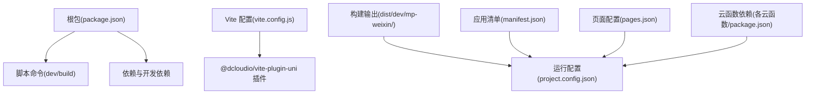
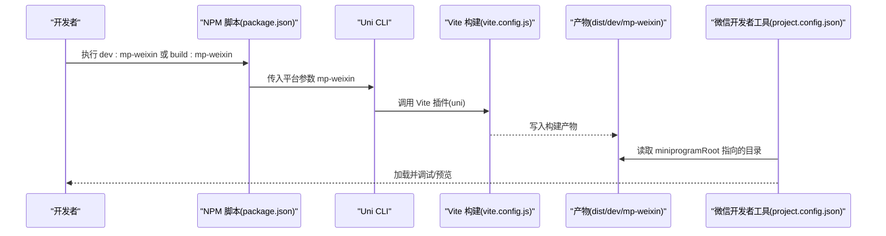
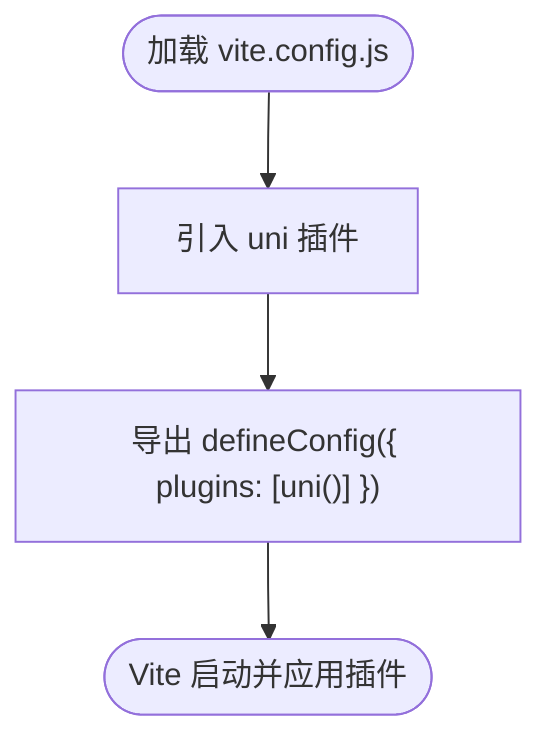
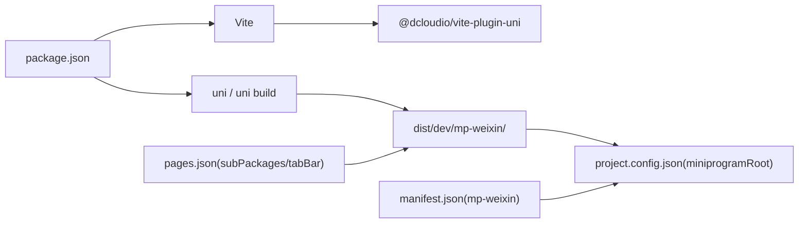

# 构建配置

<cite>
**本文引用的文件**
- [package.json](file://miniprogram/package.json)
- [vite.config.js](file://miniprogram/vite.config.js)
- [project.config.json](file://miniprogram/project.config.json)
- [manifest.json](file://miniprogram/src/manifest.json)
- [pages.json](file://miniprogram/src/pages.json)
- [main.js](file://miniprogram/src/main.js)
- [App.vue](file://miniprogram/src/App.vue)
- [booking/package.json](file://miniprogram/cloudfunctions/booking/package.json)
- [gallery/package.json](file://miniprogram/cloudfunctions/gallery/package.json)
</cite>

## 目录
1. [简介](#简介)
2. [项目结构](#项目结构)
3. [核心组件](#核心组件)
4. [架构总览](#架构总览)
5. [详细组件分析](#详细组件分析)
6. [依赖关系分析](#依赖关系分析)
7. [性能考虑](#性能考虑)
8. [故障排查指南](#故障排查指南)
9. [结论](#结论)
10. [附录](#附录)

## 简介
本文件系统性梳理 lvpai 小程序项目的构建配置与流程，覆盖以下方面：
- package.json 中的脚本命令、依赖与开发依赖
- vite.config.js 的插件与构建入口配置
- project.config.json 与 manifest.json 的小程序编译与运行配置
- 云函数依赖与根目录配置
- 不同环境（开发、测试、生产）的构建差异与切换方法
- 构建性能优化、代码分割与资源压缩最佳实践

## 项目结构
lvpai 为基于 uni-app 的微信小程序项目，采用 Vite 作为构建工具，通过 @dcloudio/vite-plugin-uni 插件实现多端编译。项目主要由以下部分组成：
- 根包管理：定义构建脚本、依赖与开发依赖
- 构建配置：Vite 插件与默认导出配置
- 运行配置：project.config.json 指定 dist 输出路径、云函数根目录与编译开关
- 应用清单：manifest.json 定义小程序平台特定设置与权限
- 页面与分包：pages.json 声明页面、分包与 tabbar 配置
- 入口应用：main.js 与 App.vue 组织应用初始化与全局样式

**图表来源**
- [package.json:1-22](file://miniprogram/package.json#L1-L22)
- [vite.config.js:1-7](file://miniprogram/vite.config.js#L1-L7)
- [project.config.json:1-21](file://miniprogram/project.config.json#L1-L21)
- [manifest.json:1-24](file://miniprogram/src/manifest.json#L1-L24)
- [pages.json:1-177](file://miniprogram/src/pages.json#L1-L177)

**章节来源**
- [package.json:1-22](file://miniprogram/package.json#L1-L22)
- [vite.config.js:1-7](file://miniprogram/vite.config.js#L1-L7)
- [project.config.json:1-21](file://miniprogram/project.config.json#L1-L21)
- [manifest.json:1-24](file://miniprogram/src/manifest.json#L1-L24)
- [pages.json:1-177](file://miniprogram/src/pages.json#L1-L177)

## 核心组件
- 根包管理与脚本命令
  - 开发命令：执行 uni 平台开发模式，目标平台为 mp-weixin
  - 构建命令：执行 uni 构建，目标平台为 mp-weixin
- 依赖与开发依赖
  - 运行时依赖：uni-app、uni-mp-weixin、uni-components、Vue 3、Pinia
  - 开发依赖：uni-cli-shared、@dcloudio/vite-plugin-uni、Vite
- Vite 配置
  - 默认导出包含 uni 插件，用于多端编译与资源处理
- 运行配置
  - 指定 dist 输出路径、云函数根目录、编译开关（如 urlCheck、es6、enhance、postcss、minified）
  - 设置 appid、项目名与条件编译字段
- 应用清单
  - 平台特定设置（如 mp-weixin）、权限声明、云函数根目录等
- 页面与分包
  - pages.json 声明主包页面、分包与 tabbar，影响打包与分包策略

**章节来源**
- [package.json:5-20](file://miniprogram/package.json#L5-L20)
- [vite.config.js:4-6](file://miniprogram/vite.config.js#L4-L6)
- [project.config.json:2-16](file://miniprogram/project.config.json#L2-L16)
- [manifest.json:7-22](file://miniprogram/src/manifest.json#L7-L22)
- [pages.json:1-177](file://miniprogram/src/pages.json#L1-L177)

## 架构总览
下图展示从脚本命令到最终产物的构建链路，以及运行配置对产物路径与编译行为的影响。

**图表来源**
- [package.json:5-7](file://miniprogram/package.json#L5-L7)
- [vite.config.js:4-6](file://miniprogram/vite.config.js#L4-L6)
- [project.config.json:2-3](file://miniprogram/project.config.json#L2-L3)

## 详细组件分析

### package.json：脚本命令与依赖管理
- 脚本命令
  - 开发：调用 uni 指令进入开发模式，目标平台为 mp-weixin
  - 构建：调用 uni build 指令进行生产构建，目标平台为 mp-weixin
- 依赖
  - 运行时依赖：包含 uni-app 生态与 Vue 3、Pinia
  - 开发依赖：包含 Vite 与 @dcloudio/vite-plugin-uni，确保多端编译与热更新
- 影响
  - 脚本命令决定构建入口与目标平台
  - 依赖版本影响构建稳定性与兼容性

**章节来源**
- [package.json:5-20](file://miniprogram/package.json#L5-L20)

### vite.config.js：Vite 配置与插件
- 配置要点
  - 使用 defineConfig 定义默认导出
  - 引入 @dcloudio/vite-plugin-uni 并在 plugins 数组中启用
- 影响
  - uni 插件负责解析 uni-app 源码、多端转换与资源处理
  - 可扩展点：在该文件中添加其他 Vite 插件以实现更精细的优化

**图表来源**
- [vite.config.js:1-7](file://miniprogram/vite.config.js#L1-L7)

**章节来源**
- [vite.config.js:1-7](file://miniprogram/vite.config.js#L1-L7)

### project.config.json：小程序运行配置
- 关键字段
  - miniprogramRoot：指定 dist 输出目录，用于微信开发者工具定位
  - cloudfunctionRoot：指定云函数根目录
  - setting：编译相关开关（urlCheck、es6、enhance、postcss、minified、compileHotReLoad 等）
  - appid：小程序 appid（当前为空）
  - projectname：项目名称
- 影响
  - 构建产物需与 miniprogramRoot 对齐
  - 编译开关影响代码压缩、ES6 转换与热更新行为

**章节来源**
- [project.config.json:1-21](file://miniprogram/project.config.json#L1-L21)

### manifest.json：应用清单与平台设置
- 关键字段
  - mp-weixin：平台特定设置（appid、setting、usingComponents、权限声明、cloudfunctionRoot）
  - 权限声明：如用户位置权限描述
- 影响
  - 平台设置直接影响小程序在微信端的行为与权限申请
  - 云函数根目录与 project.config.json 协同工作

**章节来源**
- [manifest.json:1-24](file://miniprogram/src/manifest.json#L1-L24)

### pages.json：页面与分包配置
- 关键字段
  - pages：主包页面列表与导航栏样式
  - subPackages：分包配置，含 root 与 pages
  - tabBar：底部导航配置（颜色、图标、文案等）
  - globalStyle：全局导航栏与背景色
- 影响
  - 分包配置影响打包体积与首屏加载
  - tabbar 与页面样式影响用户体验与构建产物结构

**章节来源**
- [pages.json:1-177](file://miniprogram/src/pages.json#L1-L177)

### main.js 与 App.vue：应用入口与初始化
- main.js
  - 创建 SSR 应用实例与 Pinia，并导出 createApp 工厂函数
- App.vue
  - 在 onLaunch 中初始化云开发能力
  - 引入全局样式
- 影响
  - 应用初始化逻辑影响构建后运行时行为
  - 云开发初始化与 manifest.json 的云函数根目录相关

**章节来源**
- [main.js:1-11](file://miniprogram/src/main.js#L1-L11)
- [App.vue:1-26](file://miniprogram/src/App.vue#L1-L26)

### 云函数依赖：booking 与 gallery 示例
- booking/package.json
  - 依赖 wx-server-sdk
- gallery/package.json
  - 依赖 wx-server-sdk
- 影响
  - 云函数构建需满足依赖要求
  - 云函数根目录由 project.config.json 与 manifest.json 共同决定

**章节来源**
- [booking/package.json:1-7](file://miniprogram/cloudfunctions/booking/package.json#L1-L7)
- [gallery/package.json:1-7](file://miniprogram/cloudfunctions/gallery/package.json#L1-L7)

## 依赖关系分析
- 脚本命令依赖 uni CLI 与 Vite 插件
- Vite 插件依赖 @dcloudio/vite-plugin-uni 实现多端编译
- 运行配置依赖 dist 输出路径与云函数根目录
- 页面与分包配置影响打包策略与产物结构
- 应用清单与 manifest.json 提供平台特定设置

**图表来源**
- [package.json:5-7](file://miniprogram/package.json#L5-L7)
- [vite.config.js:4-6](file://miniprogram/vite.config.js#L4-L6)
- [project.config.json:2-3](file://miniprogram/project.config.json#L2-L3)
- [manifest.json:7-22](file://miniprogram/src/manifest.json#L7-L22)
- [pages.json:77-131](file://miniprogram/src/pages.json#L77-L131)

**章节来源**
- [package.json:5-20](file://miniprogram/package.json#L5-L20)
- [vite.config.js:4-6](file://miniprogram/vite.config.js#L4-L6)
- [project.config.json:1-21](file://miniprogram/project.config.json#L1-L21)
- [manifest.json:1-24](file://miniprogram/src/manifest.json#L1-L24)
- [pages.json:1-177](file://miniprogram/src/pages.json#L1-L177)

## 性能考虑
- 构建优化
  - 启用压缩与最小化：通过 project.config.json 的 setting.minified 与 es6、postcss 等开关提升代码质量与体积
  - 代码分割：合理划分分包（subPackages），减少主包体积，提升首屏加载速度
  - 资源压缩：结合 Vite 插件链路，按需启用压缩与 Tree Shaking
- 运行时优化
  - 按需加载：利用分包与懒加载策略降低初始包体
  - 图标与静态资源：统一管理 tabbar 图标与静态资源，避免重复加载
- 最佳实践
  - 在开发阶段保持 compileHotReLoad 与 urlCheck 关闭，减少编译开销
  - 在生产阶段开启 minified、es6、postcss，确保产物体积与兼容性

[本节为通用指导，不直接分析具体文件，故无“章节来源”]

## 故障排查指南
- 构建路径不匹配
  - 现象：微信开发者工具无法找到小程序代码
  - 排查：确认 project.config.json 的 miniprogramRoot 与实际构建输出一致
- 云函数无法识别
  - 现象：云函数未被识别或依赖缺失
  - 排查：确认 cloudfunctionRoot 与各云函数 package.json 的依赖正确
- 权限与平台设置
  - 现象：运行时报权限或平台设置错误
  - 排查：核对 manifest.json 的 mp-weixin 设置与权限声明
- 页面与分包异常
  - 现象：页面跳转失败或分包加载异常
  - 排查：核对 pages.json 的 pages、subPackages、tabBar 配置

**章节来源**
- [project.config.json:2-16](file://miniprogram/project.config.json#L2-L16)
- [manifest.json:7-22](file://miniprogram/src/manifest.json#L7-L22)
- [pages.json:1-177](file://miniprogram/src/pages.json#L1-L177)

## 结论
lvpai 项目的构建配置围绕 uni-app 与 Vite 插件展开，通过 package.json 的脚本命令驱动开发与生产构建，借助 project.config.json 与 manifest.json 确保产物路径与平台设置正确。合理的分包策略与编译开关可显著提升构建效率与运行性能。建议在不同环境中明确区分构建目标与编译开关，并持续优化分包与资源压缩策略。

[本节为总结性内容，不直接分析具体文件，故无“章节来源”]

## 附录
- 环境切换方法
  - 开发环境：使用 dev:mp-weixin 脚本启动开发服务器，便于热更新与调试
  - 生产环境：使用 build:mp-weixin 脚本生成压缩后的 dist 产物，配合 project.config.json 的 minified 与 es6 开关
- 云函数依赖
  - 各云函数需在各自 package.json 中声明依赖（如 wx-server-sdk），并在 project.config.json 或 manifest.json 中正确配置云函数根目录

**章节来源**
- [package.json:5-7](file://miniprogram/package.json#L5-L7)
- [project.config.json:3-16](file://miniprogram/project.config.json#L3-L16)
- [manifest.json:21-22](file://miniprogram/src/manifest.json#L21-L22)
- [booking/package.json:1-7](file://miniprogram/cloudfunctions/booking/package.json#L1-L7)
- [gallery/package.json:1-7](file://miniprogram/cloudfunctions/gallery/package.json#L1-L7)