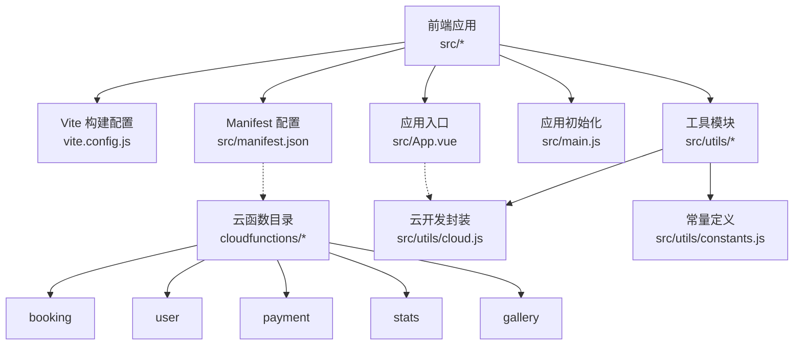
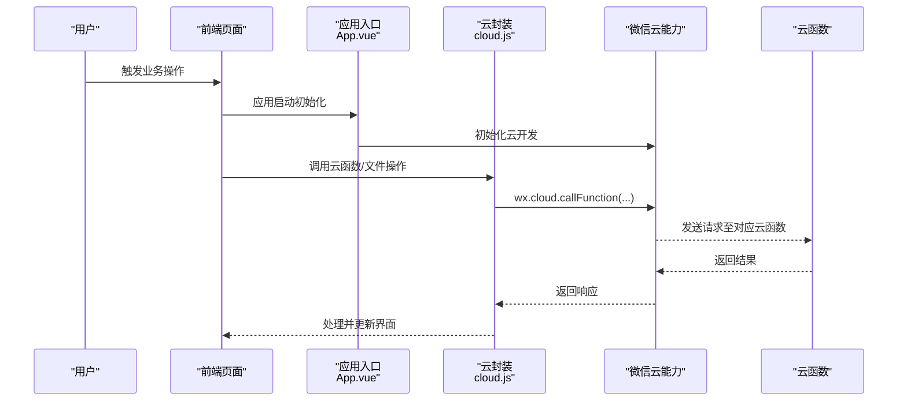
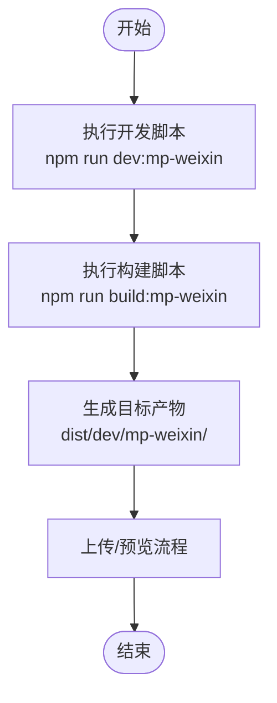
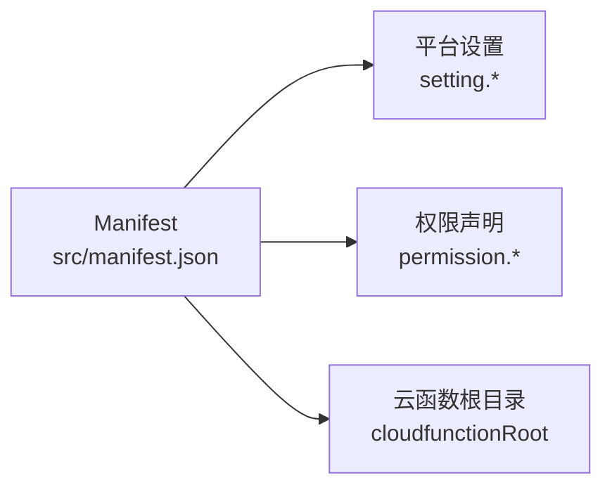
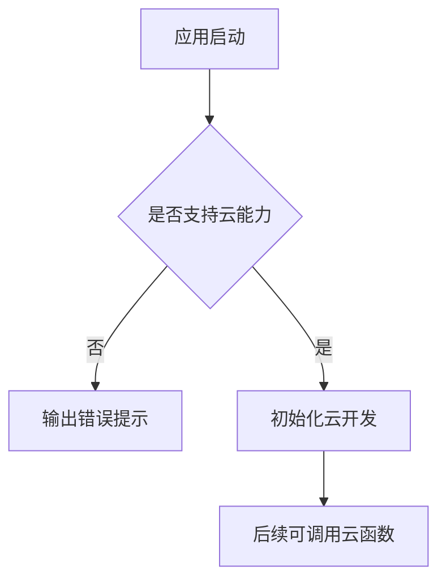
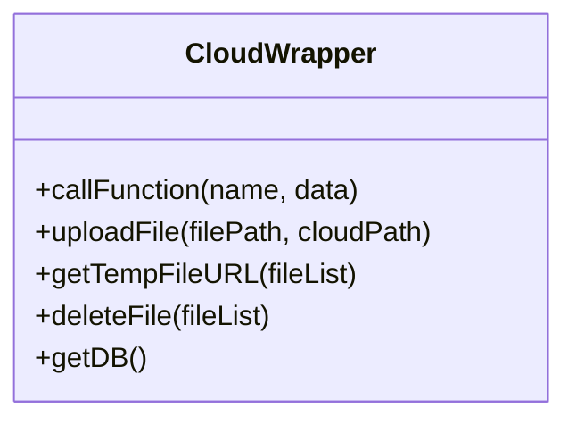
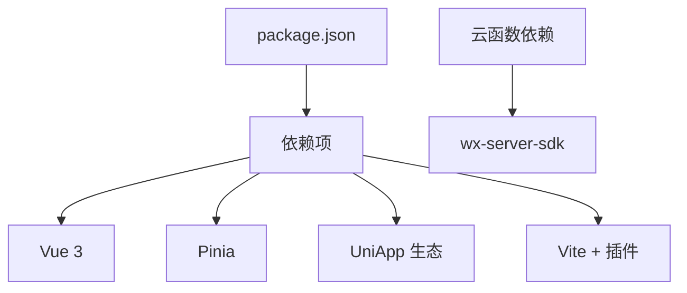
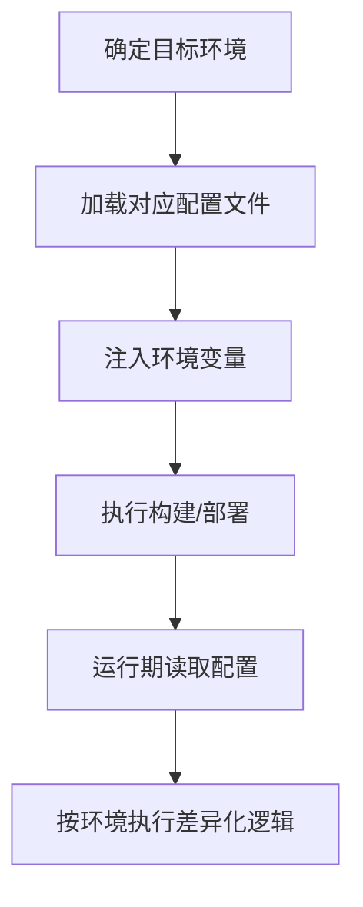

# 环境管理

<cite>
**本文档引用的文件**
- [package.json](file://miniprogram/package.json)
- [vite.config.js](file://miniprogram/vite.config.js)
- [project.config.json](file://miniprogram/project.config.json)
- [manifest.json](file://miniprogram/src/manifest.json)
- [main.js](file://miniprogram/src/main.js)
- [App.vue](file://miniprogram/src/App.vue)
- [cloud.js](file://miniprogram/src/utils/cloud.js)
- [constants.js](file://miniprogram/src/utils/constants.js)
- [booking/package.json](file://miniprogram/cloudfunctions/booking/package.json)
- [user/package.json](file://miniprogram/cloudfunctions/user/package.json)
- [payment/package.json](file://miniprogram/cloudfunctions/payment/package.json)
- [stats/package.json](file://miniprogram/cloudfunctions/stats/package.json)
- [gallery/package.json](file://miniprogram/cloudfunctions/gallery/package.json)
</cite>

## 目录
1. [引言](#引言)
2. [项目结构](#项目结构)
3. [核心组件](#核心组件)
4. [架构总览](#架构总览)
5. [详细组件分析](#详细组件分析)
6. [依赖分析](#依赖分析)
7. [性能考虑](#性能考虑)
8. [故障排查指南](#故障排查指南)
9. [结论](#结论)
10. [附录](#附录)

## 引言
本文件面向“环境管理”的核心目标，系统化梳理该小程序项目在多环境（开发、测试、生产）下的配置与管理策略。结合现有仓库中的脚本、构建配置、Manifest 与云函数依赖等信息，给出可落地的环境变量设置、敏感信息保护、配置文件版本控制、构建参数与云函数调用策略、以及环境迁移与备份建议。由于当前仓库未包含环境变量与云函数入口代码，本文在相关章节提供通用实践与实施路径，便于后续扩展。

## 项目结构
该项目为基于 Vue 3 + UniApp 的微信小程序工程，前端通过 Vite 插件进行构建，云函数位于独立目录，前端 Manifest 指定云函数根目录与小程序平台配置。

图示来源
- [vite.config.js:1-7](file://miniprogram/vite.config.js#L1-L7)
- [manifest.json:1-24](file://miniprogram/src/manifest.json#L1-L24)
- [App.vue:1-26](file://miniprogram/src/App.vue#L1-L26)
- [cloud.js:1-66](file://miniprogram/src/utils/cloud.js#L1-L66)
- [booking/package.json:1-7](file://miniprogram/cloudfunctions/booking/package.json#L1-L7)
- [user/package.json:1-7](file://miniprogram/cloudfunctions/user/package.json#L1-L7)
- [payment/package.json:1-7](file://miniprogram/cloudfunctions/payment/package.json#L1-L7)
- [stats/package.json:1-7](file://miniprogram/cloudfunctions/stats/package.json#L1-L7)
- [gallery/package.json:1-7](file://miniprogram/cloudfunctions/gallery/package.json#L1-L7)

章节来源
- [package.json:1-22](file://miniprogram/package.json#L1-L22)
- [vite.config.js:1-7](file://miniprogram/vite.config.js#L1-L7)
- [project.config.json:1-21](file://miniprogram/project.config.json#L1-L21)
- [manifest.json:1-24](file://miniprogram/src/manifest.json#L1-L24)

## 核心组件
- 构建与脚本：通过 npm scripts 启动开发与构建流程，使用 Vite 插件驱动 UniApp 平台编译。
- Manifest 配置：声明小程序平台参数、权限与云函数根目录，影响运行期云能力启用与云函数调用路径。
- 应用入口与初始化：在应用启动时初始化云开发能力，确保后续云函数调用可用。
- 云开发封装：统一封装云函数调用、文件上传/下载/删除与数据库引用，降低调用复杂度。
- 常量与配置：集中定义业务常量与全局配置，便于在不同环境间统一管理。

章节来源
- [package.json:5-8](file://miniprogram/package.json#L5-L8)
- [vite.config.js:4-6](file://miniprogram/vite.config.js#L4-L6)
- [manifest.json:7-22](file://miniprogram/src/manifest.json#L7-L22)
- [App.vue:4-13](file://miniprogram/src/App.vue#L4-L13)
- [cloud.js:6-66](file://miniprogram/src/utils/cloud.js#L6-L66)
- [constants.js:1-73](file://miniprogram/src/utils/constants.js#L1-L73)

## 架构总览
下图展示从用户交互到云函数调用的整体链路，以及与 Manifest 和构建配置的关系。

图示来源
- [App.vue:4-13](file://miniprogram/src/App.vue#L4-L13)
- [cloud.js:6-26](file://miniprogram/src/utils/cloud.js#L6-L26)
- [manifest.json:21](file://miniprogram/src/manifest.json#L21)

## 详细组件分析

### 构建与脚本（多环境执行）
- 开发与构建命令：通过 npm scripts 指定平台参数，分别执行开发预览与产物构建。
- Vite 插件：使用 UniApp 提供的 Vite 插件完成平台适配与编译。
- 项目配置：project.config.json 控制小程序根目录、云函数根目录与编译选项，影响本地调试与上传行为。

图示来源
- [package.json:5-8](file://miniprogram/package.json#L5-L8)
- [vite.config.js:4-6](file://miniprogram/vite.config.js#L4-L6)
- [project.config.json:2](file://miniprogram/project.config.json#L2)

章节来源
- [package.json:5-8](file://miniprogram/package.json#L5-L8)
- [vite.config.js:4-6](file://miniprogram/vite.config.js#L4-L6)
- [project.config.json:2-21](file://miniprogram/project.config.json#L2-L21)

### Manifest 与运行时配置
- 平台参数：设置小程序平台的编译与安全检查选项，影响本地调试体验与上传校验。
- 权限与用户信息：声明位置权限用途，提升用户体验与合规性。
- 云函数根目录：指定云函数部署路径，决定前端调用时的函数解析与网络请求路径。

图示来源
- [manifest.json:7-22](file://miniprogram/src/manifest.json#L7-L22)

章节来源
- [manifest.json:1-24](file://miniprogram/src/manifest.json#L1-L24)

### 应用初始化与云能力
- 启动阶段：在应用启动时初始化云开发能力，确保后续云函数调用可用。
- 错误处理：若基础库不满足要求，输出错误提示，避免运行期异常。

图示来源
- [App.vue:4-13](file://miniprogram/src/App.vue#L4-L13)

章节来源
- [App.vue:1-26](file://miniprogram/src/App.vue#L1-L26)

### 云开发封装（统一调用层）
- 云函数调用：统一封装返回码判断与错误处理，简化前端调用逻辑。
- 文件操作：封装上传、获取临时链接、删除文件等常用操作。
- 数据库引用：提供数据库实例获取方法，便于前端直接查询。

图示来源
- [cloud.js:6-66](file://miniprogram/src/utils/cloud.js#L6-L66)

章节来源
- [cloud.js:1-66](file://miniprogram/src/utils/cloud.js#L1-L66)

### 常量与配置（集中管理）
- 业务常量：套餐分类、客片分类、预约时段、状态枚举等，便于跨页面复用。
- 全局信息：店铺信息与标语，统一品牌展示。
- 环境适配：可在常量层增加环境标识或开关，配合后续环境变量实现差异化配置。

章节来源
- [constants.js:1-73](file://miniprogram/src/utils/constants.js#L1-L73)

### 云函数依赖（后端隔离）
- 统一 SDK：各云函数均依赖微信云函数 SDK，保证运行时能力一致。
- 独立部署：云函数按功能拆分，便于独立发布与灰度验证。

章节来源
- [booking/package.json:1-7](file://miniprogram/cloudfunctions/booking/package.json#L1-L7)
- [user/package.json:1-7](file://miniprogram/cloudfunctions/user/package.json#L1-L7)
- [payment/package.json:1-7](file://miniprogram/cloudfunctions/payment/package.json#L1-L7)
- [stats/package.json:1-7](file://miniprogram/cloudfunctions/stats/package.json#L1-L7)
- [gallery/package.json:1-7](file://miniprogram/cloudfunctions/gallery/package.json#L1-L7)

## 依赖分析
- 前端依赖：Vue 3、Pinia、UniApp 及其平台插件，构成应用主体框架。
- 构建依赖：Vite 与 UniApp Vite 插件，负责编译与平台适配。
- 云函数依赖：各云函数依赖微信云函数 SDK，提供数据库、存储与云函数运行时。

图示来源
- [package.json:9-20](file://miniprogram/package.json#L9-L20)
- [booking/package.json:3-5](file://miniprogram/cloudfunctions/booking/package.json#L3-L5)

章节来源
- [package.json:1-22](file://miniprogram/package.json#L1-L22)
- [booking/package.json:1-7](file://miniprogram/cloudfunctions/booking/package.json#L1-L7)

## 性能考虑
- 构建优化：合理开启压缩与最小化选项，减少包体体积；按需加载与懒加载有助于首屏性能。
- 云函数调用：合并请求、缓存热点数据、避免不必要的重复调用；对大文件操作采用异步与进度反馈。
- 运行时优化：减少不必要的全局状态更新，使用响应式数据与计算属性；合理拆分页面与组件，降低渲染压力。
- 日志与监控：在开发与测试环境开启详细日志，在生产环境限制日志级别，避免敏感信息泄露。

## 故障排查指南
- 云函数调用失败：检查云封装中的返回码判断与错误处理分支，定位具体失败原因并记录日志。
- 云能力不可用：确认应用启动时初始化云开发成功，检查基础库版本与平台设置。
- 文件操作异常：核对上传路径、权限与临时链接有效期，必要时重试或回退到本地缓存。
- 构建与上传问题：核对 project.config.json 中的小程序根目录与云函数根目录配置，确保路径正确。

章节来源
- [cloud.js:6-26](file://miniprogram/src/utils/cloud.js#L6-L26)
- [App.vue:4-13](file://miniprogram/src/App.vue#L4-L13)
- [project.config.json:2-21](file://miniprogram/project.config.json#L2-L21)

## 结论
本项目已具备清晰的前端构建与云函数目录结构，可通过 Manifest 与初始化流程确保云能力可用。为完善多环境管理，建议在后续迭代中引入环境变量与配置文件分离、敏感信息加密存储、版本化配置与自动化部署流水线，并建立完善的日志与监控体系，以支撑开发、测试与生产的稳定演进。

## 附录

### 多环境配置与切换策略（实践建议）
- 环境变量设置
  - 使用独立的配置文件（如 env.development、env.test、env.production），存放非敏感参数与开关。
  - 对于密钥与敏感信息，使用平台提供的机密管理服务或环境变量注入机制，避免硬编码。
- 构建参数
  - 在 npm scripts 中根据环境选择不同的平台参数与输出目录，区分开发与生产构建。
  - 通过 Vite 配置的模式与条件编译，动态替换常量与 API 地址。
- API 地址与数据库
  - 将 API 基础地址与数据库连接字符串放入环境变量，按环境注入到云函数与前端。
  - 云函数内部使用环境变量读取数据库与第三方服务凭据，避免在代码中直接暴露。
- 配置文件版本控制
  - 将公共配置纳入版本控制，但排除敏感配置；敏感配置通过 CI/CD 注入或平台机密管理。
  - 对配置变更进行评审与回滚预案，确保变更可追踪。
- 环境迁移与备份
  - 建立配置快照与差异对比机制，迁移前后进行一致性校验。
  - 云函数与数据库迁移采用灰度发布与回滚策略，确保业务连续性。
- 监控、日志与性能
  - 前端与云函数分别设置分级日志，生产环境限制敏感字段输出。
  - 采集关键指标（接口耗时、错误率、用户行为）并接入告警系统，定期复盘。

### 关键流程图（概念性）
