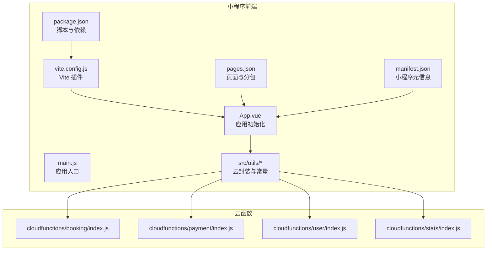
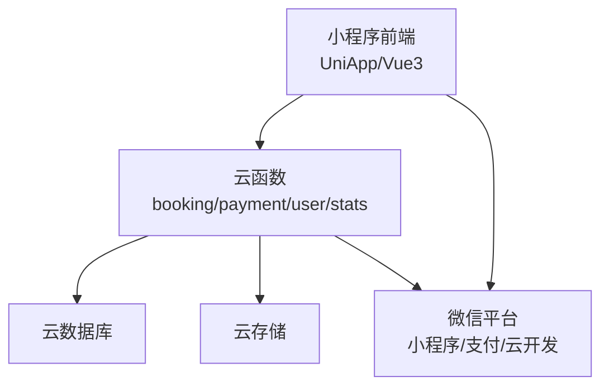
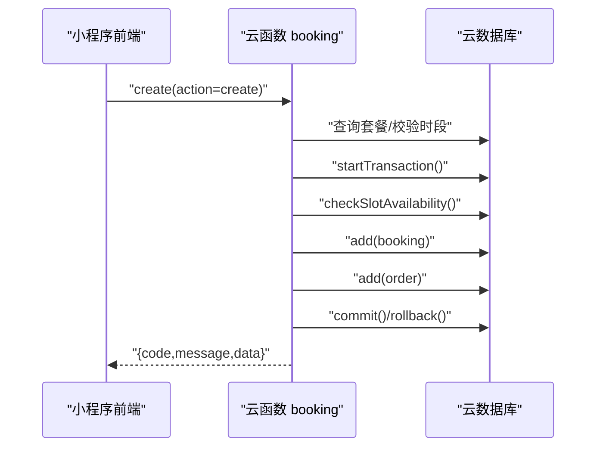
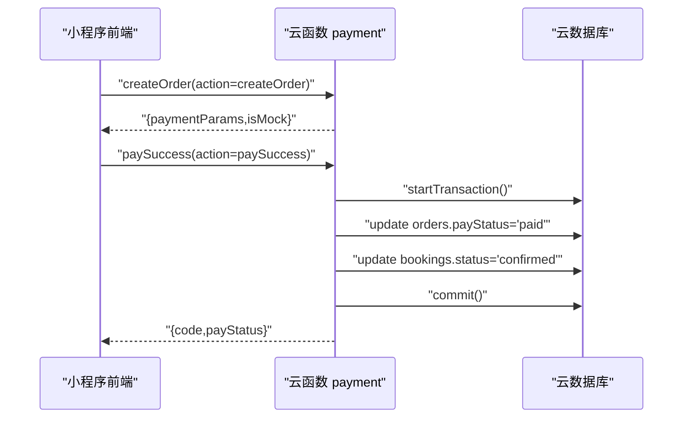
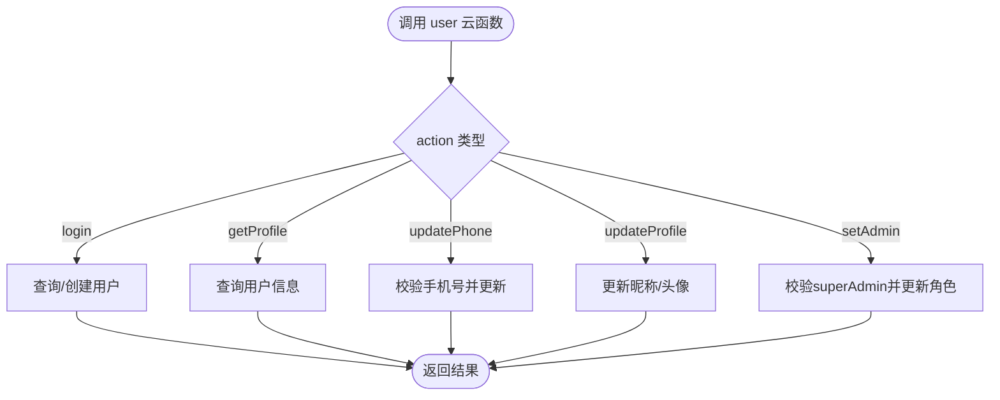
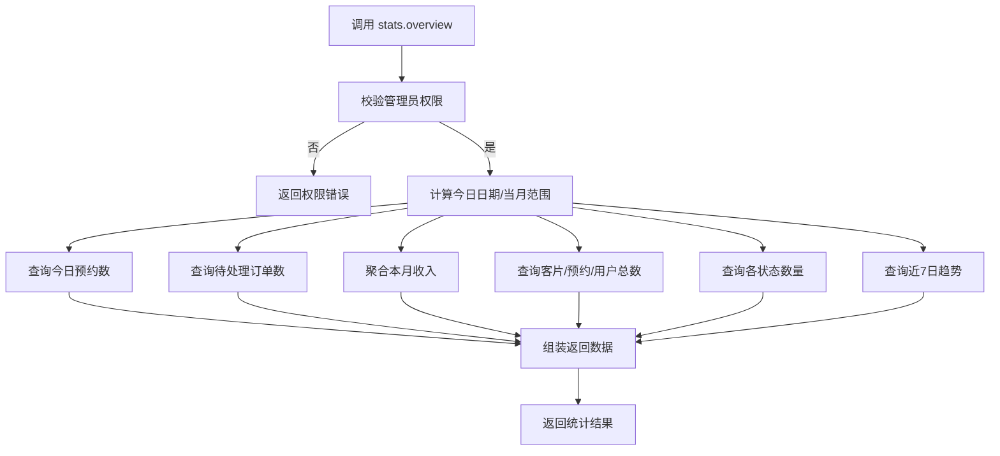
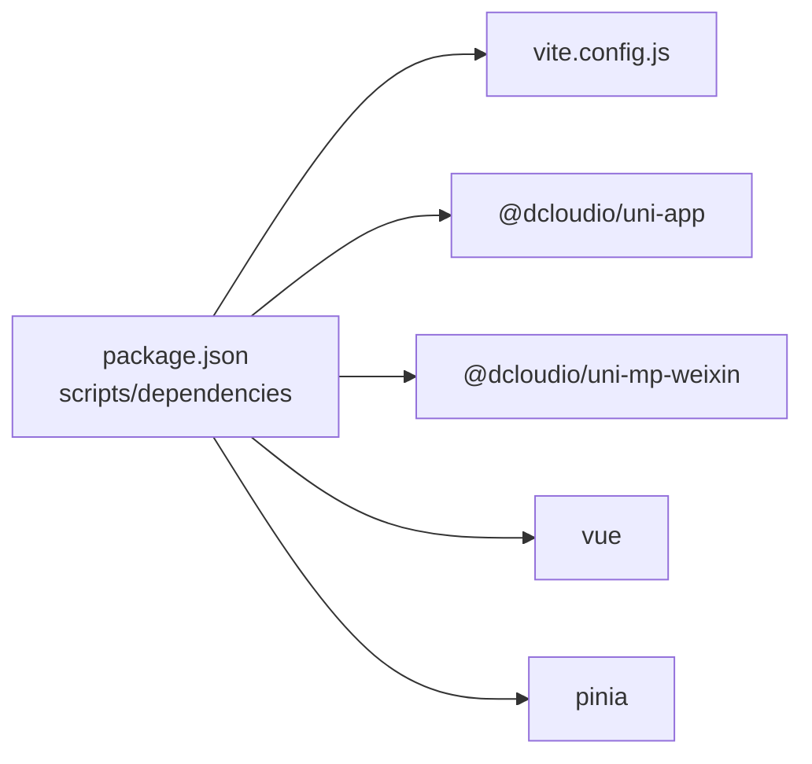

# 部署指南

<cite>
**本文引用的文件**
- [package.json](file://miniprogram/package.json)
- [project.config.json](file://miniprogram/project.config.json)
- [vite.config.js](file://miniprogram/vite.config.js)
- [main.js](file://miniprogram/src/main.js)
- [App.vue](file://miniprogram/src/App.vue)
- [pages.json](file://miniprogram/src/pages.json)
- [manifest.json](file://miniprogram/src/manifest.json)
- [cloud.js](file://miniprogram/src/utils/cloud.js)
- [constants.js](file://miniprogram/src/utils/constants.js)
- [booking/index.js](file://miniprogram/cloudfunctions/booking/index.js)
- [payment/index.js](file://miniprogram/cloudfunctions/payment/index.js)
- [user/index.js](file://miniprogram/cloudfunctions/user/index.js)
- [stats/index.js](file://miniprogram/cloudfunctions/stats/index.js)
- [booking/package.json](file://miniprogram/cloudfunctions/booking/package.json)
- [payment/package.json](file://miniprogram/cloudfunctions/payment/package.json)
- [user/package.json](file://miniprogram/cloudfunctions/user/package.json)
</cite>

## 目录
1. [简介](#简介)
2. [项目结构](#项目结构)
3. [核心组件](#核心组件)
4. [架构总览](#架构总览)
5. [详细组件分析](#详细组件分析)
6. [依赖关系分析](#依赖关系分析)
7. [性能与容量规划](#性能与容量规划)
8. [部署与运维](#部署与运维)
9. [CI/CD 流水线](#cicd-流水线)
10. [监控与日志](#监控与日志)
11. [安全与合规](#安全与合规)
12. [备份与应急响应](#备份与应急响应)
13. [故障排查指南](#故障排查指南)
14. [结论](#结论)

## 简介
本指南面向运维与开发团队，提供从开发环境到生产环境的完整部署与运维方案。内容覆盖构建与打包、云开发配置、微信小程序上传与审核、CI/CD 自动化、性能监控、日志收集、安全加固、备份与应急响应等。项目基于 Vue 3 + UniApp + Vite 技术栈，采用微信小程序平台与微信云开发（云函数、云数据库、云存储）。

## 项目结构
- 前端工程位于 miniprogram 目录，包含页面、组件、工具、云封装与构建配置。
- 云函数位于 miniprogram/cloudfunctions 下，按功能拆分（booking、payment、user、stats 等）。
- 关键配置文件包括 package.json（脚本与依赖）、project.config.json（开发者工具配置）、manifest.json（小程序元信息）、pages.json（页面路由与分包配置）。

图表来源
- [package.json:1-22](file://miniprogram/package.json#L1-L22)
- [vite.config.js:1-7](file://miniprogram/vite.config.js#L1-L7)
- [manifest.json:1-24](file://miniprogram/src/manifest.json#L1-L24)
- [pages.json:1-177](file://miniprogram/src/pages.json#L1-L177)
- [App.vue:1-26](file://miniprogram/src/App.vue#L1-L26)
- [main.js:1-11](file://miniprogram/src/main.js#L1-L11)
- [cloud.js:1-66](file://miniprogram/src/utils/cloud.js#L1-L66)
- [booking/index.js:1-463](file://miniprogram/cloudfunctions/booking/index.js#L1-L463)
- [payment/index.js:1-532](file://miniprogram/cloudfunctions/payment/index.js#L1-L532)
- [user/index.js:1-206](file://miniprogram/cloudfunctions/user/index.js#L1-L206)
- [stats/index.js:1-229](file://miniprogram/cloudfunctions/stats/index.js#L1-L229)

章节来源
- [package.json:1-22](file://miniprogram/package.json#L1-L22)
- [project.config.json:1-21](file://miniprogram/project.config.json#L1-L21)
- [vite.config.js:1-7](file://miniprogram/vite.config.js#L1-L7)
- [manifest.json:1-24](file://miniprogram/src/manifest.json#L1-L24)
- [pages.json:1-177](file://miniprogram/src/pages.json#L1-L177)
- [App.vue:1-26](file://miniprogram/src/App.vue#L1-L26)
- [main.js:1-11](file://miniprogram/src/main.js#L1-L11)

## 核心组件
- 构建与打包
  - 使用 uni-app CLI 与 Vite 进行构建，支持多端编译与热更新。
  - 开发与生产脚本通过 npm scripts 定义，便于本地与 CI 环境统一。
- 应用入口与初始化
  - 应用启动时初始化云开发能力；全局样式与主题通过 App.vue 与 uni.scss 统一。
- 页面与分包
  - pages.json 定义主包与 pages-admin 分包，含 tabbar、导航标题与全局样式。
- 云封装与常量
  - cloud.js 封装云函数调用、文件上传/下载、数据库引用等常用操作。
  - constants.js 提供套餐、客片、时段、状态等常量，便于前端展示与校验。
- 云函数
  - booking：预约创建、查询、取消、状态变更、可用时段查询。
  - payment：订单创建、支付成功、回调、退款、订单查询。
  - user：登录、获取/更新资料、设置管理员。
  - stats：管理员数据概览、状态统计、周趋势。

章节来源
- [package.json:5-8](file://miniprogram/package.json#L5-L8)
- [vite.config.js:1-7](file://miniprogram/vite.config.js#L1-L7)
- [main.js:1-11](file://miniprogram/src/main.js#L1-L11)
- [App.vue:4-13](file://miniprogram/src/App.vue#L4-L13)
- [pages.json:77-131](file://miniprogram/src/pages.json#L77-L131)
- [cloud.js:6-66](file://miniprogram/src/utils/cloud.js#L6-L66)
- [constants.js:5-73](file://miniprogram/src/utils/constants.js#L5-L73)
- [booking/index.js:67-93](file://miniprogram/cloudfunctions/booking/index.js#L67-L93)
- [payment/index.js:26-52](file://miniprogram/cloudfunctions/payment/index.js#L26-L52)
- [user/index.js:7-31](file://miniprogram/cloudfunctions/user/index.js#L7-L31)
- [stats/index.js:52-68](file://miniprogram/cloudfunctions/stats/index.js#L52-L68)

## 架构总览
系统由“小程序前端 + 微信云开发”构成，前端通过云封装调用云函数，云函数访问云数据库与云存储，实现预约、支付、用户与统计等功能。

图表来源
- [cloud.js:6-66](file://miniprogram/src/utils/cloud.js#L6-L66)
- [booking/index.js:1-10](file://miniprogram/cloudfunctions/booking/index.js#L1-L10)
- [payment/index.js:1-6](file://miniprogram/cloudfunctions/payment/index.js#L1-L6)
- [user/index.js:1-6](file://miniprogram/cloudfunctions/user/index.js#L1-L6)
- [stats/index.js:1-7](file://miniprogram/cloudfunctions/stats/index.js#L1-L7)

## 详细组件分析

### 云函数：预约 booking
- 功能要点
  - 生成订单编号、检查时段可用性、并发控制（事务）、关联创建订单。
  - 支持管理员查询、详情、状态变更；普通用户仅能操作自身数据。
- 数据一致性
  - 使用事务保证“创建预约 + 创建订单”的原子性。
- 并发保护
  - 预约前二次校验时段剩余，避免超卖。
- 错误处理
  - 统一 try/catch 包裹，返回标准化错误码与消息。

图表来源
- [booking/index.js:98-206](file://miniprogram/cloudfunctions/booking/index.js#L98-L206)

章节来源
- [booking/index.js:67-93](file://miniprogram/cloudfunctions/booking/index.js#L67-L93)
- [booking/index.js:98-206](file://miniprogram/cloudfunctions/booking/index.js#L98-L206)
- [booking/index.js:211-259](file://miniprogram/cloudfunctions/booking/index.js#L211-L259)
- [booking/index.js:264-303](file://miniprogram/cloudfunctions/booking/index.js#L264-L303)
- [booking/index.js:308-385](file://miniprogram/cloudfunctions/booking/index.js#L308-L385)
- [booking/index.js:390-438](file://miniprogram/cloudfunctions/booking/index.js#L390-L438)
- [booking/index.js:443-462](file://miniprogram/cloudfunctions/booking/index.js#L443-L462)

### 云函数：支付 payment
- 功能要点
  - 订单创建支付参数（当前为模拟模式），支付成功回调（前端触发）、退款（管理员）。
  - 支付回调与真实支付接入留有注释指引。
- 安全与幂等
  - 建议真实接入时在回调中校验签名、订单状态与金额，避免重复处理。
- 开发建议
  - 在本地联调阶段使用模拟支付参数，生产前完成商户号与证书配置。

图表来源
- [payment/index.js:65-166](file://miniprogram/cloudfunctions/payment/index.js#L65-L166)
- [payment/index.js:172-239](file://miniprogram/cloudfunctions/payment/index.js#L172-L239)

章节来源
- [payment/index.js:26-52](file://miniprogram/cloudfunctions/payment/index.js#L26-L52)
- [payment/index.js:65-166](file://miniprogram/cloudfunctions/payment/index.js#L65-L166)
- [payment/index.js:172-239](file://miniprogram/cloudfunctions/payment/index.js#L172-L239)
- [payment/index.js:253-327](file://miniprogram/cloudfunctions/payment/index.js#L253-L327)
- [payment/index.js:338-450](file://miniprogram/cloudfunctions/payment/index.js#L338-L450)

### 云函数：用户 user
- 功能要点
  - 登录即注册、获取/更新资料、设置管理员角色（仅 superAdmin）。
- 权限控制
  - setAdmin 严格校验当前用户角色，防止越权。
- 数据校验
  - 手机号格式校验，避免脏数据进入数据库。

图表来源
- [user/index.js:7-31](file://miniprogram/cloudfunctions/user/index.js#L7-L31)
- [user/index.js:34-67](file://miniprogram/cloudfunctions/user/index.js#L34-L67)
- [user/index.js:69-82](file://miniprogram/cloudfunctions/user/index.js#L69-L82)
- [user/index.js:84-115](file://miniprogram/cloudfunctions/user/index.js#L84-L115)
- [user/index.js:117-154](file://miniprogram/cloudfunctions/user/index.js#L117-L154)
- [user/index.js:156-205](file://miniprogram/cloudfunctions/user/index.js#L156-L205)

章节来源
- [user/index.js:7-31](file://miniprogram/cloudfunctions/user/index.js#L7-L31)
- [user/index.js:34-67](file://miniprogram/cloudfunctions/user/index.js#L34-L67)
- [user/index.js:84-115](file://miniprogram/cloudfunctions/user/index.js#L84-L115)
- [user/index.js:156-205](file://miniprogram/cloudfunctions/user/index.js#L156-L205)

### 云函数：统计 stats
- 功能要点
  - 管理员视角的数据概览：今日预约、待处理订单、本月收入、客片/预约/用户总数。
  - 各状态预约数量与近7日趋势统计。
- 聚合与兼容
  - 对聚合失败进行降级处理，保障接口稳定性。

图表来源
- [stats/index.js:52-68](file://miniprogram/cloudfunctions/stats/index.js#L52-L68)
- [stats/index.js:73-162](file://miniprogram/cloudfunctions/stats/index.js#L73-L162)
- [stats/index.js:167-228](file://miniprogram/cloudfunctions/stats/index.js#L167-L228)

章节来源
- [stats/index.js:52-68](file://miniprogram/cloudfunctions/stats/index.js#L52-L68)
- [stats/index.js:73-162](file://miniprogram/cloudfunctions/stats/index.js#L73-L162)
- [stats/index.js:167-228](file://miniprogram/cloudfunctions/stats/index.js#L167-L228)

## 依赖关系分析
- 前端依赖
  - @dcloudio/uni-app、@dcloudio/uni-mp-weixin、vue、pinia 等。
  - Vite 插件由 @dcloudio/vite-plugin-uni 提供。
- 云函数依赖
  - wx-server-sdk（各云函数独立声明）。
- 构建与运行
  - npm scripts 提供 dev:mp-weixin 与 build:mp-weixin，配合开发者工具或命令行执行。

图表来源
- [package.json:5-20](file://miniprogram/package.json#L5-L20)
- [vite.config.js:1-7](file://miniprogram/vite.config.js#L1-L7)

章节来源
- [package.json:9-20](file://miniprogram/package.json#L9-L20)
- [vite.config.js:1-7](file://miniprogram/vite.config.js#L1-L7)

## 性能与容量规划
- 云函数冷启动与并发
  - 合理拆分云函数，避免单函数体积过大；对高频接口启用预热（如需）。
- 数据库与索引
  - 为 bookings.orders.users 常用查询字段建立索引（如 date、userId、status、payStatus）。
- 文件存储
  - 控制图片尺寸与格式，开启 CDN 加速；定期清理无用文件。
- 前端资源
  - 启用分包加载与懒加载，减少首屏体积；合理配置 pages.json 的 subPackages。
- 缓存策略
  - 对静态数据与列表页增加缓存，降低数据库压力。

## 部署与运维

### 开发环境到生产环境
- 本地开发
  - 安装依赖后，使用 npm scripts 启动开发服务器，连接微信开发者工具。
- 构建产物
  - 生产构建输出至 dist/dev/mp-weixin，用于上传与发布。
- 云开发配置
  - 在微信公众平台配置小程序 appid、云开发环境 ID；在云开发控制台创建数据库集合与云函数。
- 域名与网络
  - 如需网络请求，确保合法域名已在微信公众平台配置；云函数网络访问白名单按需开放。

章节来源
- [package.json:5-8](file://miniprogram/package.json#L5-L8)
- [project.config.json:2-3](file://miniprogram/project.config.json#L2-L3)
- [manifest.json:7-22](file://miniprogram/src/manifest.json#L7-L22)

### 配置文件管理与环境变量
- 项目配置
  - project.config.json：小程序根目录、云函数目录、基础编译设置。
  - manifest.json：小程序 appid、云函数根目录、权限与设置。
  - pages.json：页面路由、分包、tabbar、全局样式。
- 云函数依赖
  - 各云函数目录下 package.json 声明 wx-server-sdk。
- 环境变量
  - 云函数通过 cloud.DYNAMIC_CURRENT_ENV 获取当前环境 ID；可在云开发控制台为不同环境设置变量（如数据库地址、第三方服务密钥）。

章节来源
- [project.config.json:1-21](file://miniprogram/project.config.json#L1-L21)
- [manifest.json:1-24](file://miniprogram/src/manifest.json#L1-L24)
- [pages.json:1-177](file://miniprogram/src/pages.json#L1-L177)
- [booking/package.json:1-7](file://miniprogram/cloudfunctions/booking/package.json#L1-L7)
- [payment/package.json:1-7](file://miniprogram/cloudfunctions/payment/package.json#L1-L7)
- [user/package.json:1-7](file://miniprogram/cloudfunctions/user/package.json#L1-L7)

### 微信小程序上传与审核
- 本地构建
  - 使用生产脚本生成 dist/dev/mp-weixin。
- 上传准备
  - 在微信公众平台选择对应小程序，上传代码并提交审核。
- 审核注意事项
  - 确保页面路径、分包配置与 pages.json 一致；检查权限声明与隐私政策。
- 发布与回滚
  - 审核通过后发布；若发现问题，及时回滚至上一版本。

章节来源
- [package.json:7-8](file://miniprogram/package.json#L7-L8)
- [pages.json:77-131](file://miniprogram/src/pages.json#L77-L131)
- [manifest.json:7-22](file://miniprogram/src/manifest.json#L7-L22)

### 云开发部署与域名绑定
- 云函数部署
  - 在开发者工具中上传所有云函数；或通过命令行批量部署。
- 数据库与存储
  - 在云开发控制台创建集合（users、bookings、orders、gallery），配置安全规则。
- 域名绑定
  - 若小程序内发起网络请求，需在微信公众平台配置合法域名；云函数网络访问白名单按需添加。

章节来源
- [booking/index.js:1-10](file://miniprogram/cloudfunctions/booking/index.js#L1-L10)
- [payment/index.js:1-6](file://miniprogram/cloudfunctions/payment/index.js#L1-L6)
- [user/index.js:1-6](file://miniprogram/cloudfunctions/user/index.js#L1-L6)
- [stats/index.js:1-7](file://miniprogram/cloudfunctions/stats/index.js#L1-L7)

## CI/CD 流水线
- 触发条件
  - push 到 main 分支或创建 tag。
- 步骤建议
  - 安装依赖 → 代码检查（可选）→ 构建（npm run build:mp-weixin）→ 上传云函数（命令行或工具）→ 上传小程序代码 → 审核（可选自动化通知）→ 发布（可选灰度/全量）。
- 环境隔离
  - 为 develop/test/prod 分别配置不同环境 ID 与变量；分支保护策略限制直接推送 main。
- 版本管理
  - 使用语义化版本（package.json version）与 Git 标签；发布前打标签并生成变更日志。

章节来源
- [package.json:5-8](file://miniprogram/package.json#L5-L8)

## 监控与日志
- 云开发日志
  - 在云开发控制台查看云函数日志，定位错误与耗时热点。
- 前端埋点
  - 在关键路径（预约创建、支付流程）埋点，结合小程序后台数据分析用户体验。
- 告警机制
  - 对高频错误码与异常耗时设置阈值告警；结合企业微信群或邮件通知。
- 性能指标
  - 关注云函数平均耗时、错误率、并发峰值；对慢查询与大对象传输进行优化。

## 安全与合规
- 权限控制
  - 管理员接口（stats、booking.updateStatus、user.setAdmin）严格校验角色；普通用户仅能操作自身数据。
- 输入校验
  - 对手机号、预约参数进行格式与范围校验；对敏感字段脱敏。
- 数据安全
  - 云数据库安全规则最小授权；避免在前端暴露敏感信息。
- 合规要求
  - 隐私政策与权限声明完善；用户授权与数据处理流程清晰。

章节来源
- [booking/index.js:32-46](file://miniprogram/cloudfunctions/booking/index.js#L32-L46)
- [booking/index.js:217-226](file://miniprogram/cloudfunctions/booking/index.js#L217-L226)
- [booking/index.js:284-287](file://miniprogram/cloudfunctions/booking/index.js#L284-L287)
- [payment/index.js:338-345](file://miniprogram/cloudfunctions/payment/index.js#L338-L345)
- [user/index.js:170-179](file://miniprogram/cloudfunctions/user/index.js#L170-L179)

## 备份与应急响应
- 数据备份
  - 定期导出数据库集合（users、bookings、orders、gallery）；保留备份周期与恢复演练记录。
- 应急预案
  - 云函数异常：快速回滚至上一稳定版本；临时关闭高风险接口；检查数据库索引与安全规则。
  - 支付问题：切换到模拟支付模式，人工核对订单；修复后恢复真实支付并验证回调。
- 事件响应
  - 建立事件分级与响应流程；明确责任人与沟通渠道；事后复盘与改进。

## 故障排查指南
- 云函数报错
  - 查看云函数日志中的错误堆栈与上下文；检查数据库集合是否存在、索引是否缺失。
- 预约冲突
  - 检查时段上限与并发控制逻辑；确认事务是否正确提交/回滚。
- 支付异常
  - 确认订单状态与幂等处理；若为模拟支付，需切换真实支付配置。
- 权限问题
  - 核查用户角色与管理员校验逻辑；确认 openid 是否正确传递。

章节来源
- [booking/index.js:89-92](file://miniprogram/cloudfunctions/booking/index.js#L89-L92)
- [booking/index.js:150-205](file://miniprogram/cloudfunctions/booking/index.js#L150-L205)
- [payment/index.js:48-52](file://miniprogram/cloudfunctions/payment/index.js#L48-L52)
- [payment/index.js:253-327](file://miniprogram/cloudfunctions/payment/index.js#L253-L327)
- [user/index.js:170-179](file://miniprogram/cloudfunctions/user/index.js#L170-L179)

## 结论
本指南提供了从开发到生产的全流程部署与运维实践，涵盖构建、云开发配置、小程序上传、CI/CD、监控、安全与应急响应。建议在生产环境中严格执行权限控制、输入校验与备份策略，并持续优化数据库索引与前端资源，确保系统稳定与用户体验。