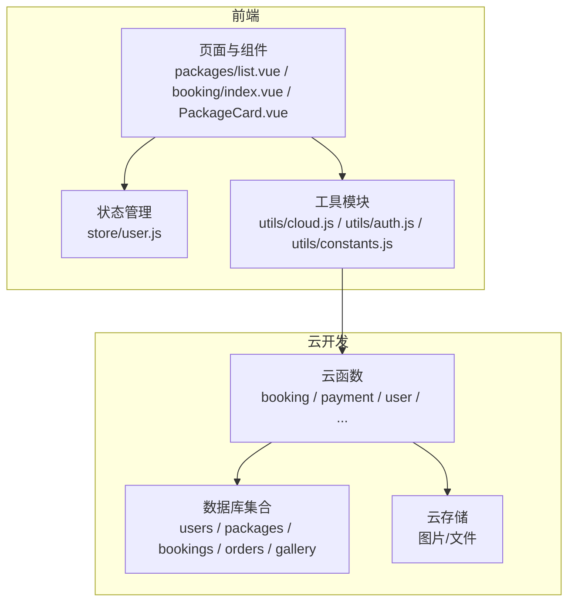
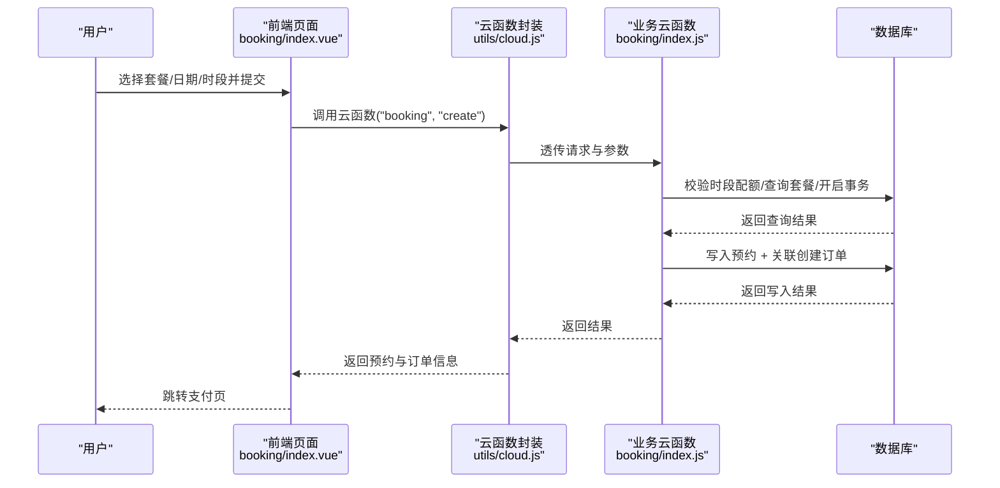
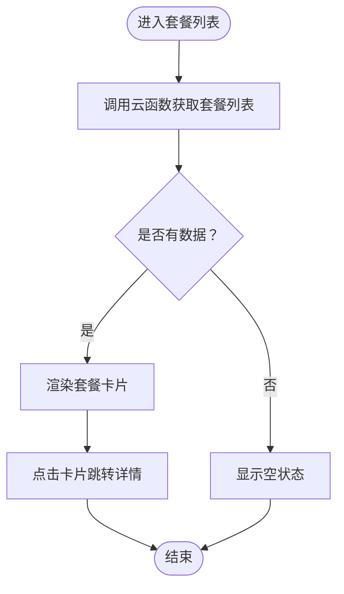
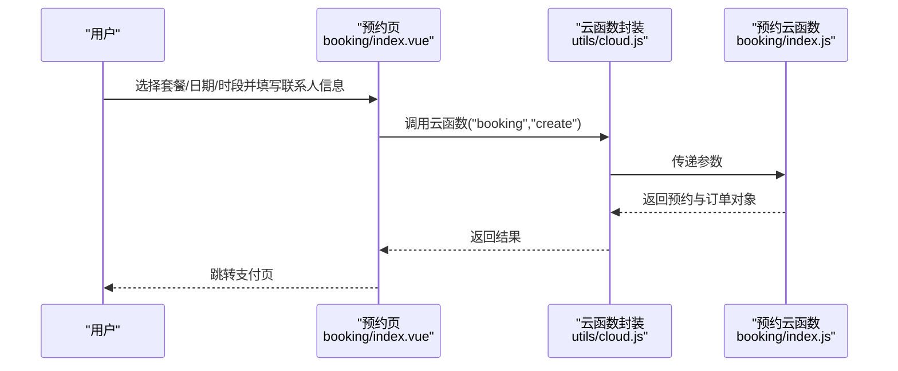
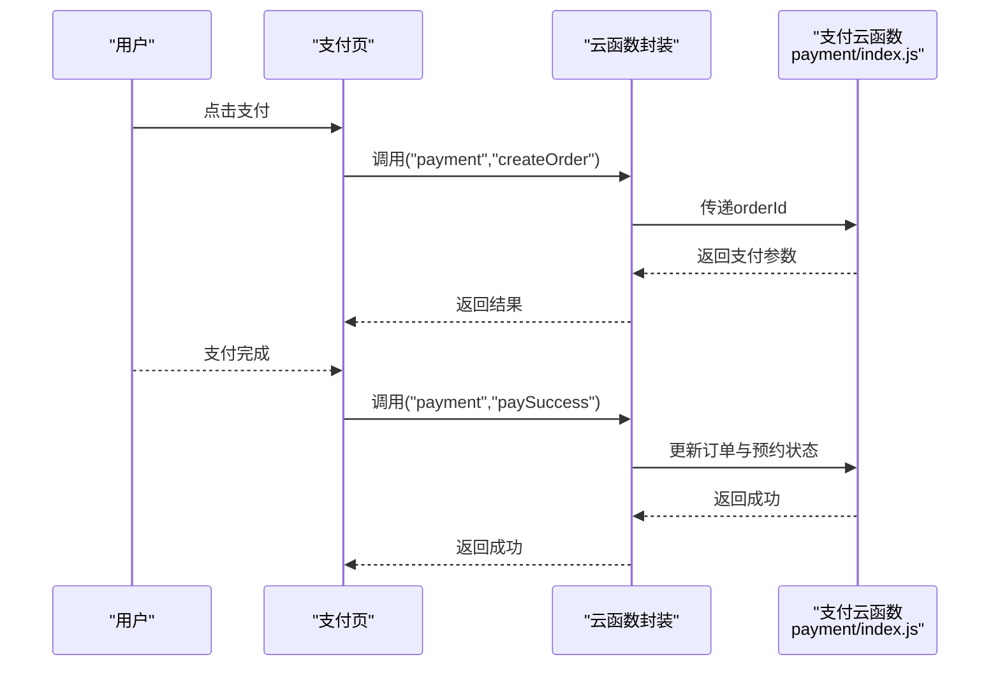
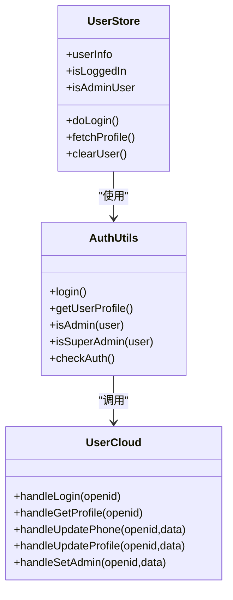
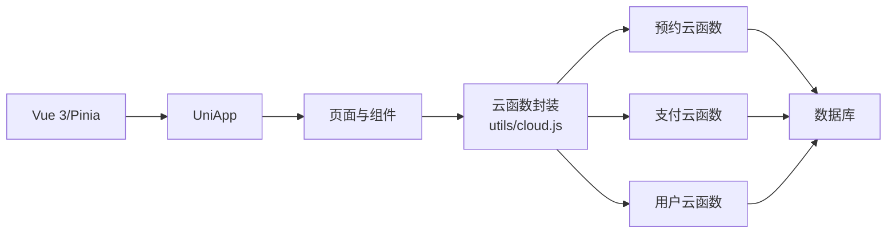

# 项目概述

<cite>
**本文档引用的文件**
- [package.json](file://package.json)
- [project.config.json](file://project.config.json)
- [main.js](file://src/main.js)
- [App.vue](file://src/App.vue)
- [pages.json](file://src/pages.json)
- [booking/index.js](file://cloudfunctions/booking/index.js)
- [payment/index.js](file://cloudfunctions/payment/index.js)
- [user/index.js](file://cloudfunctions/user/index.js)
- [cloud.js](file://src/utils/cloud.js)
- [constants.js](file://src/utils/constants.js)
- [user.js](file://src/store/user.js)
- [auth.js](file://src/utils/auth.js)
- [packages/list.vue](file://src/pages/packages/list.vue)
- [booking/index.vue](file://src/pages/booking/index.vue)
- [PackageCard.vue](file://src/components/PackageCard.vue)
</cite>

## 目录
1. [引言](#引言)
2. [项目结构](#项目结构)
3. [核心组件](#核心组件)
4. [架构总览](#架构总览)
5. [详细组件分析](#详细组件分析)
6. [依赖关系分析](#依赖关系分析)
7. [性能考虑](#性能考虑)
8. [故障排查指南](#故障排查指南)
9. [结论](#结论)
10. [附录](#附录)

## 引言
本项目是面向“成吉思汗陵”景区的蒙古袍旅拍预约小程序，旨在为游客提供从“套餐浏览—预约拍摄—支付—订单管理”的一站式服务，同时为管理员提供后台管理能力。项目通过 UniApp 跨平台框架与微信云开发能力，构建了统一的前端应用与云端服务，覆盖用户侧预约流程、支付流程、内容展示与后台管理。

业务目标：
- 提升游客体验：便捷的套餐浏览、直观的日历选座、实时的时段可用性反馈。
- 规范预约流程：基于时段配额的防超卖机制、订单与预约的联动状态。
- 降低运营成本：管理员后台集中管理套餐、客片与订单，支持状态流转与退款处理。
- 技术价值：前后端分离、云函数解耦、状态常量化、事务一致性保障。

## 项目结构
项目采用“前端 UniApp + 云开发 + 云函数”的分层架构：
- 前端层：Vue 3 + Pinia + UniApp，负责页面路由、组件化展示、状态管理与云函数调用。
- 云开发层：数据库、云存储、云函数，提供数据持久化、文件存储与业务逻辑处理。
- 业务层：按功能拆分的云函数（booking、payment、user、gallery、stats、package），职责单一、便于扩展。

图表来源
- [pages.json:1-177](file://src/pages.json#L1-L177)
- [main.js:1-11](file://src/main.js#L1-L11)
- [App.vue:1-26](file://src/App.vue#L1-L26)
- [booking/index.js:1-463](file://cloudfunctions/booking/index.js#L1-L463)
- [payment/index.js:1-532](file://cloudfunctions/payment/index.js#L1-L532)
- [user/index.js:1-206](file://cloudfunctions/user/index.js#L1-L206)

章节来源
- [package.json:1-22](file://package.json#L1-L22)
- [project.config.json:1-21](file://project.config.json#L1-L21)
- [pages.json:1-177](file://src/pages.json#L1-L177)

## 核心组件
- 前端入口与初始化
  - 应用启动时初始化云开发能力，确保后续云函数与数据库调用可用。
  - 全局样式与主题色统一，提升视觉一致性。
- 页面与路由
  - 通过 pages.json 统一声明页面路径、标题与分包结构，支持游客端与管理员端分包。
- 状态管理
  - 使用 Pinia 管理用户登录态、角色判断与全局状态，简化跨页面共享。
- 工具模块
  - 云函数封装：统一调用云函数、文件上传/下载/删除、数据库引用。
  - 常量定义：套餐分类、客片分类、时段、状态枚举、门店信息等。
  - 权限工具：登录、获取用户资料、管理员判定、会话检查。

章节来源
- [App.vue:1-26](file://src/App.vue#L1-L26)
- [main.js:1-11](file://src/main.js#L1-L11)
- [pages.json:1-177](file://src/pages.json#L1-L177)
- [user.js:1-48](file://src/store/user.js#L1-L48)
- [cloud.js:1-66](file://src/utils/cloud.js#L1-L66)
- [constants.js:1-73](file://src/utils/constants.js#L1-L73)
- [auth.js:1-47](file://src/utils/auth.js#L1-L47)

## 架构总览
系统采用“前端页面 + 云函数 + 数据库/存储”的三层架构：
- 前端页面通过云函数封装器调用后端云函数，避免直接暴露数据库接口。
- 云函数内进行权限校验、业务规则校验与数据一致性保障（事务）。
- 数据库存储用户、套餐、预约、订单、客片等核心实体；云存储用于图片与文件。

图表来源
- [booking/index.vue:422-470](file://src/pages/booking/index.vue#L422-L470)
- [cloud.js:5-26](file://src/utils/cloud.js#L5-L26)
- [booking/index.js:67-206](file://cloudfunctions/booking/index.js#L67-L206)

## 详细组件分析

### 套餐与客片展示组件
- 套餐列表页
  - 支持分类筛选与骨架屏加载，提升弱网体验。
  - 通过云函数获取套餐列表，点击卡片跳转详情。
- 套餐卡片组件
  - 展示封面图、名称、描述与价格，点击进入详情页。
- 客片展示
  - 客片分类浏览与详情展示，支持分页与空状态提示。

图表来源
- [packages/list.vue:94-130](file://src/pages/packages/list.vue#L94-L130)
- [PackageCard.vue:21-31](file://src/components/PackageCard.vue#L21-L31)

章节来源
- [packages/list.vue:1-305](file://src/pages/packages/list.vue#L1-L305)
- [PackageCard.vue:1-100](file://src/components/PackageCard.vue#L1-L100)

### 预约流程组件
- 套餐选择：支持弹窗选择与预设推荐。
- 日期选择：日历网格、月份切换、禁用历史与过远日期。
- 时段选择：根据所选日期动态拉取可用时段，显示剩余名额。
- 联系人信息：表单校验（姓名、手机号、人数、备注）。
- 提交与跳转：通过云函数创建预约与订单，跳转支付页。

图表来源
- [booking/index.vue:422-470](file://src/pages/booking/index.vue#L422-L470)
- [cloud.js:5-26](file://src/utils/cloud.js#L5-L26)
- [booking/index.js:67-206](file://cloudfunctions/booking/index.js#L67-L206)

章节来源
- [booking/index.vue:1-1029](file://src/pages/booking/index.vue#L1-L1029)

### 支付与订单组件
- 创建支付订单：校验订单状态与权限，返回支付参数（模拟模式下返回模拟参数）。
- 支付成功：前端触发“支付成功”云函数，原子更新订单与预约状态。
- 退款处理：管理员权限校验后，更新订单与预约状态（模拟模式下演示流程）。
- 订单查询：支持按订单号或订单 ID 查询，区分用户与管理员权限。

图表来源
- [payment/index.js:26-166](file://cloudfunctions/payment/index.js#L26-L166)
- [payment/index.js:172-239](file://cloudfunctions/payment/index.js#L172-L239)

章节来源
- [payment/index.js:1-532](file://cloudfunctions/payment/index.js#L1-L532)

### 用户与权限组件
- 登录与资料：首次登录创建用户记录，支持更新昵称/头像/手机号。
- 权限判定：普通用户、管理员、超级管理员三级角色，不同页面与操作可见性与可操作性不同。
- 登录态管理：Pinia store 统一维护登录态与角色，组件按需鉴权。

图表来源
- [user.js:1-48](file://src/store/user.js#L1-L48)
- [auth.js:1-47](file://src/utils/auth.js#L1-L47)
- [user/index.js:1-206](file://cloudfunctions/user/index.js#L1-L206)

章节来源
- [user.js:1-48](file://src/store/user.js#L1-L48)
- [auth.js:1-47](file://src/utils/auth.js#L1-L47)
- [user/index.js:1-206](file://cloudfunctions/user/index.js#L1-L206)

## 依赖关系分析
- 前端依赖
  - Vue 3、Pinia、UniApp 生态，保证跨端一致的开发体验。
  - 通过云函数封装器统一调用云函数，减少重复代码。
- 云函数依赖
  - wx-server-sdk 提供云开发能力；数据库命令（如 neq、serverDate）用于复杂查询与时间戳。
  - booking 与 payment 云函数分别承担预约与支付两大核心域。
- 配置与构建
  - project.config.json 指定云函数根目录与小程序构建输出目录。
  - package.json 定义脚手架与构建脚本，支持微信小程序平台。

图表来源
- [package.json:1-22](file://package.json#L1-L22)
- [project.config.json:1-21](file://project.config.json#L1-L21)
- [cloud.js:1-66](file://src/utils/cloud.js#L1-L66)

章节来源
- [package.json:1-22](file://package.json#L1-L22)
- [project.config.json:1-21](file://project.config.json#L1-L21)

## 性能考虑
- 前端优化
  - 骨架屏与懒加载：在数据加载阶段提供骨架屏与图片懒加载，改善首屏体验。
  - 分包策略：游客端与管理员端分包，减少主包体积，提升冷启动速度。
- 云函数优化
  - 事务一致性：预约创建与订单创建使用事务，避免数据不一致。
  - 并发控制：时段配额检查在事务中再次校验，防止超卖。
  - 模拟支付：开发阶段使用模拟支付参数，减少真实支付链路开销。
- 数据访问
  - 常量集中：状态枚举、分类与门店信息集中定义，便于维护与国际化扩展。
  - 权限前置：所有云函数均进行权限校验，避免越权访问。

## 故障排查指南
- 云函数调用失败
  - 检查云函数名称与 action 参数是否匹配；确认返回结果中的 code 字段。
  - 查看云函数日志与错误堆栈，定位具体异常。
- 数据不一致
  - 确认事务是否正常提交/回滚；核对并发场景下的二次校验逻辑。
- 支付问题
  - 开发阶段：确认模拟支付参数是否正确返回；生产环境需配置微信支付商户号。
  - 支付回调：若为模拟模式，回调处理将直接返回成功；真实回调需在云函数中解析并验证签名。
- 权限问题
  - 管理员接口需校验 admin/superAdmin 角色；普通用户仅能操作自身数据。
- 前端登录态
  - 若登录失败，检查用户云函数返回与本地 store 状态同步；必要时重新登录。

章节来源
- [cloud.js:5-26](file://src/utils/cloud.js#L5-L26)
- [booking/index.js:67-93](file://cloudfunctions/booking/index.js#L67-L93)
- [payment/index.js:26-52](file://cloudfunctions/payment/index.js#L26-L52)
- [auth.js:28-47](file://src/utils/auth.js#L28-L47)

## 结论
本项目以“用户体验优先、业务闭环完整、技术架构清晰”为目标，围绕“预约—支付—内容—管理”形成完整闭环。通过 UniApp 的跨端能力与微信云开发的低门槛部署，快速实现了景区旅拍业务的数字化升级。对于初学者，项目提供了清晰的页面与组件结构、统一的云函数封装与状态管理实践；对于有经验的开发者，项目展示了分层架构、事务一致性、权限模型与模拟/真实链路切换等工程化细节。

## 附录
- 术语
  - 云函数：部署在云端的函数，前端通过 wx.cloud.callFunction 调用。
  - 事务：数据库事务，保证多条写入的一致性。
  - 分包：小程序分包加载，减少主包体积。
- 快速上手建议
  - 配置云开发环境与数据库集合。
  - 在小程序后台配置云开发域名白名单与支付相关配置（生产环境）。
  - 使用分包与骨架屏优化首屏体验。
  - 逐步替换模拟支付为真实支付回调与退款流程。